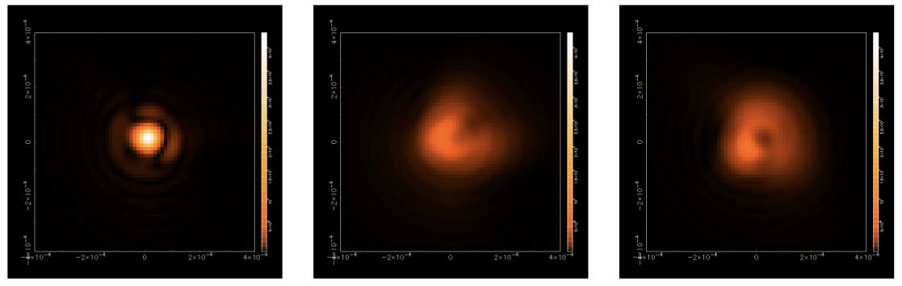
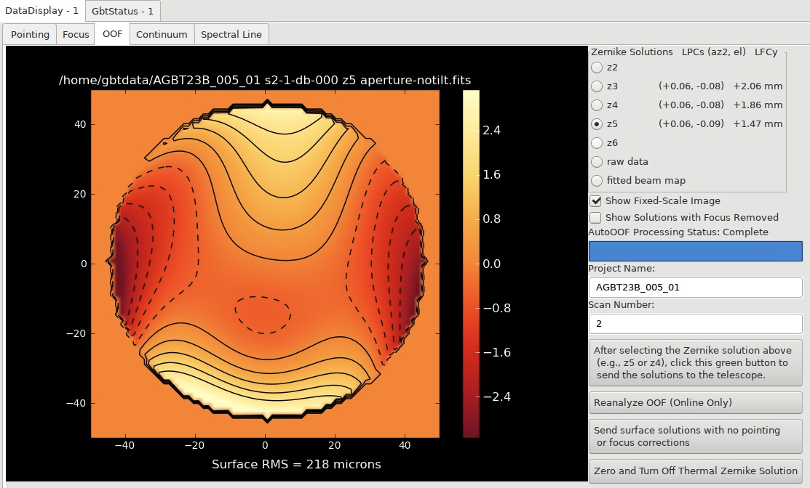
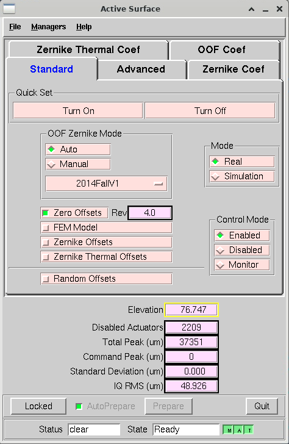
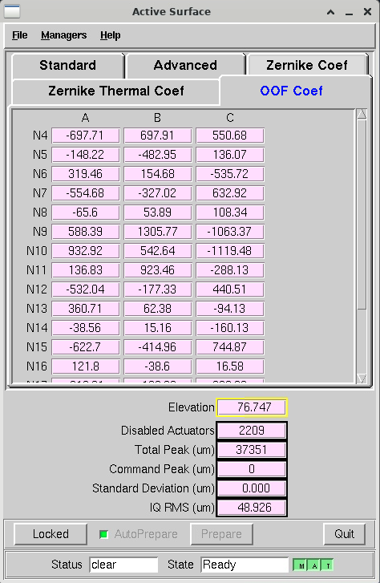

.. _OOF_explanation:

#####################
An Explanation of OOF
#####################

Context
=======
The GBT has an active surface. This means that there is an actuator at every intersection of panels which most of the time is 4 corners, but on the edges of the dish there are only 2. These actuators have one degree of freedom in that they push all the corners up or down to make corrections to the surface of the dish.

There are several forces that cause the dish to deviate from a perfect parabola. These forces create deformations in the dish which cause deviations from a perfect parabola and cause the beam to deviate from the theoretical shape. These deviations from the perfect parabola affect GBT high frequency (>8 GHz) observing the most. This is because at high frequencies, these deviations in the dish are larger than the wavelength that is being observed and thus strongly affect the light being collected. The main two factors that cause the dish to deviate from a perfect parabola (and thus cause the beam to deviate from the theoretical shape) are (b) gravitational and (b) thermal factors. 

.. image:: images/OOF/Moravec_forces_of_deformation.png

Illustration credit: Emily Moravec.

(A) Gravity. As you move the telescope to different elevations in the sky, the structure of the dish changes due to gravity (and thus deviates from a perfect parabola) - see left part of the above illustration. We can predict the expected amount of deformation due to gravity as a function of elevation based on the engineering design of the telescope. This prediction or model is referred to as the “gravity model.” 

(B) Differential heating of the dish due to thermic activity. During the day the sun will heat up the dish (indicated by the sun in the right part of the illustration above). In fact, you can imagine a situation where the sun heats one portion of the dish more strongly than another. Thus the sun causes differential heating of the dish. During the night, the ground having been warmed during the day is warmer than the dish (indicated by the moon in the right part of the illustration above), and the same situation occurs where one or more portions of the dish is heated up more than another. Again, differential heating. The differential heating due to the sun during the day and the ground at night cause deformations in the dish which in turn causes deviations from a perfect parabola.

Zernike Polynomials
===================
Gravitational and thermal effects deform the dish surface, introducing large-scale deviations from the ideal parabolic shape. These deformations are modeled using `Zernike polynomials <https://en.wikipedia.org/wiki/Zernike_polynomials>`_, a complete set of orthogonal functions defined over a circular aperture. Originally formulated by Frits Zernike in 1934, these polynomials are fundamental in optical analysis because each term isolates an independent, physically meaningful mode of surface or wavefront variation. The radial order n (or degree) determines the spatial complexity of the shape variations: low orders (n≤2) represent basic forms such as tilt, focus, and astigmatism, while higher orders (n≥3) correspond to more intricate distortions like coma and trefoil. Increasing the order increases the number of polynomials used (e.g., 3rd order = 10 terms, 4th = 15, 5th = 21) and thus expands the model’s descriptive power. For the Green Bank Telescope (GBT), we typically fit the surface using Zernike orders :math:`z_3 - z_5` to capture the large-scale errors in the surface.

So how do we use the Zernike polynomials to describe the surface of the GBT? As listed above there are two major contributors to the shape of the dish, gravity and thermal activity. We correct the dish for the large-scale errors introduced by gravity and thermal activity by measuring the shape of the dish at a given point in time and then fitting the surface with Zernike polynomials. And in the end we measure the magnitude of each polynomial's contribution to the shape of the surface through (Zernike) coefficients.

Modeling and Correcting for Gravity
===================================
There are two ways that you can correct the dish for the deformations in the dish caused by gravity.

The first is the **Finite Element Model** (`FEM <https://gbtdocs.readthedocs.io/en/latest/glossary.html#term-FEM>`_). This theoretical model estimates the effect of gravity on the dish at a given elevation based solely on the telescope’s engineering design. This model is almost always turned on by default, but it is good to check that it is on. 

It was found that the FEM did not fully account for the effect of gravity on the dish. Therefore on top of the FEM, we have calculated empirical deltas to fully correct for the effect of gravity on the dish. These deltas are measured empirically and are an empirical correction to FEM as a function of elevation. We will call these additional gravity corrections to the dish the **gravity-Zernike model**.

GBO staff have put a lot of time and effort into deriving the gravity-Zernike model. The gravity model is described by a combination of the Zernike polynomials as a function of elevation. The amplitude of the contribution to the model of each Zernike polynomial at a given elevation is determined by coefficients A, B, and C according to:

:math:`Z_n = A_n \sin(el) + B_n \cos(el) + C_n` 
where :math:`el` is the elevation. 

To create the gravity-Zernike model, the surface is measured at a large range of elevations with a process called OOF (defined and explained below). You can then fit for the coefficients (:math:`A_n`, :math:`B_n`, :math:`C_n`) to determine the amplitude of the contribution of each of the Zernike polynomials to the gravity-Zernike model at each elevation. For the gravity-Zernike model, Zernike polynomials through the 5th order are included which is why there are 21 Zernike polynomials included. For more details, see PTCS Project Note #76 - Maddalena et al., 2014.

With the gravity-Zernike model in hand, if you turn on the active surface (recommended for :math:`\geq` 5 GHz which is C-band and above at the GBT) software will correct for the effects of gravity on the shape of the dish at a given elevation. If the active surface is turned on, these corrections are done automatically (the user does not need to do anything).

Reference and further reading: Frayer et al. 2019 - `GBT Memo 301 <https://library.nrao.edu/public/memos/gbt/GBT_301.pdf>`_

OOF
===
However, even though you correct for the effects of gravity on the dish, there are still large-scale errors that remain (e.g., from differential heating, or maybe some still small errors in the gravity model). In order to correct for the remaining large-scale errors, we use use Out Of Focus (OOF implemented as :func:`AutoOOF() <astrid_commands.AutoOOF>`) mapping (or a.k.a. holography) observations of bright point sources to derive the shape of the surface using Zernike polynomials and correct for all other deviations away from perfect parabola in the surface.

How this works is that the :func:`AutoOOF() <astrid_commands.AutoOOF>` procedure takes 3 scans of a bright,compact point source (bright and point source are important!). Using the subreflector, :func:`AutoOOF() <astrid_commands.AutoOOF>` makes 3 maps of the bright point source (in order): a map in focus (shown in left of the image below), a map out of focus in the positive direction (typically 10 mm, shown in middle of the image below), and a map out of focus in the minus direction (typically -10 mm, shown in right of the image below). 

Normally, we use the dish to map an astronomical source but with OOF we invert that calculation where we use a source to map the dish. This is possible because we know what a bright point source convolved with the beam *should* look like and use that as a reference. Then we simply invert the calculation and thus determine what the shape of the dish is. Making three maps by going in and out of focus is crucial for getting 3D information.

Resources for Further Reading:
	* GBT Memo #271: `Schwab and Hunter 2010 <https://library.nrao.edu/public/memos/gbt/GBT_271.pdf>`_  
	* `Nikolic et al 2007a <https://ui.adsabs.harvard.edu/abs/2007A%26A...465..685N/abstract>`_
	* `Nikolic et al 2007b <https://ui.adsabs.harvard.edu/abs/2007A%26A...465..679N/abstract>`_
	* `Hunter et al 2011 <https://ui.adsabs.harvard.edu/abs/2011PASP..123.1087H/abstract>`_

AutoOOF Procedure
=================
According to the recommended `AutoOOF Strategy <https://gbtdocs.readthedocs.io/en/latest/how-tos/general_guides/autooof.html>`_, AutoOOF is recommended for observing at frequencies of 40 GHz and higher and only available for use with Rcvr26_40 (Ka–band), Rcvr40_52 (Q–band), Rcvr68_92 (W-band), RcvrArray75_115 (Argus), and Rcvr_MBA1_5 (MUSTANG-2).

:func:`AutoOOF() <astrid_commands.AutoOOF>` is currently only executed for observing projects at night time. In general, it will take 20-25 minutes to do an :func:`AutoOOF() <astrid_commands.AutoOOF>`. The :func:`AutoOOF() <astrid_commands.AutoOOF>` procedure takes three 5-6 minute on-the-fly maps at a different focus position (typically at focus, 10 mm, and - 10mm). It is not recommended that you OOF before 21:00 or 22:00 because prior to this the telescope is still “settling” (aka changing thermally) from the thermal effects during the day. OOF solutions are good for 2-6 hours at night time depending on the conditions of any particular night. A general rule of thumb is if the corrections are measured at least two hours after sunset, then the solutions should be good for about four hours.

Daytime surface changes are on the order of <1 hour time scales. Thus due to these rapidly changing conditions, the :func:`AutoOOF() <astrid_commands.AutoOOF>` solutions (which are on a similar timescale) can cause more harm (efficiency damage) than good. So it is typically not useful to use the “thermal” corrections during the day.

:func:`AutoOOF() <astrid_commands.AutoOOF>` not only determines the thermal corrections for the dish but it also derives pointing and focus offsets. The processing of the 3 maps of the source is launched automatically upon completion of the third map, and the result is displayed in the OOF plug-in tab of AstrID. To see when your OOF has been processed and view the results, go to AstrID -> DataDisplay -> OOF. Once your OOF has been processed, it is incumbent upon the user to examine the solutions. When :func:`AutoOOF() <astrid_commands.AutoOOF>` has finished processing, it will look like the following:

Image Credit: A processed OOF from a MUSTANG-2 run for project AGBT23B-005. The image that is displayed in the left of the OOF tab is in the shape of the dish and it displays the measured changes (referred to as :math:`\Delta`'s or "deltas") from the current surface to the computed optimal surface. Let’s call this image the "surface delta map. The algorithm takes the raw data of the surface of the dish, fits the 3rd, 4th, and 5th orders of Zernike polynomials to that data, and produces the surface delta map shown in the OOF tab. 

For illustration, we express the measured large-scale errors on the dish at a given time and elevation as 

:math:`z_{tot} = z_{grav} + z_{thermal}` 

where :math:`z_{tot}` is the measured surface of the dish (what is actually measured by :func:`AutoOOF() <astrid_commands.AutoOOF>`) expressed by a combination of Zernike polynomials, :math:`z_{grav}` is the contribution to the large-scale errors from the effects of gravity (calculated from the gravity model), and :math:`z_{thermal}` is simply the difference between :math:`z_{tot}` and :math:`z_{grav}`. AutoOOF calculates :math:`z_{thermal}` by subtracting known value of the gravity model at that elevation (:math:`z_{grav}`) from the measured surface (:math:`z_{tot}`). Thus, :math:`z_{thermal} = z_{tot} - z_{grav}`. Therefore, the solutions (shown in the surface delta map) that are calculated via OOF are often called "Zernike Thermal Solutions" or "Thermal Coefficients" for short. 

Once the user has examined the solutions and determined which corrections to send, you must then send the selected solution to the active surface. To do this it is recommended that you use the button in the OOF display tab labeled "After selecting the Zernike solution above, click this button to send the solutions to the telescope."

CLEO Active Surface Coefficients
================================
You can view the various versions of Zernike coefficients via CLEO’s Active Surface window. To open the Active Surface window, CLEO -> ``Launch`` -> ``Active Surface…`` which will produce a window like the following:

.. note::

	On the startup screen of the Active Surface, there is a box that says ``FEM model``. This was described in :ref:`Modeling and Correcting for Gravity <explanations/OOF:Modeling and Correcting for Gravity>`. Typically this is on by default, but it is good to check that this is on via this CLEO window.

There are many different tabs in Active Surface window and we describe the ones that are pertinent to OOF below.

Zernike Thermal Coef
--------------------
This tab contains the amplitude of the contributions (coefficients) of the first 21 zernike polynomials for the thermal contributions to the shape of the dish. This is what is calculated from AutoOOF. When you send the corrections via AutoOOF you should see these values update.

.. image:: images/OOF/cleo_active_surface/cleo_as_thermal.png

.. note::

	``Zero All Thermal Coefficients`` - this sets all Zernike thermal coefficient values to 0. When you zero out the thermals, then when you OOF again you are comparing directly to the gravity model. This can be a useful thing to do if you know that there was a bad OOF solution applied in the recent past. When you zero the Zernike thermal coefficients you are starting with a clean slate per se.

OOF Coef
--------
The OOF coefficients are the coefficients of the gravity-Zernike model (see explanation in :ref:`Modeling and Correcting for Gravity <explanations/OOF:Modeling and Correcting for Gravity>`). This tab shows the values of the coefficients (A, B, and C) that determine the amplitude of the contribution of the first 21 zernike polynomials to the gravity-Zernike model.

Zernike Coef
------------
The amplitude of the contributions of the first 21 Zernike polynomials to the shape of the dish. This is the "total Zernikes" that OOF measures.

.. image:: images/OOF/cleo_active_surface/cleo_as_zernike.png
