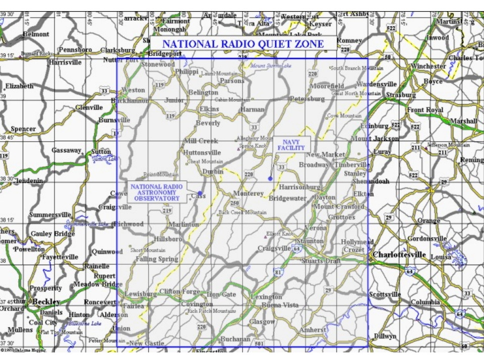

What is the NRQZ?
=================

The National Radio Quiet Zone (NRQZ) was established by the Federal Communications
Commission (FCC) and by the Interdepartmental Radio Advisory Committee (IRAC) on 
November 19, 1958 to minimize possible harmful interference to the National Radio
Astronomy Observatory (NRAO) in Green Bank, WV and the radio receiving facilities
for the United State Navy in Sugar Grove, WV. 

The NRQZ is bounded by North American Datum of 1983 (NAD83) meridians of longitude
at 78d 29m 59.0s W and 80d 29m 59.2s W and latitude of 37d 0m 0.4s N and 39d 15m 0.4s N, 
and encloses a land area of approximately 13,000 square miles near the state border 
between Virginia and West Virginia. 

* Further `NRQZ documentation <https://info.nrao.edu/do/spectrum-management/national-radio-quiet-zone-nrqz-1>`__
  managed by Observatory `Spectrum Management <https://info.nrao.edu/do/spectrum-management/>`__.

* Information on the `West Virginia State Code Chapter 37A "Radio Astronomy Zoning Act" (WVRAZ) <https://code.wvlegislature.gov/37A-1/>`__.

