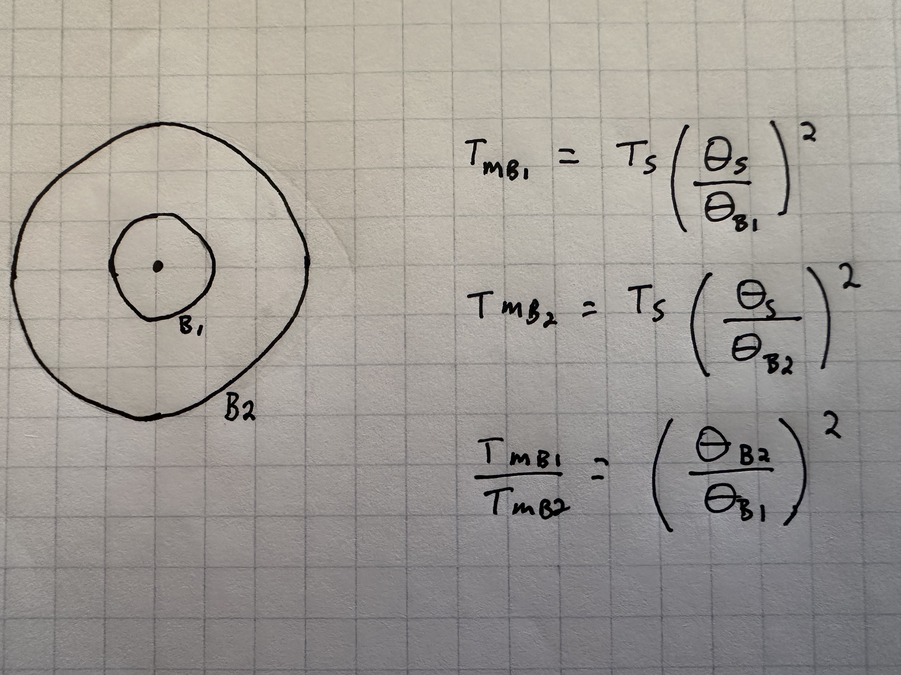

.. _temperature_scales:

############################################
Temperature Scales and Telescope Efficiences
############################################

Introduction
============
A temperature scale in radio astronomy is a system for expressing the power detected from astronomical radio sources by a radio telescope in terms of an equivalent temperature. It is common to use temperature scale, rather than directly quoting power or flux, because many astronomical sources can be approximated as thermal emitters or blackbodies.

All of these temperatures typically have units of K.

:math:`T_A` - Antenna Temperature
=================================
:math:`T_A` is the "raw" temperature measured by the radio telescope's receiver. It is proportional to the power received from a source (aka the sky brightness distribution) convolved with the telescope’s beam pattern. This temperature is measured below (including) the Earth’s atmosphere.

The Concept of :math:`T_A`
--------------------------
Conceptually what is the antenna temperature and why do we express the strength of a source in temperature in radio astronomy? Various sources describe :math:`T_A` slightly differently and it can be helpful for the reader to read the different purturbations of the same explanation. 

Thus, below we provide various sources for the explanation of :math:`T_A` as a concept. 
	- **Essential Radio Astronomy, Chapter 2.5: Noise Generated by a Warm Resistor** 
		- "The antenna temperature of a receiving antenna is defined as the temperature of an ideal resistor that would generate the same Rayleigh-Jeans noise power per unit bandwidth as appears at the antenna output."
		- Full citation: James J. Condon and Scott M. Ransom, "Noise Generated by a Warm Resistor," Essential Radio Astronomy, (Princeton, NJ: Princeton University Press, 2016), chap. 2.5, pg 50.
		- You can obtain a physical copy of the book `here <https://press.princeton.edu/books/hardcover/9780691137797/essential-radio-astronomy>`_ or see `this webpage <https://www.cv.nrao.edu/~sransom/web/Ch2.html#S5>`_.
	- **Single-Dish Radio Astronomy: Techniques and Applications, "Single-Dish Calibration Techniques at Radio Wavelengths"**
		- "The antenna temperature (:math:`T_A`) can be defined as the temperature of the antenna radiation resistance. That is, let the telescope observe a point source (i.e. a source which is considerably smaller than the beam size) which has a flux density S. Then, replace the feed of the telescope with a matched resistor (or load). If you now adjust the temperature of the resistor until the power received is the same as it was for the point source (observed with the antenna or feed horn), the antenna temperature is equal to the resistor temperature."
		- Full citation: Karen O’Neil, “Single-Dish Calibration Techniques at Radio Wavelengths,” Section 2.2 Antenna Temperature, Single-Dish Radio Astronomy: Techniques and Applications, ASP Conference Series, vol. 278 (San Francisco: Astronomical Society of the Pacific, 2002), pp 294–295.
		- You can obtain a copy of the chapter `here <https://ui.adsabs.harvard.edu/abs/2002ASPC..278..293O/abstract>`_.
	- **Single-Dish Radio Astronomy: Techniques and Applications, "Radio Telescopes and Measurements at Radio Wavelengths"**
		- "You can define the equivalent blackbody temperature in terms of the power flowing down the transmission line" (of the radio telescope) and apply it to the equation that represents the power received by the telescope. Then you find that, "the equivalent blackbody temperature, one that would produce the same power as was collected by the telescope and coupled to the transmission line, is identical to the temperature of the (presumably distant) blackbody filling the antenna’s power pattern. This leads to defining this equivalent temperature as the antenna temperature, :math:`T_A`. This temperature simply is another way to define the power flowing in the transmission line. It can be, and is used whether or not the antenna is observing a thermal source, and whether or not the source fills the antenna power pattern."
		- Full citation: Paul F. Goldsmith, "Radio Telescopes and Measurements at Radio Wavelengths,"" Section 2.3: Radio Telescopes, Transmission Lines, and the Antenna Theorem, Single-Dish Radio Astronomy: Techniques and Applications, ASP Conference Series, vol. 278 (San Francisco: Astronomical Society of the Pacific, 2002), pp 51–52.
		- You can obtain a copy of the chapter `here <https://ui.adsabs.harvard.edu/abs/2002ASPC..278...45G/abstract>`_.
	- **Single-Dish Radio Astronomy: Techniques and Applications, "Measurement in Radio Astronomy"**
		- If the temperature distribution of the source is constant over the solid angle subtended by the normalized power response pattern of a radio antenna then "for an antenna looking at an extended source with a uniform brightness temperature T, the measured antenna temperature in the Rayleigh-Jeans limit is equal to T (assuming no ohmic losses in the antenna) independent of the size of the antenna."
		- Full citation: Donald B. Campbell, "Measurement in Radio Astronomy," Single-Dish Radio Astronomy: Techniques and Applications, ASP Conference Series, vol. 278 (San Francisco: Astronomical Society of the Pacific, 2002), pp 81–82.
		- You can obtain a copy of the chapter `here <https://ui.adsabs.harvard.edu/abs/2002ASPC..278...81C/abstract>`_.
	- **Tools of Radio Astronomy, Section 5.5.4**
		- "Consider a receiving antenna with a normalized power pattern that is pointed at a brightness distribution in the sky. Then the antenna will deliver at its output terminals a total power per unit bandwidth… By definition, we work in the Rayleigh-Jeans limit, and can therefore exchange the brightness distribution by an equivalent distribution of brightness temperature." Using the Nyquist theorem we can then write down a definition of antenna temperature that relates the output of the antenna to the power of a matched resistor. "When these two power levels are equal, then the antenna temperature is given by the temperature of the resistor." You can then write down a version of the antenna temperature that is a convolution of the sky brightness temperature with the beam pattern of the telescope. But note that "the brightness temperature corresponds to the thermodynamic temperature of the radiating material only for thermal radiation in the Rayleigh-Jeans limit from an optically thick source; in all other cases" the brightness temperatures "is only an artificial but convenient quantity that in general will depend on frequency." 
		- Full citation: K. Rohlfs and T. L. Wilson, "The Concept of Antenna Temperature," Chapter 5, Section 5.5.4, Tools of Radio Astronomy, 3rd rev. and enl. ed. (Berlin: Springer, 2000), pp 132–133.
		- You can obtain a copy of the book `here <https://link.springer.com/book/10.1007/978-3-540-85122-6>`_, but it requires payment.
	- **Combined definition** from the sources above by `Perplexity <http://www.perplexity.ai>`_
		- "Antenna temperature is a way to express the power picked up by a radio telescope in temperature units, by asking: 'What temperature would a matched resistor need to have to deliver the same noise power per unit bandwidth at the antenna terminals?' In the Rayleigh–Jeans regime, noise power scales as P=kTB, so equating the received power to a resistor’s thermal noise defines :math:`T_A` as an equivalent temperature for the power flowing down the telescope’s transmission line. This definition is operational: replace the feed with a matched load and adjust the load’s temperature until the terminal power equals what the sky produced; that load temperature is :math:`T_A`. It is purely an equivalent (radiometric) temperature tied to received power, not the physical temperature of the antenna or necessarily of the source."

There are many corrections that you can apply to the incoming radiation (measured as :math:`T_A`) to get at the actual true source brightness. We will now go through various corrections that can be applied to the base :math:`T_A`.

:math:`T^{\prime}_A`
====================
:math:`T^{\prime}_A` is :math:`T_A` corrected for the atmosphere (i.e. atmospheric attenuation). Phrased another way :math:`T^{\prime}_A` is the antenna temperature of the source outside the earth’s atmosphere (Tools of radio astronomy 3rd edition pg 195). 

:math:`T^{\prime}_A` is defined as :math:`T^{\prime}_A = T_A \exp(\tau_0 A)` where :math:`\tau_0` is the zenith opacity and :math:`A` is the airmass which can be approximated by :math:`A \simeq 1.0/ \sin(El)`, except at very low elevations (El).

*Citation:* David Frayer et al., `GBT Memo 302 <https://library.nrao.edu/public/memos/gbt/GBT_302.pdf>`_: Calibration of Argus and the 4mm Receiver on the GBT, Section 2 Temperature Scales and Efficiency Definitions, June 5, 2019.

:math:`T^*_A` - Forward Beam Brightness Temperature
===================================================
:math:`T^*_A` is known as the forward beam brightness temperature and is the antenna temperature corrected for the atmosphere AND additionally corrected for the loss or contamination of the incoming radiation due to spillover. Spillover is the effect where a feed’s radiation pattern is not perfectly confined to the dish area and thus some of the received radiation extends beyond the dish. 

:math:`T^*_A` is defined as :math:`T^*_A = \frac{T^{\prime}_A}{\eta_l}` where :math:`\eta_l` represents the fraction of the total power that the feed collects from the forward-looking beam (the forward :math:`2\pi` steradian direction on the sky) and ":math:`(1 − \eta_l)` is the rear 'spillover' and scattering fraction that sees the ground. Following the convention of Kutner & Ulich (1981), the value :math:`\eta_l` is a combination of the radiation efficiency :math:`\eta_r` that corrects for ohmic losses and the 'rearward' scattering and spillover efficiency :math:`(\eta_{rss})`, where :math:`\eta_l = \eta_{r}\eta_{rss}`. Since :math:`\eta_{r}\simeq1.0` for radio telescopes, :math:`\eta_l \simeq \eta_{rss}`. Using the definitions adopted for the IRAM 30m (Kramer 1997), :math:`\eta_l` is the forward efficiency :math:`(F_{eff})`. For the unblocked aperture, the feed-arm design, and Gregorian geometry of the GBT, the forward efficiency is expected to be approximately :math:`\eta_l \simeq 0.99` (Srikanth 1989a,b)." For the GBT, we use :math:`\eta_l = 0.99`.

*Citation:* David Frayer et al., `GBT Memo 302 <https://library.nrao.edu/public/memos/gbt/GBT_302.pdf>`_: Calibration of Argus and the 4mm Receiver on the GBT, Section 2 Temperature Scales and Efficiency Definitions, June 5, 2019.

.. note::
	:math:`T^*_A` is commonly referred to as the corrected antenna temperature. But you should be careful when you see a reference to the "corrected antenna temperature" and make sure you understand what corrections have been made to the temperature.

:math:`T_{mb}` - Main Beam Brightness Temperature
=================================================
:math:`T_{mb}` is the temperature measurement corrected for the telescope’s main beam efficiency :math:`(\eta_{mb})`.

:math:`T_{mb}` is defined as :math:`T_{mb} = \frac{T^{\prime}_A}{\eta_{mb}}` where :math:`\eta_{mb}` is the the main-beam efficiency which "represents the fraction of power contained within the main-beam lobe of the antenna pattern" (Frayer et al., 2019, `GBT Memo 302 <https://library.nrao.edu/public/memos/gbt/GBT_302.pdf>`_). 

Accounting for beam dilution when comparing :math:`T_{mb}` of a source between two telescopes
---------------------------------------------------------------------------------------------
Let’s say that you have a source (represented by dot in image below on lefthand side) that is observed by telescope 1 with beam or main beam 1 (represented by B1 circle in image below) and by a second telescope with a larger beam (represented by circle labeled as B2 in image below). 

According to *Essential Radio Astronomy* Equation 3.58, 

:math:`\frac{T_A}{T_b} = \frac{\Omega_s}{\Omega_A}`

where :math:`T_b` is the source brightness temperature from now on referred to as :math:`T_S`. The ratio :math:`\Omega_s/\Omega_A` is called the beam filling factor. We can then derive that

:math:`T_A = \frac{\Omega_S}{\Omega_A}T_S`

.. note::

	:math:`T_{mb}` and :math:`T_{MB}` are used interchangeably in this explanation.

We further know that for a Gaussian (see Equation 3.118 from *Essential Radio Astronomy*)
:math:`\Omega_A = (\frac{\pi}{4\ln2}\theta_{HPBW}^2) \approx 1.133\theta_{HPBW}^2` which reduces to :math:`\Omega_A \approx \theta_{HPBW}^2`

Then for a Gaussian source (represented by single dot in image below) and a Gaussian beam (both B1 and B2 in the image below), we can substitute :math:`\Omega \approx theta^2` into :math:`T_A = \frac{\Omega_S}{\Omega_A}T_S`. Thus for a Gaussian source, we can say that :math:`\Omega_S \approx theta_S^2` (where :math:`\theta_S` is the FWHM or angular diameter of the source). And similarly, for a Gaussian main beam with :math:`T_{mb}`, we can say :math:`\Omega_B \approx theta_B^2` (where :math:`\theta_B` is the FWHM or angular diameter of the beam). We can then derive the desired ratio of :math:`T_{MB1}/T_{MB2}` in terms of :math:`\theta` (see last equation below).

   Left is an illustration of observing a source (represented by the dot in the center) with two different telescopes that each have a different main beam. B1 is the main beam of the first telescope and B2 is the main beam of the second telescope. :math:`T_{MB}` is written in terms of :math:`T_S` and :math:`\theta` (FWHM/angular diameter for a Guassian beam) for both telescopes. And at the end, we write :math:`T_{MB1}/T_{MB2}` in terms of :math:`\theta`.

:math:`T^*_R`
=============
:math:`T^*_R` is a temperature scale that standardizes the observed antenna temperature to account for instrumental and atmospheric effects and adjusts for how much of the telescope beam the source fills. :math:`T^*_R` corrects for both forward and rearward losses.

:math:`T^*_R` is defined as :math:`T^*_R = \frac{T^{\prime}_A}{\eta_l\eta_{fss}}` "where :math:`\eta_{fss}` is called the "forward" scattering and spillover efficiency. The value :math:`\eta_{fss}` is the fraction of power in the forward :math:`2\pi` direction that is contained within the diffraction pattern of the telescope including the error beam pattern."

*Citation:* David Frayer et al., `GBT Memo 302 <https://library.nrao.edu/public/memos/gbt/GBT_302.pdf>`_: Calibration of Argus and the 4mm Receiver on the GBT, Section 2 Temperature Scales and Efficiency Definitions, June 5, 2019.

.. note::

	 This temperature scale does not have a name per se (e.g., how :math:`T^*_A` is referred to as the forward beam brightness temperature). 

.. note::

	 :math:`T^*_R` is generally not the same as :math:`T_r` (radiation temperature) in the GBT sensitivity calculator.

How do the temperature scales relate to one another?
====================================================
As stated in GBT Memo #309 by Frayer et. al (2019), "single-dish astronomers typically report observational results using temperature scales of either :math:`T^{\prime}_A`, :math:`T_{mb}`, :math:`T^*_A`, or :math:`T^*_R`, depending on the calibration practices at individual telescopes and their scientific needs. These temperature scales are not the same, and are related by the following expressions:"

:math:`T^{\prime}_A = \eta_{mb}T_{mb} = \eta_l T^*_A = \eta_l\eta_{fss}T^*_R`

Additionally, here is an illustration that shows how some of the temperature scales compare to one another with respect to a beam pattern represented by the 1D Airy disk pattern below.

   The various temperature scales with respect to a beam pattern represented by the 1D Airy disk pattern.

As you can see from above, :math:`T_{mb}` represents the signal in main beam, :math:`T^*_R` includes more of the Airy disk pattern typically through the first sidelobes, and :math:`T^*_A` is the Airy pattern through the forward :math:`2\pi` steradian direction on the sky.

How do I know which scale to use?
=================================
We cannot tell you which scale to use. We can only give you food for thought. What is your scientific goal? What do you want to compare to? All of the temperature scales defined here are telescope dependent. 

All standard receivers on the GBT except Argus (so L, S, C, X, Ku, KFPA, Ka, Q, W) measure :math:`T_A` off of the telescope. Argus uses a vane calibration technique which in simple terms includes the atmospheric correction (actually it bipasses it) whereas most of the others use noise diodes which cannot be used to correct for the atmosphere. W-band does not have noise diodes either. But, unlike Argus, it does calibrate to T_A since it uses a hot and a cold load.

Argus measures the temperature off the telescope in :math:`T^*_A`. :math:`T^*_A` is the standard measured antenna temperature for mm-observations using the chopper/vane calibration technique.

For MUSTANG-2, raw data taken off the telescope is not on the temperature scale but the calibrated time ordered data (TODs) which are what are used for data reduction are temperature versus time and the temperature is a forward beam brightness temperature (:math:`T^*_A`).

We note that all temperature scales defined here are by definition telescope dependent. Thus, you must be careful when comparing temperatures via temperature scales between telescopes. You need to factor in telescope properties in order to compare temperature measurements between telescopes. :math:`T^*_A` can be telescope independent if the source is much larger (>>) than the telescope beam (and thus :math:`T_{mb}` is telescope independent as well).

Resources
=========
- *GBT Memo #302* by David Frayer et al., 2019, Section 2. You can obtain a copy of this memo `here <https://library.nrao.edu/public/memos/gbt/GBT_302.pdf>`_.
- *Single-Dish Radio Astronomy: Techniques and Applications* by many authors, ASP Conference Proceedings, Vol. 278, 2002. You can get many of the chapters individually via `ADS <https://ui.adsabs.harvard.edu/>`_or you can purchase a physical copy or e-copy `here <https://www.aspbooks.org/a/volumes/table_of_contents/?book_id=389>`_.
- *Essential Radio Astronomy* by James J. Condon and Scott M. Ransom (2016). You can obtain a physical copy of the book `here <>`_ or see this `webpage <https://press.princeton.edu/books/hardcover/9780691137797/essential-radio-astronomy>`_.
- *Tools of Radio Astronomy*, 5th edition by Thomas L. Wilson, Kristen Rohlfs , Susanne Hüttemeister, 2009. You can purchase a physical or digital copy of this book `here <https://link.springer.com/book/10.1007/978-3-540-85122-6>`_. You might have access for free through your institution.