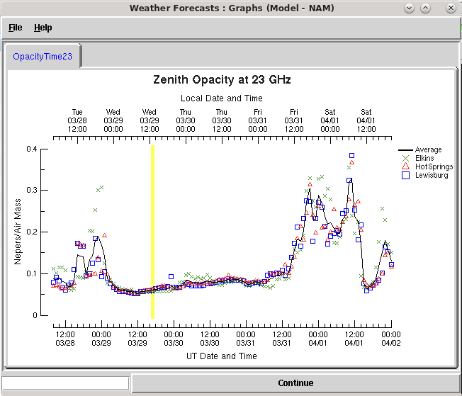

##################################################
How to Account for Sky Opacity in GBT Observations
##################################################

This guide walks you through how to calculate the opacity for your observations after the fact to use as input into GBTIDL.

1. Background
=============
At frequencies above approximately 10 GHz it becomes important to account for the effects of sky opacity on the measured antenna temperature, particularly when using the `corrected antenna temperature` scale, :math:`T_A^*` (see Chapter 16 of the Observers' `Guide <https://www.gb.nrao.edu/scienceDocs/GBTog.pdf>`_). 

.. note::

	Though it was stated above that "at frequencies above approximately 10 GHz," the exact frequency at which sky opacity becomes important and the magnitude of the effect on observations is highly variable and should be investigated for any individual given set of observations.

As a reminder, :math:`T_A^* = T_A\frac{e^{A\tau_0}}{\eta_{eff}}`
where 

- :math:`T_A^*` is the measured antenna temperature, 
- :math:`A` is the airmass at the elevation of the specific observation (~1/sin(elevation) for elevations > 20 deg), 
- :math:`\tau_0` is the zenith sky opacity at the specified frequency,
- :math:`\eta_{eff}` is the forward spillover efficiency of the antenna (~0.99 for the GBT).

As seen from the equation above, in order to calculate the corrected antenna temperature (:math:`T_A^*`) of observations made with the GBT, it is necessary to know at least the elevation of the telescope at the time of observations as well as the zenith sky opacity at the frequency observed. Some resources related to opacity are:

- A detailed description of how sky opacity measurements might be impacted by the selection of local forecast sites can be found in `GBT Memo 304 <https://library.nrao.edu/public/memos/gbt/GBT_304.pdf>`_
- Current `high frequency forecast plots <https://www.gb.nrao.edu/CLEO/Weather/AllOverviews.html>`_  are available and there are also relevant references for the interested reader available `here <https://www.gb.nrao.edu/CLEO/Weather/>`_

2. Sky Opacity in GBTIDL
========================
A feature of reducing data in GBTIDL is that data may be presented on the :math:`T_A^*` scale by supplying ``units='Ta*'`` as an option to a normal reduction command, e.g.

.. code-block:: text
    
    GBTIDL -> getps, 20, units='Ta*'

.. note::

	'20' represents the scan number

When GBTIDL calculates :math:`T_A^*`, it by default selects a representative value of zenith sky opacity (:math:`\tau_0`) from a set of historical data, which is then used to perform. The problem with this 'representative' value is that it may be significantly different to the value that is actually relevant to the observations of interest. 

If you want to know what value of :math:`\tau_0` that GBTIDL used in these circumstances, it is displayed at the command prompt when the reduction command is issued. Alternatively, the value of :math:`\tau_0` assumed when data are reduced in this manner can be retrieved by issuing the following command to GBTIDL

.. code-block:: text
    
    GBTIDL -> a=get_tau(f)

where `f` is the relevant frequency in GHz (equivalent to ``!g.s[0].line_rest_frequency/1.d9`` when working with a spectrum in current memory).

As stated, the value of :math:`\tau_0` used in this scenario is 'representative' and should not be relied upon for accurate data reduction. In order to achieve the best possible calibration, an accurate value of :math:`\tau_0` should be supplied to the GBTIDL reduction command via

.. code-block:: text
    
    GBTIDL -> getps, 20, units='Ta*', tau=tau_input

where `tau_input` is the true value of :math:`\tau_0` calculated by the user. However, this relies upon the user being able to calculate an accurate value of :math:`\tau_0` relevant to their observations. To calculate the true value of :math:`\tau_0` for your observations see the instructions below.

.. note::

	The ``tau`` value that a user enters into GBTIDL is assumed to be the zenith opacity. GBTIDL takes your ``tau_input`` value and calculates the sky opacity of your observation based on the elevation of your source.

3. Calculate Zenith Sky Opacity: Quickly By Eye
===============================================
There are multiple ways of retrieving zenith sky opacity measurements for a given time and frequency of observation, made using the GBT. The most basic or user-friendly is likely the ``Weather Forecasts`` feature of CLEO. This can be started by typing the following in the command line

.. code-block:: bash
 	
 	cleo forecast

This command will bring up the GUI shown below. 

.. _fig-forecast_gui:

	Figure 1: Image of CLEO forecast GUI.

This GUI/application has multiple features which are described below. However, please note the features described in this guide is not an exhaustive description of all of the capabilities of this GUI but will be restricted to capabilities related to calculating the opacity values only. You may notice that the GUI is also capable of returning predicted/calculated values of other parameters such as ``Air Mass``, ``Tsystem`` and ``Tatmosphere``, which the observer may find useful.

.. note::

	The opacity values reported by ``forecast`` are zenith opacity values. If you look at ``Air Mass``, you are required to put in an elevation of your observation and thus elevation is accounted for in airmass. You do not have to put in an elevation for ``Opacity`` and thus this value is a zenith opacity.

We will now go through the features of this GUI that you should pay attention to quickly, by eye calculate the sky opacity for your observations. They are:

- ``Model`` (see :ref:`how-tos/data_reduction/calculate_opacity:3.1 Model`)
- ``Sites`` (see :ref:`how-tos/data_reduction/calculate_opacity:3.2 Sites`)
- Other Parameters of Interest (see :ref:`how-tos/data_reduction/calculate_opacity:3.3 Other Parameters of Interest`)

3.1 Model
---------
Starting from the top of the GUI and working down, it can be seen that the user may select the ``Model``. The ``Model`` selected represents the National Weather Service (NWS) weather forecast model from which data is taken in order to supply the requested parameter. 

The default (see above as ``NAM``) is the 3.5 day 'NAM' forecast. More details on these models and their various features may be found elsewhere (such as `GBT Memo 304 <https://library.nrao.edu/public/memos/gbt/GBT_304.pdf>`_). But, for most purposes ``NAM`` will be the best option. It should be noted that the input model values used to derive the requested parameters may change, depending upon the date of the observation and when the user is making the request. As an example, the NAM model makes forecasts out to 3.5 days in the future and updates those forecasts with a six hour cadence, with an hourly timestep. Therefore, if the observer is requesting data that is within that 3.5 day window, those data may change. Thus even if the date is in the past, the forecast/assimilation/analysis cycle used in modern weather forecasting means that atmospheric parameters may still be updated.
What this means is that, for ``NAM``, once the 3.5 day window is past, retrieved values are the 'last, best' estimates and then remain fixed.

3.2 Sites
---------
Continuing from the top of the GUI down, the second selection the user is required to make is the site or sites used in the parameter derivation. This is again covered in much greater detail in GBT memo #304. The synopsis is that GBO uses three sites, approximately surrounding the location of the GBT, as proxies for some of the weather conditions at the site. By selecting all three of the ``Elkins``, ``HotSprings`` and ``Lewisburg`` sites, as well as checking the ``Averages`` box, all three values and their average will be plotted and the user can visually determine their relevance to their data. It may be noted that there is an option to select a now defunct 'Green Bank Radiometer' option. This is no longer operational and should be ignored.

3.2.1 Choosing Which Sites are Most Relevant to GBO Weather
^^^^^^^^^^^^^^^^^^^^^^^^^^^^^^^^^^^^^^^^^^^^^^^^^^^^^^^^^^^
At a simplistic level, weather at the GBO site typically moves approximately from south-west to north-east. This means that, when forecasting weather for the GBO site, data from the Hot Springs and Lewisburg sites are far more relevant than the Elkins site. However, on shorter timescales, it may also mean that weather that is coming up from the south will affect the Hot Springs and Lewisburg sites before impacting the GBO location. With this in mind, it is possible that the Elkins site is actually the most relevant one to use when establishing the conditions for a set of observations.

As an example, please see the figure below.

.. _fig-radar_maps:

	Figure 2: Radar maps showing the locations of Lewisburg, Hot Springs and Elkins, used for evaluating weather conditions at the GBO site, also shown. The upper map shows weather radar observations at 14:00 UT on the 7th of Feb, 2022. The bottom left and right images show radar observations at 15:00 and 16:00 UT, respectively. 

Fig. 2 shows a set of three radar maps at the beginning, middle and end of the observing session which was also used for the plot in Fig. 4. As can be seen, there appear to be clear skies above the GBO site at the beginning of the session, as well as the Elkins site. At this same time the Hot Springs and Lewisburg sites are also mostly clear but rain/cloud can be seen nearby. This corresponds to the first set of points in Fig. 4, in which all three sites have opacities in good agreement. By 15:00 - the second frame in Fig. 2, Lewisburg and Hot Springs are clearly experiencing cloudy skies and probable rain, while GBO and Elkins still have clear skies. At the end of the session (16:00 - final frame of Fig. 2) the GBO site will just be beginning to experience the weather that has been observed at the Lewisburg and Hot Springs sites for the prior two hours.

These radar maps agree well with the opacities plotted in Fig. 4. wherein the opacity at Elkins stays low for the three hour period plotted, while the Hot Springs and Lewisburg sites start the same period with low opacities, which then show increased opacity over the following two hours. In this case, it can be clearly determined that the opacity measured at the Elkins site is the most appropriate value to use for observations made during this particular period. However, this would not necessarily be immediately obvious without investigation.

3.3 Other Parameters of Interest
--------------------------------
Selecting the ``Time Series Curves`` or ``Curves for a Specific UT Date & Time`` tabs allows the user to investigate how their parameter of interest (assumed to be opacity here) varies as a function of time, in the first case, or as a function of elevation and/or frequency in the second case. For the sake of this description, I will present the example of finding opacity as a function of time (``Time Series Curves``).

Selecting ``Opacity`` under ``Calculations`` the user is then required to input the frequency, or frequencies, of interest - multiple frequencies can be selected by holding down 'control' and clicking multiple values. Note that available frequencies are in integer GHz values only.

It can be seen that the inputs to the calculations used to produce opacity (and other) values can also be selected (e.g. 'Hydrosols'). Unless there is a known reason to alter these, the user should leave these as the default values.

Once all parameters are selected, the user can choose whether or not to ``Save Results to Files``, which will prompt the user to select a location to output text files containing the relevant information. This done, the user should then click on ``Process``. After some computation, a plot (or plots) of the selected parameter(s) will be presented. An example is shown below.

.. _fig-zenith_opacity_week:

	Figure 3: Zenith Opacity variation at 23 GHz over a timescale of a week. The plot shows data points for the sites of Elkins (green crosses), Hot Springs (red triangles) and Lewisburg (blue squares) as well as the average of those three sites (solid line). The yellow bar is centered at the time at which the request was sent.

This first example (Fig. 3) shows a fairly wide time range of an entire week, useful perhaps for looking at an observing schedule or getting an idea of the overall variation of opacity but, if one would like to gain a better picture of the :math:`\tau_0` value associated with a specific observing session, then it is necessary to look at a shorter timescale. 

The image below shows an example of a much shorter timescale query, covering an observing period which lasted two hours.

.. _fig-zenith_opacity_2hours:

	Figure 4: Zenith Opacity variation at 23 GHz over a period of two hours. The plot shows data points for the sites of Elkins (green crosses), Hot Springs (red triangles) and Lewisburg (blue squares) as well as the average of those three sites (solid line).

It should be noted that, at the beginning of this observing period, there is good agreement between the three different physical locations from which data is taken, with :math:`\tau_0` values ranging from ~0.05 to ~0.062. However, by the midpoint of the period, there is a significant spread in :math:`\tau_0` values between the three. At this time, the site of Elkins shows a :math:`\tau_0` value of ~0.05, while the Hot Springs site shows a :math:`\tau_0` value of ~0.167. As can be seen, the two sites of Lewisburg (which shows a :math:`\tau_0` value of ~0.14) and Hot Springs are in reasonable agreement (< 20% error on their mean value), while the Elkins value shows a significant deviation from either of these sites. The default assumption in many cases (and for many GBO operations in general) is to take the averaged value of :math:`\tau_0` as the value supplied for data reduction. However, as can be seen in this particular case, that could lead to a potential over- or underestimate, depending on which site most closely resembles the conditions at the GBO site for the time of the observations. For this presented case, peak :math:`T_A^*` and spectral RMS values could vary by as much as ~15%, simply from poor selection of which site is used to represent weather conditions at the GBO site. See (:ref:`how-tos/data_reduction/calculate_opacity:3.2.1 Choosing Which Sites are Most Relevant to GBO Weather`) for more information.

4. Calculate Zenith Sky Opacity: Retrieving More Granular Values of Zenith Opacity
==================================================================================
While the process described above for retrieving opacity values is clearly useful for a 'quick-look' determination of how variable the weather may have been locally for a given set of observations, it is also beneficial to obtain values of :math:`\tau_0` which are calculated with more precision than by integer GHz frequency and on an hourly basis. Additionally a user might want to have a more automatic way to calculate the zenith sky opacity values instead of doing it by eye (e.g., perhaps the user wants to create a pipeline that includes an automatic/non-GUI way to calculate the  zenith sky opacity values). A way to begin scripting the calculation of zenith sky opacity values is detailed below.

Once it has been determined which of the three physical sites (or average thereof) is most pertinent to the observations in question, a user may retrieve a wide range of weather parameters using the command line tool which the CLEO GUI is the frontend for using the following command

.. code-block:: bash
 	
 	/home/cleoversions/Cleo6.2/mainscreens/forecastsCmdLine.tcl

By supplying a ``-h`` flag to this tool (i.e. ``/home/cleoversions/Cleo6.2/mainscreens/forecastsCmdLine.tcl -h``) a detailed set of instructions can be retrieved. This is a very versatile tool, with a wide range of capabilities and applications. This document only addresses the usefulness of this tool as it applies to retrieving :math:`\tau_0` values for a given set of observations. The reader is urged to explore the ways in which the tool can be used and the options for the data that are returned.

As a basic example of the use of this tool, the opacities for the observing period examined above may be retrieved via the following command

.. code-block:: bash
 	
 	/home/cleoversions/Cleo6.2/mainscreens/forecastsCmdLine.tcl -model NAM -calculate OpacityTime -freqList 23.1 23.2 23.3 -startTime "02/07/2022 14:00:00" -stopTime "02/07/2022 16:00:00" -incrTime 1

This will create a directory in the location in which the user is working and return a set of files to that directory in which the requested data are recorded. A user can then use these files in a scriptable way for your specific needs (e.g., one can interpolate to one's exact time of observations). In this case, the files contain the opacities at the frequencies 23.1, 23.2 and 23.3 GHz and they were requested on an hourly timescale. It is not currently possible to retrieve opacities at a finer time resolution than one hour. However, it is possible to retrieve opacities at much finer frequency resolution than through using the GUI tool. Unless specified otherwise, this command will return values for each of the Lewisburg, Hot Springs and Elkins sites, as well as the average of all three.

.. todo:: Possibly provide a script that uses this command line version of forecasts as an examplar way to script this process.
