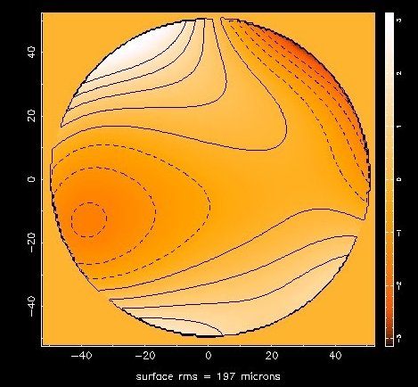
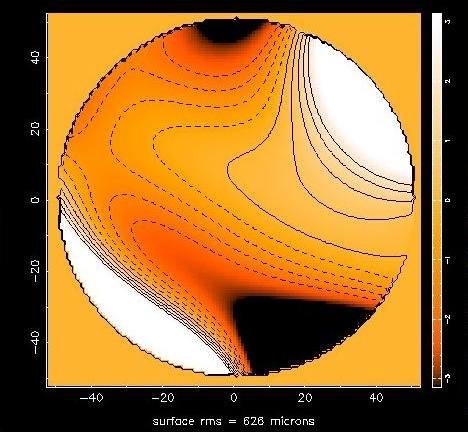
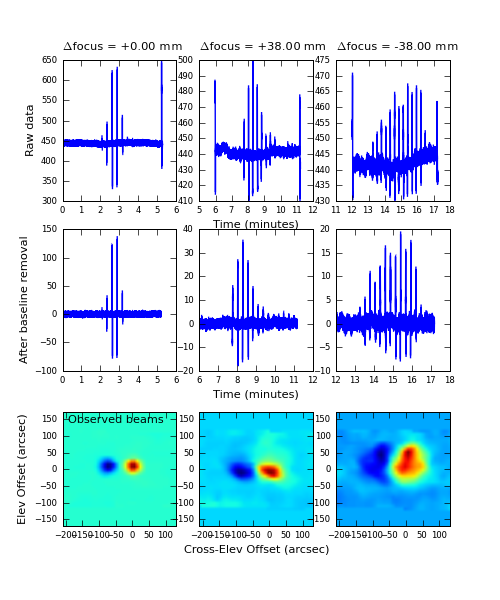
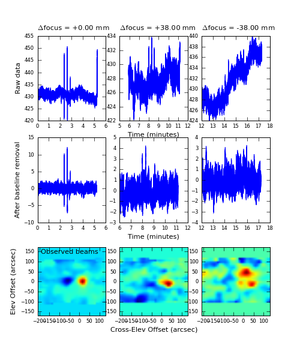
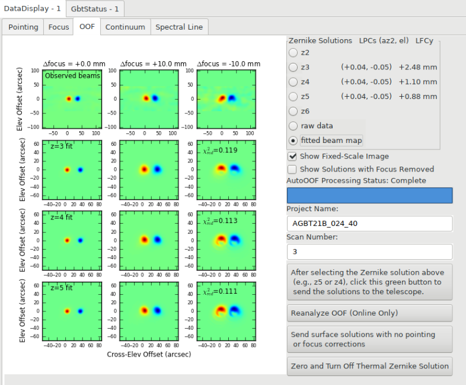
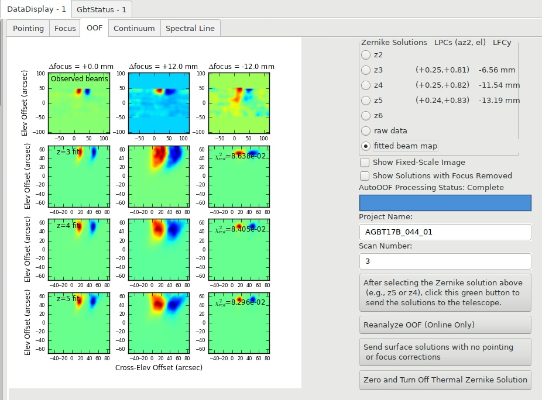
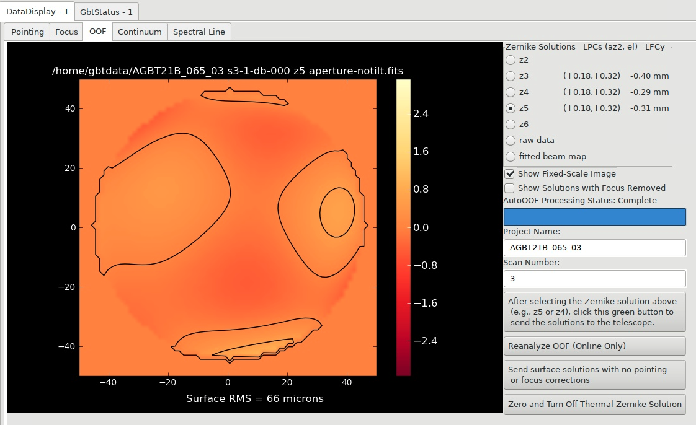

.. _AutoOOF_guide:

#############
AutoOOF Guide
#############

Context
=======
AutoOOF is recommended for observing at frequencies of 40 GHz and higher and only available 
for use with ``Rcvr26_40`` (:ref:`Ka-Band<ka_rx>`), ``Rcvr40_52`` (:ref:`Q-Band <qband_rx>`), ``Rcvr68_92`` (:ref:`W-Band<w_rx>`), ``RcvrArray75_115`` (:ref:`Argus<argus_rx>`), and ``Rcvr_MBA1_5`` (:ref:`MUSTANG-2<mustang2_technical>`). 

In this guide, you will learn about the steps of the OOF process and how to interpret the results. For information on OOF data display in AstrID, see :ref:`references/astrid:OOF Data Display`. For an explanation of what OOF is conceptually see :ref:`OOF_explanation`.

.. note:: 

    Extended sources may be observed without the AutoOOF corrections if the science is not impacted by the primary beam variations.

Finding a Good OOF Source
=========================

**What is a good source to OOF on?**

You want to choose a source that is bright, compact, and in the elevation range of 30 < el < 75 (e.g., a bright calibrator). The source should be (preferably) at least 7 K in the observed band, which is about 4 Jy at Q-band (see :numref:`tab-receivers-OOF-values` for the recommended flux limits for the receivers that can OOF). 

.. _tab-receivers-OOF-values:

.. table:: Receiver-Specific OOF Properties

   +-------------+------------------------+-----------------------------+-------------------+
   | Receiver    | OOF Frequency (GHz)    | Recommended Flux Limit (Jy) | Focus Offset (mm) |
   +=============+========================+=============================+===================+
   | Ka          | 32                     | 3.5                         | 38                |
   +-------------+------------------------+-----------------------------+-------------------+
   | Q           | 43                     | 5                           | 35                |
   +-------------+------------------------+-----------------------------+-------------------+
   | W           | 77                     | 6                           | 12                |
   +-------------+------------------------+-----------------------------+-------------------+
   | Argus       | 86                     | 7                           | 10                |
   +-------------+------------------------+-----------------------------+-------------------+
   | MUSTANG-2   | 90                     | 1                           | 10                |
   +-------------+------------------------+-----------------------------+-------------------+

.. note:: 

    The frequency which an OOF is taken at is hard coded. :numref:`tab-receivers-OOF-values` shows the frequencies for each receiver. MUSTANG-2 is a continuum instrument and the fiducial band center of 90 GHz is used. 

**How do I find a good OOF source?**

You can use the default CLEO catalogs to find potential bright calibrators. However, you should **NOT** rely on the catalog flux to be accurate as it is often many years out of date. It is preferable to instead use the `ALMA Calibrator Source Catalogue <https://almascience.eso.org/sc/>`_ to find good OOF sources as these sources are well understood and observed often. The ALMA Calibrator Source Catalogue has an extensive record of the flux densities for many of the bright 3 mm sources. 

If you unsure about the brightness of your source then you can run a point/focus scan on the calibrator first in order to confirm its strength. Remember, to obtain good OOF results, you need to be able to detect the source when the subreflector is out of focus which reduces its peak intensity significantly.

.. note:: 

    In the past it was true that you would want to OOF at an elevation that is similar to your source. However that was before the new gravity model implemented in 2010. Now the gravity model is good enough that this is not necessary.

.. warning::
   
   Do not OOF on a source that is in the keyhole (> 85°) or about to enter the keyhole. Find a source to OOF on that has an elevation of 30-75°. Remember that an OOF can take up to 30 minutes to complete so make sure that your OOF source will not go into the keyhole during the duration of the OOF process.

Receiver-Specific OOF Guidance
==============================
Since the Ka-band receiver with the default CCB backend provides the most accurate measurements of the surface parameters, users should consider using this whenever possible (except for MUSTANG-2 users who use the MUSTANG system for OOFing). The benefit of using the Ka+CCB system when possible is two-fold: (a) due to the high sensitivity provided by the CCB, the S/N ratios observed with the Ka+CCB system are much higher than what is possible at higher frequencies, and (b) the winds affect the Ka-band data to a lesser degree due to the larger beam-size which in turn makes the surface solutions less affected by winds.

Q-Band
------
In general the advice is to use Ka when you can, but if you are observing with Q-band, just use Q. You don't gain that much by switching to Ka.

W-Band
------
See guidance in W-band :ref:`references/receivers/w-band:Observing`, but in summary if the Ka-band receiver is available, run :func:`AutoOOF() <astrid_commands.AutoOOF>` at Ka-band (or if Ka is not available and Q-band is available, use Q-band) instead of W-band for more accurate surface corrections.

Argus
-----
See guidance in Argus :ref:`references/receivers/argus:Observing`, but in summary, again, if the Ka-band receiver is available, run the AutoOOF at Ka-band instead of Argus for more accurate surface corrections. Then after the AutoOOF solutions are applied, run a point and focus with Argus to confirm the telescope collimation offsets after the application of the OOF solutions.

MUSTANG-2
---------
Use MUSTANG-2 to OOF and obtain pointing and focus corrections. For choosing your OOF sources for MUSTANG-2, see guide on picking :ref:`OOF sources <how-tos/receivers/mustang2/mustang2_obs_scripts:3.2 OOF sources>`. In the :func:`AutoOOF() <astrid_commands.AutoOOF>`, if it is the first OOF for the MUSTANG-2 project set ``calseq=True`` so ``AutoOOF(source,calseq=True)``. When you set ``calseq=True``, this initiates a skydip scan before the OOF scans (skydip is needed for calibration of the data). If you are doing an OOF later in the night then set ``calseq=False`` so that you do not run another skydip. 

The AutoOOF Procedure
=====================
When you come online, check if there were high frequency observations before you at any point that did an AutoOOF. You can ask the operator about this. If there were no high frequency observations before you, the Zernike thermal coefficients should be zeroed out and the Zernike thermal offsets turned off. The operator should do this before the first high frequency project of the night, but it is good practice to check this. Additionally, if the OOF was done before ~22:00, you may want to request the same thing (that the Zernike thermal coefficients are zeroed out and the Zernike thermal offsets are turned off) before you OOF, because the dish may still be settling and the previous corrections may not be similar to what you calculate.

For a more in-depth explanation of what OOF is doing see :ref:`this section of the OOF explanation<explanations/OOF:AutoOOF Procedure>`.

Below we provide some general information about the OOF process:

* **Allow approximately 25 minutes for an AutoOOF**.
    * The AutoOOF procedure obtains three consecutive OTF maps; each map takes 5-6 minutes and is at a different focus position.
* **Use AutoOOF to derive pointing and focus offsets**
    * The OOF-processing is launched automatically upon completion of the third map, and the result is displayed in the OOF tab of AstrID. It is incumbent upon you, as the observer, to examine the solutions (see guidance in guide below), select a solution, and click the button (in the AstrID *DataDisplay* tab) to send the selected solution to the active surface. It is recommended that when sending the solutions, you use the button in the OOF display tab labeled *After selecting the Zernike solution above (e.g., z4 or z5), click this green button to send the solutions to the telescope*.

.. note:: 

    :func:`AutoPeakFocus() <astrid_commands.AutoPeakFocus>` may be run as a sanity check on the AutoOOF solution. If Peak/Focus scans were performed before AutoOOF, then source amplitude should be greater after the AutoOOF than what was seen before the surface correction was sent.  Additionally, :func:`AutoPeakFocus() <astrid_commands.AutoPeakFocus>` pointing and focus corrections should agree with values derived by :func:`AutoOOF() <astrid_commands.AutoOOF>`.

How long does an OOF solution remain valid?
============================================
:func:`AutoOOF() <astrid_commands.AutoOOF>` is currently only executed for observing projects at nighttime. 

Nighttime
----------
A general rule of thumb is that if the corrections are measured at least two hours after sunset, then the solutions should be good for about 4 hours. This depends on how rapidly the backup structure cools off after sunset and how sunny the day was. If the OOF is taken after midnight, the structure has typically stabilized by then, and the solutions may even be good until after sunrise. But in general, OOF solutions are good for 2-6 hours at nighttime depending on the conditions of any particular night. Note that if you are scheduled soon after sunset, be aware that you might have to OOF more often as the surface "settles."

Daytime
--------
During the daytime, it is a difficult to answer the question of "How long does the OOF solution remain valid?" as it depends on the position of the telescope with respect to the Sun and cloud cover. The answer can be anything from less than 30 min to 4 hours. Daytime surface changes are on time scales of the order of <1 hour. Due to these rapidly changing conditions, the :func:`AutoOOF() <astrid_commands.AutoOOF>` solutions (which are dervied on similar timescale of ~30 minutes) can cause more harm (efficiency damage) than good. So it is typically not useful to use the OOF derived corrections during the day.

When do I need to OOF again?
----------------------------
No matter what receiver you are using you should **periodically examine peak scans**. 

A new AutoOOF may be necessary if the following characteristics are seen:
    * Significant sidelobes begin to appear.
    * The beam size increases by more than 10%.
    * Source amplitude decreases systematically by 15% or more.
   
For how often to do a peak scan for Ka-Argus receivers see :ref:`See Table 1 in Pointing and Focus Strategies <how-tos/general_guides/point-focus:Pointing and Focusing Strategies>`. MUSTANG-2 observers should observe a pointing calibrator and use it to check the peak and beam approximately every 30 minutes.

.. todo::

    Using the Ruze and radiometer equations, calculate at what point the surface degrades enough that it will be more efficient use of time to OOF as opposed to keep observing

Inspecting AutoOOF Solutions
============================

Surface Delta Map Characteristics
---------------------------------
Good solutions have the following characteristics:
    * **Broad features** of less than :math:`\pm 1.5` radians of phase (the amplitude of the features is in radians and indicated by the colorbar on a surface delta map - see :numref:`fig-good-oof-solution`)  in good, stable conditions.  Note that you may uncheck *Show Fixed Scale Image* to view the full data range in the color bar.
    * Surface RMS :math:`\lesssim` 400\ :math:`\mu m` if the gravity-Zernike model is on and the temperature is greater than 10° F.

If you see an RMS :math:`\gtrsim` 400\ :math:`\mu m`, the solutions might still be ok to apply. The following are conditions in which you would expect to have a higher RMS:
        - The temperature is < 10° F. The gravity-Zernike model is an average model taken in a variety of conditions (see :ref:`explanations/OOF:Modeling and Correcting for Gravity`). Consequently, if the conditions under which you are performing the AutoOOF procedure differ substantially from "typical" conditions (defined by the gravity-Zernike model), the resulting solutions exhibit corresponding deviations. For example, the gravity-Zernike model was taken in the temperature range of 20-40° F. Therefore, at temperatures < 10° F, you have begun to deviate from the typical range of the gravity-Zernike model and you will see larger deltas and therefore higher RMS values. 
        - The previous OOF solution is no longer applicable. This can happen if the OOF before you was done before ~22:00. In this case the dish may have still been settling, but is now stable when you are observing. And in this case, the differences between the previous surface and yours in stable conditions might be quite large.
        - The gravity-Zernike model is not on. You can check this by doing the following: open the CLEO Active Surface application and in the *Standard* tab (default when the Active Surface application opens) the gravity-Zernike model is on if the box next to *Zernike Offsets* is green (see more details in :ref:`explanations/OOF:OOF Coefficients in Active Surface Application`).

Here is an example of an acceptable OOF solution: 

.. _fig-good-oof-solution:

    
    This solution shows broad features (:math:`\pm` 1.5 radians of phase) with a surface RMS of 197\ :math:`\mu m`.

Here is an example of an unacceptable OOF solution:

.. _fig-bad-oof-solution:

    This solution shows steep contour lines (:math:`\pm` 15 radians of phase) and a surface RMS of 626\ :math:`\mu m`. This is likely the result of poor quality raw data and the solution should not be used.

.. note:: 

    The scalebar in the surface delta map has units of radians. The units of the x and y axis of the surface delta map are meters. 

Selecting the Zernike order
---------------------------

By default, AutoOOF will halt processing after the fifth-order Zernike (z5) solution has been computed. The z5 solution is suitable for most conditions and is generally what observers should expect to use. A more aggressive sixth-order (z6) fit may also be derived at the cost of a few additional minutes of processing time. This is usually unnecessary and should only be done on bright calibrators under favorable weather conditions. See :ref:`how-tos/general_guides/autooof:OOF z6 Processing Options` for information on how to do this.

Occasionally, it may be necessary to drop to a lower order of fit if the following features are seen:

* **Large deviations** over a significant area of the dish edge in the OOF solution.
* **Regularly spaced features** around the circumference of the dish at higher order fits in the OOF solution.
* **Anomalous values in the pointing/focus LPC/LFC** for one particular solution, or a significant jump in LPC above a certain Zernike fit order. For example, if the focus (LFCy) values for the z3-z4 solutions are around -3mm, then abruptly jump to +10mm for the z5 solution, then it would be prudent to assume that some or all of the solutions may be invalid. It may be possible to determine which solutions are valid by examining the fitted beam maps for obvious artifacts or deviations from the observed beams.
  
  .. _fig-oof-beammap:
  .. figure:: images/autoOOF/OOF_fittedbeammap.jpg
        
         The AutoOOF fitted beam maps. The observed beams are plotted on the top row with the z3, z4 and z5 fits to the observed beams plotted below. The z3 solution (:math:`2^{\text{nd}}` row down) shows an obvious artifact and should not be used.

  .. _fig-oof-beammap-solutions:
  .. figure:: images/autoOOF/OOF_fittedbeammap_solutions.jpg
         
          Zernike Solutions. Note the significant jump in LPC and the LFC between the z3 and z4 solutions.

.. todo:: remake :numref:`fig-oof-beammap-solutions`.

OOF z6 Processing Options
^^^^^^^^^^^^^^^^^^^^^^^^^

Deriving the sixth-order Zernike (z6) solution will require a few additional minutes of processing time. To do this, the user will have to manually change the maximum order of fit to process to z6 in the following way:

#. Select the *OOF* Subtab of the AstrID *DataDisplay*.
#. Select *Tools* :math:`\rightarrow` *Options...* from the drop--down menu.
#. Select the maximum order of fit to process from the *Processing Options* tab of the pop--up window.

   .. image:: images/autoOOF/OOFprocessing_options.jpg

.. important:: 

    All changes must be made **before submitting the AstrID script** containing the :func:`AutoOOF() <astrid_commands.AutoOOF>` function in order to take effect. You may also repeat processing after making any changes by pressing *Reanalyze OOF (Online Only*.

.. admonition:: Internal Access Only

    More information on AutoOOF can be found `here <https://safe.nrao.edu/wiki/bin/view/GB/PTCS/AutoOOFInstructions>`_.

    .. todo:: Transfer the relevant content from that wiki page here.

AutoOOF Raw Data
----------------

Although an OOF solution may appear to be reasonable (e.g., :numref:`fig-good-oof-solution`) it may be invalid if it was derived from a bad set of raw data. Sending such a solution to the active surface could degrade performance. Therefore, you should always check the quality of the raw AutoOOF data in order to determine whether your derived solutions are valid. 

For a set of raw data to be considered valid, it should show the following characteristics:
    * Detection of the source in the raw data timestream at all focus positions and at least two focus positions have good signal-to-noise.
    * Symmetrical positive/negative pattern in all three raw data images.
    * Smooth features in all three raw data images. Sharp edges or stripes indicate hardware/software glitches or excessive winds.

You can view the AutoOOF raw data by selecting the *raw data* button in the upper-right section of the OOF Subtab of the Data Display. Each column represents one focus position. The top row is the raw timestream data from the receiver, the second row has the baselines removed, and the bottom row shows the corresponding beam maps. See :numref:`fig-good-oof-raw-data` and :numref:`fig-bad-oof-raw-data` for a comparison of acceptable and unacceptable raw AutoOOF data.

.. _fig-good-oof-raw-data:

    A plot of the raw OOF data on a fairly clean Ka-Band+CCB dataset.

.. _fig-bad-oof-raw-data:

    A plot of the raw OOF data on a source which is too faint in particular in the delta focus = -38 mm and = +38 mm. 

Raw Data: What am I looking at?
^^^^^^^^^^^^^^^^^^^^^^^^^^^^^^^
For all receivers besides MUSTANG-2, each OOF is an RALongMap so each of the spikes in the raw data is the beam going over the source; and the relative strength of the spike is how much of the source is in the beam. The closer you are to the correct focus, the less fuzzy and wide the source is, and thus then the less spikes there are. Said another way, when you are close to the focus correction values, there are fewer, but stronger peaks. Further, where you are getting the spikes in time tells you about the elevation offset. For example if you see spikes early in time that means there will be a minus elevation offset.

Note that if a receiver has 2 or more beams, two beams are used to OOF. In the raw data plots you will see the signal of the source twice: once for each beam. One beam is subtracted from another to make the raw data plots so that is why there are negative spikes. And if you zoom in you will see that the positive and negative spikes aren't exactly lined up. It is because the two beams are going over the source at slightly different times.

How do I know if I have a good SNR for the OOF? Ask yourself, do you see peaks? If yes, you have high SNR. If you just see noise, you don't have high SNR. 

.. admonition:: Tip for determining if you have enough SNR for OOFing.

    Change to the *DataDisplay* -> *Continuum* tab for the first OOF scan and see if you see signal from a source or not. If you don't see spikes, then you might want to abort and change to a stronger source.

.. note::

    The y-axis in the raw data plots are NOT scaled between the three focus positions.

AutoOOF Fitted Beam Map
-----------------------
It is good to quickly check the fitted beam map. 

.. _fig-example-fitted-beam-map:

    A plot of the fitted beam map for an OOF taken with Argus. 

The top row shows the observed beams at the various focus positions. Each subsequent row presents the fitted beam maps for the 3rd to 5th Zernike orders if these corrections were applied. In general, higher Zernike orders yield a more accurate beam solution. Moreover, the beam appearance should become more circular near the correct focus; for example, when LFC_Y is −9 mm, the −10 mm fitted beam maps should appear more circular. Note, however, that these maps depict how point sources would look at each focus position, so the maps corresponding to two of the three focus positions are likely to deviate from the actual focus position and may appear non-circular.

Note that when the telescope is out of focus, you are stretching the beam out. Thus, being at different focus positions will stretch the beam out in different ways. Let's say that 0 mm is at focus, then the plus focus position stretches the beam out vertically then the minus focus stretches out the beam horizontally. For example, see the fitted beam map in :ref:`the bad low SNR example <bad-low-snr>`. 

.. note::

    There are always two beams in the fitted beam maps for all receivers that you can OOF with besides MUSTANG-2. 

Summary for checking your OOF solutions
----------------------------------------

Go through the various Zernike order fits (z5-z3) and check the following:

* surface delta map. If the structure of surface delta map has:
    * smooth features = good
    * sharp features = bad

* surface RMS.
    * RMS :math:`\lesssim` 400 um = good
    * RMS :math:`\gtrsim` 400 um = potentially bad. In this case, the observer should do some sleuthing into reasons why it might be higher. See cases in which you would expect to see a higher RMS in :ref:`how-tos/general_guides/autooof:Surface Delta Map Characteristics`.

* local point corrections (LPCs) & local focus correction (LFC)
    * smaller numbers = good
    * large numbers (LFC > 10mm) = bad

Also check the:

* the raw data
    * high SNR = good
    * low SNR = bad

* the fitted beam maps
    * streaks and/or very non-gaussian = bad

Tips and Tricks
===============

Uncheck Fixed Scale
-------------------
You'll notice that the z-axis values of the surface delta map are by default from -2.5 to 2.5 radians (see scale bar to the right of the surface delta map). This is because the box to the right of the surface image map labeled *Show Fixed-Scale Image* is checked. It can be useful to see the full range of z-axis values. To do this uncheck the box next to *Show Fixed-Scale Image* and it will then display the full range of values. This can be helpful in the case that the OOF is clearly bad or you are uncertain.
    
Scaling for a Bad OOF
^^^^^^^^^^^^^^^^^^^^^

.. _scaling_bad_oof_ex1:

Example 1
'''''''''

.. tab-set::

    .. tab-item:: Fixed z5

        .. image:: images/autoOOF/Q-band/AGMV24B_376_01_OOF1_bad_z5_fixedScale.png

    .. tab-item:: Scaled z5

        .. image:: images/autoOOF/scaled/AGMV24B_376_01_OOF1_bad_z5_scaled.png

    .. tab-item:: Fixed z4

        .. image:: images/autoOOF/Q-band/AGMV24B_376_01_OOF1_bad_z4_fixedScale.png

    .. tab-item:: Scaled z4

        .. image:: images/autoOOF/scaled/AGMV24B_376_01_OOF1_bad_z4_scaled.png

    .. tab-item:: Fixed z3

        .. image:: images/autoOOF/Q-band/AGMV24B_376_01_OOF1_bad_z3_fixedScale.png

    .. tab-item:: Scaled z3

        .. image:: images/autoOOF/scaled/AGMV24B_376_01_OOF1_bad_z3_scaled.png

For more details about this OOF see the :ref:`Q-Band Bad Example <qband_bad>`.

.. _scaling_bad_oof_ex2:

Example 2
'''''''''

.. tab-set::

    .. tab-item:: Fixed z5

        .. image:: images/autoOOF/M2/bad/AGBT21B_206_06_s46_z5_fixedScale.png

    .. tab-item:: Scaled z5

        .. image:: images/autoOOF/scaled/AGBT21B_206_06_s46_z5_scaled.png

    .. tab-item:: Fixed z4

        .. image:: images/autoOOF/M2/bad/AGBT21B_206_06_s46_z4_fixedScale.png

    .. tab-item:: Scaled z4

        .. image:: images/autoOOF/scaled/AGBT21B_206_06_s46_z4_scaled.png

    .. tab-item:: Fixed z3

        .. image:: images/autoOOF/M2/bad/AGBT21B_206_06_s46_z3_fixedScale.png

    .. tab-item:: Scaled z3

        .. image:: images/autoOOF/scaled/AGBT21B_206_06_s46_z3_scaled.png

For more details about this OOF see the :ref:`MUSTANG2 Bad Example 2 <mustang2_bad_ex2>`.

Scaling for an Uncertain OOF
^^^^^^^^^^^^^^^^^^^^^^^^^^^^

.. tab-set::

    .. tab-item:: Fixed z5

        .. image:: images/autoOOF/Q-band/AGMV24B_376_01_OOF2_iffy_z5_fixedScale.png

    .. tab-item:: Scaled z5

        .. image:: images/autoOOF/scaled/AGMV24B_376_01_OOF2_iffy_z5_scaled.png

    .. tab-item:: Fixed z4

        .. image:: images/autoOOF/Q-band/AGMV24B_376_01_OOF2_iffy_z4_fixedScale.png

    .. tab-item:: Scaled z4

        .. image:: images/autoOOF/scaled/AGMV24B_376_01_OOF2_iffy_z4_scaled.png

    .. tab-item:: Fixed z3

        .. image:: images/autoOOF/Q-band/AGMV24B_376_01_OOF2_iffy_z3_fixedScale.png

    .. tab-item:: Scaled z3

        .. image:: images/autoOOF/scaled/AGMV24B_376_01_OOF2_iffy_z3_scaled.png

For more details about this OOF see the :ref:`Q-Band Uncertain Example <qband_uncertain>`.

Scaling for a Good OOF
^^^^^^^^^^^^^^^^^^^^^^

.. tab-set:: 

    .. tab-item:: Fixed z5

        .. image:: images/autoOOF/M2/good/AGBT21A_376_01_s5_z5_fixedScale.png

    .. tab-item:: Scaled z5

        .. image:: images/autoOOF/scaled/AGBT21A_376_01_s5_z5_scaled.png

    .. tab-item:: Fixed z4

        .. image:: images/autoOOF/M2/good/AGBT21A_376_01_s5_z4_fixedScale.png

    .. tab-item:: Scaled z4

        .. image:: images/autoOOF/scaled/AGBT21A_376_01_s5_z4_scaled.png

    .. tab-item:: Fixed z3

        .. image:: images/autoOOF/M2/good/AGBT21A_376_01_s5_z3_fixedScale.png

    .. tab-item:: Scaled z3

        .. image:: images/autoOOF/scaled/AGBT21A_376_01_s5_z3_scaled.png

For more details about this OOF see the :ref:`MUSTANG2 Good Example 1 <mustang2_good_ex1>`. 

Show Solutions with Focus Removed
---------------------------------
When you are inspecting the surface delta map, there is an option on the right hand side to *Show Solutions with Focus Removed*. OOF solves for the pointing and focus corrections in addition to the surface corrections. *Show Solutions with Focus Removed* allows you to look at the surface corrections with the focus removed. This is particularly useful to do when you have a large focus correction (:math:`|` LFC_Y :math:`| \gtrsim` 10 mm) and/or the focus correction is outside of the range of the focus offsets which is receiver specific (see the "Focus Offset" column of :numref:`tab-receivers-OOF-values`). It is also useful to check when you are unsure if you have good surface corrections (typically when you have indications that the OOF is bad or marginal) as this allows you check the surface delta map with the focus removed to see if the underlying surface corrections are good. 

For an example, see the following surface delta maps of a project that OOFed with Ka+CCB for different orders of Zernike polynomials.

.. tab-set::

    .. tab-item:: z5

        .. image:: images/autoOOF/misc_examples/AGBT20A_322_16_s1_z5_fixedScale.png

    .. tab-item:: z4

        .. image:: images/autoOOF/misc_examples/AGBT20A_322_16_s1_z4_fixedScale.png

    .. tab-item:: z3

        .. image:: images/autoOOF/misc_examples/AGBT20A_322_16_s1_z3_fixedScale.png

You will notice that with all of those the surface delta map looks ok (no sharp edges really), but the surface RMS for z5 is a bit on the high side. The main thing of concern is that the focus offsets are quite high (:math:`\gtrsim|10mm|`). This is a good case in which it is good to inspect the surface corrections with the focus removed. To do this, check the box that says *Show Solutions with Focus Removed*. Once you have done that you can inspect all three orders of Zernike surface delta maps. For this case they look like the following:

.. tab-set:: 

    .. tab-item:: z5

        .. image:: images/autoOOF/misc_examples/AGBT20A_322_16_s1_z5_focusRemoved.png

    .. tab-item:: z4

        .. image:: images/autoOOF/misc_examples/AGBT20A_322_16_s1_z4_focusRemoved.png

    .. tab-item:: z3

        .. image:: images/autoOOF/misc_examples/AGBT20A_322_16_s1_z3_focusRemoved.png

.. note:: 

    *Show Solutions with Focus Removed* shows three different surface delta maps: relative solution, absolute solution, and absolute solution with focus removed. Note that the relative solution is the one that most looks like the surface delta map that is initially displayed. The *absolute solution with focus removed* is the map that you want to look at. 

For this example, in the main z5 surface delta map you see (a) a spherically symmetric shape that is indicative of being out of focus, and (b) a higher surface RMS. Then when you look at the solution with the focus removed (*absolute solution with focus removed*) there is a decent surface with the spherically symmetric shape gone and the RMS is more reasonable. This example demonstrates the use of looking at the surface corrections with the focus removed. And in this case, we would say that the z5 solutions are good (we saw that the surface solutions look good via removing the focus) and would apply those.

.. note::

    If the focus corrections are small, you wont see much of a difference in the focus removed solutions. It is when the focus corrections are larger when the focus removed solutions will be different from the solutions. As a rule of thumb, look at the focus removed solutions when the focus corrections are around what the +-focus positions are for the receiver being used (e.g., 10mm for MUSTANG-2).

OOF Examples
============

Bad: Keyhole
------------
OOF done with Argus in the keyhole at >85° which resulted in an OOF "RMS"=438 :math:`\mu\mathrm{m}` with a large implied focus and elevation (el) pointing offset. 

.. tab-set:: 

    .. tab-item:: z5

        .. image:: images/autoOOF/bad/AGBT17B_044_01_s3_bad_keyhole_z5_fixedScale.png

    .. tab-item:: z4

        .. image:: images/autoOOF/bad/AGBT17B_044_01_s3_bad_keyhole_z4_fixedScale.png

    .. tab-item:: z3

        .. image:: images/autoOOF/bad/AGBT17B_044_01_s3_bad_keyhole_z3_fixedScale.png

Notice that they all have sharp features and the higher orders have RMS :math:`\gtrsim` 400 :math:`\mu\mathrm{m}` and large implied focus and elevation pointing offsets. 

Fitted beam map:

Notice that observed beams are not circular; this is likely due to the beam jittering around due to movement of telescope. Notice that the beam is elongated but this is not necessarily due to being in the keyhole.

.. note::

    Note that the source is at the very top of the fitted beam map and a bit is cut off. This indicates that the pointing was off. This often happens when you observe at high elevations so being in the keyhole is likely the cause in this case.

Bad: High Winds
---------------
OOF done with Argus in windy conditions.

.. tab-set:: 

    .. tab-item:: z5

        .. image:: images/autoOOF/bad/AGBT19A_326_07_s20_z5_fixedScale.png

    .. tab-item:: z4

        .. image:: images/autoOOF/bad/AGBT19A_326_07_s20_z4_fixedScale.png

    .. tab-item:: z3

        .. image:: images/autoOOF/bad/AGBT19A_326_07_s20_z3_fixedScale.png

    .. tab-item:: Raw data

        .. image:: images/autoOOF/bad/AGBT19A_326_07_s20_raw_data.png

    .. tab-item:: Fitted beam map

        .. image:: images/autoOOF/bad/AGBT19A_326_07_s20_fitted_beam_map.png

        Notice that none of the beams are circular. Notice that the Zernike fits to the beam are streaky; this is due to the telescope moving in the wind.

.. _bad-low-snr:

Bad: Low SNR
------------
You should always check the SNR of your OOF sources. To do this go to the *DataDisplay* tab and then click **raw data**. See :numref:`fig-good-oof-raw-data` (look particularly at the row that is marked "After baseline removal") for an example of what good raw data SNR plots look like and see :numref:`fig-bad-oof-raw-data` for an example of what bad raw data SNR plots look like (as in you do not see the source at all).

Below is an example of an OOF done with Argus that is categorized as a "marginal OOF" with borderline SNR.

.. tab-set:: 

    .. tab-item:: z5 Surface Delta Map

        .. image:: images/autoOOF/bad/AGBT17B_151_68_s3_z5_fixedScale.png

    .. tab-item:: Raw data

        .. image:: images/autoOOF/bad/AGBT17B_151_68_s3_raw_data.png

    .. tab-item:: Fitted beam map

        .. image:: images/autoOOF/bad/AGBT17B_151_68_s3_fitted_beam_map.png

        Notice that the beams plus and minus focus positions are not circular. This is not due to low SNR but due to the telescope being out of focus at those focus positions.

Notice that though the RMS of the surface delta map is 244 :math:`\mu\mathrm{m}` (which is reasonable and categorized as good), the SNR of the data is overall low (especially the +12mm focus *After baseline removal*). If you have low RMS from an OOF with Argus, you might not be detecting the source. And if you aren't detecting a source, your "signal" is just noise and RMS of noise is likely low so you would expect a low surface RMS. So for all receivers that you can OOF with besides MUSTANG-2, you need to make sure you have a high SNR source for OOFing. 

**Advice for this situation:** Find a different source to OOF on with higher SNR.

.. note::
    
    You need two out of the three scans to have good SNR to get a good surface solution.

Comparing Ka and Argus OOF on Same Source
-----------------------------------------
Here is a comparison of the raw data from an OOF taken on the same source (3C84, also known as 0319+4130) with Ka+CCB and Argus. 

.. tab-set:: 

    .. tab-item:: Ka+CCB

        .. image:: images/autoOOF/Argus/TGBT19B_506_01_s3_Ka_raw_data.png

    .. tab-item:: Argus

        .. image:: images/autoOOF/Argus/Argus_3C84_resized.png

The takeaway here is that if you can do your OOF with Ka (unless you are a MUSTANG-2 observer) do it with Ka as the larger beam size allows for better SNR of a source and thus a better OOF solution.

Q-band
------
Both of the following OOFs were taken during a VLBI run where the observer used Q-band to OOF and then observed with W-band.

.. _qband_bad:

Bad
^^^
Right at the start of the observing session, the observer started with an OOF with Q-band.

.. tab-set:: 

    .. tab-item:: z5

        .. image:: images/autoOOF/Q-band/AGMV24B_376_01_OOF1_bad_z5_fixedScale.png

    .. tab-item:: z4

        .. image:: images/autoOOF/Q-band/AGMV24B_376_01_OOF1_bad_z4_fixedScale.png

    .. tab-item:: z3

        .. image:: images/autoOOF/Q-band/AGMV24B_376_01_OOF1_bad_z3_fixedScale.png

    .. tab-item:: Raw data

        .. image:: images/autoOOF/Q-band/AGMV24B_376_01_OOF1_bad_raw_data.png

    .. tab-item:: Fitted beam map

        .. image:: images/autoOOF/Q-band/AGMV24B_376_01_OOF1_bad_fitted_beam_map.png

        Notice that the +- focus positions do not look good.

All of the above surface delta maps have a) sharp features, b) a high surface RMS, and c) high focus corrections. You can view the scaled surface delta maps in :ref:`Scaling for a Bad OOF Example 1 <scaling_bad_oof_ex1>`. 

Let's take a look at the solutions with the focus removed. 

.. tab-set:: 

    .. tab-item:: z5

        .. image:: images/autoOOF/Q-band/AGMV24B_376_01_OOF1_bad_z5_focus_removed.png

        Though some of the spherical shape has been removed from the focus dependency, notice that the sharp features are still there and there is still a very high surface RMS.

    .. tab-item:: z4

        .. image:: images/autoOOF/Q-band/AGMV24B_376_01_OOF1_bad_z4_focus_removed.png

        Again, though some of the spherical shape has been removed from the focus dependency, notice that the sharp features are still there and there is still a high surface RMS. 

    .. tab-item:: z3

        .. image:: images/autoOOF/Q-band/AGMV24B_376_01_OOF1_bad_z3_focus_removed.png

        Removing the focus corrections didn't change the features in the surface delta map much because there wasn't a large focus correction for this Zernike order. Some somewhat sharp features still exist and there is still a high RMS.

Since we didn't see improvement from the focus removed solutions, this would point to some other issue going on. For example, the surface may have been bad at the start.

**Advice for this situation:** This situation is a gray area. Generally in this situation, given high RMS the observer may opt to repeat OOF. In this case given the VLBI time constraints, the observer opted to not apply and move on.

.. _qband_uncertain:

Uncertain
^^^^^^^^^
Then later in the same VLBI observing session, the observer had to OOF again.

.. tab-set:: 

    .. tab-item:: z5

        .. image:: images/autoOOF/Q-band/AGMV24B_376_01_OOF2_iffy_z5_fixedScale.png

        Notice the sharp features, very high surface RMS, and large focus correction. 

    .. tab-item:: z4

        .. image:: images/autoOOF/Q-band/AGMV24B_376_01_OOF2_iffy_z4_fixedScale.png

        Notice the sharp features, high surface RMS, and large focus correction. 

    .. tab-item:: z3

        .. image:: images/autoOOF/Q-band/AGMV24B_376_01_OOF2_iffy_z3_fixedScale.png

        Notice the sharp features have been minimized, the surface RMS is still high but not as high as before, and the focus correction is much smaller. 

    .. tab-item:: Raw data

        .. image:: images/autoOOF/Q-band/AGMV24B_376_01_OOF2_iffy_raw_data.png

    .. tab-item:: Fitted beam map

        .. image:: images/autoOOF/Q-band/AGMV24B_376_01_OOF2_iffy_fitted_beam_map.png

You can look at the scaled surface delta maps in :ref:`how-tos/general_guides/autooof:Scaling for an Uncertain OOF`.

This is a good example in which to see if the surface corrections look ok with the focus removed.

.. tab-set:: 

    .. tab-item:: z5

        .. image:: images/autoOOF/Q-band/AGMV24B_376_01_OOF2_iffy_z5_focus_removed.png

        Notice the sharp features are still there and there is still a very high surface RMS.

    .. tab-item:: z4

        .. image:: images/autoOOF/Q-band/AGMV24B_376_01_OOF2_iffy_z4_focus_removed.png

        Notice the sharp features are still there (though more muted) but now the surface RMS has dropped to a reasonable regime. 

    .. tab-item:: z3

        .. image:: images/autoOOF/Q-band/AGMV24B_376_01_OOF2_iffy_z3_focus_removed.png

        Notice that there are no longer sharp features (though those had resolved in the initial surface delta map) and that the spherical feature that is indicative of being out of focus has disappeared. But the main thing to note is that the surface RMS has dropped to a good regime.

**Advice for this situation:** Based on all of this data, the advice in this case is to apply the z3 solutions. This is a good example that sometimes the z5 solutions aren't a great fit and going to a lower order gets you better solutions.

Argus
-----
.. note:: 

    When the weather is good, OOFing with Argus is ok (in that you can get the SNR needed to fit the surface), but when the weather is marginal getting a usable Argus OOF is challenging. Thus, the general guidance is to OOF with Ka if its available.

.. _argus_good:

Good
^^^^
.. tab-set:: 

    .. tab-item:: z5

        .. image:: images/autoOOF/Argus/AGBT21B_024_40_s3_z5_fixedScale.png

    .. tab-item:: z4

        .. image:: images/autoOOF/Argus/AGBT21B_024_40_s3_z4_fixedScale.png

    .. tab-item:: z3

        .. image:: images/autoOOF/Argus/AGBT21B_024_40_s3_z3_fixedScale.png

    .. tab-item:: Raw data

        .. image:: images/autoOOF/Argus/AGBT21B_024_40_s3_raw_data.png

    .. tab-item:: Fitted beam map

        .. image:: images/autoOOF/Argus/AGBT21B_024_40_s3_fitted_beam_map.png

.. _argus_bad:

Bad
^^^
See the many examples above (see the first three bad examples of :ref:`how-tos/general_guides/autooof:OOF examples` section).

MUSTANG-2
---------

MUSTANG-2 observers use OOF not only for correcting the surface but also for their pointing and focus corrections (as opposed to using an AutoPeakFocus as other receivers do). Below are examples of good, bad, and uncertain OOFs. Additionally, MUSTANG-2 observers use an IDL GUI to check the beam and keep an eye on the data (see :ref:`how-tos/receivers/mustang2/mustang2_obs:4. Checking data with the m2gui`). Thus the *raw data* view in the *DataDisplay* -> *OOF* tab are not of particular use to MUSTANG-2 observers. 

.. note::

    The order of the focus values for a MUSTANG-2 OOF is typically -10mm, 0 mm, then 10 mm. However, when you look at the "fitted beam map" in AstrID, the order will be +10mm, 0, -10mm (so inverted from the order of the scans).

.. _mustang2_good:

Good
^^^^

.. _mustang2_good_ex1:

Example 1
'''''''''

.. tab-set:: 

    .. tab-item:: z5

        .. image:: images/autoOOF/M2/good/AGBT21A_376_01_s5_z5_fixedScale.png

        Notice the relatively smooth features, good surface RMS, and small focus correction. 

    .. tab-item:: z4

        .. image:: images/autoOOF/M2/good/AGBT21A_376_01_s5_z4_fixedScale.png

    .. tab-item:: z3

        .. image:: images/autoOOF/M2/good/AGBT21A_376_01_s5_z3_fixedScale.png
    
    .. tab-item:: Raw data

        .. image:: images/autoOOF/M2/good/AGBT21A_376_01_s5_raw_data.png

    .. tab-item:: Fitted beam map

        .. image:: images/autoOOF/M2/good/AGBT21A_376_01_s5_fitted_beam_map.png

    .. tab-item:: Beam maps from M2 GUI

        .. image:: images/autoOOF/M2/good/AGBT21A_376_01_s5_m2_gui_beam_maps.png

        Lower left hand corner has the scan number (s#) then the focus value.

You can look at the scaled surface delta maps in :ref:`how-tos/general_guides/autooof:Scaling for a Good OOF`.

Solutions with Focus Removed: 

.. tab-set:: 

    .. tab-item:: z5

        .. image:: images/autoOOF/M2/good/AGBT21A_376_01_s5_z5_focus_removed.png
 

    .. tab-item:: z4

        .. image:: images/autoOOF/M2/good/AGBT21A_376_01_s5_z4_focus_removed.png

    .. tab-item:: z3

        .. image:: images/autoOOF/M2/good/AGBT21A_376_01_s5_z3_focus_removed.png

Notice for all of the solutions with the focus removed have relatively smooth features, good surface RMS, and small focus correction. Remember that if the focus corrections are small, you wont see much of a difference in the focus removed solutions. 

.. _mustang2_good_ex2:

Example 2
'''''''''

.. tab-set:: 

    .. tab-item:: z5

        .. image:: images/autoOOF/M2/good/AGBT21B_206_06_s8_z5_fixedScale.png

        Notice the relatively smooth features, good surface RMS, and small focus correction. 

    .. tab-item:: z4

        .. image:: images/autoOOF/M2/good/AGBT21B_206_06_s8_z4_fixedScale.png

    .. tab-item:: z3

        .. image:: images/autoOOF/M2/good/AGBT21B_206_06_s8_z3_fixedScale.png

    .. tab-item:: Raw data

        .. image:: images/autoOOF/M2/good/AGBT21B_206_06_s8_raw_data2.png

    .. tab-item:: Fitted beam map

        .. image:: images/autoOOF/M2/good/AGBT21B_206_06_s8_fitted_beam_map.png

    .. tab-item:: Beam maps from M2 GUI

        .. image:: images/autoOOF/M2/good/AGBT21B_206_06_s8_m2_gui_beam_maps.png

        Lower left hand corner has the scan number (s#) then the focus value.

.. _mustang2_good_ex3:

Example 3
'''''''''

.. tab-set:: 

    .. tab-item:: z5

        .. image:: images/autoOOF/M2/good/AGBT21B_298_08_s42_z5_fixedScale.png

        Notice the relatively smooth features, good surface RMS, and small focus correction. 

    .. tab-item:: z4

        .. image:: images/autoOOF/M2/good/AGBT21B_298_08_s42_z4_fixedScale.png

    .. tab-item:: z3

        .. image:: images/autoOOF/M2/good/AGBT21B_298_08_s42_z3_fixedScale.png

    .. tab-item:: Raw data

        .. image:: images/autoOOF/M2/good/AGBT21B_298_08_s42_raw_data.png

    .. tab-item:: Fitted beam map

        .. image:: images/autoOOF/M2/good/AGBT21B_298_08_s42_fitted_beam_map.png

    .. tab-item:: Beam maps from M2 GUI

        .. image:: images/autoOOF/M2/good/AGBT21B_298_08_s42_m2_gui_beam_maps.png

        Lower left hand corner has the scan number (s#) then the focus value.

.. _mustang2_bad:

Bad
^^^

.. _mustang2_bad_ex1:

Example 1
'''''''''

.. tab-set:: 

    .. tab-item:: z5

        .. image:: images/autoOOF/M2/bad/AGBT21B_206_06_s41_z5_fixedScale.png

        Notice the sharp features, very high surface RMS, and very large focus correction.  

    .. tab-item:: z4

        .. image:: images/autoOOF/M2/bad/AGBT21B_206_06_s41_z4_fixedScale.png

        Notice the sharp features, very high surface RMS, and very large focus correction.

    .. tab-item:: z3

        .. image:: images/autoOOF/M2/bad/AGBT21B_206_06_s41_z3_fixedScale.png

        Notice the sharp features, very high surface RMS, and very large focus correction.

    .. tab-item:: Raw data

        .. image:: images/autoOOF/M2/bad/AGBT21B_206_06_s41_raw_data.png

    .. tab-item:: Fitted beam map

        .. image:: images/autoOOF/M2/bad/AGBT21B_206_06_s41_fitted_beam_map.png

        Notice how non-circular the source is. This indicates something is quite wrong.

    .. tab-item:: Beam maps from M2 GUI

        .. image:: images/autoOOF/M2/bad/AGBT21B_206_06_s41_m2_gui_beam_maps.png

        Lower left hand corner has the scan number (s#) then the focus value. Again, notice how non-circular the source is. This indicates something is quite wrong.

Notice that *all* of the focus corrections are ~30mm and the circular shape of the solutions in the surface delta map. These two things together indicate that at the time of the observations the telescope was quite out of focus and the solutions are dominated by the focus. This is confirmed you can see this in the beam maps (fitted beam maps in AstrID and in M2 GUI). Thus, this is a good situation in which to view the solutions with the focus removed.

.. tab-set::

    .. tab-item:: z5

        .. image:: images/autoOOF/M2/bad/AGBT21B_206_06_s41_z5_focus_removed.png

        Notice that even though the spherical shape indicative of a large focus correction is gone, the features are still a bit sharp. There is a more reasonable but still high surface RMS.

    .. tab-item:: z4

        .. image:: images/autoOOF/M2/bad/AGBT21B_206_06_s41_z4_focus_removed.png

        Notice that even though the spherical shape indicative of a large focus correction is gone, the features are still a bit sharp. There is a more reasonable but still high surface RMS.

    .. tab-item:: z3

        .. image:: images/autoOOF/M2/bad/AGBT21B_206_06_s41_z3_focus_removed.png

        Notice that even though the spherical shape indicative of a large focus correction is gone, the features are still a bit sharp though more muted now than the z4 and z5. There is a more reasonable surface RMS.

**Advice for this situation:** though the observer could maybe apply z3 and that might work, the advice for this situation is to manually put in a focus of +30 mm (either by hand in AstrID or ask the operator to do it) then redo the OOF. 

.. _mustang2_bad_ex2:

Example 2
'''''''''

.. tab-set:: 

    .. tab-item:: z5

        .. image:: images/autoOOF/M2/bad/AGBT21B_206_06_s46_z5_fixedScale.png

        Notice the sharp features, very high surface RMS, but small focus correction.  

    .. tab-item:: z4

        .. image:: images/autoOOF/M2/bad/AGBT21B_206_06_s46_z4_fixedScale.png

        Notice the sharp features, high surface RMS, and large focus correction.

    .. tab-item:: z3

        .. image:: images/autoOOF/M2/bad/AGBT21B_206_06_s46_z3_fixedScale.png

        Notice that the sharp features have gotten better and reasonable surface RMS, but there is a very large focus correction.

    .. tab-item:: Raw data

        .. image:: images/autoOOF/M2/bad/AGBT21B_206_06_s46_raw_data.png

    .. tab-item:: Fitted beam map

        .. image:: images/autoOOF/M2/bad/AGBT21B_206_06_s46_fitted_beam_map.png

    .. tab-item:: Beam maps from M2 GUI

        .. image:: images/autoOOF/M2/bad/AGBT21B_206_06_s46_m2_gui_beam_maps.png

        Lower left hand corner has the scan number (s#) then the focus value.

You can look at the scaled surface delta maps in :ref:`Scaling for a Bad OOF Example 2 <scaling_bad_oof_ex2>`. The context of this OOF is that it is after another bad OOF (see :ref:`previous bad M2 OOF <mustang2_bad_ex1>`). Notice that there are some solutions that have large focus corrections so another good time to look at the solutions with focus removed:

.. tab-set:: 

    .. tab-item:: z5

        .. image:: images/autoOOF/M2/bad/AGBT21B_206_06_s46_z5_focus_removed.png

        Notice that the sharp features are still there, very high surface RMS, and large focus correction.

    .. tab-item:: z4

        .. image:: images/autoOOF/M2/bad/AGBT21B_206_06_s46_z4_focus_removed.png

        Notice that the sharp features are still there, very high surface RMS, and large focus correction.

    .. tab-item:: z3

        .. image:: images/autoOOF/M2/bad/AGBT21B_206_06_s46_z3_focus_removed.png

        Notice that removing the focus correction has not changed the shape of the surface delta map.

In this example, the beams look a lot better than in the  but still none are in focus. Thus, the **advice for this situation** is to manually apply a focus offset of +15mm (either by hand in AstrID or ask the operator to do it) and OOF again.

It is unclear what the best thing to do in this situation. This OOF was done right after :ref:`previous bad M2 OOF example<mustang2_bad_ex1>`. You can see in the z5 focus offset that the focus is better (-0.08 mm), but looking at the focus removed solutions we see really large deltas. But this makes sense in that now the focus is better but the previous OOF was "bad" and so the surface is probably bad. Consequently you would expect large corrections to a bad surface, so maybe z5 might be ok to apply. In the actual observing session this was the end of the observing session, so the observer didn't actually have to make a choice. 

.. _mustang2_bad_ex3:

Example 3
'''''''''

.. tab-set:: 

    .. tab-item:: z5

        .. image:: images/autoOOF/M2/bad/AGBT25B_185_04_s2_z5.png

        Notice the horrible shape, the **extremely** high surface RMS, pointing offsets, and LFCy!!

    .. tab-item:: z4

        .. image:: images/autoOOF/M2/bad/AGBT25B_185_04_s2_z4.png

    .. tab-item:: z3

        .. image:: images/autoOOF/M2/bad/AGBT25B_185_04_s2_z3.png

    .. tab-item:: Raw data

        .. image:: images/autoOOF/M2/bad/AGBT25B_185_04_s2_raw_data.png

    .. tab-item:: Fitted beam map

        .. image:: images/autoOOF/M2/bad/AGBT25B_185_04_s2_fitted_beam_map.png

        Notice that the object is in the upper portion of the map not in the center as it usually is/ should be.

    .. tab-item:: Beam maps from M2 GUI

        .. image:: images/autoOOF/M2/bad/AGBT25B_185_04_s2_m2_gui_beam_maps.png

        Lower left hand corner has the scan number (s#) then the focus value. Notice that the object is in the upper portion of the map.

Notice that in the fitted beam map the source is at the very top of the maps (barely visible) and in beam maps from the M2 GUI it is in the upper portion of the maps. This is not normal as the source is typically near the center of the maps. This indicates that the pointing of the telescope is off (in elevation in particular). The observer looked at the pointing offsets and saw that the El offset from the last project was 1.1'. They then set the El offset to 0 and did another OOF. That fixed the problem. 

**Advice for this situation:** remove elevation pointing offset and re-OOF. 

.. _mustang2_uncertain:

Uncertain
^^^^^^^^^

.. _mustang2_uncertain_ex1:

Example 1
'''''''''

.. tab-set:: 

    .. tab-item:: z5

        .. image:: images/autoOOF/M2/uncertain/AGBT21B_298_08_s3_z5_fixedScale.png

        Notice the sharp features, high surface RMS, and very large focus correction.  

    .. tab-item:: z4

        .. image:: images/autoOOF/M2/uncertain/AGBT21B_298_08_s3_z4_fixedScale.png

        Notice that the sharp features have become more muted (though still a bit there on the right of the surface delta map), high surface RMS, and large focus correction.

    .. tab-item:: z3

        .. image:: images/autoOOF/M2/uncertain/AGBT21B_298_08_s3_z3_fixedScale.png

        Notice that the sharp features have disappeared and there is now a reasonable surface RMS, but still a relatively large focus correction.

    .. tab-item:: Raw data

        .. image:: images/autoOOF/M2/uncertain/AGBT21B_298_08_s3_raw_data.png

    .. tab-item:: Fitted beam map

        .. image:: images/autoOOF/M2/uncertain/AGBT21B_298_08_s3_fitted_beam_map.png

        Look good/typical. 

    .. tab-item:: Beam maps from M2 GUI

        .. image:: images/autoOOF/M2/uncertain/AGBT21B_298_08_s3_m2_gui_beam_maps.png

        Lower left hand corner has the scan number (s#) then the focus value.

Due to high focus corrections, look at the solutions with the focus removed:

.. tab-set:: 

    .. tab-item:: z5

        .. image:: images/autoOOF/M2/uncertain/AGBT21B_298_08_s3_z5_focus_removed.png

        Notice that the sharp features are still there and a high surface RMS.

    .. tab-item:: z4

        .. image:: images/autoOOF/M2/uncertain/AGBT21B_298_08_s3_z4_focus_removed.png

        Notice that removing the focus correction has created some more features in the surface delta map but that the surface RMS is in the reasonable regime. 

    .. tab-item:: z3

        .. image:: images/autoOOF/M2/uncertain/AGBT21B_298_08_s3_z3_focus_removed.png

        Notice that removing the focus correction has created some sharper features in the lower portion of the surface delta map but there is a reasonable surface RMS.

**Advice for this situation:** Apply the z4 or z3 to introduce smoother, less aggressive corrections to the surface.

.. _mustang2_uncertain_ex2:

Example 2
'''''''''

.. tab-set:: 

    .. tab-item:: z5

        .. image:: images/autoOOF/M2/uncertain/AGBT21B_298_08_s20_z5_fixedScale.png

        Notice the sharp feature in the upper portion of the surface delta map and high surface RMS, but a relatively reasonable focus correction.  

    .. tab-item:: z4

        .. image:: images/autoOOF/M2/uncertain/AGBT21B_298_08_s20_z4_fixedScale.png

        Notice that the sharp feature has become more muted though still exists but now there is a reasonable surface RMS. However the focus correction has doubled.

    .. tab-item:: z3

        .. image:: images/autoOOF/M2/uncertain/AGBT21B_298_08_s20_z3_fixedScale.png

        Notice that the sharp feature has mostly disappeared and there is now a low surface RMS, but now there is a large focus correction.

    .. tab-item:: Raw data

        .. image:: images/autoOOF/M2/uncertain/AGBT21B_298_08_s20_raw_data.png

    .. tab-item:: Fitted beam map

        .. image:: images/autoOOF/M2/uncertain/AGBT21B_298_08_s20_fitted_beam_map.png

    .. tab-item:: Beam maps from M2 GUI

        .. image:: images/autoOOF/M2/uncertain/AGBT21B_298_08_s20_m2_gui_beam_maps.png

        Lower left hand corner has the scan number (s#) then the focus value.

Solutions with Focus Removed:

.. tab-set:: 

    .. tab-item:: z5

        .. image:: images/autoOOF/M2/uncertain/AGBT21B_298_08_s20_z5_focus_removed.png

        Notice that removing the focus correction has muted the sharp features and there is now a reasonable surface RMS.

    .. tab-item:: z4

        .. image:: images/autoOOF/M2/uncertain/AGBT21B_298_08_s20_z4_focus_removed.png

        Notice that removing the focus correction has created sharper features in the surface delta map and now there is a higher surface RMS.

    .. tab-item:: z3

        .. image:: images/autoOOF/M2/uncertain/AGBT21B_298_08_s20_z3_focus_removed.png

        Notice that removing the focus correction has created sharper features in the surface delta map and now there is a higher surface RMS.

It is unclear what the best thing to do in this situation. One thing the observer could try would to apply z5 and see how that affects the data.

.. _mustang2_uncertain_ex3:

Example 3
'''''''''

.. tab-set:: 

    .. tab-item:: z5

        .. image:: images/autoOOF/M2/uncertain/AGBT22A_459_04_s3_z5_fixedScale.png

        Notice the sharp features on the outskirts of the surface delta map. It generally looks a little wonky. Notice that though the RMS is in the reasonable range it is on this high end. The focus correction is reasonable.   

    .. tab-item:: z4

        .. image:: images/autoOOF/M2/uncertain/AGBT22A_459_04_s3_z4_fixedScale.png

        Notice that previously sharp features have disappeared and the typical structure of a MUSTANG-2 OOF is now seen. Surface RMS and focus corrections are in the reasonable range. 

    .. tab-item:: z3

        .. image:: images/autoOOF/M2/uncertain/AGBT22A_459_04_s3_z3_fixedScale.png

        Not much different from z4 - a little less sharp features. 

    .. tab-item:: Raw data

        .. image:: images/autoOOF/M2/uncertain/AGBT22A_459_04_s3_raw_data.png

    .. tab-item:: Fitted beam map

        .. image:: images/autoOOF/M2/uncertain/AGBT22A_459_04_s3_fitted_beam_map.png

    .. tab-item:: Beam maps from M2 GUI

        .. image:: images/autoOOF/M2/uncertain/AGBT22A_459_04_s3_m2_gui_beam_maps.png

        Lower left hand corner has the scan number (s#) then the focus value.

Notice that all the focus offsets are relatively small and within ~1mm of one another. Solutions with Focus Removed:

.. tab-set:: 

    .. tab-item:: z5

        .. image:: images/autoOOF/M2/uncertain/AGBT22A_459_04_s3_z5_focus_removed.png

    .. tab-item:: z4

        .. image:: images/autoOOF/M2/uncertain/AGBT22A_459_04_s3_z4_focus_removed.png

    .. tab-item:: z3

        .. image:: images/autoOOF/M2/uncertain/AGBT22A_459_04_s3_z3_focus_removed.png

Notice that removing the focus correction did changed the surface delta map nor the surface RMS - that is because the focus corrections were small. 

**Advice for this situation:** apply z3, because z5 is a bit wonky looking and between z4 and z3 the features in the surface delta map are the least sharp in z3. We pick a lower order to get closer RMS/solutions to previous surface. Additionally, the +3mm focus offset for z3 is in the middle of the z4 and z5 focus corrections. You could likely apply z4 or z3 and be ok.

Sending a Solution to the Active Surface
========================================

When you are ready to accept the solution being displayed it will need to be manually sent to the active surface. It is recommended that when sending the solutions, you use the button labeled *Send Selected Solution with Point and Focus Corrections*. If you use this option, you do not have to perform a Peak or Focus after an AutoOOF. It is still good practice to run a Peak and Focus at the beginning of your observing session unless you are using MUSTANG-2. Subsequent pointing and focus corrections may be computed via AutoOOF.

Many high frequency observers will perform Peak scans immediately following an AutoOOF to verify the surface solution. If the solution is satisfactory the LPCs and LFC from Peak/Focus scans should agree with values from the OOF solution, there should be no significant sidelobes visible in the peak scans, and Peak scans should also yield the expected beam FWHM. 

FAQ
===

I have a bad OOF. What should I do?
-----------------------------------
In general, if you have a bad OOF, ask operator to zero out the Zernike thermal coefficients and turn off the Zernike thermal offsets. Once that has been done, reOOF and see if things improve. 

I have a low RMS. What should I do?
-----------------------------------
Nothing! It is not bad to have a low RMS. It just means it is a stable night and the difference in the surface between when the surface was last set and now is small. Technically, there isn’t a lower limit for OOF surface RMS solutions; though GBO staff haven't seen one below 40 :math:`\mu\mathrm{m}`. See below for an example of a "low" RMS of 66 :math:`\mu\mathrm{m}` from an Argus observing run:

What if OOF fails?
------------------
Sometimes OOF may time out and you will get a red screen like this. 

.. image:: images/autoOOF/OOF_failure_to_process.png

If you get this red screen, this means that for some reason the OOF processing failed. This type of red screen has only been seen during MUSTANG-2 observations so far. OOF processing for M2 can take a while. GFM checks the directory where the processing script puts the solutions for the files and if GFM doesn’t find the solutions after a certain amount of time, it puts up that red screen.

If you get this, start another OOF and diagnose the underlying problem.

How do I view the results of a previous OOF?
--------------------------------------------
In AstrID, select the *DataDisplay* tab, then go to *File* -> *Open*. Load the project folder of interest via the *Location* field, by entering the path and hit enter. Select the ``ScanLog.fits`` file, and press *Open*. As you wait for the scan details to load, go to *DataDislay* -> *OOF*. Once the scan information has loaded, find the set of OOF scans (3 RALongMaps together), and select the third scan and you should see the OOF results.
