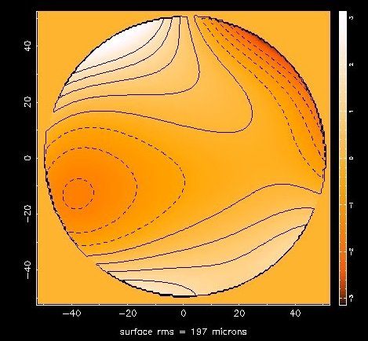
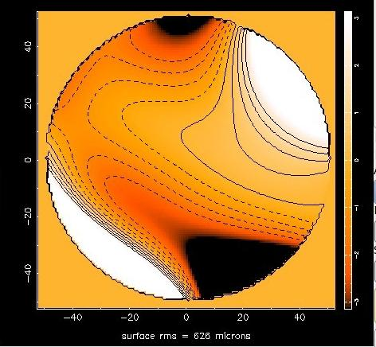
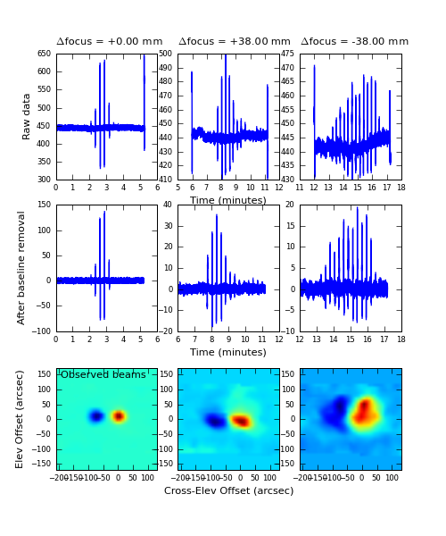
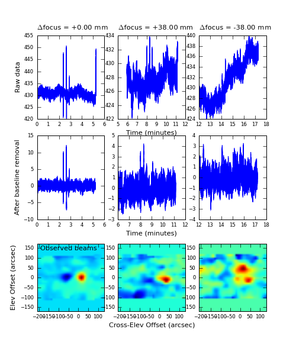

AutoOOF Strategy
----------------

AutoOOF is recommended for observing at frequencies of 40 GHz and higher and only available 
for use with ``Rcvr26_40`` (Ka-Band), ``Rcvr40_52`` (Q-Band), ``Rcvr68_92`` (W-Band), 
``RcvrArray75_115`` (Argus), and ``Rcvr_MBA1_5`` (MUSTANG-2). For the associated data display, see
:ref:`references/astrid:OOF Data Display`.  

.. note:: 

    * Since the Ka-band receiver with the default CCB backend provides the most accurate measurements
      of the surface parameters, users should consider using this whenever possible, except for MUSTANG-2
      users who prefer using the MUSTANG system. Besides the high sensitivity provided by the CCB, 
      the larger beam at the lower frequency makes the surface solutions less affected by winds.

    * **Choose a bright calibrator**
        Preferably at least 7 K in the observed band, which is about 4 Jy at Q-band. You should not rely
        on the catalog flux to be accurate as it is often many years out of date. The `ALMA Calibrator 
        Source Catalogue <https://almascience.eso.org/sc/>` has an extensive record of the flux densities
        for many of the bright 3 mm sources. If you are not sure then run a point/focus scan on the 
        calibrator first in order to confirm its strength. Remember, to obtain good oof results, you need
        to be able to detect the source when the subreflector is out of focus which reduces its peak
        intensity significantly.

    * **Allow approximately 25 minutes for an AutoOOF**
        The AutoOOF procedure will obtain three consecutive OTF maps (each map takes 5--6 minutes) at
        a different focus position.

    * **Use AutoOOF to derive pointing and focus offsets**
        The oof-processing is launched automatically upon completion of the third map, and the result is 
        displayed in the OOF plug-in tab of Astrid. It is incumbent upon you, as the user, to examine the
        solutions, and click the button (in the Astrid DataDisplay tab) to send the  selected solution to
        the active surface. It is recommended that when sending the solutions, you use the button in the
        OOF display tab labeled ``After selecting the Zernike solution above, click this button to send the solutions to the telescope``.

    * **AutoOOF is not necessary for extended sources**
        Extended sources may be observed without the AutoOOF corrections if the science is not impacted 
        by the primary beam variations.

:func:`AutoPeakFocus() <astrid_commands.AutoPeakFocus>` may be run as a sanity check on the AutoOOF solution.
If Peak/Focus scans were performed before AutoOOF, then source amplitude should be greater after the AutoOOF 
than what was seen before the surface correction was sent.  Additionally, :func:`AutoPeakFocus() <astrid_commands.AutoPeakFocus>`
pointing and focus corrections should agree with values derived by :func:`AutoOOF() <astrid_commands.AutoOOF>`.

How long does the solution remain valid?
^^^^^^^^^^^^^^^^^^^^^^^^^^^^^^^^^^^^^^^^

* **Nighttime**
    A general rule of thumb is if the corrections are measured at least two hours after sunset, then the 
    solutions should be good for about 4 hours. This depends on how rapidly the backup structure cools off
    after sunset and how sunny the day was. If the OOF is taken after midnight, the structure has typically
    stabilized by then, and the solutions may be good until after sunrise.
    
* **Daytime**
    During the daytime, this is a difficult question to answer, as it depends on the position of the telescope
    with respect to the Sun and cloud cover. The answer can be anything from less than 30 min to 4 hours.
    
* **Periodically Examine Peak Scans**
    A new AutoOOF may be necessary if the following characteristics are seen:
    
    * Significant sidelobes begin to appear.
    * The beam size increases by more than 10%.
    * Source amplitude decreases systematically by 15% or more.
   

AutoOOF Solutions
^^^^^^^^^^^^^^^^^

Here is an example of an acceptable OOF solution: 

.. _fig-good-oof-solution:

    
    This solution shows broad features (:math:`\pm` 1.5 radians of phase) with a surface rms of 197\ :math:`\mu m`.

Here is an example of an unacceptable OOF solution:

.. _fig-bad-oof-solution:

    This solution shows steep contour lines (:math:`\pm` 15 radians of phaee) and a surface rms of 626\ :math:`\mu m`. 
    This is likely the result of poor quality raw data and the solution should not be used.

* Good solutions have the following characteristics:
    * Broad features of less than :math:`\pm 1.5` radians of phase in early to mid-morning to a few radians 
      in the afternoon.  Note that you may uncheck ``Show Fixed Scale Image`` to view the full data 
      range in the color bar.
    * Surface rms residuals <400\ :math:`\mu m`.  (less than 500 microns if starting withe the default
      gravity-zernike model)

AutoOOF Raw Data
^^^^^^^^^^^^^^^^

Although an OOF solution may appear to be reasonable (e.g., :numref:`fig-good-oof-solution`) it may also be invalid if
it was derived from a bad set of raw data. Sending such a solution to the active surface could degrade performance.
Therefore, observers should always check the quality of the raw AutoOOF data in order to determine whether their derived 
solutions are valid. For a set of raw data to be considered valid, it should show the following characteristics:

* Clear detections of the source in the raw data timestream at all focus positions.
* Symmetrical left/right positive/negative pattern in all three raw data images.
* Smooth features in all three raw data images. Sharp edges or stripes indicate hardware/software glitches or excessive winds.

The AutoOOF raw data can be viewed by selecting the ``raw data`` radio button in the upper-right section of the OOF Subtab
of the Data Display. Each column represents one focus position. The top row is the raw timestream data from the receiver,
the second row has the baselines removed, and the bottom row shows the corresponding beam maps. See Figure~\ref{fig:rawOOFdata} for a comparison of acceptable and unacceptable raw AutoOOF data.

.. _fig-good-oof-raw-data:

    A plot of the raw OOF data on a fairly clean Ka-Band+CCB dataset.

.. _fig-bad-oof-raw-data:

    A plot of  raw OOF data on a sourceh which is too faint.

Selecting the Zernike order to fit
^^^^^^^^^^^^^^^^^^^^^^^^^^^^^^^^^^

By default, AutoOOF will halt processing after the fifth-order Zernike (z5) solution has been computed.
The z5 solution is suitable for most conditions and is generally what observers should expect to use.
A more agressive sixth-order (z6) fit may also be derived at the cost of a few additional minutes of 
processing time. This is usually unnecessary and should only be done on bright calibrators under favorable 
weather conditions. See :ref:`how-tos/general_guides/autooof:OOF z6 Processing Options` for information on how
to change the maximum order of fit to process.

Occasionally, it may be necessary to drop to a lower order of fit if the following features are seen:

* **Large excursions** over a significant area of the dish edge in the OOF solution.
* **Regularly spaced features** around the circumference of the dish at higher order fits in the OOF solution.
* **Anomalous values in the pointing/focus LPC/LFC** for one particular solution, or a significant jump in LPC
  above a certain Zernike fit order. For example, if the focus (LFCy) values for the z3-z4 solutions are around
  -3mm, then abruptly jump to +10mm for the z5 solution, then it would be prudent to assume that some or all of
  the solutions may be invalid. It may be possible to determine which solutions are valid by examining the 
  fitted beam maps for obvious artifacts or deviations from the observed beams.
  
  .. _fig-oof-beammap:
  .. figure:: material/OOF_fittedbeammap.jpg
        
         The AutoOOF fitted beam maps. The observed beams are plotted on the top row with the z3, z4 and z5 fits
         to the observed beams plotted below. The z3 solution (:math:`2^{\text{nd}}` row down) shows an obvious
         artifact and should not be used.

  .. _fig-oof-beammap-solutions:
  .. figure:: material/OOF_fittedbeammap_solutions.jpg
         
          Zernike Solutions. Note the significant jump in LPC and the LFC between the z3 and z4 solutions.

Sending a Solution to the Active Surface
^^^^^^^^^^^^^^^^^^^^^^^^^^^^^^^^^^^^^^^^

When you are ready to accept the solution being displayed it will need to be manually sent to the active surface. 
It is recommended that when sending the solutions, you use the yellow button labeled ``Send Selected Solution with 
Point and Focus Corrections``. If you use this option, you do not have to perform a Peak or Focus after an AutoOOF.
It is still good practice to run a Peak and Focus at the beginning of your observing session unless you are using
the :ref:`W-band (68-92 GHz) <references/receivers/w-band:W-Band receiver>`. Subsequent pointing and focus 
corrections may be computed via AutoOOF.

Many high frequency observers will perform Peak scans immediately following an AutoOOF to verify the surface solution.
If the solution is satisfactory the LPCs and LFC from Peak/Focus scans should agree with values from the OOF solution,
there should be no significant sidelobes visible in the peak scans, and Peak scans should also yield the expected beam
FWHM. If in doubt, you may disable OOF corrections by pressing ``Zero and Turn Off Thernal Zernike Solution`` in order
to compare Peak scans with and without OOF corrections.

OOF z6 Processing Options
^^^^^^^^^^^^^^^^^^^^^^^^^

Deriving the sixth-order Zernike (z6) solution will require a few additional minutes of processing time and for the
user to manually change the maximum order of fit to process in the following way:

#. Select the OOF Subtab of the AstrID Data Display.
#. Select ``Tools`` :math:`\rightarrow` ``Options...`` from the drop--down menu.
#. Select the maximum order of fit to process from the ``Processing Options`` tab of the pop--up window.

   .. image:: material/OOFprocessing_options.jpg

.. important:: 

    All changes must be made **before submitting the SB** containing the :func:`AutoOOF() <astrid_commands.AutoOOF>` 
    function in order to take effect.  You may also repeat processing after making any changes by pressing 
    ``Reanalyze OOF (Online Only)``.

.. admonition:: Internal Access Only

    More information on AutoOOF can be found `here <https://safe.nrao.edu/wiki/bin/view/GB/PTCS/AutoOOFInstructions>`__.

    .. todo:: Transfer the relevant content from that wiki page here.

