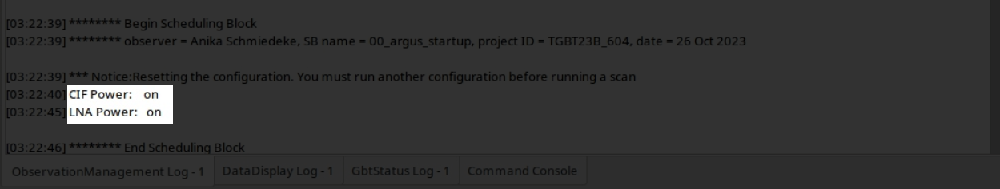
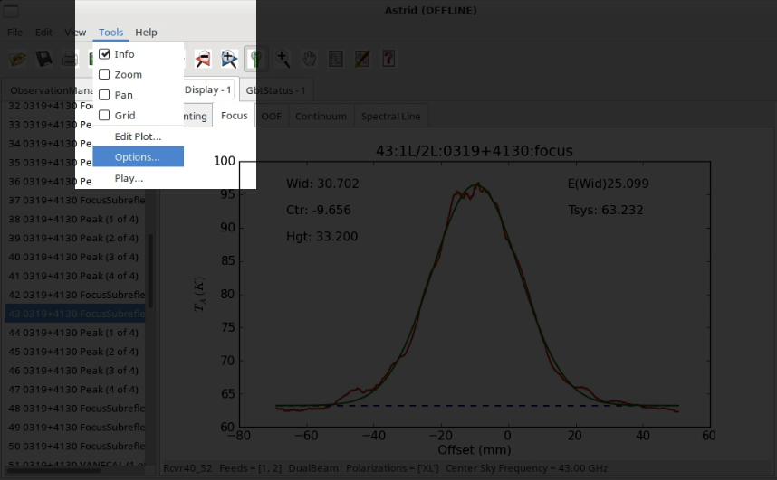
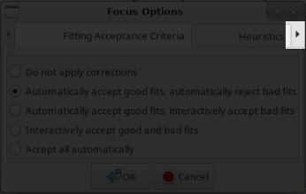
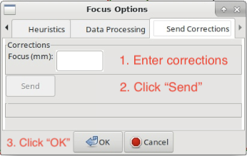

.. _argus_obs:

###########################
How to observe using Argus
###########################

This guide contains instructions for the recommended observing procedure for the 23B/24A winter observing season.

.. admonition:: Change Log

    2026-09-21:
       - Updates for the 26B observing semester (incl. more generalized observing scripts)
    2024-01-04: 
       - Adjusted instructions to reflect change of available receivers
       - Modified code snippet in :ref:`how-tos/receivers/argus/argus_obs:3.1 Pointing and Focus Correction` to apply  :math:`\Delta_\text{focus}` when switching from Argus to "peak/focus receiver"        
    2023-11-13: 
       - Added code snippet in :ref:`how-tos/receivers/argus/argus_obs:3.1 Pointing and Focus Correction` to automatically apply :math:`\Delta_\text{focus}`.

1. Turn on Argus
================

Run the script below and then make sure Argus is turned on. 

.. code-block:: python

    ResetConfig()
        
    # start up Argus by calling the 'presets'command
    # this will turn on CIF/LNA if necessary

    SetValues("RcvrArray75_115", {"presets": "on"})
    print "CIF Power: ", GetValue("RcvrArray75_115", "cif_power")
    print "LNA Power: ", GetValue("RcvrArray75_115", "lna_power")

In the "ObservationManagement Log" in Astrid, make sure you see the lines "CIF Power: on" and "LNA Power: on". If not, reissue the startup script above.

.. admonition:: Troubleshooting

    If CIF and LNA power remain off, open a terminal and check that you can ping the instrument, ``ping argus``. If
    nothing comes back, ask the operator to "Run the resetbox on Argus". This should bring back the network connection. 

    If the network connection to Argus works fine, have the operator call the instrument friend or on-call scientist for 
    assistance. 

2. Primary Calibrator
=====================

Go to your primary calibrator (i.e., the brightest calibrator available at the time of your observations).

2.1 Set the surface
-------------------

Run **AutoOOF** using *Ka-band*, *Q-band* or *Argus* to set the surface. Technically you can run an AutoOOF with Ka-band, Q-band, W-band, Argus, and MUSTANG-2m, however using W-band over Argus does not gain much, and MUSTANG-2 needs a dedicated startup procedure by the instrument team that takes about 1h before the instrument can be used. You can use Argus if your calibrator is strong enough; e.g. 0319+4130 is a very strong calibrator that Argus can use for AutoOOF. If they are available, we recommend to use either *Ka-band*, followed by *Q-band*. 

The observing script remains the same, irrespective of which receiver is in focus.
    
.. code-block:: python

    Catalog('fluxcal')
    Catalog('/home/astro-util/astridcats/wband_pointing.cat')

    source = '0319+4130'                            # replace with your calibrator
    AutoOOF(source)

2.2. Absolute flux calibration, focus reference
-----------------------------------------------

Run **AutoPeak**, **Focus** and **AutoPeak** using *Argus* at your target frequency for absolute flux calibration. You can optionally use `elAzOrder=True`, which will run the elevation pointing scans first, followed by the azimuth pointing scans. We typically have larger offsets in elevation than in azimuth, so using this option facilitates finding the pointing solutions.

.. code-block:: python

    source = '0319+4130'                    # replace with your calibrator
    freq_argus = 93173.0                    # replace with your target frequency in MHz
        
    Break("Ask the operator to switch to Argus. Click yes when Argus is in place.")
    SetValues("ScanCoordinator", {"receiver": "RcvrArray75_115"})
    SetValues("LO1", {"restFrequency_A": freq_argus})      

    AutoPeak(source, frequency=freq_argus, elAzOrder=True)     
    Break("Check the pointing solution")
    Focus(source)
    Break("Check the focus solution")
    AutoPeak(source, frequency=freq_argus, elAzOrder=True)

Make sure you take notes of the peak heights of all four peak scans of the second **AutoPeak()**. At this point the
surface of the telescope should be set optimally, the telescope is pointed correctly and in focus. So we can compare the
height of the second set of peak scans with the strength of the calibrator in the ALMA calibrator catalog. 

.. todo:: Describe how to do this in a new argus how-to guide and link this here.

2.3 Determine focus offset
--------------------------

If you do not have a strong calibrator nearby your science target (i.e., within 10 degrees), we recommend switching to a lower frequency receiver for pointing and focus calibration on a secondary calibrator. This also usually allows to reduce the slew time between science target and calibrator. However, when you use a different receiver than Argus for pointing and focus, you will need to measure the focus offset between the two receivers. 

Run **AutoPeakFocus** using either *Ka-Band*, *X-Band*, *KFPA*, *Q-Band* (whichever is available, in that order; we will call this receiver the "pointing receiver) to determine the focus offset between Argus (at your observing frequency) and your "pointing receiver" (at its standard pointing frequency).
         
.. code-block:: python

    primaryCalibrator = '0319+4130'         # replace with your calibrator

    Break("Have you switched to the desired receiver? (KFPA, X, Ka, or Q?)")

    rcvr = GetValue("Antenna", "receiver")

    if rcvr == 'Rcvr8_10':
        # configure X
        SetValues("ScanCoordinator", {"receiver": "Rcvr8_10"})
        SetValues("LO1",{"restFrequency_A":9000})
    elif rcvr == 'RcvrArray18_26':
        # configure KFPA
        SetValues("ScanCoordinator", {"receiver": "RcvrArray18_26"})
        SetValues("LO1",{"restFrequency_A":25000})
    elif rcvr == 'Rcvr26_40':
        # configure Ka
        SetValues("ScanCoordinator", {"receiver": "Rcvr26_40"})
        SetValues("LO1",{"restFrequency_A":32000})
    elif rcvr == 'Rcvr40_52':
        # configure Q
        SetValues("ScanCoordinator", {"receiver": "Rcvr40_52"})
        SetValues("LO1",{"restFrequency_A":43000})

    AutoPeakFocus(primaryCalibrator) 

    Break ("Ask the operator to switch back to Argus. Click yes when Argus is in place.")

    #configure Argus
    SetValues("ScanCoordinator", {"receiver": "RcvrArray75_115"})
    SetValues("LO1",{"restFrequency_A":freq})

Step 2.2 provides :math:`\text{focus}_\text{Argus}` at your target frequency and Step 2.3 provides :math:`\text{focus}_\text{pointing receiver, primary}`. Using those two numbers we can calculate the focus offset, :math:`\Delta_\text{focus}`, as :math:`\Delta_\text{focus} = \text{focus}_\text{Argus} - \text{focus}_\text{pointing receiver, primary}`. Determining the focus offset with a single decimal point is sufficient. 

.. admonition:: Example
    :class: note

    :math:`\text{focus}_\text{Argus} = -4 \text{ mm}`

    :math:`\text{focus}_\text{pointing receiver, primary} = -1 \text{ mm}`
    
    :math:`\Delta_\text{focus} = -4 \text{ mm} - (-1 \text{ mm}) = -3 \text{ mm}`

3. Secondary Calibrator
=======================

Go to your secondary calibrator (nearby your science target, i.e. within ~10 deg in Az and El, the closer the better to minimize slew times).

3.1 Pointing and Focus Correction
---------------------------------

Run **AutoPeakFocus** using your pointing receiver (*Ka-Band*, *X-Band*, *KFPA*, *Q-Band*), this script will at the end automatically apply your determined :math:`\Delta_\text{focus}`. If you have the run the script more than once in a row, please make sure you comment out line 42 ``SetValues("Antenna",{"local_focus_correction,Y": new_lfc}`` before re-issuing the script, to avoid adjusting the focus multiple times. 

.. code-block:: python
    :linenos:

    ## (1) determine FocusArgus and Focus[X,Ka,KFPA or Q] on primary calibrator
    ##      (a) you get FocusArgus from script 11
    ##      (b) you get Focus[X,Ka,KFPA or Q] from script 12
    ## (2) calculate deltaFocus

    ## deltaFocus = FocusArgus - Focus[X, Ka, KFPA or Q]
    ## example:
    ## deltaFocus= 5.1                  # in mm; 2023-12-16 Anika; Argus 2.7, KFPA -2.4
    deltaFocus = 0.0                    # in mm; REPLACE WITH YOUR VALUE

    Catalog('/home/astro-util/astridcats/kband_pointing.cat')

    secondaryCalibrator = '0336+3218'       # replace with your calibrator
    freq_argus = 93173.0                    # replace with your target frequency in MHz

    
    Break("Have you switched to the desired receiver? (KFPA, X, Ka, or Q?)")

    rcvr = GetValue("Antenna", "receiver")

    if rcvr == 'Rcvr8_10':
        # configure X
        SetValues("ScanCoordinator", {"receiver": "Rcvr8_10"})
        SetValues("LO1",{"restFrequency_A":9000})
    elif rcvr == 'RcvrArray18_26':
        # configure KFPA
        SetValues("ScanCoordinator", {"receiver": "RcvrArray18_26"})
        SetValues("LO1",{"restFrequency_A":25000})
    elif rcvr == 'Rcvr26_40':
        # configure Ka
        SetValues("ScanCoordinator", {"receiver": "Rcvr26_40"})
        SetValues("LO1",{"restFrequency_A":32000})
    elif rcvr == 'Rcvr40_52':
        # configure Q
        SetValues("ScanCoordinator", {"receiver": "Rcvr40_52"})
        SetValues("LO1",{"restFrequency_A":43000})

    # adjust the focus properly for [X, KFPA, Ka or Q]
    lfc = float(GetValue("Antenna", "local_focus_correction,Y"))
    new_lfc = lfc -deltaFocus
    SetValues("Antenna", {"local_focus_correction,Y": new_lfc})

    AutoPeakFocus(secondaryCalibrator) 

    Break ("Ask the operator to switch back to Argus. Click yes when Argus is in place.")

    #configure Argus
    SetValues("ScanCoordinator", {"receiver": "RcvrArray75_115"})
    SetValues("LO1",{"restFrequency_A": freq_argus})

    # adjust the focus properly for Argus
    lfc = float(GetValue("Antenna", "local_focus_correction,Y"))
    new_lfc = lfc +deltaFocus
    SetValues("Antenna", {"local_focus_correction,Y": new_lfc})

    Comment("")
    Comment("-------------------------------")
    Comment("LFC changed  from %f  to  %f     (shift of %f  mm)"  %(float(lfc), float(new_lfc), float(deltaFocus)))
    Comment("--------------------------------")
    Comment("")

3.2 Add the focus correction factor manually
--------------------------------------------

If you don't use the code snippet provided in :ref:`how-tos/receivers/argus/argus_obs:3.1 Pointing and Focus Correction` to add the focus offset, :math:`\Delta_\text{focus}` you calculated in step 2.3 to the determined focus correction, LFC, you will need to do it manually. 

.. admonition:: Example
    :class: note

    :math:`\text{focus}_\text{pointing receiver, secondary} = +2 \text{ mm}`

    :math:`\text{LFC} = \text{focus}_\text{pointing receiver, secondary} + \Delta_\text{focus} = +2 \text{ mm} + (-3 \text{ mm}) = -1 \text{ mm}`

To add this LFC value in the system, you have to be in the "DataDisplay" Tab in Astrid, and there in the subtab "Focus". Then click "Tools" in the top left menu of the Astrid applications and choose "Options".

A pop-up window "Focus Options" will open. Click the right arrow a few times, to switch to the last tab "Send Corrections".

In the "Send Corrections" tab enter your determined LFC, click the send button and then click OK after you have confirmed that the corrections have been send to the telescope, e.g. by checking the LFC value in the CLEO Status page. 

Alternatively you can ask the Operator to enter the LFC value for you. You will also want to adjust the focus when you switch from Argus to Ka before executing peak/focus calibration.

4. Science Target
=================

Go to your science target, configure Argus for your science observations, check the YIG power. Run a vanecal and execute your observations. We recommend to verify your configuration/setup by executing short track or OnOff observation on a known source at the beginning of each observing run.

5. Subsequent observing procedure
=================================

Alternate between observations of your science target (:ref:`Step 4 above <how-tos/receivers/argus/argus_obs:4. Science Target>`) and observations of the secondary calibrator (:ref:`Step 3 above <how-tos/receivers/argus/argus_obs:3. Secondary Calibrator>`) every 30-40 min, depending on weather conditions. 

Remember to re-run an AutoOOF every 3-6 hours, depending on weather (and more often if you've been scheduled at or shortly after sunset while the temperature was still dropping).

