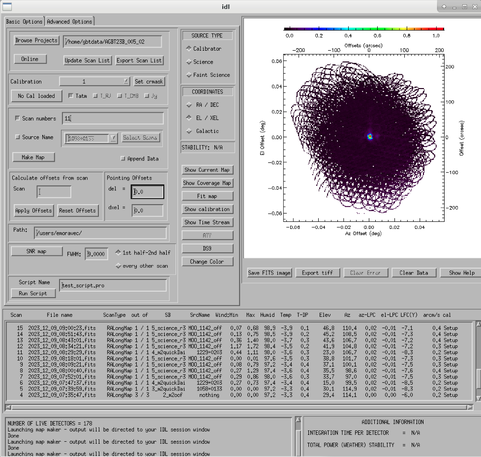
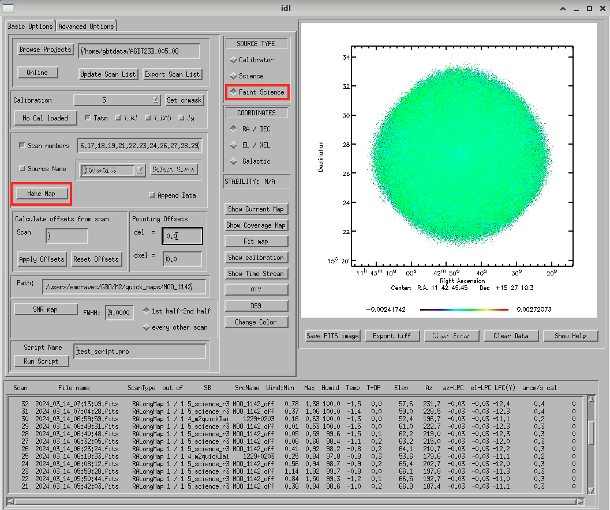
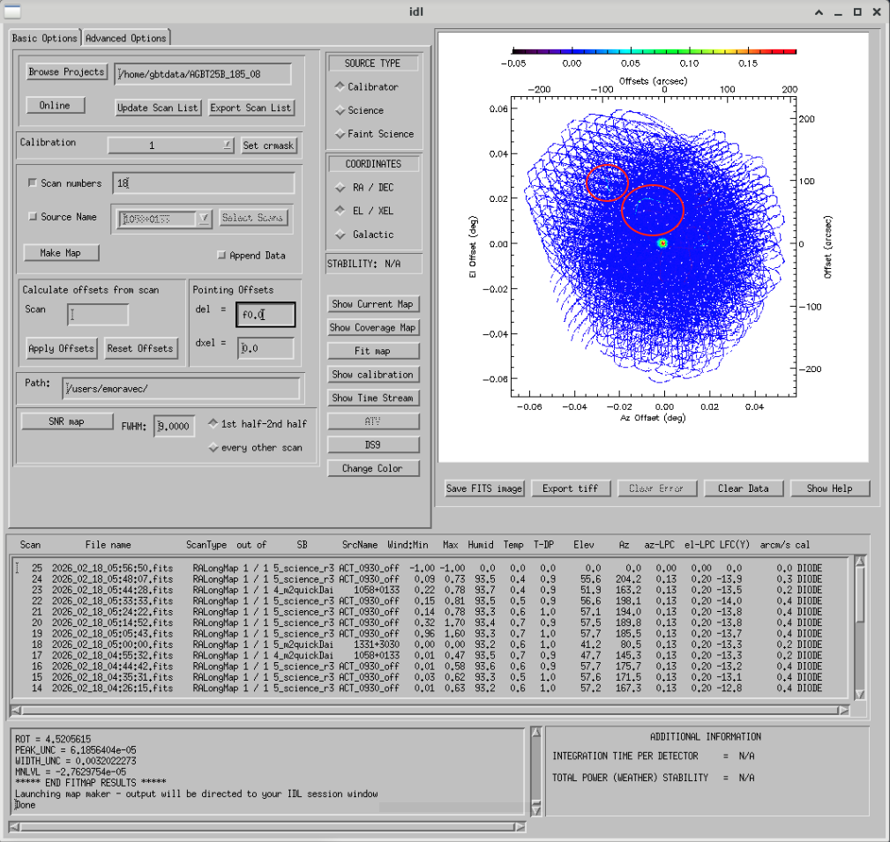
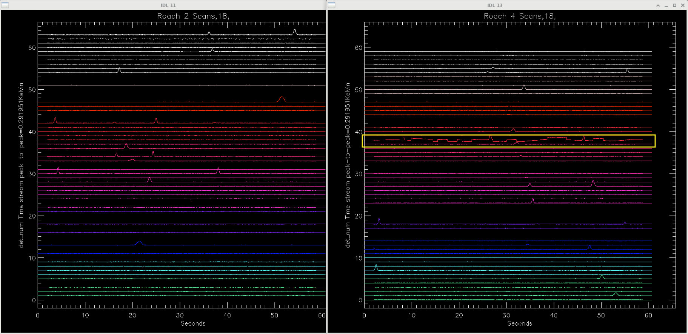
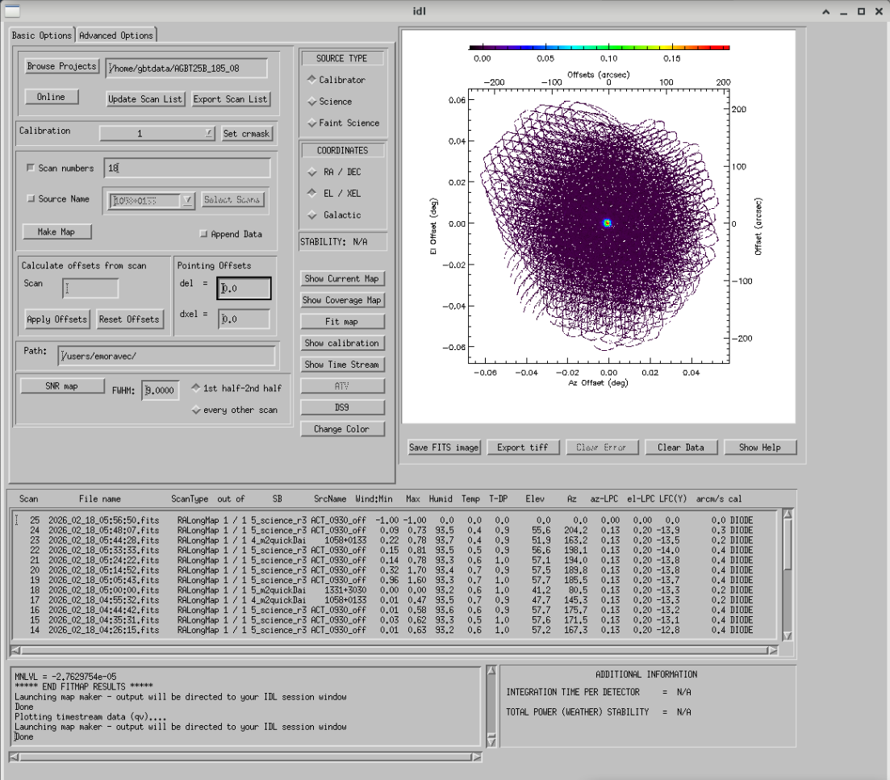
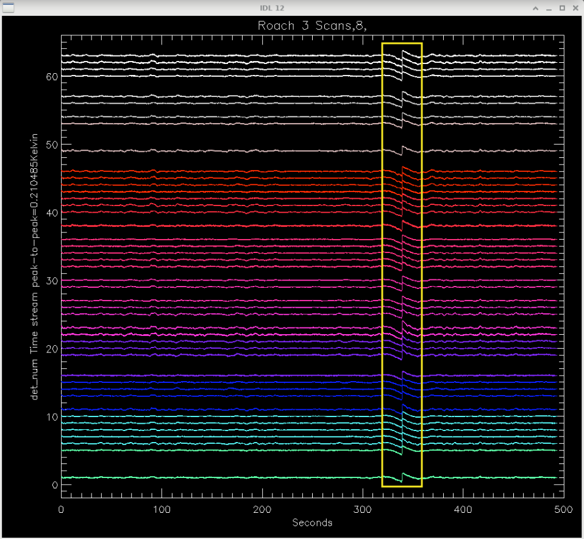
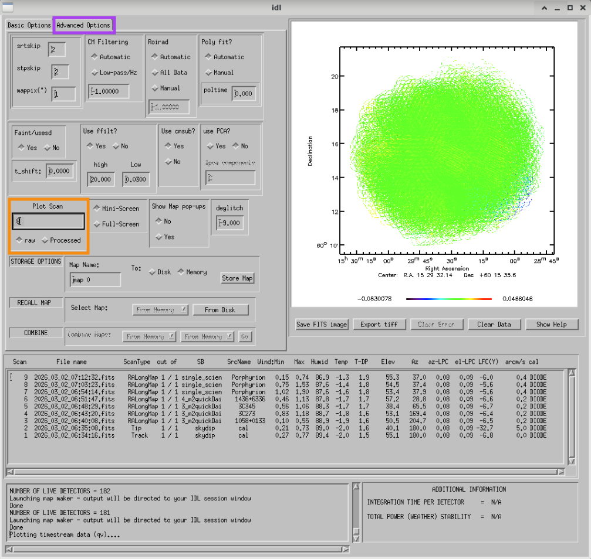
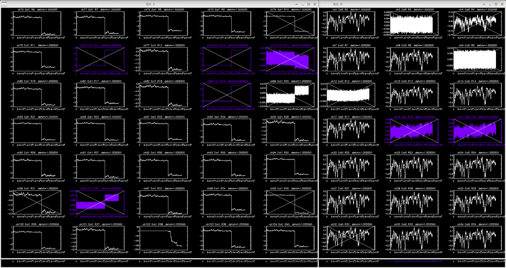
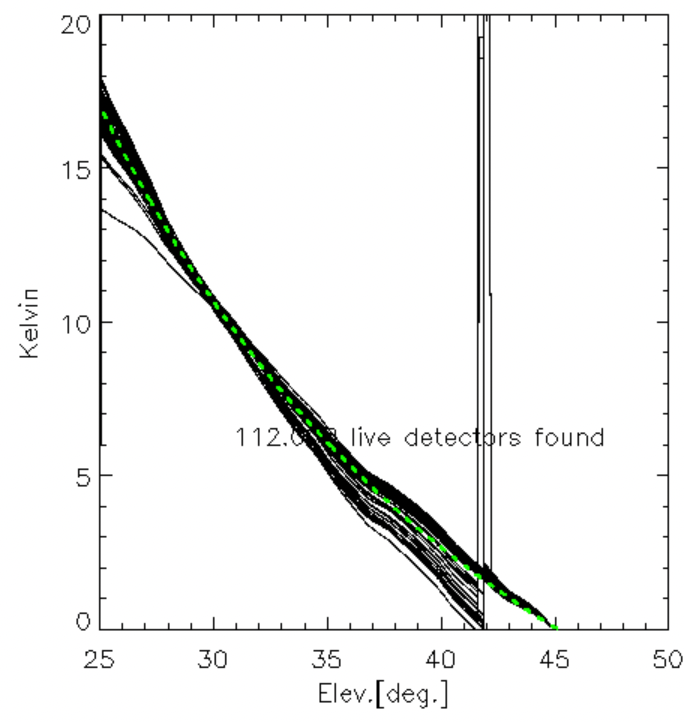
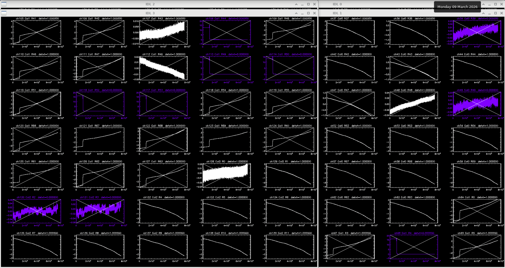

.. _mustang2_gui:

#############
MUSTANG-2 GUI
#############
This guide shows you how to check your data with the MUSTANG-2 GUI during obsevation

Start the m2gui
===============
To open up the m2gui, first make sure you are in a directory that you have write permissions in and then in a terminal execute:

.. code:: bash
                
    ~penarray/Public/startm2idl

Once that version of IDL has started execute ``m2gui``.
    
After you have opened the m2gui follow these steps to check the tipping scan, monitor the beam shape (``width``, ``widthA``, ``widthB``) and peak of calibrators (``Peak_Height``), or to just check the data.

#. **Go online**
    Click the ``online`` button.

    .. image:: images/gui/m2gui_01_start_online.png

    .. note:: 

        If you want to open up a previous project that is not the current online project, click ``Browse Projects``, find the project+session in the left hand column, and double click that folder to open it up.

Check the Tipping Scan (Skydip)
===============================

.. admonition:: What is a Skydip (Tipping Scan)?

    What is a skydip? And what are the plots that we looking at? A skydip is a flat field. If you look at the detector bias curves some are inverted and even those with the same sign will have a different response to bias. We use the fact that the atmosphere is not transparent and has a :math:`\frac{1-\exp^{-\tau}}{\cos(\text{elevation})}` dependence. With a fair guess of the opacity :math:`\tau`, you can do a fit on each detector to get them roughly Kelvin_RJ. These calibrations are used to make maps of known sources and the results scaled to bring them to the correct amplitude.

#. **Select tipping scan**
    Under Calibration, click ``Select Tip Scan`` and choose the most recent scan number from the bottom labeled ``Tip`` under ``scan type.`` At the beginning of the night, this should be from scan 1, before the 3 OOF scans (see below image - blue box).

    .. image:: images/gui/m2gui_02_select_tip.png

#. **Inspect plots**
    Many plots will pop up - one for each roach showing the results of the tipping scan for each roach. You can click out of these once they finish unless you are particularly curious about specific roaches. After these plots have been produced, you will see a graph to the right in the main gui window, showing the results of the tip scan - each roach is plotted in black with a fit in green. Check to make sure that it looks reasonable.

    .. image:: images/gui/m2gui_03_tip_individ.png

    Example of tipping scans: 

    .. tab-set::

        .. tab-item:: Good Tip Scan 

            A good weather skydip. The black lines (one for each roach) should be fairly free of wiggles and the dashed green line (which is the fit) should follow the black lines fairly closely. 

            .. image:: images/gui/m2gui_04_tip_scan_good_example.png

        .. tab-item:: Bad Tip Scan 

            A bad weather skydip. The black lines (one for each roach) are full of wiggles and the dashed green line (the fit) is not following the black lines well.

            .. image:: images/gui/m2gui_05_tip_scan_bad_example.png

    If the tipping scan doesn’t look right (a lot of wiggles), try running the ``skydip`` script in AstrID. This reruns the tipping scan without having to redo the whole OOF. If it still looks bad, check the weather conditions in CLEO. The weather might not be good enough to observe (consult :ref:`how-tos/receivers/mustang2/mustang2_obs:4. General Advice for Determining “Bad Weather“` for advice). You can also call one of the M2 instrument team and get their advice.

#. **Check the number of live detectors**
    At this stage, check the number of live detectors, as well as throughout the night. Record this in your observing log.

    In the image below, you can see where to check the number of live detectors:

    .. image:: images/gui/m2gui_06_live_detectors.png

    Generally it's good to have 170+ live detectors, however it can sometimes be as low as 160 if the tuning step didn't go very well. If you see this number as low as the 150s or 140s (especially if it's lower than that, which it shouldn't be) be sure to contact a M2 team member. You can also try re-tuning (see section A) and hope that that fixes it.

#. **Continue**
    If the tipping scan and number of live detectors look good.

Make Calibrator Map
===================
To make a map of a calibrator, after you have run the ``m2quickDaisy`` script on a source in AstrID, do the following:
    - Click ``Update Scan List`` to find the source scan number of the source you just observed
    - Set the ``Scan Numbers`` to the scan number of interest
    - Set ``Source Type`` to ``Calibrator``
    - Click ``Make Map``

    .. image:: images/gui/m2gui_07_tip_make_cal_map.png

This will open up an image of the daisy map that you selected. The map should look something like this:

What you see at this stage is an image of the daisy scan. In the center is your calibrator source, visible because it is a bright source. Later, when looking at daisy scans of your science source, it's very likely that you will only see a flat map in the center because it's so much more faint.

The units of the color-coding of this map are in Kelvin of the forward beam. The forward beam is calibrated for the estimated sky temperature at that elevation that we gleaned from our tipping scan earlier on in the night. Therefore, the forward beam temperature should hover around zero if everything is calibrated correctly.

.. admonition:: What is a Daisy Map?

    See :ref:`how-tos/receivers/mustang2/mustang2_obs_scripts:Explanation of M2 scan pattern: Daisy`.

Fit Calibrator Map
==================
First, :ref:`how-tos/receivers/mustang2/data/mustang2_gui:Make Calibrator Map`.

Then to fit the map of the calibrator click ``Fit Map``. This action fits a Gaussian to the point source. Because the point source is assumed to fill a single beam, the resulting Gaussian width parameters are taken as the beam parameters.

    .. image:: images/gui/m2gui_09_qd_cal_fit.png

Fitting the map, will 
	- produce the following plots in the gui

	    .. image:: images/gui/m2gui_10_fitmap_gui.png

	- print out the fitting parameters in the terminal

	    .. image:: images/gui/m2gui_11_fitmap_terminal_output.png

	    .. note:: 

	        The Floating underflow error you see in the output is **not** a concern.

For tracking the beam, write down the values for ``PEAK_HEIGHT``, ``WIDTHA``, and ``WIDTHB`` in the observing log to compare to later pointing scans to monitor the beam and decide if you need to re-OOF. 

.. note::

    When you fit a quick daisy map, the units of ``PEAK_HEIGHT`` that are output in the terminal are in the units of the calibration, which in the GUI the calibration is the skydip which are in units of ``T_RJ``. The units of ``WIDTH`` are arcseconds.

.. note::

    Occasionally, one or more detectors may show glitches in their time streams. These faulty detectors appear as artifacts in the maps and can distort the map’s scaling. As a result, the source may appear fainter than it truly is, and this can lead to a poor fit to a point source or even prevent the GUI from fitting the point source altogether. See :ref:`how-tos/receivers/mustang2/data/mustang2_gui:Use crmask to Mask Bad Detectors` on how to mask the bad detector(s).

Make Science Maps
=================

If you would like to make a map of a science scan(s), you can do so by following the same steps as making a map of a calibrator with the following modification
    - under ``Source Type`` select ``Faint Science`` 

.. note::

    The ``Faint Science`` option is for targets that do not have bright sources in the field (typical M2 science targets). If you have bright sources in your science target, you can use the ``Science`` option instead. 

.. note::

    You can add several science scans together by putting them all separated by commas in the scan list. Please note that when you put several science scans together to make a map, it will likely take a while (>5 minutes) to make the map. A suggestion to combat this is to have two GUIs open while observing, one for checking the beam and one for making science maps.

.. note::

    You may not see any signal in your science map in the GUI. This is because. To see what your object looks like and what sort of SNR you are getting, you'll want to look at an SNR map. See instructions on how to do that below.

Make SNR Map
------------

You can make an SNR map with the GUI. To do this, first follow the instructions above for making a science scan, once the map has been made, click the ``SNR map`` button. 

.. tab-set:: 

    .. tab-item:: Make SNR Map

        .. image:: images/gui/m2gui_13_make_SNR.png

        To make an SNR map, first make a make of your science scan(s), then click the ``SNR map`` button.

    .. tab-item:: SNR Example

        .. image:: images/gui/m2gui_14_SNR_result.png

        Resulting SNR map from a map of MOO 1142.

Checking Time Streams
=====================

It is a good idea to check the time streams (checking how the sky temperature is changing over time) as well as the maps. Time stream is the same as a TOD (time ordered data).

To check the time steams:
	- Make your map (see :ref:`how-tos/receivers/mustang2/data/mustang2_gui:Make Calibrator Map` or :ref:`how-tos/receivers/mustang2/data/mustang2_gui:Make Science Maps`)
	- Click ``Show Time Stream`` button underneath the ``Fit Map`` button after making your map
	    .. image:: images/gui/m2gui_18_show_time_streams.png

Here is what different types of time streams look like:

.. tab-set:: 

    .. tab-item:: Calibrator Time Stream

        .. image:: images/gui/timestream_calibrator_AGBT23B_005_08_scan9.png

        This is an exemplar time stream for a calibrator source. Notice that you see the point-like source as a gaussian peak in most time streams.

    .. tab-item:: Faint Science Time Stream

        .. image:: ../images/timestream_faint_sci_good_AGBT23B_005_08_scan13.png

        Faint science time streams (a cluster) in good weather. Notice how nice and flat the time streams are.

.. note::

    There may be detectors that have glitches that are not flagged by the imaging making pipeline used by the GUI. See :ref:`how-tos/receivers/mustang2/data/mustang2_gui:Use crmask to Mask Bad Detectors` on how to mask the bad detector(s).

Use crmask to Mask Bad Detectors
================================
Occasionally, one or more detectors may show glitches in their time streams. These faulty detectors appear as artifacts in the maps and can distort the map’s scaling. 

Below is an example of what a map with a bad detector looks like (streaks indicative of a bad detector marked in red):

Identify Bad Detector(s)
------------------------
To fix this, you need to identify the bad detector(s) then use the **crmask** option to mask out the bad detectors. To identify the bad detector, you need to inspect the time streams to find which detector is anomalous. To inspect the time streams click the ``Show Time Stream`` button. Then look through the time streams on each raoch to find the anomalous time stream(s). The detectors are numbered on the Y axis. In this case the bad detector is on roach 4 detector 38 (in yellow box).

Update ``crmask``
-----------------
Now do the following to include that anomalous detector in the detector mask (and exclude it from the map):

.. note::

    The crmask indicates the roach number by the "c" (c=column) values and the roach number by the "r" (r=row) values and the indexing for roach values start at 0. So in this example, roach 4 detector 38 would be c3 r38.

.. tab-set:: 

    .. tab-item:: Click ``Set crmask``

        .. image:: images/gui/AGBT25B_185_08_scan18_03_crmask.png

    .. tab-item:: Find your anomalous detector

        .. image:: images/gui/AGBT25B_185_08_scan18_04_c3_r38.png

        The current crmask will pop up. Scroll to roach 4 detector 38 which is c3 r38. Note that this detector is currently selected so included in the map. 

    .. tab-item:: Unselect the desired detector

        .. image:: images/gui/AGBT25B_185_08_scan18_05_c3_r38_unselected.png

        Simply click on the box next to the detector that you want to exclude from the map. This will deselect it and not include it in the map.

.. warning::

    Once you add something to a crmask it will stay included in the mask (in crmask) for future maps.

.. note::

    It is a good practice to note which detectors you masked in your log.

Remake Map
----------
Once you have set the crmask, now you are ready to **remake the map**. To do so click ``Make Map``. You can see in the image below that the bad detector has been masked and the scaling has changed.

Save FITS image
===============

It is possible to save the images that you make in the GUI as a FITS image. Instructions below:

.. tab-set:: 

    .. tab-item:: 1. Set image path.

        .. image:: images/gui/m2gui_15_save_image_path.png

        First you need to set the path where your image will be saved. To do this click in the ``Path`` box marked in red in the image above. 

    .. tab-item:: 2. Set image path via popup.

        .. image:: images/gui/m2gui_16_save_image_path_box.png

        A box will popup where you can set the path and file name. Hit enter to set the path. 

    .. tab-item:: 3. Save image.

        .. image:: images/gui/m2gui_17_save_image.png

        Once you have set the image path, click ``Save FITS image``. 

Inspect the Raw Data
====================
When you make a map and look at time streams you are viewing processed data. There are various situations when it is beneficial to look at the raw data. For example, if you see evidence of glitches in the skydip or science timestreams. 

For example, let's say you see the following glitches in your science scan time streams (see features marked with yellow rectangle). 

In order to diagnose these glitches you can look at the raw data. To do this, first click the ``Advanced Features`` tab (marked with purple box in image below). Then find the ``Plot Scan`` box (marked with orange box in image below), type the scan number you want to plot, make sure that the ``raw`` option is chosen, then hit enter.

In the above plots the x-axis is time and the y-axis is phase (radians). There are 256 channels in data space - each one corresponds to resonator on a specific roach. The ``Col`` is the roach number (again indexing starts at 0 so roach 1 is ``Col``=0)and ``R`` is the row number. Purple indicates a detector that has been flagged.

In the image below, you can see the detectors that exhibit a step function in their time streams, which appear as the features observed in the processed time streams after applying the FFT.

You may also see glitches in a skydip, exhibited below.

To view the raw time streams, follow the same process described above; the characteristic glitch is again visible. You can see that many detectors exhibiting this glitch have been flagged (those that have an X  through them), though some remain unflagged and are responsible for the spike at approximately 42 degrees elevation in the skydip above.

m2gui Troubleshooting
=====================

m2gui Hangs
-----------

If your m2gui is hanging (won't quit), you will need to kill it and open a new window. To kill the GUI, do the following in a terminal:

.. code:: bash

    xkill

This will turn your cursor into an ``x``. Use the ``x`` to click on the GUI window (``xkill`` allows you to select the window of the process you want to kill). Then close the terminal that m2idl is running in to fully kill everything.

If that doesn't work for some reason, you can get the PID of the GUI and kill it manually with the following commands in your terminal:

.. code:: bash

    ps -u

Find the PIDs of startm2gui and idl and kill both.

.. code:: bash
   
    kill -9 PID

m2gui is slow
-------------

If m2gui is slow/not working, you can ssh to another computer and start m2idl and the GUI from there.

m2gui is not making maps
------------------------
When you start the m2gui, you need to be in a directory that you have write access to, otherwise the gui will not make maps. It will display scans but will not make maps. If you have this issue, close the GUI and terminal running m2idl, cd to a directory where you have write permissions and restart m2idl and the GUI.
