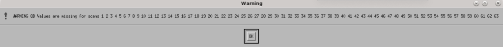
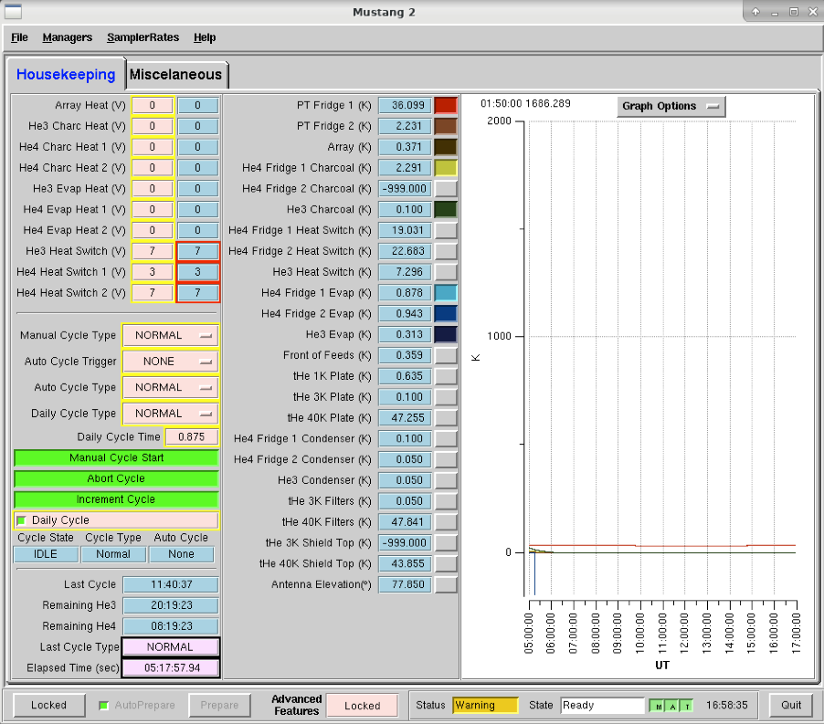
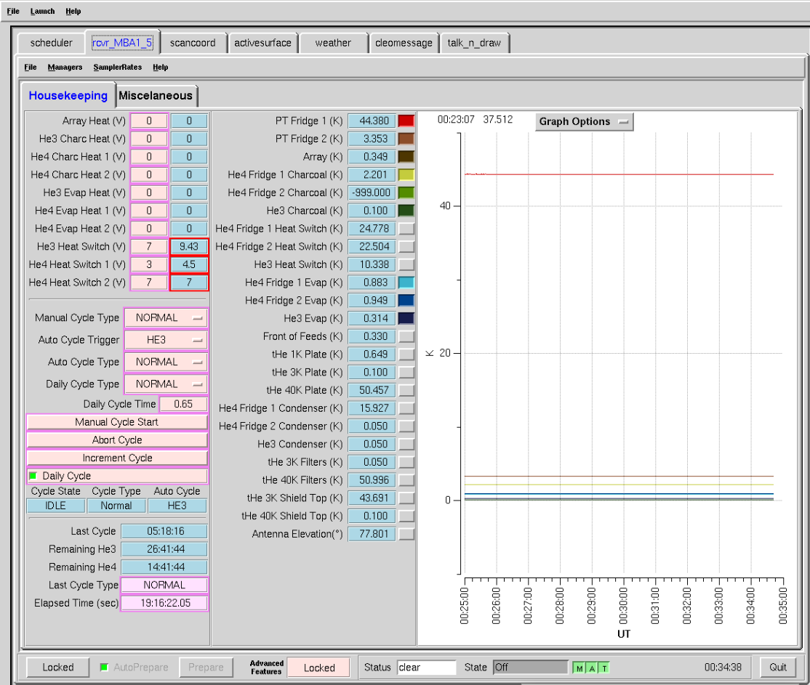

.. _mustang2_obs:

#############################
How to observe with MUSTANG-2
#############################

1. Project Preparation
======================

1.1 Prepare observing scripts
-----------------------------
Before you observe you need to have prepared your observing scripts and chosen your primary/flux calibrators, your OOF sources, and secondary calibrators. For a guide on how to do all of these things see :ref:`this guide <mustang2_obs_scripts>` for instructions on preparing your scripts.

1.2 Observing Log
-------------------

During observing, you are expected to edit the MUSTANG-2 observing run notes wiki and take notes of what's occurred throughout the night.

#. Create a new page and entry at the bottom of the `observing logs wiki <https://safe.nrao.edu/wiki/bin/view/GB/Pennarray/NewRunNotes>`_ by clicking "Edit Wiki text" 

#. Follow the naming convention of entry above <AGBTsemester_project-code_session-number>, e.g. ``AGBT18A_014_01``

#. On the new log page you have created you can put in the text from a `log template <https://safe.nrao.edu/wiki/bin/view/GB/Pennarray/NewRunNotes#Log_Template>`_. On the log template page, go to "Edit", copy that text, and paste it into your new log (also in the "Edit" mode). You will have to get rid of some extra spaces.

.. attention::

    Save your log often (not only at the end of the observation) to ensure that your notes are being saved!

.. tip::

    When you are actually recording information during observing you can be in either the "Edit Wiki Text" or "Edit" modes. But for some reason copying the formatting from the log template to your log has to be done in the "Edit" mode.

.. note::

    If you don't have permissions yet to edit the wiki and are observing, you can take notes in a text document and email them to the MUSTANG-2 team afterwards to upload to the wiki for you.

2. Observing Preparation
========================

2.1 Connect
-----------

Open and connect to :ref:`VNC session <how-tos/infrastructure/remote-connection:Quick VNC Reference>` or start an XFCE :ref:`FastX session <how-tos/infrastructure/remote-connection:FastX connection>` on ``titania`` or ``ariel`` via FastX.

Connection Issues?
^^^^^^^^^^^^^^^^^^
The internet at GBO can be intermitent at times. Specifically there are days that the internet goes down for 30-60 seconds at a time quite often. Are you having issues with FastX or your VNC being really laggy? Check `this status page <https://status.gb.nrao.edu/>`__ to see the status of the ssh gateways. See :ref:`these instructions <how-tos/infrastructure/remote-connection:What to do if the GBO network is down/slow>` for FastX and VNC workarounds using Charlottesville to potentially better your connection. 

2.2 AstrID 
-----------

Open an AstrID session and navigate to your corresponding MUSTANG-2 project. The MUSTANG-2 instrument team should have already populated your AstrID area with appropriate scripts.

2.3 CLEO
--------

The following are suggested CLEO windows to have open during observing:

- Launch → Receivers → **Mustang2**
    - To monitor specific thermometers, click the gray box next to the titles:
        - PT Fridge 1
        - PT Fridge 2
        - Array
        - HE4 Fridge 1 Charcoal
        - He4 Fridge 2 Charcoal
        - He3 Charcoal
        - He4 Fridge 1 Evap
        - He4 Fridge 2 Evap
        - He3 Evap. 
          
        These thermometers are of interest because they can indicate that things are wrong before they affect the array, or help diagnose what is wrong and how to fix it if the array temperature starts to go up.  Sometimes a cryocycle gets started by accident - in which case if you are looking at the charcoal you can hit abort quickly and no damage is done. Other times a helium4 might run out and that can pull up the array temperature - not much you can do but often you can still collect some good data for a while.

- Launch → **Status**

- Launch → **Antenna**

- Launch → Observer Tools → **Scheduler & Skyview**
    - Click on ``Real-time mode``
    - Load in catalogs:
        - your science target catalogs
            - Click ``Catalog...`` in the upper right-hand corner
            - Click ``Add/Select/DeSelect Catalogs ...``
            - Select ``Add User Catalog``
            - Select the path to your science catalog (consult your observing scripts). They may be in ``/users/penarray/Public/Catalogs/Science_catalogs/``
            - Click ``Apply``
        - ALMA grid calibrators (flux calibration and often OOF sources)
            - Click ``Catalog...`` in the upper right-hand corner
            - Click ``Add/Select/DeSelect Catalogs ...``
            - Select ``Add User Catalog``
            - Select the path ``/users/penarray/Public/Catalogs/alma_gridcal.cat``
            - Click ``Apply``
        - mustang_pointing
            - Click ``Catalog...`` in the upper right-hand corner
            - Click ``Add/Select/DeSelect Catalogs ...``
            - Select ``mustang_pointing``
            - Click ``Apply``
            - It is suggested that you enter in a minimum of 0.5 Jy

- Launch → Observer Tools → **Talk and Draw** 

2.4 Checklist if setup was done awhile ago
-------------------------------------------
If the setup (tuning, get data flowing, etc.) was done a while ago (several hours) and there is no other M2 project before you, there are a few things you should check before starting to take data.

2.4.1 Reconnect to Roaches
--------------------------
Over many hours temperature drifts will make the tuning less optimal. Therefore if the tuning was done a while ago (several hours), you need to reconnect to the roaches and check the tuning.

To check the tuning:
    #. To reconnect to the roaches execute ``/users/penarray/Public/startMUSTANG.bash <project1> reconnect`` where ``<project>`` is the project code (e.g., AGBT26A_XXX_sessionNum). For more information about the ``./startMUSTANG.bash`` script see `Advanced Useage of the startMUSTANGbash <https://safe.nrao.edu/wiki/bin/view/GB/Pennarray/OnGbtOps#Advanced_Usage_of_startMUSTANG.bash>`_.
    #. Run ``um1.plotIQ()`` in each roach's terminal.
    #. If needed, run ``um1.fixIQ()`` per roach.

2.4.2 Check that data is flowing
--------------------------------
Go to the M2 CLEO manager and check that data is flowing (see how to do this and some fixes if data is not flowing :ref:`here <how-tos/receivers/mustang2/mustang2_setup:3. Check that data is flowing>`). 

2.4.3 Check biases
------------------
If biases were set manually by hand before the observations, check that they are not 0 in the ``Miscelaneous`` tab of the CLEO M2 manager. If they are 0 it means that the manager likely crashed.

3. Observing Procedure
======================

3.1. Communicate with operator 
------------------------------

A few minutes before your observing start time (say 15 minutes, better 30 minutes), get on Talk & Draw, tell the operator who you are and what project you are observing for. Also ask who the operator is. 

3.2. Fill in AstrID info
------------------------

In AstrID under ObservationManagement, go to the Run tab and fill in the Observer and Operator information. 

3.3. Take control
-----------------

Once the member of the M2 instrument team has finished biasing and the operator tells you are in the gateway/gives you the go ahead, in AstrID → File → Real time mode ... → Select ``work online with control of the telescope``.

3.4. Configure
--------------

Run the ``1_m2setup`` script in AstrID.

3.5. OOF
--------

#. Make sure that you have changed ``mySrc`` in ``2_m2oof`` and run the ``2_m2oof`` script in AstrID. 

#. For the first OOF of the night, you need to have ``calSeq=True`` so that a skydip is done as a part of the OOFing process. An OOF will take ~20 minutes to run. 

#. Check the OOF results in AstrID → DataDisplay → OOF and re-rerun if necessary. 
    For M2, we typically apply the z5 corrections. When the corrections are available, press the green button that reads ``After selecting the Zernike solution above, click this green button to send the solutions to the telescope.``
   
    .. note::
        
        Sometimes OOF may time out and you will get a red screen if this happens. If this happens, re-OOF as this will restart the calculations of the solutions.

.. hint:: 

    While your OOF is running, it is a good time to:

    - Write down the weather conditions in the observing log 
        - Temperature
        - Humidity
        - Wind Velocity
        Note that you can get this weather information from the *GbtStatus* tab in AstrID, the "Weather" CLEO application, or from the "Status" CLEO application.

    - :ref:`how-tos/receivers/mustang2/data/mustang2_gui:Start the m2gui` to check M2 data while observing.

    - In the m2gui
        - Once the skydip has finished, :ref:`how-tos/receivers/mustang2/data/mustang2_gui:Check the Tipping Scan (Skydip)` and write down the number of live detector in the log.
        - check what each of the OOF images looks like (see :ref:`how-tos/receivers/mustang2/data/mustang2_gui:Make Calibrator Map`)
        
.. note:: 

   During this initial data acquisition (and to some extent, throughout the night) check your MUSTANG-2 manager CLEO screen, and make sure that the numbers in sections such as ``Frame Cntr`` and ``Roach Data`` are continuing to change with time (if so, the boxes will mostly be blue). However, if they stop (indicated when the boxes turn lavender) then the Mustang2 manager has crashed, and you’ll need to :ref:`restart it <how-tos/receivers/mustang2/mustang2_obs:6.1 MUSTANG-2 Manager>`. The M2 manager is known to crash on the 1st scan of a session.

3.6 Quick daisy on OOF source
-----------------------------

#. Run the ``2_m2quickDaisyPrimary`` script on your OOF/calibrator source
    It's best if you can make your OOF source and your calibrator source the same. 

#. Use the m2gui to :ref:`how-tos/receivers/mustang2/data/mustang2_gui:Fit Calibrator Map` and determine:
    - beam shape (``WidthA`` & ``WidthB``)
    - peak of the source (``Peak_Height``)
     
#. Record these values in your observing log

#. It's a good idea to check the time streams (see the :ref:`check time streams section <how-tos/receivers/mustang2/data/mustang2_gui:Checking Time Streams>` for instructions and examples)

3.7 Quick daisy on secondary calibrator
---------------------------------------

#. Run the ``3_m2quickDaisySecondary`` script on your secondary calibrator

#. Use the m2gui again to :ref:`how-tos/receivers/mustang2/data/mustang2_gui:Fit Calibrator Map` and determine:
    - beam shape (``WidthA`` & ``WidthB``)
    - peak of the source (``Peak_Height``)
     
#. Record these values in your observing log

.. note::

    Occasionally, one or more detectors may show glitches in their time streams. These faulty detectors appear as artifacts in the maps and can distort the map’s scaling. As a result, the source may appear fainter than it truly is, and this can lead to a poor fit to a point source or even prevent the GUI from fitting the point source altogether. See :ref:`how-tos/receivers/mustang2/data/mustang2_gui:Use crmask to Mask Bad Detectors` on how to mask the bad detector(s).
 

3.8 Take science data
---------------------
Take ~30 minutes of science data followed by a quick daisy on your seconday calibrator. Often this is accomplished by submitting several science scripts (e.g., ``5_science_rX``) in AstrID. For example, often for cluster science each individual science scan is ~8-9 minutes in length. So if you are submitting individual science scans (which ``5_science_rX`` are), you can submit 4 of the science scripts in a row followed by your secondary calibrator scan. 

You should check the time streams in the m2gui (see the :ref:`check time streams section <how-tos/receivers/mustang2/data/mustang2_gui:Checking Time Streams>` for instructions and examples) of each science scan. 

You can make maps and SNR maps of your science target using the m2gui (see :ref:`make science maps section <how-tos/receivers/mustang2/data/mustang2_gui:Make Science Maps>` for instructions).

3.9 Continue to take science data
---------------------------------
#. Continue to do ~30 minutes of science data followed by a quick daisy on the secondary calibrator for the rest of the night. 
#. Monitor the beam size (``WidthA`` and ``WidthB``) and the ``Peak_Height`` using the m2gui to determine if you need to OOF again.

3.10 Observing primary calibrators
----------------------------------
It is safest to observe multiple primary/flux calibrators in an observing session. You should have your OOF source be a primary calibrator but when you observe an additional primary calibrator later in the observing session, the sequence of observing should be:

- secondary
- science scans
- secondary
- primary calibrator
- science scans
- secondary

Primary and secondary calibrators need to be observed as close in time as is feasible.

.. note::

    In February, ALMA is shutdown and thus ALMA grid cals are not observed during this period. See :ref:`how-tos/receivers/mustang2/mustang2_obs_scripts:3.1.1 Primary Calibrators in February` for more information on which flux calibrators to observe during the ALMA shutdown.

3.11 When to OOF again?
-----------------------

First, know that there is no right answer and you have to gain experience to get a feel for when to OOF again. But the following is some advice for when to consider OOFing again.

The two criteria for determining if you need to OOF again are the ``Peak_Height`` and the width of the beam.

The ``Peak_Height`` is important as it is related to the efficiency of the telescope. If the ``PeakHeight`` is down by more than ~15-25%, you will want to do another OOF. It can be a good idea to take another.

.. admonition:: Optional
    :class: note

    If you don't have much observing time left, once the ``PeakHeight`` is down by more than 15%, instead of redoing the OOF scan, you can do another ``m2QuickDaisy`` on the secondary source to be sure that it is that low, and then do two more science scans until the ``PeakHeight`` has gone down by another 15% (so a cumulative 30%).

Generally, you want to monitor the size and shape of the beam. If the largest diameter of the beam (whichever of ``WidthA`` or ``WidthB``) is 12-13" you'll want to consider doing another OOF. For more extended sources (like clusters), a slightly more diffuse beam isn't so harmful; you can stretch a beam up to 13" for diffuse sources. But for point sources the beam size matters more so a largest beam width of ~12" is worrisome. Additionally, you should monitor the shape of the beam. If the beam has become quite elliptical (i.e., ``WidthA`` and ``WidthB`` become very different from one another), you'll want to consider doing another OOF. In the case of M2, a nice beam is 9"x9". An elliptical beam is when there is a :math:`≳` 3" difference between ``WidthA`` and ``WidthB``.

Often you will see that a decrease in ``PeakHeight`` and a degradation of the beam will come hand in hand.

If you have a 1/2 hour of a project left, it isn't worth it to OOF again because OOF takes ~a half hour so you likely wouldn't get much if any observing time done after the OOF.

.. attention::

    Make sure that you are not being fooled by a bad detector or two. A bad detector will affect your measurements of the calibrator. See :ref:`how-tos/receivers/mustang2/data/mustang2_gui:Use crmask to Mask Bad Detectors` for how to mask bad detectors. You will see a bad detector in your map as a bright daisy pattern or in the time streams.

3.12 Be aware - Issue with quadrant detector
--------------------------------------------
In early 2023 it was discovered that over the past year or two the quadrant detector sometimes isn't working and doesn't write files to ``/home/gbtdata/project_code_sesion/QuadrantDetector`` as we expect. The GUI now will pop up a warning box (``WARNING QD Values are missing for scans: ...``) if it detects that the quadrant detector files are not being written.

If this happens during observing, press ok and ask the operator to restart the quadrant detector manager.

.. warning::

    However if you get a warning about just ONE file, this is not a problem. Most likely the scan is not finished yet. There may be an issue with the quadrant detector only if you get a pop-up notification about SEVERAL scans.

3.13 Observing Tips and Tricks
------------------------------
#. You can open two m2gui windows, one for working with your calibrators and one for making science maps.

#. Save your wiki observing log often (not only at the end of the observation) to ensure that your notes are being saved!

#. We note that when observing with MUSTANG-2 on the GBT, the preferred maximum elevation limit of a target is 75 degrees. It is possible to observe targets up to 80 degrees elevation but this is not preferable. The hard limit is around 84 degrees. At these higher elevations, the MUSTANG-2 beam becomes large because the GBT cannot keep up with the slewing speeds required to map and track the source. Conversely, the preferred minimum elevation is 30 degrees. However, it is possible to but can go lower, but lower than 30 is hard on the hardware.

4. General Advice for Determining “Bad Weather“
===============================================
Once you have some indication of bad weather (bad skydip, bad time streams, or physical weather indication), you will want to make an educated guess as to what the trajectory of the weather/data is in order to determine whether or not to keep observing or give up the time. There are many tools that you can use to an assessment of this trajectory. Consider, do the following suggest that the remainder of your scans would be scientifically useful? (this can be used as a checklist of sorts)
    - Time streams
        - Check the time streams of the science scans as laid out above in :ref:`how-tos/receivers/mustang2/data/mustang2_gui:Checking Time Streams`. Are they wiggly? How wiggly? See examples below in :ref:`how-tos/receivers/mustang2/mustang2_obs:4.1 Examples of effect of bad weather`.
        - How many “bad” science scans have there been in a row?

    - Skydip(s)
        - How does the first skydip of night look? How wiggly is it? See examples below :ref:`how-tos/receivers/mustang2/mustang2_obs:4.1 Examples of effect of bad weather`.
        - If you are seeing indications of bad weather and you decide to OOF again one could add a skydip in to test the weather (calSeq=True).
        - One could even do a one off skydip.

    - Beam
        - Has the beam been deteriorating?

    - Weather forecast
        - Ask the operator what the weather is like
        - Check the `All High Frequency Overview Plots <https://www.gb.nrao.edu/~rmaddale/Weather/AllOverviews.html>`_ via the DSS
        - `Weather Underground <https://www.wunderground.com/weather/us/wv/green-bank>`_ for Green Bank, WV
        - `Windy <https://www.windy.com/38.435/-79.818?37.848,-79.818,8>`_ for Green Bank, WV
        - `NOAA <https://forecast.weather.gov/MapClick.php?lat=38.4192&lon=-79.831>`_ for Green Bank, WV
        - `NOAA Atlantic Coast Radar <https://www.star.nesdis.noaa.gov/GOES/sector_band.php?sat=G19&sector=eus&band=GEOCOLOR&length=24>`_
        - Check other reputable weather forecasters (Weather underground, weather.forcast.gov, Windy, etc.)

    - Direct communication with the operator
        - Ask the operator what the weather is like. Since you asked at the beginning of the observation you have one data point.
        - This also serves as a way to keep the operator in the loop and aware of a potentially imminent decision to relinquish telescope control.

.. note::
            
    The observer should reach out to the operator once the concern of bad weather is identified to let them know that the weather is a concern. This could be as early as the first bad scan (time streams, whether a science scan or those from a skydip). A good practice is that if there are two consecutive scans with bad time streams, the operator should be notified and consulted at this point. That doesn’t mean a decision needs to be made this early on, but it lays the groundwork so that both parties are aware of a potentially imminent decision to relinquish telescope control. If the observer has doubts, reach out to an M2 team member after a second bad scan.

A few data/weather trajectories are as follows:
    - Improve
        - Is it a one off? As in its just a cloud passing by?
        - Is the or will the weather improve?
    - Stay the same. Is the weather staying bad and not improving?
    - Get worse. Is the trajectory getting worse and worse?

You will need to monitoring the situation over time and over multiple scans in order to make a guess about the trajectory of the data. One note is the it is usually never sufficient to come across one bad scan and call it quits. There is usually always some nebulous time span (~half hour to an hour) to determine that things are bad and staying bad. If you think the weather will improve and the improvement should happen soon and give ample time for valuable science scans, then the suggestion is to try to endure the bad weather. However, for weather staying the same and getting worse, the advice is to rely on the other metrics to make a determination, except for the case that the operator identifies clear precipitation with no expectation for improvement. At that point, one can give up the time promptly if it’s heavily raining or snowing.

When making a judgment call as to whether to give up the time due to bad weather, consider the following cases:
    - How much time is left? If there is not much time left it is less likely that the weather will change.
    - Are you observing a faint target? If you give up amount of time you have left, will that amount of time you have left make a difference for your science?
    - How much time has been observed for the project and how much time is left in the project? We ask for a factor of 2 of overheads so maybe there is time to tolerate bad weather.

.. note::
        
    ~30 minutes is a rough minimum amount of time to relinquish control, but the operator will need some time to prepare a backup project so this is why it is good to keep in touch with the operator throughout this process. So the general advice is that if you give up the time near the end of an observation, the minimum time left in an observing session would be ~45 minutes. 

.. note::
        
    The flip side of overheads (i.e. maybe the project can tolerate bad weather) is that if you are observing the last session (using up all awarded time), any rescheduled observing would all go to overheads. If it’s not the last session, then the advice is to give up the remainder of time for bad weather (if all bad-weather items are checked).

Again, when in doubt you can always call an M2 team member to help you make the call of whether or not to give up the time.

4.1 Examples of effect of bad weather
-------------------------------------
Here are some examples of science time streams and skydips in good and bad weather.

Faint Science
^^^^^^^^^^^^^

.. tab-set:: 

    .. tab-item:: Good Time Stream

        .. image:: images/timestream_faint_sci_good_AGBT23B_005_08_scan13.png

        This is what a good, unaffected faint science time streams (a cluster) looks like in good weather - flat.

    .. tab-item:: Bad Time Stream

        .. image:: images/timestream_faint_sci_bad_AGBT18A_215_04_scan93.png

        This is what faint science time streams look like when they are heavily affected by weather - very wiggly.

Skydip
^^^^^^

.. tab-set::

    .. tab-item:: Good Skydip

        .. image:: images/skydip_good_AGBT23B_005_08.png

        This is what a good skydip looks like in good weather - not wiggly.
        
    .. tab-item:: Bad Skydip

        .. image:: images/skydip_bad_AGBT23B_005_06_scan13.png

        This is what a skydip looks like when it is heavily affected by weather - very wiggly.

.. note::
        
    It is difficult to see the affect of weather in calibrator time streams as the signal from the point source is quite bright.

5. Checklist for Changing M2 Projects
=====================================
Multiple M2 projects can be scheduled in a single night. If you are observing for an M2 project that is not the first M2 project of the night (a subsequent M2 project), you need to do the following:

5.1 Check for Tuning Files
--------------------------
Tuning files need to be linked to an observing session. This is done one of two ways either:
- the tuner includes the second project in the tuning process (put the second observing project/session as a second argument separated by a comma in the tuning process)
- or if they did not, you will have to create a symlink. 

If you are observing for a second project in the night, it is best to communicate with the tuner to make sure they include the second project. But if you didn't, before you start observing check to see if the tuning directory for this second project exists `/home/gbtlogs/Rcvr_MBA1_5tuning/`. If it does not follow the instructions below to create a symlink for the tuning.

Before you begin observing, login to egret as lmonctrl (`ssh lmonctrl@egret.gbt.nrao.edu`) and type:

.. code:: bash

    cd /home/gbtlogs/Rcvr_MBA1_5tuning/
    ln -s <old_project_session> <new_project_session>

where ``old_project_session`` is the full name of the previous M2 project and ``new_project_session`` is the second M2 project of the night that you are observing for. 

.. warning::

    Be very careful to put in the right project and session ID or this step will not work and you won't get any data. You can ask the previous observer for the old project session ID, or look for it by typing:

    .. code:: bash
        
        ls -ltr /home/gbtdata/

    The last modified file will tell you what the most recent project ID was.

5.2 Check data is flowing
-------------------------
Go to the M2 CLEO manager and check that data is flowing (see how to do this and some fixes if data is not flowing :ref:`here <how-tos/receivers/mustang2/mustang2_setup:3. Check that data is flowing>`). 

5.3 Determine if you need to OOF
--------------------------------
At least 15-30 minutes before your observations, you'll need to get a sense of how the beam is doing and if you need to OOF at the beginning of the project. To do this, (a) ask the observer of the previous M2 project via Talk and Draw how the beam is and if they recommend OOFing, and (b) check the observing log of the previous session to see how the beam is doing.

5.4 Configure
-------------

When the observing time for the second project starts, you need run ``1_m2setup`` in AstrID as usual.

.. warning::
   
   Some people think they can skip this step when changing from another MUSTANG-2 run. This is not the case. It's very important to still run ``1_m2setup`` at the beginning of your session.

5.5 Get a Skydip 
----------------
You need a skydip at the beginning of this project. 

You can get this skydip one of two ways:
- If you need to re-OOF, make sure that ``calSeq=True`` to get a skydip.
- If you do **not** need to re-OOF, do a stand-alone skydip (typically called ``skydip``) and change ``myAz`` to the Azimuth of whatever your first source will be (calibrator, etc.). The telescope will slew to that Azimuth and do the skydip. 

.. note::

    Note that if you run the stand-alone skydip in the m2gui you will see that scan 1 is a "Track" scan and scan 2 is a "Tip" scan. The skydip is scan 2. You only get one scan when you run the skydip as part of an OOF.

5.4 Flux calibrator
-------------------

You'll also want to still observe your flux calibrator using the ``m2quickdaisy`` script. 

.. warning::

    This is another thing people think they can skip, but it makes reduction later more difficult. Check the beam with this flux calibrator.

    
6. Observing Troubleshooting
============================

6.1 MUSTANG-2 Manager
---------------------
The MUSTANG-2 manager is run on the computer egret and we typically interface with the manager through CLEO. 

.. image:: images/m2_manager_good_state_MAT_marked.png

At the bottom of the manager, you will see MAT each in a box (marked in image above by black box). These boxes show the state of the following: M = manager, A = accessor, and T = transporter. If the boxes are green, they are up and running. If any of them are red, they are down. You can check on the status of and reboot the manager and transporter on egret (see instructions `here <https://safe.nrao.edu/wiki/bin/view/GB/Pennarray/OnGbtOps#Restart_Manager_by_Hand>`_).

6.1.1 Manager not starting
^^^^^^^^^^^^^^^^^^^^^^^^^^

Sometimes the MUSTANG-2 manager refuses to start (i.e., you try to start it and you get a failure every time either by using TaskMaster or asking the operator to do this for you).

The solution is to 
    - log onto egret
    - shut the computer down
    - log onto the iboot bar
    - power off egret and the housekeeping
    - leave it off for 30 seconds
    - turn these back on
      
Egret may take a while to reboot but once it does you should be able to restart the manager.
Assuming this works you should also make sure to press the ``reset heater card`` button on the manager twice.

6.1.2 CLEO M2 Manager Status
^^^^^^^^^^^^^^^^^^^^^^^^^^^^
A typical, good state for the M2 manager is *Status* = "Warning" and *State* = "Ready."

MAT are red
~~~~~~~~~~~
There can be situations where one of the MAT are red or all are red. When all red, *Status* will be "Unknown" (and pink) and *State* will be "NotConnected" (pink). 

.. image:: images/m2_manager_MAT_red.png

In this case, the manager has crashed and you'll need to check on the status and perhaps restart the manager by hand (see instructions `here <https://safe.nrao.edu/wiki/bin/view/GB/Pennarray/OnGbtOps#Restart_Manager_by_Hand>`_). And if only M or T are red, you should still check their status on egret.

Boxes are yellow
~~~~~~~~~~~~~~~~

The manager is out of sync. Simply enter in some command (like turn the daily cycle off then on again) and it should resync.

Boxes are pink
~~~~~~~~~~~~~~

The manager is out of sync. Simply enter in some command (like turn the daily cycle off then on again) and it should resync.

When the *State* = "Off" (see previous image), you need to go to the menu for the M2 manager that says *Managers* and click "On."

6.1.3 Manager crashes on 1st scan
^^^^^^^^^^^^^^^^^^^^^^^^^^^^^^^^^
It is a known issue that sometimes the manager will crash on the first scan (the skydip). A classic telltale sign of the manager crashing is that the biases are set to 0 and data is not flowing. Check the status of the manager in CLEO and on egret (see instructions `here <https://safe.nrao.edu/wiki/bin/view/GB/Pennarray/OnGbtOps#Restart_Manager_by_Hand>`_).

6.2 You have less detectors than you are expecting
--------------------------------------------------
If have less live detectors than expected (usually found through skydip or seeing many detectors missing from map), :ref:`reconnect to the roaches <how-tos/receivers/mustang2/mustang2_obs:2.4.1 Reconnect to Roaches>` and run ``um1.fixIQ()`` in each roach's terminal. 

.. attention::

    If you change anything about the instrument during an observing session (like bringing detectors back via ``um1.fixIQ()``), when you OOF after those changes, make sure that you take a skydip as a part of AutoOOF (i.e., set calseq=True). More information about the discovery of this procedure `here <https://safe.nrao.edu/wiki/bin/view/GB/Pennarray/OnGbtOps#A_2026_4501_4513>`_.

7. Closing up for the night
===========================

7.1 Go offline
--------------

In AstrID, go from ``working online`` to ``working offline``:
    - ``File`` → ``Real time mode`` ... → ``work offline``. 

7.2 Shutdown M2
---------------

For the shutdown process you can either do this **(a) automatically** or **(b) manually**. For BOTH you need to be in the gateway for MUSTANG-2 (not just the observing gateway).

.. tab-set::

    .. tab-item:: Automatic Shutdown

        Execute the following in a terminal:
            .. code:: bash
        
                /users/penarray/Public/stopMUSTANG.bash 

    .. tab-item:: Manual Shutdown

        #. **Set detector biases to zero**
            - Go to the Mustang Manager in CLEO
            - Click on the miscellaneous tab
            - In the top middle, you will see 4 rows of Det Bias 1-4, corresponding to the 4 roaches.
            - Unlock the manager
            - roach-by-roach:
                - type ``0`` in the left DetBias box
                - press enter
                - wait until the blue box (right DetBias box) shows a DetBias of 0
                - repeat this step for all 4 roaches.

        #. **Turn off data transmission**
            - Mustang2 CLEO scan turn off ``DataXinit`` for all four roaches. 
          
            .. note::
            
                You will need to be in gateway AND unlock both the ``unlock`` and ``advanced features unlock`` buttons to do this.

        #. **Turn off components**
            In VNC session, go to http://mustangboot.gbt.nrao.edu and turn off the *roaches*, *HEMTs*, and *Function Generator* by checking those three boxes then go to left of the screen and click 'Off’ (gray button).

        #. **Turn on daily cycle**
            Mustang2 CLEO window
                - go to ``Housekeeping``
                - unlock
                - recheck daily cycle to be on and put autocycle trigger to HE4
                    This means that if either of the He4 fridges run out it starts a cycle. 
                - set the ``daily cycle time`` = 0.65 of a day in UT
                    This is the time of day that the daily cycle starts measured in fraction of a day (UT).  0.65 is a nice balance 
                    between ensuring the cycle is over by the time any observations are likely to come up, yet not so early that 
                    there is no time to work with the receiver in the morning.

7.3 Finish updates to log 
-------------------------
Finish updates to your observing log. It is best to do this while it is all fresh in your memory.

7.4 Send observing summary to M2 team
-------------------------------------
Send a short summary of how observing went and a link to the observing log to the M2 instrument team via the google group email address. You can simply just respond to the email thread where observing was coordinated with this information.

7.5 Kill VNC session
--------------------

Either kill your FastX session or your VNC session via the terminal.

.. admonition:: Congratulations!
    :class: important
  
    You’re all done! Now, let's do some science with that data!
