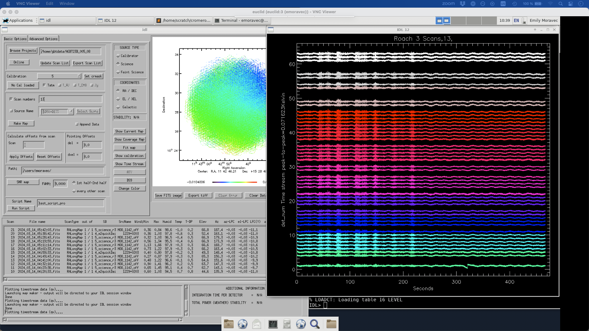

.. _mustang2_obs:

#############################
How to observe with MUSTANG-2
#############################

1. Project Preparation
======================

1.1 Prepare observing scripts
-----------------------------
Before you observe you need to have prepared your observing scripts and chosen your flux calibrators, your OOF sources, and pointing calibrators. For a guide on how to do all of these things see :ref:` this guide <How to Prepare MUSTANG-2 Observing Scripts>` for instructions on preparing your scripts.

1.2 Observing Log
-------------------

During observing, you are expected to edit the MUSTANG-2 observing run notes wiki and take notes of what's occurred throughout the night.

#. Create a new page and entry at the bottom of the `observing logs wiki <https://safe.nrao.edu/wiki/bin/view/GB/Pennarray/NewRunNotes>`_ by clicking "Edit Wiki text" 

#. Follow the naming convention of entry above <AGBTsemester_project-code_session-number>, e.g. ``AGBT18A_014_01``

#. On the new log page you have created you can put in the text from a `log template <https://safe.nrao.edu/wiki/bin/view/GB/Pennarray/NewRunNotes#Log_Template>`_. On the log template page, go to "Edit", copy that text, and paste it into your new log (also in the "Edit" mode). You will have to get rid of some extra spaces.

.. attention::

    Save your log often (not only at the end of the observation) to ensure that your notes are being saved!

.. tip::

    When you are actually recording information during observing you can be in either the "Edit Wiki Text" or "Edit" modes. But for some reason copying the formatting from the log template to your log has to be done in the "Edit" mode.

.. note::

    If you don't have permissions yet to edit the wiki and are observing, you can take notes in a text document and email them to the MUSTANG-2 team afterwards to upload to the wiki for you.

2. Observing Preparation
========================

2.1 Connect
-----------

Open and connect to :ref:`VNC session <Quick VNC Reference>` or start an XFCE :ref:`FastX session <FastX connection>` on ``titania`` or ``ariel`` via FastX.

Connection Issues?
^^^^^^^^^^^^^^^^^^
The internet at GBO can be intermitent at times. Specifically there are days that the internet goes down for 30-60 seconds at a time quite often. Are you having issues with FastX or your VNC being really laggy? Check `this status page <https://status.gb.nrao.edu/>`_ to see the status of the ssh gateways. See :ref:`these instructions <What to do if the GBO network is down/slow>` for FastX and VNC workarounds using Charlottesville to potentially better your connection. 

2.2 AstrID 
-----------

Open an AstrID session and navigate to your corresponding MUSTANG-2 project. The MUSTANG-2 instrument team should have already populated your Astrid area with appropriate scripts.

2.3 CLEO
--------

The following are suggested CLEO windows to have open during observing:

- Launch → Receivers → **Mustang2**
    - To monitor specific thermometers, click the gray box next to the titles:
        - PT Fridge 1
        - PT Fridge 2
        - Array
        - HE4 Fridge 1 Charcoal
        - He4 Fridge 2 Charcoal
        - He3 Charcoal
        - He4 Fridge 1 Evap
        - He4 Fridge 2 Evap
        - He3 Evap. 
          
        These thermometers are of interest because they can indicate that things are wrong before they affect the array, or help diagnose what is wrong and how to fix it if the array temperature starts to go up.  Sometimes a cryocycle gets started by accident - in which case if you are looking at the charcoal you can hit abort quickly and no damage is done. Other times a helium4 might run out and that can pull up the array temperature - not much you can do but often you can still collect some good data for a while.

- Launch → **Status**

- Launch → **Antenna**

- Launch → Observer Tools → **Scheduler & Skyview**
    - Click on ``Real-time mode``
    - Load in catalogs:
        - your science target catalogs
            - Click ``Catalog...`` in the upper right-hand corner
            - Click ``Add/Select/DeSelect Catalogs ...``
            - Select ``Add User Catalog``
            - Select the path to your science catalog (consult your observing scripts). They may be in ``/users/penarray/Public/Catalogs/Science_catalogs/``
            - Click ``Apply``
        - ALMA grid calibrators (flux calibration and often OOF sources)
            - Click ``Catalog...`` in the upper right-hand corner
            - Click ``Add/Select/DeSelect Catalogs ...``
            - Select ``Add User Catalog``
            - Select the path ``/users/penarray/Public/Catalogs/alma_gridcal.cat``
            - Click ``Apply``
        - mustang_pointing
            - Click ``Catalog...`` in the upper right-hand corner
            - Click ``Add/Select/DeSelect Catalogs ...``
            - Select ``mustang_pointing``
            - Click ``Apply``
            - It is suggested that you enter in a minimum of 0.5 Jy

- Launch → Observer Tools → **Talk and Draw** 

3. Observing Procedure
======================

3.1. Communicate with operator 
------------------------------

A few minutes before your observing start time (say 15 minutes, better 30 minutes), get on Talk & Draw, tell the operator who you are and what project you are observing for. Also ask who the operator is. 

3.2. Fill in AstrID info
------------------------

In Astrid under ObservationManagement, go to the Run tab and fill in the Observer and Operator information. 

3.3. Take control
-----------------

Once the member of the M2 instrument team has finished biasing and the operator tells you are in the gateway/gives you the go ahead, in Astrid → File → Real time mode ... → Select ``work online with control of the telescope``.

3.4. Configure
--------------

Run the ``1_m2setup`` script in Astrid.

3.5. OOF
--------

#. Make sure that you have changed ``mySrc`` in ``2_m2oof`` and run the ``2_m2OOF`` script in Astrid. 

#. For the first OOF of the night, you need to have ``calSeq=True`` so that a skydip is done as a part of the OOFing process. An OOF will take ~20 minutes to run. 

#. Check the OOF results in Astrid → DataDisplay → OOF and re-rerun if necessary. 
    For M2, we typically apply the z5 corrections. When the corrections are available, press the green button that reads ``After selecting the Zernike solution above, click this green button to send the solutions to the telescope.``
   
    .. note::
        
        Sometimes OOF may time out and you will get a red screen if this happens. If this happens, re-OOF as this will restart the calculations of the solutions.

.. hint:: 

    While your OOF is running, it is a good time to:

    - Write down the weather conditions from the GbtStatus tab in Astrid in the observing log 
        - Pyrgeometer - if working
        - Temperature
        - Humidity
        - IR Cloud Cover
        - Wind Velocity.

    - :ref:`Start the m2gui <4. Checking data with the m2gui>` which is used to check M2 data while observing.

    - In the m2gui check
        - the skydip (once this has been executed through the OOF process)
        - that you can see the OOF images
              

3.6 Quick daisy on OOF source
-----------------------------

#. Run the ``2_m2quickDaisyOOF`` script on your OOF/calibrator source
    It's best if you can make your OOF source and your calibrator source the same. 

#. Use the m2gui and determine
    - beam shape (``WidthA`` & ``WidthB``)
    - peak of the source (``Peak_Height``)
     
#. Record these values in your observing log

#. It's a good idea to check the time streams (see the :ref:`check time streams section <4.5 Checking Time Streams>` for instructions and examples.)

3.7 Quick daisy on pointing calibrator
--------------------------------------

#. Run the ``3_m2quickDaisyPC`` script on your pointing source. 

#. Use the m2gui again and determine
    - beam shape (``WidthA`` & ``WidthB``)
    - peak of the source (``Peak_Height``)
     
#. Record these values in your observing log

.. note:: 

   During this initial data acquisition (and to some extent, throughout the night) check your Mustang2 CLEO screen, and make sure that the numbers in sections such as ``Frame Cntr`` and ``Roach Data`` are continuing to change with time (if so, the boxes will mostly be blue). However, if they stop (indicated when the boxes turn lavender) then the Mustang2 manager has crashed, and you’ll need to :ref:`restart it <7.1 MUSTANG-2 Manager>`.
 

3.8 Take science data
---------------------

Take ~30 minutes of science data followed by a quick daisy on your pointing calibrator. Often this is accomplished by submitting several science scripts (e.g., ``5_science_rX``) in Astrid. For example, often for cluster science each individual science scan is ~8-9 minutes in length. So if you are submitting individual beauty scans (which ``5_science_rX`` are), you can submit 4 of the science scripts in a row followed by your pointing calibrator scan. 

It's a good idea to check the time streams (see the :ref:`check time streams section <4.5 Checking Time Streams>` for instructions and examples.)

.. note:: 

    If you try to look at science data in the m2gui, make sure you choose the "faint science" option under ``source type``.

.. admonition:: What is ``science_r2p5`` and ``science_r3``?

    ``Science_r2p5`` and ``science_r3`` are the science scans of the observation. The difference between the two is the radius of the scans in arcminutes (one is 2.5' and one is 3' respectively). If you only see science scans, unlabeled otherwise, then they are likely 3' in diameter. Legacy M2 scripts will have labels like ``beauty_r3``.

3.9 Continue to take science data
---------------------------------

#. Continue to do ~30 minutes of science data followed by a quick daisy on the pointing calibrator for the rest of the night. 
#. Monitor the beam size (``WidthA`` and ``WidthB``) and the ``Peak_Height`` using the m2gui to determine if you need to OOF again.

.. note:: 

    We note that when observing with MUSTANG-2 on the GBT, the preferred maximum elevation limit of a target if 75 degrees. It is possible to observe targets up to 80 degrees elevation but this is not preferable. The hard limit is around 84 degrees. At these higher elevations, the MUSTNAG-2 beam becomes large because the GBT cannot keep up with the slewing speeds required to map and track the source. Conversely, the preferred minimum elevation is 30 degrees. However, it is possible to but can go lower, but lower than 30 is hard on the hardware.

.. attention::

    Save your wiki observing log often (not only at the end of the observation) to ensure that your notes are being saved!

3.10 When to OOF?
-----------------

If the new ``Peak_Height`` is down by more than ~15%, or if ``WidthA`` and ``WidthB`` become very different from one another (indicating that the beam has become overly elliptical) you'll want to do an OOF. 

.. admonition:: Optional
    :class: note

    If you don't have much observing time left, once the PeakHeight is down by more than 15%, instead of redoing the OOF scan, you can do another m2QuickDaisy on the pointing source to be sure that it is that low, and then do two more Beauty scans until the PeakHeight has gone down by another 15% (so a cumulative 30%).

3.11 Be aware - Issue with quadrant detector
--------------------------------------------
In early 2023 it was discovered that over the past year or two the quadrant detector sometimes isn't working and doesn't write files to ``/home/gbtdata/project_code_sesion/QuadrantDetector`` as we expect. The GUI now will pop up a warning box (``WARNING QD Values are missing for scans: ...``) if it detects that the quadrant detector files are not being written.

If this happens during observing, press ok and ask the operator to restart the quadrant detector manager.

.. warning::

    However if you get a warning about just ONE file, this is not a problem. Most likely the scan is not finished yet. There may be an issue with the quadrant detector only if you get a pop-up notification about SEVERAL scans.

4. Checking data with the m2gui
===============================

4.1 Start-up m2gui
------------------

To open up the m2gui, execute in a terminal (in a directory where you have write-access):

.. code:: bash
                
    ~penarray/Public/startm2idl
    m2gui

After you have opened the m2gui follow these steps to check the tipping scan, monitor the beam shape (``width``, ``widthA``, ``widthB``) and peak of calibrators (``Peak_Height``), or to just check the data.

#. **Go online**
    Click the ``online`` button.

    .. image:: images/m2gui_01_start_online.png

    .. note:: 

        If you want to open up a previous project that is not the current online project, click ``Browse Projects``, find the project+session in the left hand column, and double click that folder to open it up.

4.2 Check Tipping Scan
----------------------

.. admonition:: What is a Skydip (Tipping Scan)?

    What is a skydip? And what are the plots that we looking at? A skydip is a flat field. If you look at the detector bias curves some are inverted and even those with the same sign will have a different response to bias. We use the fact that the atmosphere is not transparent and has a :math:`\frac{1-\exp^{-\tau}}{\cos(\text{elevation})}` dependence. With a fair guess of the opacity :math:`\tau`, you can do a fit on each detector to get them roughly Kelvin_RJ. These calibrations are used to make maps of known sources and the results scaled to bring them to the correct amplitude.

#. **Select tipping scan**
    Under Calibration, click ``Select Tip Scan`` and choose the most recent scan number from the bottom labeled ``Tip`` under ``scan type.`` At the beginning of the night, this should be from scan 1, before the 3 OOF scans (see below image - blue box).

    .. image:: images/m2gui_02_select_tip.png

#. **Inspect plots**
    Many plots will pop up - one for each roach showing the results of the tipping scan for each roach. You can click out of these once they finish unless you are particularly curious about specific roaches. After these plots have been produced, you will see a graph to the right in the main gui window, showing the results of the tip scan - each roach is plotted in black with a fit in green. Check to make sure that it looks reasonable.

    .. image:: images/m2gui_03_tip_individ.png

    .. admonition:: Examples of tipping scans

        .. tab:: Good Tip Scan 

            A good weather skydip. The black lines (one for each roach) should be fairly free of wiggles and the dashed green line (which is the fit) should follow the black lines fairly closely. 

            .. image:: images/m2gui_04_tip_scan_good_example.png

        .. tab:: Bad Tip Scan 

            A bad weather skydip. The black lines (one for each roach) are full of wiggles and the dashed green line (the fit) is not following the black lines well.

            .. image:: images/m2gui_05_tip_scan_bad_example.png

    If the tipping scan doesn’t look right (a lot of wiggles), try running the ``skydip`` script in AstrID. This reruns the tipping scan without having to redo the whole OOF. If it still looks bad, check the weather conditions in CLEO. The weather might not be good enough to observe (consult :ref:`5. General Advice for Determining “Bad Weather“` for advice). You can also call one of the M2 instrument team and get their advice.

#. **Check the number of live detectors**
    At this stage, check the number of live detectors, as well as throughout the night. Record this in your observing log.

    In the image below, you can see where to check the number of live detectors:

    .. image:: images/m2gui_06_live_detectors.png

    Generally it's good to have 170+ live detectors, however it can sometimes be as low as 160 if the tuning step didn't go very well. If you see this number as low as the 150s or 140s (especially if it's lower than that, which it shouldn't be) be sure to contact a M2 team member. You can also try re-tuning (see section A) and hope that that fixes it.

#. **Continue**
    If the tipping scan and number of live detectors look good.

4.3 Checking Calibrator/Beam Parameters
---------------------------------------

#. **Make map**
    To make a map of a calibrator, after you have run the ``m2quickDaisy`` script on a source in AstrID
        - Click ``Update Scan List`` to find the source scan number of the source you just observed
        - Set the ``Scan Numbers`` to the scan number of interest
        - Set ``Source Type`` to ``Calibrator``
        - Click ``Make Map``

        .. image:: images/m2gui_07_tip_make_cal_map.png

    This will open up an image of the daisy map that you selected. The map should look something like this:

    .. image:: images/m2gui_08_qd_cal.png

    What you see at this stage is an image of the daisy scan. In the center is your calibrator source, visible because it is a bright source. Later, when looking at daisy scans of your science source, it's very likely that you will only see a flat map in the center because it's so much more faint.

    The units of the color-coding of this map are in Kelvin of the forward beam. The forward beam is calibrated for the estimated sky temperature at that elevation that we gleaned from our tipping scan earlier on in the night. Therefore, the forward beam temperature should hover around zero if everything is calibrated correctly.

    .. admonition:: What is a Daisy Map?

        The maps that the M2 team makes are called daisy scans. This is because they loop many times around a central point, looking somewhat like daisy petals. This emphasizes exposure time on the center of the map, with less exposure on the outside edges of the map, making the center of the map more accurately calibrated. They then use the outside of the map to calibrate the sky temperature and remove these effects in the center of the daisy in later post-processing.

        .. image:: images/14_m2gui_daisy_explanation.png

        The lines drawn on the map designate the beam path of the GBT on the sky relative to your source. As you can see, each loop begins at the source, extends out, and then returns to the source. This is done throughout the space around your source. Because every loop returns to your source, this results in a higher exposure time on your source relative to the rest of the sky. However, because the units are in Kelvin of the forward beam, this does not mean a higher temperature, but instead simply less noise in the map.

#. **Fit Map**
    Click ``Fit Map``. 

    .. image:: images/m2gui_09_qd_cal_fit.png

    This will produce the following plots in the gui.

    .. image:: images/m2gui_10_fitmap_gui.png

#. **Check fitting parameters**
    The fit parameters will be printed out in your terminal.

    .. image:: images/m2gui_11_fitmap_terminal_output.png

    .. note:: 

        The Floating underflow error you see in the output is **not** a concern.

#. **Record values**

   Write down the values for ``PEAK_HEIGHT``, ``WIDTHA``, and ``WIDTHB`` in the observing log to compare to later pointing scans to monitor the beam and decide if you need to re-OOF. 

4.4 Checking Science Scans
--------------------------

If you would like to make a map of a science scan(s), you can do so by following the same steps as making a map of a calibrator with the following modification
    - under ``Source Type`` select ``Faint Science`` 

.. note::

    The ``Faint Science`` option is for targets that do not have bright sources in the field. If you have bright sources in your science target, you can use the ``Science`` option instead. 

.. note::

    You can add several science scans together by putting them all separated by commas in the scan list.

4.5 Checking Time Streams
------------------------------------

It is a good idea to check the time streams (checking how the sky temperature is changing over time) as well as the maps. To do so:

- Make your map (see :ref:`4.3 Checking Calibrator/Beam Parameters` or :ref:`4.4 Checking Science Scans`)
- Click ``show time stream`` button underneath the ``Fit Map`` button after making your map
    .. image:: images/18_show_time_stream_button.png

    .. admonition:: Example Time Streams

        .. tab:: Calibrator Time Stream

            .. image:: images/timestream_calibrator_AGBT23B_005_08_scan9.png

            This is an exemplar time stream for a calibrator source. Notice that you see the point-like source as a gaussian peak in most time streams.

        .. tab:: Faint Science Time Stream

            .. image:: images/timestream_faint_sci_good_AGBT23B_005_08_scan13.png

            Faint science time streams (a cluster) in good weather. Notice how nice a flat the time streams are.

.. note::

    There may be detectors that have glitches that are not flagged by the imaging making pipeline used by the GUI. In this case, you can identify the glitchy detector and flag it using `Set crmask` and remake the map.

4.6 Use crmask to Mask Bad Detectors
------------------------------------

1. **Identify bad detector**. See in image below that detector 60 on roach 3 has a glitch that has not been flagged and thus is throwing off the autoscaling. Note that in this example, type=``Science`` is being used for making a science map which is not correct but is being using for demonstration here.

2. **Set crmask**. Click the ``Set crmask`` button and another window will pop up with 4 columns: ``r`` is the detector number and ``c`` stands for column which is the roach number. There is a button next to each detector that is selected or "pressed in" if it is being used and is unselected or "not pressed in" if it is being masked (see images below).

.. admonition:: Setting crmask

    .. tab:: Default crmask

        .. image:: images/crmask02_default.png

        In this example we find detector 60 on roach 3 or ``r 60 c 3`` and see it is not included in the crmask.

    .. tab:: Add detector to crmask

        .. image:: images/crmask03_changed.png

        Click the box next to ``r 60 c 3`` to include it in the detectors that are masked.

.. warning::

    Once you add something to a crmask it will stay included in the mask (in crmask) for future maps.

3. **Remake the map**. Then click ``Make Map`` again and ``Show Time Stream`` after the map has been made to see the effects of adding this detector to the crmask. You can see in the image below that the bad detector has been masked and now one can see the time stream structure better.

4.7 Troubleshooting: m2gui hangs
--------------------------------

If your m2gui is hanging (won't quit) do the following in a terminal:

.. code:: bash

    ps -u

Find the PIDs of startm2gui and idl and kill both.

.. code:: bash
   
    kill -9 PID

5. General Advice for Determining “Bad Weather“
======================================================
Once you have some indication of bad weather (bad skydip, bad time streams, or physical weather indication), you will want to make an educated guess as to what the trajectory of the weather/data is in order to determine whether or not to keep observing or give up the time. There are many tools that you can use to an assessment of this trajectory. Consider, do the following suggest that the remainder of your scans would be scientifically useful? (this can be used as a checklist of sorts)
    - Time streams
        - Check the time streams of the science scans as laid out above in :ref:`4.5 Checking Time Streams`. Are they wiggly? How wiggly? See examples below in :ref:`5.1 Examples of effect of bad weather`.
        - How many “bad” science scans have there been in a row?

    - Skydip(s)
        - How does the first skydip of night look? How wiggly is it? See examples below :ref:`5.1 Examples of effect of bad weather`.
        - If you are seeing indications of bad weather and you decide to OOF again one could add a skydip in to test the weather (calSeq=True).
        - One could even do a one off skydip.

    - Beam
        - Has the beam been deteriorating?

    - Weather forecast
        - Check https://www.gb.nrao.edu/~rmaddale/Weather/AllOverviews.html.
        - Check another reputable weather forecaster (Weather underground, weather.forcast.gov, Windy, etc.)

    - Direct communication with the operator
        - Ask the operator what the weather is like. Since you asked at the beginning of the observation you have one data point.
        - This also serves as a way to keep the operator in the loop and aware of a potentially imminent decision to relinquish telescope control.

.. note::
            
    The observer should reach out to the operator once the concern of bad weather is identified to let them know that the weather is a concern. This could be as early as the first bad scan (time streams, whether a science scan or those from a skydip). A good practice is that if there are two consecutive scans with bad time streams, the operator should be notified and consulted at this point. That doesn’t mean a decision needs to be made this early on, but it lays the groundwork so that both parties are aware of a potentially imminent decision to relinquish telescope control. If the observer has doubts, reach out to an M2 team member after a second bad scan.

A few data/weather trajectories are as follows:
    - Improve
        - Is it a one off? As in its just a cloud passing by?
        - Is the or will the weather improve?
    - Stay the same. Is the weather staying bad and not improving?
    - Get worse. Is the trajectory getting worse and worse?

You will need to monitoring the situation over time and over multiple scans in order to make a guess about the trajectory of the data. One note is the it is usually never sufficient to come across one bad scan and call it quits. There is usually always some nebulous time span (~half hour to an hour) to determine that things are bad and staying bad. If you think the weather will improve and the improvement should happen soon and give ample time for valuable science scans, then the suggestion is to try to endure the bad weather. However, for weather staying the same and getting worse, the advice is to rely on the other metrics to make a determination, except for the case that the operator identifies clear precipitation with no expectation for improvement. At that point, one can give up the time promptly if it’s heavily raining or snowing.

When making a judgment call as to whether to give up the time due to bad weather, consider the following cases:
    - How much time is left? If there is not much time left it is less likely that the weather will change.
    - Are you observing a faint target? If you give up amount of time you have left, will that amount of time you have left make a difference for your science?
    - How much time has been observed for the project and how much time is left in the project? We ask for a factor of 2 of overheads so maybe there is time to tolerate bad weather.

.. note::
        
    ~30 minutes is a rough minimum amount of time to relinquish control, but the operator will need some time to prepare a backup project so this is why it is good to keep in touch with the operator throughout this process. So the general advice is that if you give up the time near the end of an observation, the minimum time left in an observing session would be ~45 minutes. 

.. note::
        
    The flip side of overheads (i.e. maybe the project can tolerate bad weather) is that if you are observing the last session (using up all awarded time), any rescheduled observing would all go to overheads. If it’s not the last session, then the advice is to give up the remainder of time for bad weather (if all bad-weather items are checked).

Again, when in doubt you can always call an M2 team member to help you make the call of whether or not to give up the time.

5.1 Examples of effect of bad weather
-------------------------------------
Here are some examples of science time streams and skydips in good and bad weather.

.. admonition:: Faint Science

    .. tab:: Good Time Stream

        .. image:: images/timestream_faint_sci_good_AGBT23B_005_08_scan13.png

        This is what a good, unaffected faint science time streams (a cluster) looks like in good weather - flat.

    .. tab:: Bad Time Stream

        .. image:: images/timestream_faint_sci_bad_AGBT18A_215_04_scan93.png

        This is what faint science time streams look like when they are heavily affected by weather - very wiggly.

.. admonition:: Skydip

    .. tab:: Good Skydip

        .. image:: images/skydip_good_AGBT23B_005_08.png

        This is what a good skydip looks like in good weather - not wiggly.
        
    .. tab:: Bad Skydip

        .. image:: images/skydip_bad_AGBT23B_005_06_scan13.png

        This is what a skydip looks like when it is heavily affected by weather - very wiggly.

.. note::
        
    It is difficult to see the affect of weather in calibrator time streams as the signal from the point source is quite bright.

6. Changing M2 Projects/Second M2 Project of the Night
======================================================

6.1 Check Tuning for Files
--------------------------
Tuning files need to be linked to an observing session. This is done one of two ways either:
- the tuner includes the second project in the tuning process (put the second observing project/session as a second argument separated by a comma in the tuning process)
- or if they did not, you will have to create a symlink. 

If you are observing for a second project in the night, it is best to communicate with the tuner to make sure they include the second project. But if you didn't, before you start observing check to see if the tuning directory for this second project exists `/home/gbtlogs/Rcvr_MBA1_5tuning/`. If it does not follow the instructions below to create a symlink for the tuning.

Before you begin observing, login to egret as lmonctrl (`ssh lmonctrl@egret.gbt.nrao.edu`) and type:

.. code:: bash

    cd /home/gbtlogs/Rcvr_MBA1_5tuning/
    ln -s <old_project_session> <new_project_session>

where ``old_project_session`` is the full name of the previous M2 project and ``new_project_session`` is the second M2 project of the night that you are observing for. 

.. warning::

    Be very careful to put in the right project and session ID or this step will not work and you won't get any data. You can ask the previous observer for the old project session ID, or look for it by typing:

    .. code:: bash
        
        ls -ltr /home/gbtdata/

    The last modified file will tell you what the most recent project ID was.

6.2 ``Run m2setup``
-------------------

When the observing time for the second project starts, you need run m2setup in AstrID again. This is already outlined in the directions.

.. warning::
   
   Some people think they can skip this step when changing from another MUSTANG-2 run. This is not the case. It's very important to still run ``m2setup`` at the beginning of your session.

6.3 Skydip/OOF 
--------------
You need a skydip at the beginning of this project, but you can possibly skip OOFing at the beginning of this second project. You can ask the previous observer when they last did an OOF and what the progression of the beam was.

- If you need to re-OOF
    - make sure that ``calSeq=True`` to get a skydip

- If you do **not** need to re-OOF
    - do a stand-alone skydip and change ``myAz`` to the Azimuth of whatever your first source will be (calibrator, etc.). The telescope will slew to that Az.

6.4 Flux calibrator
-------------------

You'll also want to still observe your flux calibrator using the ``m2quickdaisy`` script. 

.. warning::

    This is another thing people think they can skip, but it makes reduction later more difficult. Check the beam with this flux calibrator.

    
7. Observing Troubleshooting
============================

7.1 MUSTANG-2 Manager
---------------------

Sometimes the MUSTANG-2 manager refuses to start - you try to start it and you get a failure every time (using TaskMaster or asking the operator to do this for you). 

The solution is to 
    - log onto egret
    - shut the computer down
    - log onto the iboot bar
    - power off egret and the housekeeping
    - leave it off for 30 seconds
    - turn these back on
      
Egret may take a while to reboot but once it does you should be able to restart the manager.
Assuming this works you should also make sure to press the ``reset heater card`` button on the manager twice.

8. Closing up for the night
===========================

8.1 Go offline
--------------

In AstrID, go from ``working online`` to ``working offline``:
    - ``File`` → ``Real time mode`` ... → ``work offline``. 

8.2 Shutdown M2
----------------------

For the shutdown process you can either do this **(a) automatically** or **(b) manually**.

.. tab:: Automatic Shutdown

    Execute ONE of the following in a terminal:
        .. code:: bash
        
            /users/penarray/Public/stopMUSTANG.bash 

        OR

        .. code:: bash
        
            cd /users/penarray/Public  
            ./stopMUSTANG.bash

.. tab:: Manual Shutdown

    #. **Set detector biases to zero**
        - Go to the Mustang Manager in CLEO
        - Click on the miscellaneous tab
        - In the top middle, you will see 4 rows of Det Bias 1-4, corresponding to the 4 roaches.
        - Unlock the manager
        - roach-by-roach:
            - type ``0`` in the left DetBias box
            - press enter
            - wait until the blue box (right DetBias box) shows a DetBias of 0
            - repeat this step for all 4 roaches.

    #. **Turn off data transmission**
        - Mustang2 CLEO scan turn off ``DataXinit`` for all four roaches. 
          
        .. note::
            
            You will need to be in gateway AND unlock both the ``unlock`` and ``advanced features unlock`` buttons to do this.

    #. **Turn off components**
        In VNC session, go to http://mustangboot.gbt.nrao.edu and turn off the *roaches*, *HEMTs*, and *Function Generator* by checking those three boxes then go to left of the screen and click 'Off’ (gray button).

    #. **Turn on daily cycle**
        Mustang2 CLEO window
            - go to ``Housekeeping``
            - unlock
            - recheck daily cycle to be on and put autocycle trigger to HE4
                This means that if either of the He4 fridges run out it starts a cycle. 
            - set the ``daily cycle time`` = 0.65 of a day in UT
                This is the time of day that the daily cycle starts measured in fraction of a day (UT).  0.65 is a nice balance between ensuring the cycle is over by the time any observations are likely to come up, yet not so early that there is no time to work with the receiver in the morning.

8.3 Kill VNC session
--------------------

Either kill your FastX session or your VNC session via the terminal.

.. admonition:: Congratulations!
    :class: important
  
    You’re all done! Now, let's do some science with that data!
