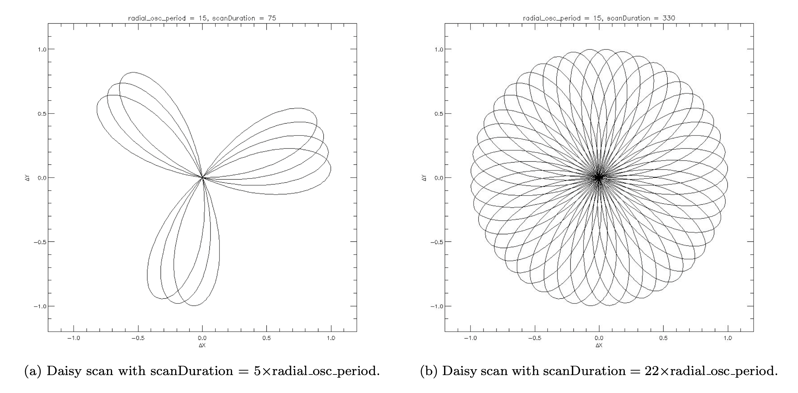
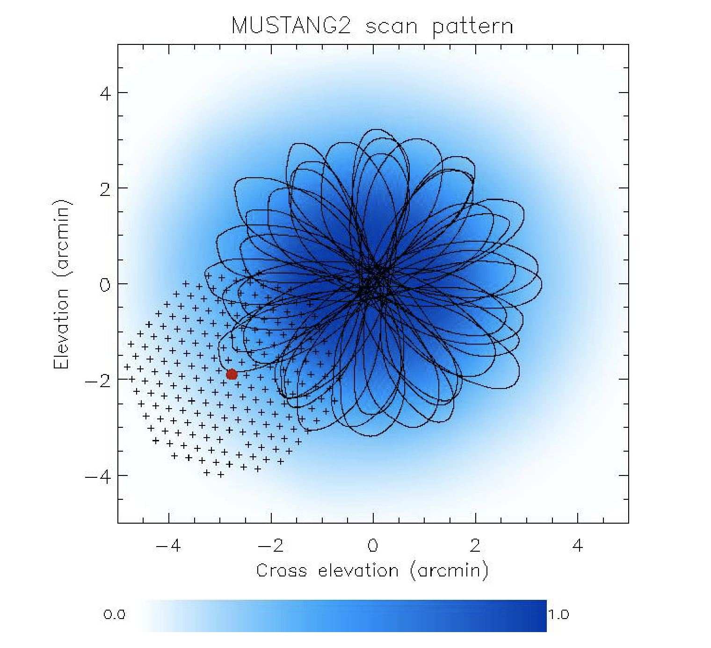

.. _mustang2_obs_scripts:

##########################################
How to Prepare MUSTANG-2 Observing Scripts
##########################################
You are expected to have your scripts ready well before your first observation (ideally at the start of the observing semester). You will likely receive an email from your project friend spurring you to do this.

Explanation of M2 scan pattern: Daisy
=====================================
MUSTANG-2 uses on-the-fly mapping with the default (recommended for most projects) being what is referred to as a :func:`Daisy() <astrid_commands.Daisy>` scan (an on-the-fly scan around a central point in the form of daisy petals). This scan pattern minimizes acceleration of the feedarm and has cross linking on the full range of timescales. Visually it looks like the petals of a daisy (see :numref:`fig-daisy`) with the path of the telescope (in elevation and cross elevation) being described by two sine wave in radius that rotate on the sky with time :math:`t`. Expressed as (el, xel) = ``daisyRad`` :math:`*` (sin(:math:`\theta_1 * t`) :math:`*` sin(:math:`\theta_2 * t`), sin(:math:`\theta_1 * t`) :math:`*` cos(:math:`\theta_2 * t`)) where :math:`\theta_2 << \theta_1` and :math:`\theta_1` = ``daisyRadPd``. Conceptually :math:`\theta_2` is the movement around the center of the pointing (i.e., how wide the petals are).

.. _fig-daisy:

	Illustration of basic daisy pattern with different scan lengths.

.. Image of daisy is from the Observer's guide (August 2024 version the figure is 5.6) in the description of a Daisy. As of Dec 2025, this figure should be in the :func:`Daisy() <astrid_commands.Daisy>` description but is not. 

.. todo:: Once image of daisy has been uploaded to :func:`Daisy() <astrid_commands.Daisy>` definition, link to that image. 

To spread out the coverage of the maps, the MUSTANG-2 standard daisy has a (typically) small lissajous pattern added on top of the daisy trajectory. For the lissajous addition,  the path of the telescope (in elevation and cross elevation) described by (el, xel) = ``lissHw`` :math:`*` (sin(:math:`\theta_3`), sin(:math:`\theta_4`) where ``lissHw`` < ``daisyRad`` and :math:`\theta_3` and :math:`\theta_4` are only slightly different. 

So in total the MUSTANG-2 standard scan is the combination of a smallish lissajous box scan and a larger daisy scan executed through the AstrID command ``DaisyWithDither()``. The added lissajous pattern is the "dither" in ``DaisyWithDither()``. On a typical night, MUSTANG-2 will have 180-195 live detectors. *Each* of these detectors will be scanning in ``DaisyWithDither()`` pattern (illustrated in :numref:`daisy-with-dither-dicker2020`). 

.. _daisy-with-dither-dicker2020:

	: `Dicker et al 2020 Figure 1 <https://ui.adsabs.harvard.edu/abs/2020ApJ...902..144D/abstract>`_. The black lines represent the path of the central detector of the array. Shown in the bottom left is the footprint of the array with the central detector marked as the red dot. The scan pattern is designed to provide cross-linking on many different timescales, between all parts of the array. The blue represents the normalized coverage.

.. note::
	
	Notice how the central detector does not cross the center for each petal. 

Below is the typical ``DaisyWithDither()`` command that you will see in the template scripts:

.. code::

	DaisyWithDither(mySrc,map_radius=daisyRad,radial_osc_period=daisyRadPd,radial_phase=0,rotation_phase=0,scanDuration=daisyScanDur,beamName='C',cos_v=True,coordMode=coordSys,lissajous=lissHw)

where all that varies between scans is ``mySrc``, ``daisyRad``, parameters associated with ``daisyRadPd``, ``daisyScanDur``, and sometimes ``lissHw``. These parameters are all set in the AstrID script (see template examples in ``/users/penarray/Public/m2_template_scripts/``). Values for all the parameters are set in the observing scripts but the user will typically only adjust the radius of the daisy scan (``daisyRad``) based on their science goals. For ``daisyRad`` < 5' no changes should be needed in the other parameters. For larger scan sizes, please contact the MUSTANG-2 team for advice. 

Explanations of the daisy parameters you need to understand:
	* ``daisyRad`` is the radius of the daisy in arcminutes.
	* ``daisyRadPd`` is the period of the daisy in seconds. Said in a different way, ``daisyRadPd`` is how long it takes to sketch out one oscillation period or petal of the daisy. You should keep ``daisyRadPd`` :math:`\leq` 20 sec * (``daisyRad`` /2 arcmin)^(1/3) to avoid jerking the feedarm for 90 GHz observations. Once you know ``daisyRad`` you can calculate ``daisyRadPd``. 
	* ``daisyScanDur`` - the total duration in seconds of the scan. 
		* For science scans, we know that "the Daisy scan will produce an approximately closed circular pattern on the sky after 22 radial oscillation periods" so in the M2 template scripts for science targets ``daisyScanDur`` is set by ``daisyScanDur=daisyRadPd*22.0`` and you will not have to change this as you will be updating ``daisyRadPd``. So for science scans, the total science scan duration is 8.5-9.25 minutes.
		* For calibrator scans, we use something called a "quick daisy." Insteaad of completing the full, 22 radial oscillation periods, we only do 4.5. The calibrator scans are meant to be a quick check of a point source so do not need the full 22 radial oscillations. We typically have ~190-200 detectors online during a given observation so the 4.5 radial oscillations of the point source are enough for calibration. Note that ``daisyRad=1.5`` for these "quick daisies." Thus, in total ``daisyScanDur=daisyRadPd*4.5`` for a quick daisy which amounts to ~1.5 minutes.
	* ``lissHw`` is the lissajous dithering half-width in arcminutes. As stated above, the MUSTANG-2 standard scan is the combination of a smallish lissajous box scan and a larger daisy scan. ``lissHW`` is essentially the size of that lissajous box. A smaller lissajous pattern spreads out the coverage. If you want to cover a large area ``lissHW`` can be made larger, but if you are trying to concentrate integration time in the center r=2' then keep ``lissHW`` small. For most MUSTANG-2 targets which are ~4' across ``lissHW`` is not so important but for very large target (e.g., the Moon) then you would get a big, array-sized peak in the coverage map for small ``lissHW``. So in short except in extreme cases ``lissHW`` is not important. ``lissHW`` is set for you in the template scripts so that you don't have to worry about this.

Note that you can use ``~bmason/mustangPub/daisycalc.py`` to help determine appropriate parameters.

If you want to explore how all these parameters affect the properties of a daisy scan, open an ipython session and execute the following:

.. code::

	import numpy as np
	import pyplot as plt
	t=np.arange(3000)/10.*2*np.pi
	t1=0.1
	t2=0.01
	t3=0.01
	t4=0.015
	plt.ion()
	plot(np.sin(t*t3),np.sin(t*t4))
	plot(np.sin(t*t1)*np.sin(t*t2),np.sin(t*t1)*np.cos(t*t2)

1. Copy script templates into AstrID
====================================
The M2 instrument team has created template observing scripts which are located in: ``/users/penarray/Public/m2_template_scripts/``. 

If you are creating the scripts for the first time for your project, you will want to copy the following templates into your project directory:
    #. Standard calibration scripts
        * ``1_m2setup``
        * ``2_m2oof``
        * ``3_m2quickDaisyPrimary``
        * ``4_m2quickDaisySecondary``
        * ``skydip``
        * ``m2quickDaisy``
    #. Science script. If your science requires a typical observing strategy of a daisy of a certain radius, copy one of the science scripts labeled ``5_XXX`` with the radius listed in the file name (e.g. r3 is a daisy with a radius of 3').
	.. note::

		The radius of the daisy will depend on your science - reach out to the M2 instrument team for guidance.
	           
The scripts ``m2quickDaisy`` and ``skydip`` are extra but can be of use.

To copy these scripts into your project directory in AstrID, first open AstrID and navigate to your project (first go to the observing semester then to your full project code). Then click *File* → *Import from file...*  → ``/users/penarray/Public/m2_template_scripts/`` → *Open* at which point the script will appear in the AstrID window. Save this script to your project directory by clicking *Save to Database* and enter the name of the script and hit *Save*. You will have to open each template script this way and save each one.

Read the README (``/users/penarray/Public/m2_template_scripts/README.txt``) for instructions on editing these scripts once you have them in your project directory.

2. Make your science target catalog
===================================
The M2 instrument team is now requesting that all science target catalogs be put in ``/users/penarray/Public/Catalogs/Science_catalogs/Catalogs_YourObservingSemester/``. If your semester does not yet exist please contact the M2 instrument team. You can either make your catalog either directly the appropriate folder in the penarray directory or make it in your home directory and copy it over. 

Example catalogs can be found in any of the folders in ``/users/penarray/Public/Catalogs/Science_catalogs/``. But a basic catalog will look like the following:

.. code::

	format=spherical
	coordmode=j2000
	head= name ra dec
	objectName1 13:22:56.3 -02:28:15
	objectname2 22:07:11.6 +07:57:23

For more information regarding catalogs, see the Catalogs section (section 5.3) of the `Observers guide <http://www.gb.nrao.edu/scienceDocs/GBTog.pdf>`_.

2.1 Naming Conventions
----------------------
We request that you name your catalog in the following way: ``AGBTSemester_ProjectCode.cat``. For example for a catalog for project AGBT23B_005 the catalog would be ``/users/penarray/Public/Catalogs/Science_catalogs/Catalogs_23B/AGBT23B_005.cat``. Note that catalog files should have the ``.cat`` extension in order for CLEO to automatically pick them up.

2.2 Catalog Permissions
-----------------------
At the end of the day, your catalog needs to have the following permissions: ``-rw-rw-r--``. By default it will have ``-rw-r--r--``. You need to add the write permission for the ``observer`` group so that others on the M2 instrument team can edit the catalog if they need to. To do this you can either do this when you copy over your catalog with 

.. code:: bash

	rsync -v /path/to/cats/* ~penarray/Public/Catalogs/Science_catalogs/yourCatalog.cat --chmod=g+w 

or if you copied your catalog over to ``/users/penarray/Public/Catalogs/Science_catalogs/Catalogs_YourObservingSemester/`` just simply change the permissions of the catalog with

.. code:: bash

	chmod g+w yourCatalog.cat

2.3 Update Path for Catalog in Scripts
--------------------------------------
Once you have created your catalog you can update the filepath to the catalog in your science scripts (``5_XXX``) and load them into the Scheduler & Skyview.

3. Choose your calibrators
==========================
You are expected to have your calibrator sources planned out **at least a few hours before** the time of your observation. You can use CLEO's Scheduler and Skyview to do this.

3.1 Primary Calibrators
=======================
You will need to observe at least one "primary calibrator" during your observing session. A primary calibrator is an absolute flux calibrator. Observing an absolute flux calibrator ensures that flux calibration can be done. It is preferable that you observe 2-3 flux calibrators per observing session. But if your science goals can be met with a 10-20% error in your flux measurement, you can observe only one flux calibrator. In general, you will want to find the flux calibrators that are closest to your source.

Where can you find primary/flux calibrators? You can use any of the ALMA grid cals listed in the following catalog: ``/users/penarray/Public/Catalogs/alma_gridcal.cat``. You can check the `ALMA Calibrator Source Catalogs <https://almascience.nrao.edu/sc/>`_ for the current flux density levels in Band 3 of the ALMA grid calibrators listed in ``/users/penarray/Public/Catalogs/alma_gridcal.cat`` (the flux density values listed in the CLEO catalog are quite old). Uranus and Neptune, especially Uranus, are also good flux calibrators. 

.. note::

	In February ALMA is shutdown so ALMA grid cals are not observed during February. Therefore, you should observe other flux calibrators besides the ALMA grid calibrators in February. You can use planets (Uranus, Neptune, Jupiter) or small solar system objects. Consult with MUSTANG-2 team about which flux calibrators to use during this time. 

Find a few primary source calibrators (beyond your OOF source) and add them to the ``m2quickDaisy`` script.

3.2 OOF source
==============
It is efficient to use a primary calibrator as your first OOF source of the night. In general a flux above 1 Jy at 90GHz is preferable, however good results have been obtained on weaker sources. Again, you can use CLEO's Scheduler and Skyview to find an ALMA grid cal source or other source that is > 1 Jy but you should check `ALMA Calibrator Source Catalogs <https://almascience.nrao.edu/sc/>`_ to make sure its flux is actually > 1 Jy. 

The main quality of a good OOF source is that it is a bright point source at 90 GHz. You want to avoid sources that have structure like Saturn or 3C273 (M87). Out of the planets Uranus and Neptune are the only planets that can be used as an OOF source. Note that Uranus is brighter than Neptune and can also be used as an absolute flux calibrator. Neptune is not particularly bright (< 1 Jy) so it is not a bad choice to OOF on, but there can be better choices. If you happen to have something brighter nearby (say an ALMA calibrator) - OOF on that instead. In general, when trying to decide whether to OOF on a planet, if convenience factors (e.g., if you get the telescope near a planet and it will take a while to slew to something else that is out of the way) overrides other factors, use planets. 

Additionally, a good general rule to follow for picking your OOF source is that you want to choose an OOF source that is approximately at same elevation as your source. This is because one of the main contributors to the deformations in the dish (what OOF is correcting for) is gravity and at each elevation the dish will deform differently due to gravity. However, a more nuanced way of choosing an OOF source is to consider the average elevation of your science target. If the average observing elevation of your target will be "low" (~35 or less), or "high" (average observing elevation ~60 or higher) then one would prefer to OOF on a source with a similar elevation. But if the science target is in between, then the OOF elevation will be less important.

Once you determine your OOF source, fill in the source name in the ``2_m2oof`` and ``3_m2quickDaisyPrimary`` scripts.

.. note::

	An advanced technique for choosing an OOF source is to choose the OOF source in real time based on where the last observer left the telescope.

3.3 Secondary calibrators
=========================
For each science target you will need to determine a secondary calibrator (a.k.a. pointing calibrators) that you will go to roughly every 30 minutes. 

You can find suitable calibrators using CLEO's Scheduler & Skyview
	- Click *Catalog...* in the upper right-hand corner
	- Click *Add/Select/DeSelect Catalogs ...*
	- Select *mustang_pointing*
	- Click *Apply*
    
The goal is to find a secondary calibrator that is within 10-15 degrees of your target and > 0.5 Jy. If a pointing calibrator can also be a bright absolute calibrator, that is worth a few extra degrees of slewing (over a lower brightness close by source). You should also take into consideration if the calibrator will be too low/high at any point of during your observations.

To find a source that is > 0.5 Jy, do the following in CLEO's Scheduler & SkyView:
    - Go to the box in the right-hand corner that says *Source Intensity Range* and in the *Min* box put 0.5
    - Hit enter
    - Load your science source catalog
    - Enter the time you will be observing in the *UT Date and Time* box
    - Find a source that is showing and is 10-15 deg from your target.

It is suggested that you find a few options for each science target. Once you determine your pointing calibrator(s), fill in the source name(s) with the strength in a comment in the ``4_m2quickDaisySecondary`` script. It is suggested that you leave the best one uncommented and comment out the other options.

4. Choose your science scan size
================================
The scan size for your science scans was likely predetermined by the proposal. In that when the proposal was submitted, the PI needed to determine the scan size for a noise estimation and/or the size of the object(s) being observed. Check the proposal under the Technical Justification section for these details. You may want to again reference :ref:`M2 mapping speeds <references/receivers/mustang2/mustang2_mapping:MUSTANG-2 Mapping Information>`.

Once you know the size of scans that is appropriate for your science, you can check in ``/users/penarray/Public/m2_template_scripts/`` for ``5_science_rX`` that are AstrID scripts for science daisy scans of a ~8.5 minute duration with a daisy radius of X'. If there is not one with the radius that you need, you can calculate it yourself. All you need to change  is ``daisyRad`` to your desired radius and calculate ``daisyRadPd`` such that daisyRadPd >= 20 sec * (daisyRad/2 arcmin)^(1/3) (see text in the DAISY PARAMS section of the template scripts). If you have questions, contact Emily Moravec for help in doing this.

In general, the M2 instrument team recommends doing an offset strategy where 4 science scans have the center of their daisy varied in the corners of a 1.5'x1.5' box. This offset strategy helps especially for projects recovering extended signal (that is, separating extended signal from extended, i.e. large-scale noise). There are two advantages to the offset strategy: (1) it seems to reduce the large-scale noise somewhat, and (2) it gives a more uniform noise in the center of the map (more so than with a single pointing). The trade-off is that the coverage is more spread-out, so there's a minor hit to sensitivity/mapping speed. There is an example of the offset strategy in ``5_science_r3_offset_4scans``; if you need a different daisy radius you will have to update that script with your requirements.
