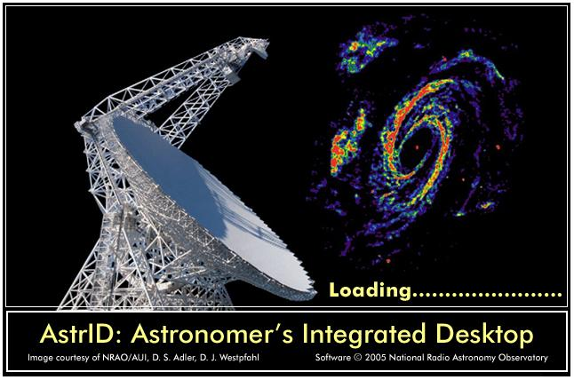
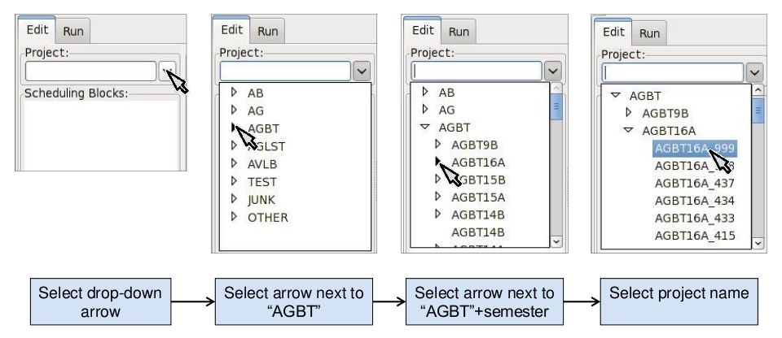

.. astrid::

Astronomer's Integrated Desktop (AstrID)
----------------------------------------

What is Astrid?
^^^^^^^^^^^^^^^

Astrid is the primary graphical interface and control workspace for the
Green Bank Telescope (GBT). It consolidates multiple applications into
a single environment for the creation, editing, execution, and monitoring
of scheduling blocks (SBs).

* **Core Functions**
    * Execute Scheduling Blocks (SBs) to control astronomical observations.
    * Monitor real-time GBT status.
    * Display live data streams from the GBT.
    * Edit SBs offline or online, with validation and save functions.
    * Allow secondary observers to monitor active sessions.

* **System Integration**
    * Interfaces directly with GBT Monitor & Control (M&C) software.
    * Interprets Python code in SBs to coordinate device-specific M&C programs
      and the Scan Coordinator.
    * Applications appear in tabbed windows within the Astrid GUI.

* **Applications**
    * Observation Management
        * Integrates with the Observing Management Application.
        * *Edit* Subtab: text editor with Python syntax highlighting, enables SB
          editing, validation, duplication, and saving.
        * *Run* Subtab: supports SB queuing and execution.
    * Data Display
        * Connects to the GBT Fits Monitor (GFM) for real-time processing of 
          pointing and focus scans.
        * Automatically updates M&C system with derived corrections.
        * Displays raw, uncalibrated continuum data as a funciton of time.
    * GBT Status
        * Provides real-time operational data, including:
            * Local Sidereal Time (LST) and UTC
            * Observer and project ID
            * Antenna position
            * Scan and IF configuration

How to start AstrID?
^^^^^^^^^^^^^^^^^^^^

Type ``astrid`` from the command line on any Linux computer in Green Bank. The first thing you will see is
the AstrID "splash screen". 

The AstrID GUI should appear on screen after 10-20s.

.. image:: images/AstridGUI.png

Astrid Modes 
''''''''''''

On startup AstrID will automatically ask what mode to operate in via a pop-up window. 

.. image:: images/AstridMode.jpg

You can reopen the selection window any time by clicking ``File`` :math:`\rightarrow`
``Real time mode...`` in the AstrID GUI.

.. important:: 

    You should use ``File`` :math:`\rightarrow` ``Real time mode...`` to relinquish 
    control  of the telescope immediately after your scheduled observing session.

You should select the most appropriate mode for your purpose:

* **Work offline**
    Primarily used to create, edit and validate SBs. It is alo the 
    preferred method to look at previously obtained data in the Data Display since online
    modes will continually refresh the display window with near-real time data.

* **Work online, but only monitor observations**
    May be used to view what is happening
    in the AstrID observing logs and Data Display for the current observations. You will
    not be able to submit SBs or affect observing in any manner.

* **Work online with control of the telescope**
    Use to perform observations with the
    GBT by allowing you to submit SBs. Log information and real-time data displays are
    also available in this mode.

    .. note:: 
    
        Working online requires the GBT operator to "put you in the gateway", i.e. give you security access.

.. _tab-astrid-mode-features:
.. list-table:: AstrID mode features
    :widths: 25, 15, 15, 15, 15, 15
    :header-rows: 1

    * - Mode
      - Edit & Validate Syntax 
      - Validate Configuration
      - Submit SBs
      - Observing Logs
      - Data Display
    * - **Offline**
      - :octicon:`check`
      - Simulated
      - :octicon:`x`
      - :octicon:`x`
      - Historical [#]_
    * - **Online** (monitor)
      - :octicon:`check`
      - Simulated
      - :octicon:`x`
      - :octicon:`check`
      - Real-time
    * - **Online** (control)
      - :octicon:`check`
      - Real [#]_
      - :octicon:`check` [#]_ 
      - :octicon:`check`
      - Real-time

.. rubric:: Table Footnotes

.. [#] Previously acquired data should always be viewed in ``offline`` mode.
.. [#] Requested configurations are validated with respect to the actual 
   ``dev_health.conf`` rather than the simulated "ideal" universal cabling file.
.. [#] Only permitted when you are "in the gateway", i.e. the GBT operator has 
   given you security access

AstrID GUI Composition
^^^^^^^^^^^^^^^^^^^^^^

The AstrID GUI layout consists of several components:

.. image:: images/AstridGUIcomposition.png

Resizing AstrID Display Areas
'''''''''''''''''''''''''''''

It is possible to resize some of the display areas within AstrID. If you hover the mouse
over the bar separating two display areas you will get a double-arrowed resize cursor. 
If you then hold down the left mouse button you can use the mouse to move the border and
resize the display areas.

Application
'''''''''''
This comprises the majority of the space within the AStrID GUI and shows the contents of
the Application selected by the application selection tabs.

Application Selection Tabs
''''''''''''''''''''''''''

The application selection tabs are located under the Drop-down menus and the Toolbar The
top level of tabs allow users to switch between the three main Astrid applications: 
* Observation Management, 
* Data Display
* GBT Status. 
 
Each application has its own set of subtabs.

Drop-Down Menus
'''''''''''''''

In the top, left hand side of the AstrID GUI you will find the drop-down menus. The 
contents of the drop-down menus change according to which Application is currently 
being displayed on the AstrID GUI. We will not discuss all of the options under the
drop-down menus in this document but we will provide some highlights.

* ``File``
    * ``New Window`` - Launch applications within the AstrID GUI or in an independent GUI.
    * ``Close Window`` - Close the currently displayed application in the AstrID GUI.
    * ``Real time mode...`` - Change between the :ref:`operational modes of AStrID <Astrid Modes>`.

* ``Edit`` - Standard "Windows" undo, redo, cut and paste options.

* ``View`` - Display or hide the Toolbar or view AstrID in Full Screen mode.

* ``Tools`` - Only active for the Data Display Application. You may use checkboxes to 
  select various tooltips such as *info*, *pan*, and *zoom*. You can also change the 
  "Heuristics"used during the reduction of pointing and focus observations by selecting
  ``Options...``.

* ``Help`` - Bring up documentation for some, but not all applications.

  .. note:: 
    
    The links in the documentation are outdated.
 

Toolbar
''''''''
The Toolbar is located just under the Drop-down Menus near the top of the AstrID GUI. The 
contents of the Toolbar change depending on which application is being displayed in the
AstrID GUI.  The Toolbar options are a subset of commonly used options from the Drop-down
Menus.  When you leave the mouse situated over one of the Toolbar buttons for a few seconds
a pop-up will appear that tells you what action the Toolbar button will invoke.

Logs
''''
The Log Window is located in the lower portion of the AstrID GUI underneath the Application
display area.  Clicking on the log tabs at the very bottom of the GUI will display log
information for the Observation Managament, Data Display, or GBT Status applications. 
Viewing a specific log will also change the application window to display the matching
application.

The contents of the Observation Management application Log may be saved to an external file 
via the ``Export Log`` button.  Note that closing or restarting AstrID will clear the
Observation Management Log.  If you wish to retrieve an unsaved observating log, please 
contact your GBT project friend.

Command Console
'''''''''''''''
The Command Console is a Python shell that imports the Configuration Tool and Balance APIs.
Both APIs will only interact with the Monitor & Control (M&C) systems if the user has been 
granted security access and is operating AstrID from the ``Work online with control of the telescope``
mode (see :ref:`Astrid Modes`).

State
'''''

There are three indications of state located in the upper right corner of the AstrID GUI.

* **Observation State** indicates AStrID's state.
    * ``Not Connected``: AstrID is not communicating with the M&C system (such as in its
      offline mode).
    * ``Idle``: AStrID is communicating with the M&C system and no SB is currently being
      executed 
    * ``SB Executing`` AStrID is communicating with the M&C system and an SB is running 
    * ``SB Paused``: AstrID is communicating with the M&C sstem and an SB has been paused 

* **GBT State** indicates the M&C system state.
    * ``Not In Service``: the M&C system is not working properly
    * ``Not Connected``: the M&C system is not working properly
    * ``Unknown``: the M&C system is working but does not know the state of any of the
      hardware devices
    * ``Ready``: the GBT is not doing anything
    * ``Activating`` or ``Committed``: the GBT is preparing to perform an observation
    * ``Running``: the GBT is taking data during a scan 
    * ``Stopping``: the scan is ending
    * ``Aborting``: the scan is ended for any abnormal reason

* **GBT Status** indicates the error state of the M&C system.
    * ``Unknown`` or ``Not Connected``: the \gls{MC} system is not communicating properly
      with the hardware
    * ``Clear``, ``Info`` or ``Notice``: there are no significant problems with the GBT
    * ``Warning``: it is worth asking the Operator what the problem is, but it may not
      affect observation quality.
    * ``Error``: there is potentially something wrong that may need attention
    * ``Fault`` or ``Fatal`` then something has definitely gone wrong with the observations

Queue Control Button
''''''''''''''''''''
The Queue Control Button is located between the Observation State Section and the
Observation Control Section on the right of the AstrID GUI. These buttons gives
you control of the SB queue.

* ``Halt Queue``: If this button is not activated then the SB in the Run queue will continue
  to be executed in order. If this button is activated it will finish the currently running
  SB but will not allow the next SB in the Run Queue to execute until the button is returned
  to its default off state.

Observation Control Button
''''''''''''''''''''''''''
The Observation Control Buttons are located in the lower-right of the AstrID GUI. These buttons
give you control of the GBT during the execution of an SB and have the following functions:

* ``Pause``: Pause the SB after the completion of the current sub-scan (if in progress).
* ``Stop``: Stop the current sub-scan (if in progress) and unterrupts current SB, offering 
  you a chance to exit the SB. This is a nice, gentle way to stop a scan.
* ``Abort``: Abort current sub-scan (if in progress) and interrupt current SB, offering you a 
  chance to exit the SB.  This may lead to corrupted data.
* ``Interactive``: When selected, will cause AstrID to automatically answer any pop--up query.
  AstrID will always choose what it deems to be the safest answer.  This is useful when you have
  to leave the  control for an extended period of time (such as when you go to the cafeteria to
  eat, etc.). 

Observation Management Tab
^^^^^^^^^^^^^^^^^^^^^^^^^^

The Observation Management Application consists of two sub-GUIS: the Edit Subtab and the Run Subtab.
In the Edit Subtab you can create, load, save, and edit SBs.  You can also validate that the syntax
is correct. The Run Subtab is where you will execute GBT observations.

The Edit Subtab
'''''''''''''''

The Edit Subtab has five major areas: a list of Project Names, SBs that have been saved into the
AstrID database for that project, an editor, a validation area, and a log summarizing the observations.

.. image:: images/AstridEditSubtab.jpg

.. todo:: Add reference to contents and creation of SBs here.

Project Name and List of SBs
""""""""""""""""""""""""""""

To access scheduling blocks associated with your project, you will need to enter your
Project Name in the ``Project`` window located in the upper left part if the Edit Subtab.
Your Project Name is the code that your GBT proposal was given with the prefix ``AGBT``,
e.g., ``AGBT16A_001``. To enter a Project Name you may either type it in directly, or use
the drop-down arrows to navigate to your project through a project hierarchy as shown here:

After doing this you will see in the window labeled ``Scheduling Blocks`` a list of SBs, 
if any, that have been previously saved into the AstrID database. If an SB has been validated
(i.e. it is syntactically correct) then it will appear in bold-face type. This means that it
can be executed. If a script has been saved but is syntactically incorrect it will appear in
lighter-faced type and cannot be executed.

Editor
""""""

You can use the Editor to create or modify an SB within AstrID. Standard Windows functions
like Ctrl-X (to cut selected text), Ctrl-C (to copy selected text), and Crtl-V (to paste 
selected text) can be used within the editor. The editor lists the line number on the left
hand side of the window and marks Python code as follows:

* **Green highlighted text** - Commented characters
* **Black highlighted text** - Standard Python commands/syntax
* **Purple highlighted text** - Strings
* **Magenta highlighted text** - Triple quoted strings (used in Python to enclose 
  strings that span multiple lines)
* **Dark blue highlighted text** - Python functions
* :math:`\boldsymbol{\ominus}`, :math:`\boldsymbol{\oplus}` - Marks the start of an 
  indented block of Python code such as an ``if`` statement or ``for`` loop.  Clicking
  on :math:`\ominus` will collapse the indented code block and change the symbol to 
  :math:`\oplus`.  Likewise, clicking on :math:`\oplus` will expand a previously
  collapsed code block.

The editor also has four operational buttons:

* ``Save to Database`` - This button will check the validation of the current SB and then
  save it to the AstrID database.  A pop-up window will notify you if the SB did not pass
  validation.  A second pop-up window will allow you to set the name that the SB will be
  saved under in the AstrID database.

* ``Delete from Database`` - This button will delete the currently selected SB from the
  AstrID database.
   
* ``Import from File`` - This button will allow you to load an SB from a file on disk.
    
* ``Export to File`` - This button will allow you to save the edited SB displayed in the
  editor to a file on a disk. This does not save the SB into the AstrID database.

The first time you select either of the ``Import from File`` or ``Export to File`` buttons
you will have a pop-up window that lets you select the default directory to use. After 
selecting the default directory you will get a second pop-up window that shows the contents
of the default directory so that you can select or set the disk file name to load from or
export to.

Adding and Editing SBs in the Database
""""""""""""""""""""""""""""""""""""""

* **Saving a Scheduling Block to the Database**
    If you have already created an SB outside of AstrID, you should go to the Edit Subtab in
    AstrID and then use the ``Import from File`` button to load your SB into the Editor. 
    Alternatively you can just create your SB in the Editor. To save the SB into the AstrID
    database you just need to hit the ``Save to Database`` button. This will trigger a 
    validation check on your SB and then a pop-up window will appear which allows you to 
    specify the name which you would like to use in the list for your SB.

* **Selecting a Scheduling Block** 
    If you perform a single click on any SB in the Scheduling Block list, the contents of
    the selected SB will appear in the Editor. The selected SB will be highlighted with a 
    blue background.

* **Mouse-button Actions on the selected Scheduling Block**
    If you perform a right mouse button click on the selected SB a pop-up window will appear
    that will let you rename, create a copy or save the SB to the AstrID database. You can
    also delete the SB from the AstrID database. You may also rename the SB if you perform
    a left mouse button double click on the script name in the list.

Validator
"""""""""

The validation area is where you can check that the currently selected SB is syntactically
correct.  This does not check for run-time errors and thus, does not guarantee that the script
will do exactly what you want it to do. For example, it cannot check that you have the correct 
coordinates for your source. You will also see error messages, notices and warnings from the
validation in this area.

The validator will attempt to verify that you are using a legal configuration. When run in 
AstrID's offline mode, the validator can only compare your requested configuration with a 
simulated "ideal" model of the telescope hardware. To perform a full configuration check 
against the true hardware state of the telescope (modelled by the ``dev_health.conf`` file),
you must be running AstrID from the ``Work online with control of the telescope`` mode.

Before an SB can be run within AstrID it first must pass validation. To validate a script without
saving it you can just hit the ``Validate`` button. An SB automatically undergoes a validation 
check when you hit the ``Save to Database`` button in the editor.  Any messages, etc. from the
validation will appear in the "Validation Output" test area. You can export these messages to a 
file on disk by hitting the ``Export`` button in the validation area.

The state of an SB's validation is shown by the stop-light left of the ``Validate`` button.
If the script has never been validated or has been changed since the last validation the 
stop-light will have the yellow light on. If the SB fails validation the stop-light will 
turn red, while it will turn green if the SB passes validation.

.. note::

    ``for``-loops with many repeats can take an extended amount of time to validate since 
    the Validator will go through each step in the loop. Also be careful of infinite loops 
    in the validation process.  Use of time functions such as :func:`Now() <astrid_commands.Now>`
    always return ``None`` in the validation.

The Observing Log
""""""""""""""""
The observing log is always visible at the bottom of the Observation Management Tab. It shows 
information from the execution of SBs in either of the AstrID online modes. The observing log
can be saved to a disk file by hitting the ``Export`` button that is just above the top right
corner of the log display area.  Note that closing AstrID will clear the observing log. If you 
wish to retrieve unsaved observing log information, please contact your GBT project friend.

The Run Subtab
''''''''''''''

In the Run Subtab you can queue up SBs to perform the various observations that you desire to
make. The Run Subtab has five components. Across the top of the Run Subtab you enter information
that will be put into the headers associated with the observations. On the left is a list of SBs
that you can execute. On the right are the "Run Queue" which holds SBs that are to be executed 
in the future, and the "Session History" which shows which SBs have previously been executed.  
At the bottom is the "Observing Log".

.. image:: images/AstridRunSubtab.jpg

Header Information Area
"""""""""""""""""""""""

The following fields must have entries before an SB can be executed:

* **Project**: 
    Just as in the Edit Subtab you use the drop-down menu to select your Project Name.
    If your project is not listed, ask your GBT project friend or the telescope Operator to add it
    to the database.

* **Session**: 
    A session is a contiguous amount of time (a block of time) for which the project
    is scheduled to be on the telescope. Each time a project begins observing for a new block of
    time it should have a new session number. The session number is usually determined by AstrID
    and automatically entered. However, there are cases (such as AstrID crashing) where the session
    number could become incorrect. You can type in the correct session number if needed.
 
    .. note:: 

        A "session" in AstrID is equivalent to an "observing period" in the lingo of the DSS.
        The word "Session" has a different meaning in the DSS.

* **Observer's Name**:
    This is a drop-down list where you choose the observer's name.  Only the PI on a project are 
    guaranteed to have their name in this list. If your name is not listed, ask your GBT project
    friend or the telescope operator to add it.
    
* **Operator's Name**: 
    This is a drop-down list from which you pick the current operator's name at the beginning of 
    your observations.

Submitting an SB to the Run Queue
"""""""""""""""""""""""""""""""""

In order to execute an SB you must:

#. Be in the ``Work online with control of the telescope`` mode.
#. Be in the gateway (contact the operator).
#. Select the Observation Management Tab. 
#. Select the Run Subtab.  
#. Make sure that the header information fields all have entries.  
#. Select the SB you wish to execute from the list of available SBs.  
#. Hit the ``Submit`` button below the list of SBs.

Your SB is then automatically then sent to the Run Queue.  

.. note::

    Double-clicking on an SB is the same as selecting the SB and then hitting 
    the ``Submit`` button. 

The Run Queue and Session History
"""""""""""""""""""""""""""""""""

When an SB is submitted for execution it is first sent to the Run Queue. This
contains a list of submitted SBs that will be sequentially executed in the future.

When an SB begins execution it is moved to the Session History list.  So the Session
History list contains the currently executing SB on the first line and all previously 
executed SBs that have been run while the current instance of AstrID has been running
on subsequent lines.

If there are not any SB in the Run Queue when a new SB is submitted for execution it
may appear that the SB just shows up in the Session History. However it has indeed 
gone through the Run Queue - albeit very quickly.

The Observing Log
"""""""""""""""""

The observing log is always visible at the bottom of the Observation Management Tab. 
It shows information from the execution of SBs.  The observing log can be saved to a
disk file by hitting the ``Export`` button that is just above the top right corner of
the log display area.  Note that closing AstrID will clear the observing log. If you 
wish to retrieve unsaved observing log information, please contact your GBT project
friend.

Data Display Tab
^^^^^^^^^^^^^^^^

The Data Display Tab provides a real time display of your GBT data so that you can
check that you are getting valid data. The Data Display is actually running an 
application called GBT Fits Monitor (GFM). This application provides scan-based 
display and analysis of GBT data, either in real-time as the data is being collected,
or in an offline mode where it can be used to simply step through the scans from an
observation. You are encouraged to run GFM offline for reanalyzing data during 
observations. A separate GFM application can be launched from the Linux prompt via 
the ``gfm`` command or AstrID could be switched to offline-mode.

Working Online
''''''''''''''

If you are using either of AstrID's ``online`` modes (see :ref:`Astrid Modes`) and have
selected the ``DataDisplay`` tab, then the data display will update as new data are 
obtained. Continuum and Spectral Line data are only updated when these displays are
being viewed. 

.. important:: 

    Pointing and Focus data are always automatically updated whether or not their 
    displays are being shown or not.  Due to this feature, clicking on previous 
    observations while Pointing and Focus scans are in progress can confuse GFM 
    and should be avoided. 
    
The list of scans will always automatically update.

Working Offline
'''''''''''''''

You can look at data that have already been taken with the GBT by running AstrID in 
``offline`` mode. To view data in this mode you need to follow these steps:

#. Change the AstrID mode to ``offline`` (see :ref:`Astrid Modes`).
#. Select the DataDisplay tab in AstrID
#. Select ``File`` :math:`\rightarrow` ``Open`` from the drop-down menu or click the 
   |icon-open| icon in the toolbar.
#. Select a project ID from the list of project directories in ``/home/gbtdata/``.
#. Double-click ``ScanLog.fits`` file to access the data.

   .. note:: 

    It may take several seconds to a few minutes to access all of your scans depending on
    the amount of data to load. The process is complete when you see a list of scans displayed
    sequentially on the left hand side of the GFM display.

#. Click on a scan in the scan list window to process it.

Pointing and Focus Data Display
'''''''''''''''''''''''''''''''

Pointing scans (from :func:`Peak() <astrid_commands.Peak>`, :func:`AutoPeak() <astrid_commands.AutoPeak>`
and :func:`AutoPeakFocus() <astrid_commands.AutoPeakFocus>`) will appear under the Pointing Tab.
If working ``online``, the data display will automatically process the pointing scans. 

.. note:: 

    Clicking on previous scans while Pointing and Focus scans are in progress may interfere with 
    automatic processing.
   
It will calibrate the data, remove a baseline and fit a Gaussian to the data. After the two 
azimuth scans (cross-elevation, i.e. :math:`{\text{Az}} \times \cos{({\text{Dec}})}`) it will
then automatically update the GBT M&C system with the new azimuth pointing offset values that
it determined. It will then automatically update the elevation pointing offset after the two
elevation scans, unless certain criteria are not met (see :ref:`Fitting Acceptance Options`).
Here is a sample of the Data Display Application after a pointing 

The measured FWHM width (``Wid``) is shown in arcminutes. The fitted center of the Gaussian (``Ctr``) 
is pointing offset in arcmin. The measured height of the Gaussian (``Hgt``) is in units of the 
calibrated temperature scale or raw counts (as given by the y-axis label).

The focus scan data will appear under the Focus Tab.

Again, in ``online`` mode the data will be processed automatically. They will be calibrated, have
a baseline removed and a Gaussian will be fit to the data. The focus offset will automatically
be sent to the M&C system.

The details of pointing and focus observations are described in XXX

.. todo:: Add reference to section 5.4.1. in GBTog.

Fitting Acceptance Options
""""""""""""""""""""""""""

GFM has several levels of determining whether or not the pointing and focus solutions will be 
updated in the M&C system. The expected FWHM of the Gaussian fitted to the observed pointing
data as the GBT slews across the source should be :math:`\sim748/\nu_{\text{GHz}}` arcsec, 
where :math:`\nu_{\text{GHz}}` is the observing frequency in GHz.

For a focus scan the resulting data should approximate a Gaussian with a FWHM of
:math:`1080 \nu_{\text{GHz}}`, in mm. The default behavior for observations below 27 GHz is 
to assume that a pointing fit is bad if the FWHM differ from the expected value by more than
30\% or if the pointing correction is more than twice the FWHM in magnitude; for observations
above 27 GHz, the fit is bad if the FWHM differ from the expected value by more than 50% or 
if the pointing correction is more than three times the FWHM in magnitude. The default for a
bad focus scan is if the FWHM is more than 30% from the expected value. 

You may change fitting acceptance criteria by: 

#. Select the Pointing or Focus Subtab in the DataDisplay tab.
#. Select ``Tools`` :math:`\rightarrow` ``Options...`` from the drop-down menu.
#. Select the new mode in the ``Fitting Acceptance Criteria`` tab of the pop-up window.

   .. note:: 
    
        This Option must be set independently for both Pointing and Focus **before** each 
        type of observation in order to take effect.

The GFM recognizes the fitting acceptance criteria shown below only when AstrID is in one of 
its online modes. 

The default setting is to ``Automatically accept good fits, automatically reject bad fits``.
You may also choose to never apply corrections or interactively accept bad and/or good fits. 
There is also an option to ``Accept all automatically`` which can be very dangerous and should
only be used by experts.

Data Processing Options
"""""""""""""""""""""""

You may change the data processing strategy, beams, and/or polarizations used by GFM in reducing
pointing or focus scans.  This is not needed typically since the software picks the proper default
settings under normal conditions.  However, for example, if the X polarization channel is faulty
for some reason, one can use the Y channel instead. This can be done by:

#. Select the Pointing or Focus Subtab in the DataDisplay tab.
#. Select ``Tools`` :math:`\rightarrow` ``Options...`` from the drop-down menu.
#. Make new data processing selections in the ``Data Processing`` Tab of the pop--up window 
   
   .. image:: images/Astrid_dataProcessing.jpg

   .. note:: 

    Options must be set independently for both Pointing and Focus **before** each type of
    observation in order to take effect.

Heuristics Options
""""""""""""""""""

Heuristics is a generic term used at the GBT to quantify the "goodness of fit" of the pointing and
focus data reduction solutions. Based on the known properties of the GBT, parts of the solution, 
such as the beamwidth in pointing data, should have certain values within measurement errors. The
Heuristics define how large these errors can be. You may change the Heuristics by:

#. Select the Pointing or Focus Subtab in the DataDisplay tab.
#. Select ``Tools`` :math:`\rightarrow` ``Options...`` from the drop-down menu.
#. Select the new mode in the Heuristics tab of the pop-up window 
   
   .. image:: images/Astrid_heuristicsOptions.png

   .. note:: 

    Options must be set independently for both Pointing and Focus **before** each type of observation
    in order to take effect.

The GFM allows you to switch between ``default``, ``standard``, ``relaxed``, and ``user-defined``
heuristics. The meaning of ``standard`` and ``relaxed`` heuristic values are predefined and cannot 
be changed by you.  The ``standard`` heuristic expects that the fitted Gaussians have a FWHM within
30% of the expected values and that the pointing solution is within twice the FWHM of the nominal
location of the source. For the ``relaxed`` heuristics this becomes within 50% of the expected FWHM
of the Gaussian fits and three times the FWHM for the pointing correction.  

The ``default`` option is the software default, and at low frequency (<27 GHz) it is equivalent to 
``standard`` heurisitics, while at high frequency (>27 GHz) the ``default`` mode corresponds to
``relaxed`` heursitics.  Under normal observing conditions, you should expect to use the ``default``
values.  Under marginal weather conditions ``relaxed`` heuristics may be appropriate even at low 
frequencies (below 27 GHz).  The ``user-defined`` heuristic values should only be used by experts.
If you wish to use ``user-defined`` heuristics then you should contact your GBT project friend.

Sending Corrections
"""""""""""""""""""

For most observations, GFM processing produces good fits, and the solutions are automatically sent
to the telescope using the default settings.  However, at high frequencies (especially for W-Band
and Argus), fits may fail, and you may want to manually send the corrections to the telescope. You 
may tell the operator to enter a solution, or you can send the corrections yourself using the 
Send Corrections functionality.

.. note:: 

    Corrections show up instantly within the CLEO status window (see XXX), but do not take effect
    until the start of the next scan.

This can be done by:

#. Select the Pointing or Focus Subtab in the DataDisplay tab.
#. Select ``Tools`` :math:`\rightarrow` ``Options...`` from the drop-down menu.
#. Select the ``Send Corrections`` Tab in the pop-up window (if not visible use the arrow button on 
   the right, the ``Send Corrections`` tab is farthest to the right)

   .. image:: images/Astrid_sendCorrections.jpg

#. Enter the corrections in the text box, and click ``Send`` to send the solutions to the telescope.
  

OOF Data Display
''''''''''''''''

Out-of-focus holography (OOF) is a technique for measuring large-scale errors in the shape of the
reflecting surface by mapping a strong point source both in and out of focus. The procedure derives 
surface corrections which can be sent to the active surface controller to correct surface errors. 
The procedure is only recommended for observing at frequencies of 40 GHz and higher.

The :func:`AutoOOF() <astrid_commands.AutoOOF>` procedure will obtain three OTF maps, each taken at
a different focus position. Processing will begin automatically upon completion of the third map,
the status of which can be viewed in the progress bar under ``AutoOOF Processing Status`` on the 
right-hand-side of the screen. Once complete, the result will be displayed in the OOF subtab of the
AstrID DataDisplay. 

Once processing is complete, the default solution displayed in AstrID is the fifth-order Zernike fit
(z5). The most aggressive fit is z6, while z3 is less aggressive. Solutions may be selected and viewed
via the radio buttons in the upper-right section of the screen. Derived Local Pointing Corrections
(LPCs) in arcminutes, and Local Focus Corrections (LFCy) in millimeters are displayed to the right 
of each radio button. Raw AutoOOF data at each focus position can be viewed as a timestream and map 
by selecting the ``raw data`` radio button.  The ``fitted beam map`` radio button will display fitted
beam map images and reduced :math:`\chi^{2}` values for the three highest orders of Zernike fits
(z3, z4, and z5 by default).

Solutions must be chosen by the observer and manually sent to the active surface. Therefore, it is 
essential that the Zernike fits and raw AutoOOF data are examined carefully before deciding upon a
solution. Steps for validating and discerning appropriate solutions can be found in XXX.

.. todo:: 

   Add reference to GBTog 6.2

Continuum Data Display
''''''''''''''''''''''

Continuum data taken with the GBT that are not part of pointing and focus scans will show up in plots 
under the Continuum Tab. This will show the uncalibrated continuum data as a function of time only.

Spectral Data Display
'''''''''''''''''''''

The Spectral Line Display was a tool originally designed for browsing the previous GBT Spectrometer 
spectral line data.  

When viewing data online, the most recent integration is plotted automatically. Individual integrations 
may be selected and viewed offline. Here is an example of the spectral line data display. 

The spectra displayed are raw data and no calibration has been applied to them. As spectra are plotted,
information about each plot is printed in the console window. Each line is color coded to match the
color of that spectrum in the plotting window. In addition, some of the information for the very first 
spectra are used to annotate the plot. The plot title is parsed as ``project_name:scan_number:integration_number``.
For offline usage, the desired integration can be selected either using the up/down arrows, or by typing
in a value in the edit box.

All user interaction for this plugin occurs in the right-hand side options panel. The check boxes allow
selection of spectra to plot via astronomical variables: Beams, Polarizations, IF numbers, and Phases.
The options panel also includes three buttons and a radio box for plot viewing. The ``Views`` radio box
offers options for plotting the bandpass vs. Channels or Sky Frequency. The ``Keep Zoom`` toggle button
will maintain the current zoom, even as new spectra are plotted. Using the unzoom command (mouse 
right-click, or via the toolbar) will return the plot to its original scale. The ``Overlay`` toggle 
button can be used to overplot spectra from different integrations or scans. Finally, the ``Clear`` 
button erases the plot.

Data Display Plotting Panel Toolbar
'''''''''''''''''''''''''''''''''''

The plotting panel toolbar allows user interactions with plots in the display window and is located near
the top of the Astrid Screen. The following features are available:

.. list-table:: 
    :widths: 10, 10, 80
    :header-rows: 0

    * - .. image:: images/DTopen.jpg
      - **Open**
      - Allows the user to open a previously saved session.  This has the same functionality as ``File``
        :math:`\rightarrow` ``Open...`` described in :ref:`Working Offline`.
    * - .. image:: images/DTsave.jpg
      - **Save** 
      - Allows the user to save output from the data display log as a text file.
    * - .. image:: images/DTprint.jpg
      - **Print** 
      - **DO NOT USE**, Please use the ``Export`` function instead.
    * - .. image:: images/DTexport.jpg
      - **Export**
      - Allows the user to save the figure displayed in the plotting panel to a file.  The name must 
        have an extension of either .png, .ps or .eps.
    * - .. image:: images/DTunfreeze.jpg
      - **Unfreeze**
      - Not applicable to Astrid general use. Unfreezes the processing of commands via the command line
        and intended for use in conjunction with the ``Freeze`` command.
    * - .. image:: images/DTundo.jpg
      - **Undo**
      - Undoes your last command.
    * - .. image:: images/DTredo.jpg
      - **Redo**
      - Redoes your last command.
    * - .. image:: images/DTunzoom.jpg
      - **Unzoom**
      - Undoes a previously executed zoom.
    * - .. image:: images/DTrezoom.jpg
      - **Rezoom**
      - Redoes a previously executed zoom.
    * - .. image:: images/DTinfo.jpg
      - **Info Tool**
      - Selecting the info tool allows the user to use the mouse pointer to focus in/out among the 
        available subplots (e.g., peak scans). Left-clicking the mouse brings a subplot into focus
        (hiding the other subplots). Right-clicking the mouse on the focused plot will show all 
        subplots. If there is only one subplot, the info tool simply displays the mouse xy 
        coordinates.
    * - .. image:: images/DTzoom.jpg
      - **Zoom Tool**
      - Selecting the zoom tool allows the user to use the mouse pointer for zooming in on a 
        particular area of the plot. Left-clicking the mouse will zoom in. Right-clicking the 
        mouse will zoom out.
    * - .. image:: images/DTpan.jpg
      - **Pan Tool**
      - Allows the user to use the mouse pointer to pan around the selected subplot. Left-clicking
        the mouse and holding the left button down will pan around the subplot. Right-clicking 
        restores the original view.
    * - .. image:: images/DTgrid.jpg
      - **Grid Tool**
      - Turns on the plot grid.
    * - .. image:: images/DTplotedit.jpg
      - **Plot Edit Tool**
      - Allows you to edit plot labels, colors, and title. Clicking on "Advanced Options" brings up
        an additional dialog which contains options for transparency, legend placement, and ordering
        of plots. Colors may be entered as hex codes or selected by clicking on the colored button 
        to the right of the text field. Plots can only be reordered within their subplot - i.e., Y1
        lines will always be below Y2 lines. Legend location can be specified with simple strings 
        (e.g., "upper right") or coordinates 0-1 along the plot edges. If a string is chosen it will
        be used in place of any coordinates.
    * - .. image:: images/DTusermanual.jpg
      - **User Manual**
      - Displays the Data Extraction and Analysis Program (DEAP) user manual.

.. todo:: Transfer DEAP user manual to GBTdocs.

Use of Plotting Capabilities
''''''''''''''''''''''''''''

A User Manual is available http://deap.sourceforge.net/help/index.html that describes all the plotting
functionality available in GFM. There is also a plotting Tutorial that illustrates the plotting 
capabilities by example which is available at http://deap.sourceforge.net/tutorial/index.html.

.. todo:: Transfer the guide and tutorial to GBTdocs.

GbtStatus Tab
^^^^^^^^^^^^^

The GbtStatus Tab displays various GBT specific parameters, sampled values and computed
values. Special care was taken to promote its use for remote observing. An Example of
how the GBT Status Display appears in AstrID is shown in Figure~\ref{fig:astridstatusone} and~\ref{fig:astridstatustwo}.

.. _astrid_gbtstatus1:

    The top portion of the AstrID GbtStatus Tab. To see the rest of the status screen you
    will need to use the scroll bar.

.. _astrid_gbtstatus2:

    The bottom portion of the AstrID GbtStatus Tab. To see the rest of the status screen 
    you will need to use the scroll bar.

General Status
''''''''''''''

.. list-table:: 
    :header-rows: 0
    :widths: 20 80

    * - Observer
      - The observer name
    * - Project ID
      - The data directory of the FITS files. This is your Project Name with the session as a suffix.  
        For example, the Project ID for session 02 of AGBT16A_001 would be ``AGBT16A_001_02``
        
        .. todo:: Add reference to GBT-OG 3.4.1.1.
        
    * - Status
      - The status of the GBT.  
        
        .. todo:: Add reference to GBT-OG 3.3.8

    * - LST
      - The Local Sideral Time of the last update
    * - Last Update
      - The local time when the database was last updated
    * - UTC Date
      - The Coordinated Universal Time date of the last update 
    * - UTC Time
      - The Coordinated Universal Time time of the last update
    * - MJD
      - The Modified Julian Date of the last update

Telescope Status
''''''''''''''''

.. list-table:: 
    :header-rows: 0
    :widths: 20 80

    * - Az commanded
      - The commanded azimuth position of the telescope in degrees.
    * - Az actual
      -  The actual azimuth position of the telescope in degrees.
    * - Az error
      - The difference between the commanded and the actual azimuth 
        position of the telescope in arc-seconds. This value does not
        contain a :math:`\cos\left({\text{el}}\right)` correction
    * - El commanded
      - The commanded elevation position of the telescope in degrees.
    * - El actual
      - The actual elevation position of the telescope in degrees.
    * - El error
      - The difference between the commanded and the actual elevation
        position of the telescope in arc-seconds.
    * - Coordinate Mode
      - The coordinate mode used to represent a particular location 
        on the sky.
        
        .. todo:: Add reference to GBT-OG Section location_objects

    * - Major and Minor Coord
      - The telescope position in the current Coordinate Mode.
    * - Major and Minor Cmd Coord
      - The telescope position in the current commanded Coordinate Mode.
    * - Antenna State
      - * ``Disconnected`` - antenna software is not running
        * ``Dormant`` - antenna software is running but with its control of
          the antenna turned off 
        * ``Stopped``- antenna is not moving
        * ``Guiding``- antenna is moving and data are being taken
        * ``Tracking``- data are not being taken
        * ``Slewing`` - antenna is moving to a new commanded position
    * - LPCs Az/XEl/El
      - The Local Pointing Correction (LPC) offsets in arc-seconds.
    * - DC Az/XEl/El
      - The DC values in arc-seconds. The GBT has temperature sensors 
        attached at various points on the backup structure and the 
        feed-arm.  These are used in a dynamic model for how the GBT
        flexes with changing temperatures. This model is used to correct
        for pointing and focus changes that occur from this flexing.
    * - LFCs (XYZ mm)
      - The Local Focus Correction (LFC) for the offset focus position
        in millimeters.  This value is determined from a Focus observation
        
        .. todo:: Add reference to GBT-OG chap:scripts

    * - LFCs (XYZ deg)
      - The subreflector tilt offset in degrees.
    * - DC Focus Y (mm)
      - The DC Y subreflector offset in millimeters.
    * - AS FEM Model
      - The  state of the Finite-Element Model (FEM) correction for the 
        Active Surface (AS). The FEM predicts how the surface changes due
        to gravitional flexure versus the elevation angle.
    * - AS Zernike Model
      - The  state of the AS Zernike model correction model. The Zernike
        model is a set of Zernike polynomial coefficients determined from
        Out-Of-Focus (OOF) holography that improve the shape of the AS
        versus the elevation angle.
    * - AS Zernike Thrm Model
      - The  state of the FEM correction for the AS. The FEM predicts how
        the surface changes due to thermal flexure.
    * - AS Offsets
      - The  state of the AS zero offsets. The zero offsets are the default 
        positions for the AS.  This should always be ``On`` if the AS is 
        being used.
    * - Quad. det. rms
      - The quadrant detector is used to detect and correct for wind-induced
        pointing errors.  rms values in arc-seconds are reported in elevation
        and cross-elevation.  Total rms is also given as a fraction of the beam.

Scan and Source Status
''''''''''''''''''''''

.. list-table:: 
    :header-rows: 0
    :widths: 20 80

    * - Scan
      - A scan is a command within an SB used to collect observational data.
        The field here is derived from the scan number and ``PROCNAME``, 
        ``PROCSIZE and ``PROCSEQN`` keywords from the GO FITS file. 
    * - Duration
      - The scan length in seconds.
    * - Scan Start Time
      - If scan has started it is the UTC scan start time - if the scan has 
        not started, then it is the countdown until the start of scan. 
    * - On Source
      - ``Yes`` or displays a countdown until the antenna is on source.
    * - Remaining
      - The time remaining in the scan.
    * - Source
      - The source name.
    * - Vel  Def
      - The velocity definition specifies which mathematical equation is used
        to convert between frequency and velocity. 
        
        .. todo:: Add reference to Explanation section (TBW) 

    * - Vel Frame
      - The velocity frame or inertial reference frame.  
        
        .. todo:: Add reference to GBT-OG \dq{vframe} keyword in sec:keywords. 

    * - Source Vel
      - The source velocity (km :math:`{\text{s}}^{-1}`).
    * - Time To Set
      - The time till the current source sets. 

Configuration Status
''''''''''''''''''''

.. list-table:: 
    :header-rows: 0
    :widths: 20 80

    * - Receiver
      - The receiver being used.
    * - Polarity
      - The receiver polarity.
    * - Cal State
      - ``ON`` if the noise diode is firing during the scan 
    * - Sw Period
      - The period in seconds over which the full switching cycle occurs. 
        This is determined by the user in their configuration 
        
        .. todo:: Add reference to GBT-OG sec:config
        
    * - Obs Freq
      - The observed spectral line frequency in the local frame (MHz).
    * - Rest Freq
      - The spectral line frequency in the rest frame (MHz).
    * - Center Freq
      - The center IF frequency set by the LO in MHz. 
        
        .. todo:: Add reference to GBT-OG appendix:spectralwindows for further details

    * - Frequency State
      - The switching type.  Either "total power" or "frequency-switching".

Weather Status
''''''''''''''

A real--time readout from one of the \gls{GBT} weather stations providing information
on temperature, pressure, humidity, dew point, wind direction and velocity. In addition,
the pyrgeometer measures the net near-IR irradiance of the sky to give an approximate 
indication of cloud cover.

.. note:: The pyrgeometer is currently not active.

Time Delay Status
'''''''''''''''''

.. list-table:: 
    :header-rows: 0
    :widths: 20 80

    * - RT phase delay
      - This is the time delay between the timing center in the GBT 
        equipment room and the GBT receiver room, in picoseconds,
        modulo 2000 ps.  It is measured by comparing the phase of the
        500 MHz reference signal sent to the receiver room with a copy 
        of the signal returned to the  timing center.
    * - Site1Hz-GPS dt
      - Time difference between the Site1Hz (a one pulse per second 
        signal that is locked to the hydrogen maser time standard) and 
        a pulse from the GPS receiver.
    * - GPS-GBT_VLBA dt
      - Time difference between the GPS receiver and the VLBA backend 
        timing module.
    * - Site1Hz-GBTRtn dt
      - Time delay between the Site 1Hz and a copy of the 1 Hz returned
        from GBT receiver room.  It is twice the delay of the fiber cables.
        The value is about 28933 ns which means the time delay between the
        equipment room the the receiver room is about 14466 ns.

VEGAS Status
''''''''''''

.. list-table:: 
    :header-rows: 0
    :widths: 20 80

    * - VEGAS
      - The VEGAS Bank (spectrometer with letter designation A 
        :math:`\rightarrow` H) selected in the scan coordinator.
    * - Power Levels
      - The power levels at the inputs to the VEGAS ADC cards. There
        are two ADCs per bank, one for each polarization. The VEGAS
        balance API sets these values to approximately -20dBm by default.
    * - Mode Name
      - Each VEGAS Bank can be configured in one of 29 Spectral Modes or
        1 of 24 Pulsar Modes.

        .. todo:: Add reference to VEGAS spectral mode table and VPM table.

    * - FilterBW
      - The bandwidth (MHz) of the digital filter implemented in the 
        FPGA.
      
        .. note:: 
            
            These values do not correspond to the bandwidths listed in 
            Table XXX.
            
            .. todo:: Add reference to VEGAS spectral mode table.

    * - Noise
      - The state of the noise source which can be either ``On`` or ``Off``.
    * - Polarization
      - Users may specify which spectral product to record (See the ``vegas.vpol``
        keyword in XYZ). 
        
        * ``vegas.vpol="self"`` records "Total Intensity" products
        * ``vegas.vpol="cross"`` records "Full Stokes" parameters
        * ``vegas.vpol="self1"`` records the polarization inputs from the first ADC only
        * ``vegas.vpol="self2"`` records the polarization inputs from the second ADC only.        

        .. todo:: Add reference to vegas.vpol keyword       

    * - Subbands
      - Each VEGAS bank can select between single (subbands=1) and multiple
        (subbands=8) spectral windows when using VEGAS modes with a 23.44 MHz bandwidth.  
    * - IntTime
      - The VEGAS integration (dump) time in seconds.
    * - Switching
      - Determines whether switching is controlled by VEGAS ("Internal")
        or another source ("External").

IF Status
'''''''''

The IF path in use is always displayed in the last section of the GBT status screen.
An example screen is shown in Figure :ref:`astrid_gbtstatus2`; the content displayed
depends on the exact configuration. In this example, each line represents the IF path
for a single polarization path from the IF rack to the backend.  Each line contains
only the devices in use for the listed path. A path may include a subset of the
devices and values listed below.

.. list-table:: 
    :header-rows: 0
    :widths: 20 80

    * - IF#
      - The # displayed is the number corresponding to the IF rack switch in use.
        The value displayed is the RF power in Volts detected by the IF rack. 
    * - CM#
      - The # displayed is the number corresponding to the Converter Module in use. 
        The value displayed is the RF power in Volts coming out of the Converter
        Module after the LO2 and LO3 mixers and before the Converter Module filters. 
    * - CF#
      - The # displayed is the number corresponding to the Analog Filter in use. 
        The value displayed is the RF power in Volts coming out of the AF rack
        after all filters have been applied (used with 100 MHz converters).
    * - SG#
      - The # displayed is the number corresponding to the Analog Filter in use.
        The value displayed is the RF power in Volts coming out of the AF rack
        after all filters have been applied (used with 1.6 GHz samplers).
    * - VEGAS-J#
      - The # displayed is the number corresponding to the port of VEGAS0 in use.
        The value displayed is the power level in dBFS. For best performance, it 
        should be approximately -20 dBFS.
    * - Radar-Port#
      - The # displayed is the number corresponding to the port of the Radar in 
        use.
    * - DCR:A_#
      - The # displayed is the bank and number corresponding to the port of the 
        DCR in use. The value displayed is the total power in raw counts. 
    * - TSys#
      - The # displayed is the number corresponding DCR port in use. The value
        displayed is the system temperature as reported by the DCR (should be
        considered a loose approximation).
    * - backendIF
      - The value displayed is the frequency of the Doppler track rest frequency
        as seen by the backend, in GHz.

