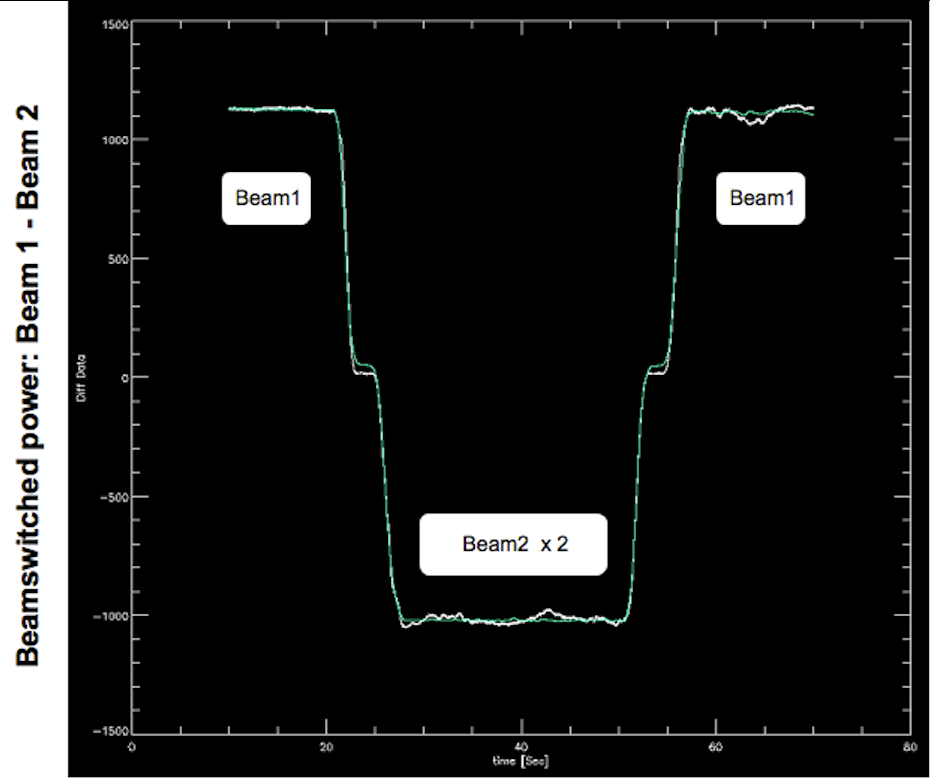
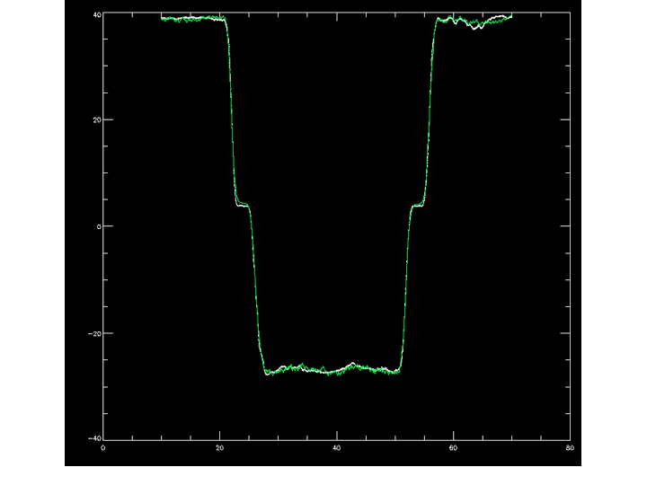
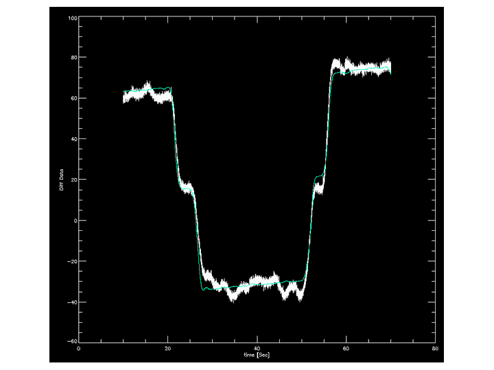
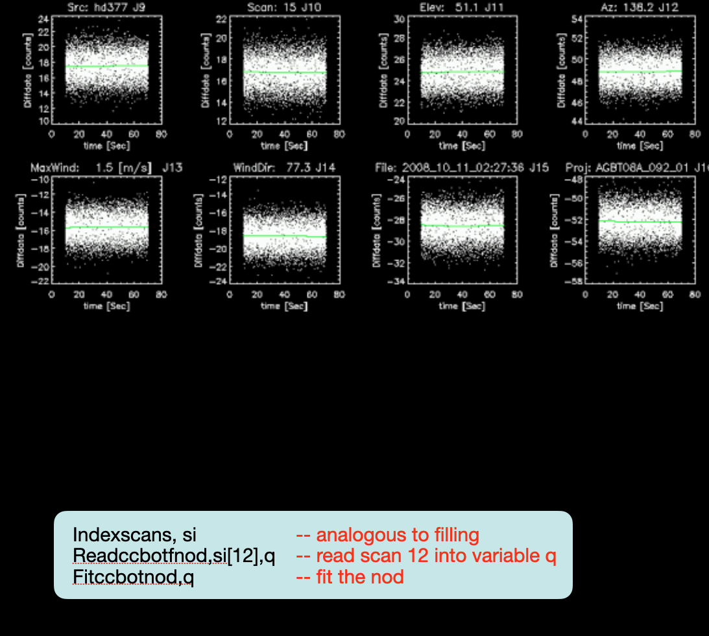
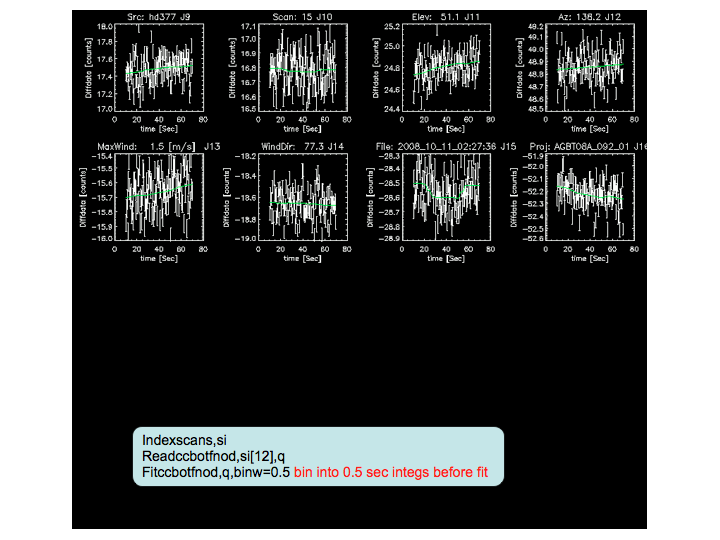

CCB
---

The CCB is a sensitive, wideband backend designed exclusively for use with the GBT Ka-band receiver, 
build in collaboration with A.C.S. Readhead's radio astronomy instrumentaiton group at Caltech, It
was commissioned on the GBT in 2006.

The driving consideration behind its design is to provide fast electronic beam switching in order to
suppress the electronic gain fluctuations which usually limit the sensitivity of continuum measurements
with single dish radio receivers. To further improve stability, it is a direct detection system: there
are no mixers before the conversion from RF to detected power. The Ka-band receiver provides eight 
simultaneous, directly detected channels of RF power levels to the CCB: one for each feed, times four 
frequency channels (26-29.5 GHz; 29.5-33 GHz; 33-36.5 GHz; and 36.5-40 GHz). Astronomical information
and labels for these 8 channels (or ports in GBT parlance) are summarized below:

.. csv-table:: CCB port labels and the astronomical quantities they measure
    :file: material/ccb_port_labels.csv
    :widths: 25, 25, 25, 25
    :header-rows: 1

It provides carefully optimized radio frequency (not an intermediate frequency) detector circuits
and the capability to beam-switch the receiver rapidly to suppress instrumental gain fluctuations.
There are 16 input ports (only 8 can be used at present with the Ka-band receiver), hard-wired to
the receiver's 2 feeds x 2 polarizations x 4 frequency sub-bands. The CCB allows the left and right
noise-diodes to be controlled individually to allow for differential or total power calibration.
Unlike other GBT backends, the noise-diodes are either on or off for an entire integration (there is 
no concept of phase within an integration). The minimum practical integration period is 5 milliseconds;
integration periods longer than 0.1 seconds are not recommended. The maximum practical beam-switching
rate is about 4 kHz, limited by the needed :math:`250\mu s` beam-switch blanking time. 
Switching slower than 1 kHz is not recommended.

The following sections outline the process of observing with, and analyzing the data from, the CCB. 

Much of the information in this chapter is also maintained at ``/users/bmason/ccbPub/README.txt``.

.. todo:: Move Brian's CCB part entirely to GBTdocs.

Observing with the CCB
^^^^^^^^^^^^^^^^^^^^^^

Configuration
'''''''''''''

Configuration of the CCB is straightforward, and for most purposes the only two configurations
are needed:

* ``ccb.conf`` - integration time of 4 milliseconds, useful for estimating the scatter in the
  samples to obtain meaningful :math:`\chi^2` values in the analysis of science data
  

* ``ccbbothcalslong.conf`` - integration time of 25 miliseconds, useful in preak/focus 
  observations to speed up processing of the data.

.. tab:: ccb.conf

    .. literalinclude:: material/ccb.conf
       :language: python

.. tab:: ccbbothcalslong.conf

    .. literalinclude:: material/ccbbothcalslong.conf

Pointing \& Focus
'''''''''''''''''

The online processing of pointing and focus data is handled by GFM (which runs within the
AstrID Data Display window) similarly as for other GBT receivers and the DCR. A few comments:

* Because the Kaband receiver currently only has one polarization per beam, GFM will by
  default issue some complaints which can be ignored.  These can be eliminated by choosing
  ``Y/Right`` polarization in the AstrID Data Display window under ``Tools`` :math:`\rightarrow`
  ``Options`` :math:`\rightarrow` ``Data Processing``.
* In the same menu (``Tools`` :math:`\rightarrow` ``Options`` :math:`\rightarrow` ``Data Processing``),
  choosing ``31.25 GHz`` as the frequency to process, instead of the default ``38.25 GHz``, can 
  improve robustness of the result.
* The results shown in the AstrID Display are in *raw counts*, not Kelvin or Janskys.
* Processing the data with ``Relaxed`` heuristics is also often helpful, which is the default
  processing option for Ka-band

There is a template pointing and focus SB for the CCB in ``/users/bmason/ccbPub`` called 
``ccbPeak.turtle`` (see below). This scheduling block does a focus scan, four peak scans, and a symmetric
nod (for accurate photometry to monitor the telescope gain).

.. literalinclude:: material/ccbPeak.turtle
    :language: python

Observing Modes & Scheduling Blocks
'''''''''''''''''''''''''''''''''''

Science projects with the CCB typically fall into two categories: mapping, and point source photometry.
The majority of CCB science is the latter, since this is what, by design, it does best. Template
scheduling blocks for both are in ``/users/bmason/ccbPub``.

.. todo:: Move those templates here.

.. note:: 

    We strongly encouraged you to use these template scheduling blocks as the basis for your CCB 
    observing scripts and make only the changes that are required! Relatively innocuous changes
    can make the data difficult or impossible to calibrate with existing analysis software.

    
The basic template SB are:

* ``ccbObsCycle.turtle``: perform photometry on a list of sources.
* ``ccbRaLongMap.turtle``: perform a standard :func:`RALongMap() <astrid_commands.RALongMap>`
  on a source.
* ``ccbMap.turtle``, ``ccbMosaicMap.turtle``: make maps using longer, single-scan, custom
  raster maps. Your project friend will help tailor these to your project's needs, should  
  you choose this approach.

.. tab:: ccbObsCycle.turtle

   .. literalinclude:: material/ccbObsCycle.turtle
        :language: python

.. tab:: ccbRALongMap.turtle

   .. literalinclude:: material/ccbRaLongMap.turtle
        :language: python

.. tab:: ccbMap.turtle

   .. literalinclude:: material/ccbMap.turtle
        :language: python

.. tab:: ccbMosaicMap.turtle

   .. literalinclude:: material/ccbMosaicMap.turtle
        :language: python

Point source photometry is accomplished with an OTF variant of the symmetric :func:`Nod() <astrid_commands.Nod>`
procedure. This procedure, which we refer to as the OTF-NOD, alternately places the beam
in each of the two beams of the Ka-band receiver in a B1/B2/B2/B1 pattern. This sequence 
cancels means and gradients in the atmospheric or receiver emission with time. Plotting 
the beamswitched data from this sequence produces a sawtooth pattern shown in 
Figure~\ref{fig:otfnodconcept}; this is discussed more in \S~\ref{sec:onlineanalys}.  

Each NOD is 70 seconds long (10 seconds in each phase, with a 10 second slew between beams
and an initial 10 second acquire time).

.. note:: 

    OTF-NOD is not one of the standard scan types; it is implemented in the scripts mentioned 
    here (e.g., ``ccbObsCycle.turtle``).

    Data from a CCB, beamswitched OTF-NOD, showing data and model versus time through
    one B1/B2/B2/B1 scan. The white line is the CCB beam-switched data and the green 
    line is the fit for source amplitude using the known source and telescope (as a
    function of time) positions.

Calibration
'''''''''''

If at all possible, be sure to do a peak and focus, and perform photometry (an OTF-NOD, 
as implemented in ``ccbObsCycle.turtle`` or ``ccbPeak.turtle``) on one of the following 
three primary (flux) calibrators: 3c48, 3c147, or 3c286. This will allow your data to be 
accurately calibrated (our calibration scale is ultimately referenced to the WMAP 30 GHz
measurements of the planets). If this is not possible the calibration can be transferred 
from another telescope period (observing session) within a few days of the session in
question.

Online Data Analysis
''''''''''''''''''''

It is important to assess data quality during your observing session. There are a set of
custom IDL routines for analyzing CCB data; if you use the observing procedures and config
files described here, your data should be readily calibratable and analyzable by them. To 
use the IDL code, start IDL by typing (from the GB UNIX command line): 

.. code-block:: bash

   /users/bmason/ccbPub/ccbidl

Example OTF-NOD data for bright sources (under good and poor conditions) and a weak source 
(under good conditions) are shown in Figures~\ref{fig:brightgood} through \ref{fig:weakbinned}.

   CCB data from an OTF-NOD observation of a bright source, showing data and model versus 
   time through one B1/B2/B2/B1 scan. The white line is the CCB beam-switched data and 
   the green line is the fit for source amplitude using the known source and telescope 
   (as a function of time) positions. The close agreement between the data and the fit 
   indicate that neither fluctuations in atmospheric emission nor pointing fluctuations
   (typically due to the wind on these timescales) are problems in this data.

   CCB OTF-NOD data on a bright source under marginal conditions.The differences between
   the data and the model are clearly larger in this case.

   CCB OTF-NOD measurement of a weak (mJy-level) source under good conditions. The IDL
   commands used to obtain this plot are shown inset.

   The same weak-source data, this time with the individual integrations binned into 
   0.5 second bins (using the optional argument ``binwidth`` in ``fitccbotfnod``) so
   the thermal-noise scatter doesn't dominate the automatically chosen y-axis scale. 
   This better shows any gradients or low-level fluctutions in the beamswitched data 
   (due, for instance, to imperfect  photometric conditions). In this data they are 
   not significant

Here is an example data reduction session that provides a quick look at your data:

.. literalinclude:: material/ccb_reduction.pro
   :language: IDL

Mapping data can also be imaged using the IDL tools:

.. literalinclude:: material/ccb_map_imaging.pro
   :language: IDL

This will be a beam-switched map. The beam-switching can be removed by an EKH deconvolution
algorithm :cite:p:`Emerson1979` also implemented in the code. Your project friend will help 
you with this, if needed.

Performance
^^^^^^^^^^^

Tests under excellent conditions show a sensitivity of 150µJy (RMS) for the most sensitive 
single channel (34 GHz), or 100µJy (RMS) for all channels combined together. These are the
RMS of fully-calibrated, 70-second OTF-NODs on a very weak source.  Typical reasonable-weather
conditions are a factor of two worse.

Differences Between the CCB/Ka System and other GBT Systems
^^^^^^^^^^^^^^^^^^^^^^^^^^^^^^^^^^^^^^^^^^^^^^^^^^^^^^^^^^^

There are a few differences between the CCB/Ka system and other GBT receiver/backend systems 
which users familiar with the GBT will want to bear in mind.

* Because it is a direct detection system, the GBT IF system does not enter into observing. 

* The Ka/CCB gains are engineered to be stable (10% - 20% over months), so no variable
  attenuators are in the signal chain. Consequently there is no :func:`Balance() <astrid_commands.Balance>`
  step.

* To optimize the RF balance (for spectral baseline and continuum stability), the OMT's 
  have been removed from the Ka band receiver. It is therefore sensitive to *one linear 
  polarization per feed*.  The two feeds are sensitive to orthogonal linear polarizations
  (X and Y).

* Feed orientation is :math:`45^\circ` from the Elevation/cross-Elevation axes. All other
  receivers have feed separations that are parallel to the Elevation or cross-Elevation 
  axes (except for the KFPA).
 
* There are two cal diodes (one for each feed), and they are separately controlled (i.e.,
  it is possible to turn one on and not the other). Cals are ON or OFF for an entire 
  integration; they are not pulsed ON and OFF within a single integration.

