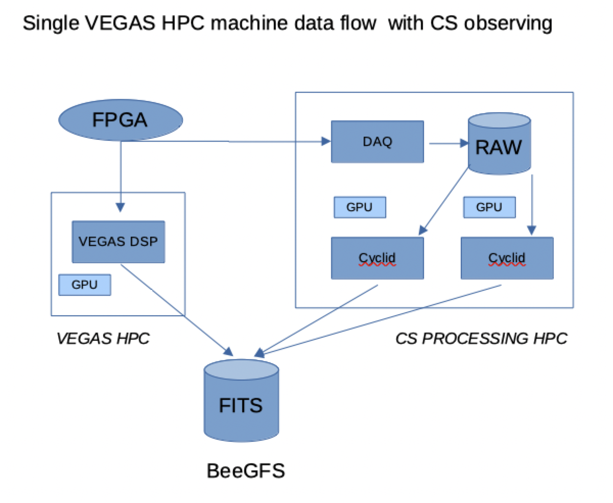
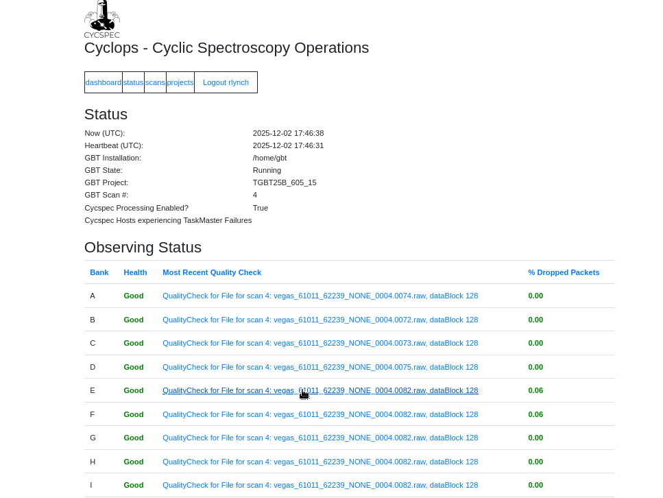
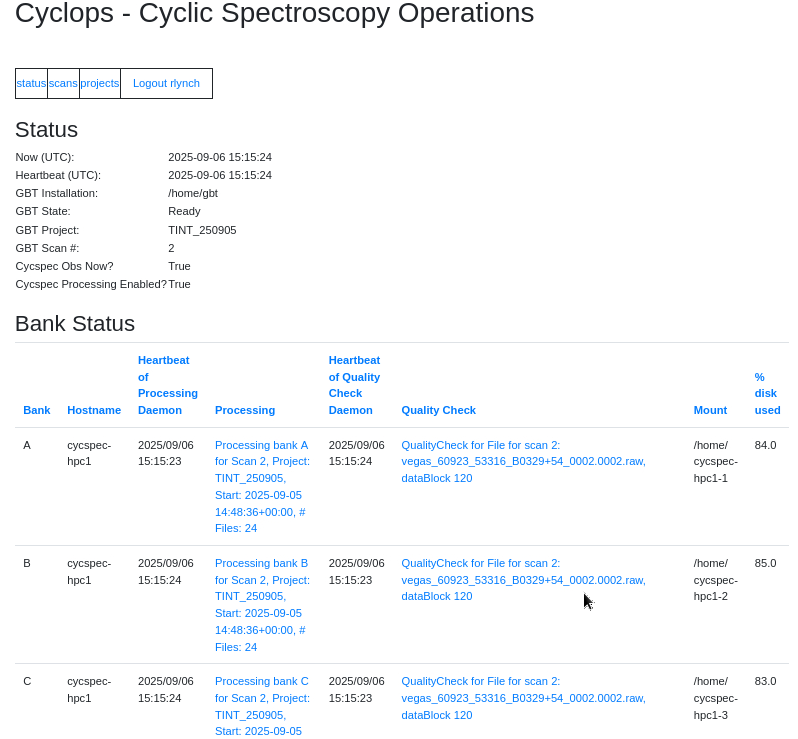
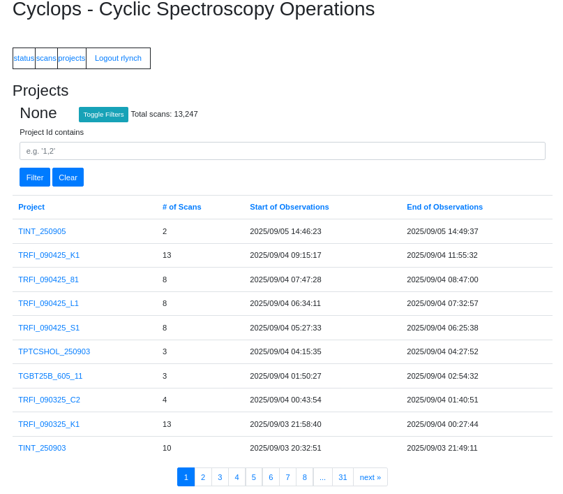
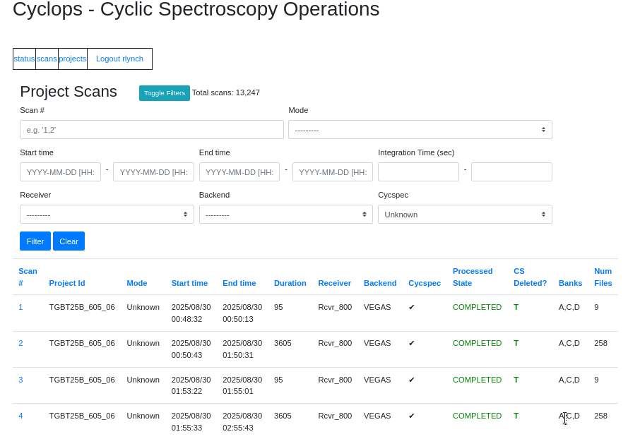
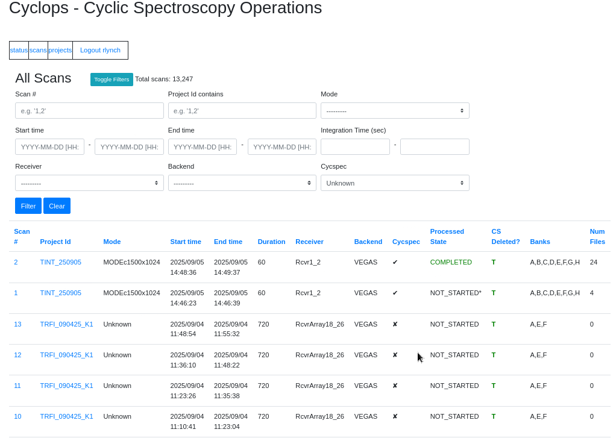
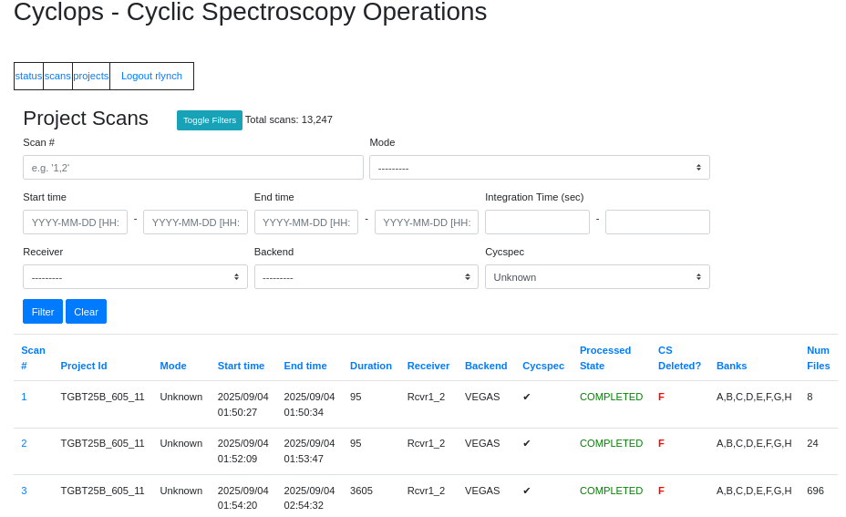
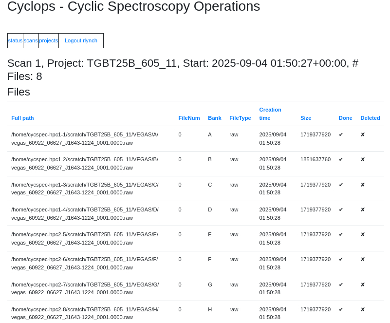
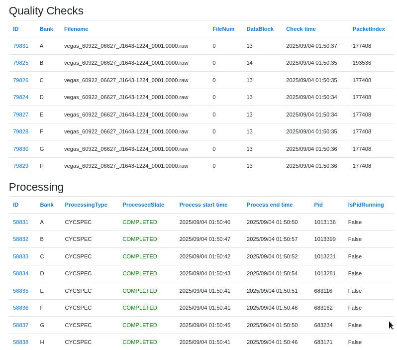
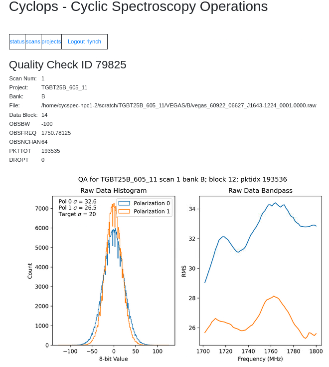

.. |npfb| replace:: :math:`n_{\rm pfb} \downarrow`
.. |nbin| replace:: :math:`n_{\rm bin} \rightarrow`

Cyclic Spectroscopy
-------------------

Overview
^^^^^^^^

The GBT offers a CS backend system which produces periodic spectra
(related to the cyclic spectrum via a Fourier transform) in
close-to-real time (the operation of the system is described in more
detail below).  It operates simultaneously with VEGAS to produce both
traditional coherent-dedispersion fold-mode pulsar data along with
periodic spectra.  CS can be used with any GBT receiver other than
MUSTANG2.

The CS backend shares some components with VEGAS.  Specifically, the
VEGAS ROACH2 boards are used to perform a first-stage channelization
via a polyphase filterbank (PFB).  Note that the number of PFB
channels (denoted by :math:`n_{\rm pfb}`) is the same as the number of
frequency channels in traditional VEGAS pulsar data.  These coarsely
channelized baseband data are sent via ethernet to both VEGAS (where
they are processed in real-time to produce traditional data products)
and to a dedicated CS processing cluster.  CS can be used with the
100, 200, 800, and 1500 MHz-bandwidth coherent dedispersion modes of
VEGAS, producing one, two, eight, or eight data streams.  Each stream
is a duplicate copy of the data sent to and processed on a VEGAS Bank.
CS streams retain this nomenclature (i.e. the data stream associated
with VEGAS Bank A is also labeled ``A'').  :numref:`cs-system`
provides a schematic overview of the CS system and its shared
components with VEGAS.

	 
   A simplified, schematic overview of the CS system and its
   relationship to VEGAS.  Note that only a single CS stream/VEGAS
   Bank is depicted here.  Data from a VEGAS ROACH2 FPGA is multi-cast
   over Ethernet to both a VEGAS HPC (where the digital signal is
   processed using traditional techniques) and to a CS processing HPC.
   Raw baseband data from a CS data stream is stored on dedicated
   disks and processed using custom GPU-accelerated software (known as
   cyclid).  Two scans from each VEGAS Bank/CS data stream can be
   processed simultaneously.  Both VEGAS and the CS system write final
   FITS data products to the BeeGFS mass file
   store.

The baseband data are temporarily saved to disk on the CS cluster, and
processed after a scan ends.  Each data stream has its own, dedicated
storage disk and two dedicated GPUs that are used to process data.
This involves using CS to further channelize the data to achieve finer
frequency resolution, while still maintaining pulse phase resolution.
The additional channelization factor is denoted by :math:`n_{\rm cyc}`
and the number of pulse phase bins is denoted by :math:`n_{\rm bin}`.
The final frequency resolution is given by

.. math::
   
  \Delta f = \frac{\mathrm{BW}}{n_{\rm pfb} n_{\rm cyc}}

where BW is the total bandwidth.

Processing begins automatically once a scan ends.  After periodic
spectra have been produced they undergo automated quality checks and,
after passing, the baseband data are automatically deleted, freeing
space for subsequent observations.  The time it takes to produce
period spectra depends on the combination of observing parameters but
is limited to :math:`\leq 2\times` the length of the observation.  Data
acquisition and post-processing status are monitored via a
browser-based interface.

Allowable Observing Parameters
""""""""""""""""""""""""""""""

The storage disks associated with each data stream have a maximum
capacity of 16 TB each.  This is sufficient to record up to
approximately 6 hours of data when using 1500 MHz or UWBR modes, and
11 hours of data when using 100, 200, or 800 MHz bandwidth modes.
There are also two GPUs used to process data from each stream after a
scan ends.  To ensure that the CS system can be used continuously
without exceeding the capacity of the local storage or negatively
impacting system performance, there are restrictions on the maximum
length of an individual scan and the time it takes to process a scan:

1. An individual scan is limited to :math:`\leq` one hour.
2. The time to process a scan is limited to :math:`\leq` twice the scan length.

The latter restriction limits the allowable combination of PFB channel
bandwidth, the final frequency resolution of the periodic spectrum,
and the pulse phase resolution.  Allowable parameter combinations are
shown in :numref:`cs-allowed-modes` .

.. table:: **Maximum Allowable** :math:`\mathbf{n_{\rm cyc}}`
   :name: cs-allowed-modes
   
   +-----------+--------+-----+-----+-----+-----+-----+------+------+
   | |npfb|    | |nbin| | 32  | 64  | 128 | 256 | 512 | 1024 | 2048 |
   +===========+========+=====+=====+=====+=====+=====+======+======+
   | **100 MHz Bandwidth Modes**                                    |
   +-----------+--------+-----+-----+-----+-----+-----+------+------+
   | **64**    |        | 512 | 512 | 512 | 256 | 256 | 128  | 64   |
   +-----------+--------+-----+-----+-----+-----+-----+------+------+
   | **128**   |        | 512 | 512 | 256 | 256 | 128 | 64   | 64   |
   +-----------+--------+-----+-----+-----+-----+-----+------+------+
   | **256**   |        | 512 | 256 | 256 | 128 | 64  | 64   | 32   |
   +-----------+--------+-----+-----+-----+-----+-----+------+------+
   | **512**   |        | 256 | 128 | 128 | 64  | 64  | 32   |      |
   +-----------+--------+-----+-----+-----+-----+-----+------+------+
   | **200 MHz Bandwidth Modes**                                    |
   +-----------+--------+-----+-----+-----+-----+-----+------+------+
   | **64**    |        | 256 | 256 | 256 | 256 | 256 | 128  | 128  |
   +-----------+--------+-----+-----+-----+-----+-----+------+------+
   | **128**   |        | 512 | 512 | 512 | 256 | 256 | 128  | 64   |
   +-----------+--------+-----+-----+-----+-----+-----+------+------+
   | **256**   |        | 512 | 512 | 256 | 256 | 128 | 64   | 64   |
   +-----------+--------+-----+-----+-----+-----+-----+------+------+
   | **512**   |        | 512 | 256 | 256 | 128 | 64  | 64   | 32   |
   +-----------+--------+-----+-----+-----+-----+-----+------+------+
   | **1024**  |        | 256 | 128 | 128 | 64  | 64  | 32   |      |
   +-----------+--------+-----+-----+-----+-----+-----+------+------+
   | **800 MHz Bandwidth Modes**                                    |
   +-----------+--------+-----+-----+-----+-----+-----+------+------+
   | **32**    |        | 32  | 32  | 64  | 64  | 32  | 32   | 32   |
   +-----------+--------+-----+-----+-----+-----+-----+------+------+
   | **64**    |        | 128 | 128 | 128 | 128 | 128 | 128  | 128  |
   +-----------+--------+-----+-----+-----+-----+-----+------+------+
   | **128**   |        | 128 | 256 | 128 | 128 | 128 | 128  | 128  |
   +-----------+--------+-----+-----+-----+-----+-----+------+------+
   | **256**   |        | 256 | 256 | 256 | 256 | 256 | 128  | 128  |
   +-----------+--------+-----+-----+-----+-----+-----+------+------+
   | **512**   |        | 512 | 512 | 512 | 256 | 256 | 128  | 64   |
   +-----------+--------+-----+-----+-----+-----+-----+------+------+
   | **1024**  |        | 512 | 512 | 256 | 256 | 128 | 64   | 64   |
   +-----------+--------+-----+-----+-----+-----+-----+------+------+
   | **2048**  |        | 512 | 256 | 256 | 128 | 64  | 64   | 32   |
   +-----------+--------+-----+-----+-----+-----+-----+------+------+
   | **4096**  |        | 256 | 128 | 128 | 64  | 64  | 32   |      |
   +-----------+--------+-----+-----+-----+-----+-----+------+------+
   | **1500 MHz Bandwidth Modes**                                   |
   +-----------+--------+-----+-----+-----+-----+-----+------+------+
   | **64**    |        | 64  | 16  | 32  | 64  | 16  | 16   | 16   |
   +-----------+--------+-----+-----+-----+-----+-----+------+------+
   | **128**   |        | 64  | 64  | 64  | 64  | 64  | 64   | 64   |
   +-----------+--------+-----+-----+-----+-----+-----+------+------+
   | **256**   |        | 128 | 128 | 128 | 128 | 128 | 128  | 64   |
   +-----------+--------+-----+-----+-----+-----+-----+------+------+
   | **512**   |        | 256 | 256 | 128 | 128 | 128 | 64   | 64   |
   +-----------+--------+-----+-----+-----+-----+-----+------+------+
   | **1024**  |        | 256 | 256 | 256 | 128 | 128 | 64   | 16   |
   +-----------+--------+-----+-----+-----+-----+-----+------+------+
   | **2048**  |        | 256 | 256 | 128 | 128 | 64  | 32   | 8    |
   +-----------+--------+-----+-----+-----+-----+-----+------+------+
   | **4096**  |        | 256 | 128 | 64  | 64  | 16  | 4    |      |
   +-----------+--------+-----+-----+-----+-----+-----+------+------+
   | **4500 MHz Bandwidth UWBR Modes**                              |
   +-----------+--------+-----+-----+-----+-----+-----+------+------+
   | **768**   |        | 128 | 128 | 128 | 128 | 128 | 128  | 64   |
   +-----------+--------+-----+-----+-----+-----+-----+------+------+
   | **1536**  |        | 256 | 256 | 128 | 128 | 128 | 64   | 64   |
   +-----------+--------+-----+-----+-----+-----+-----+------+------+
   | **3072**  |        | 256 | 256 | 256 | 128 | 128 | 64   | 16   |
   +-----------+--------+-----+-----+-----+-----+-----+------+------+
   | **6144**  |        | 256 | 256 | 128 | 128 | 64  | 32   | 8    |
   +-----------+--------+-----+-----+-----+-----+-----+------+------+
   | **12288** |        | 256 | 128 | 64  | 64  | 16  | 4    |      |
   +-----------+--------+-----+-----+-----+-----+-----+------+------+

Using Cyclops to Monitor Your CS Observations
^^^^^^^^^^^^^^^^^^^^^^^^^^^^^^^^^^^^^^^^^^^^^

During CS observations you should make use of the :ref:`VPM observing
tools <references/backends/vpm:VPM Observing Tools>` relevant for
coherent dedispersion fold and calibration modes.  The CS backend has
its own tools for monitoring observations, but they differ from the
typical GBT backend because of the unique architecture of the CS
backend, which shares much of its data acquisition infrastructure with
VEGAS and processes data offline (rather than in real time).  Most
notably, the CS backend does not have a CLEO application that
interfaces with a software Manager.  In addition, while errors during
the data acquisition stage will trigger messages that are displayed in
the CLEO Message application, errors during the offline processing
stage will not appear in CLEO Message.

Instead, CS observations are monitored using `Cyclops
<https://cyclops.gb.nrao.edu>`__, a browser-based interface that
"keeps an eye on things".  Cyclops can only be accessed from a
computer on the GBO internal network, and also requires a login using
your my.nrao.edu credentials.  Cyclops allows users to monitor ongoing
data acquisition and the status of offline processing.  Note that you
will only be able to view information for GBT projects on which you
are a PI or Co-I.  We detail various features of Cyclops in the
sections below.

The Cyclops Dashboard
"""""""""""""""""""""

   The Cyclops Dashboard.  Observers should use this page to
   check on the overall health of the system.  Note that click on a
   quality check link takes one to a detailed overview of the quality
   of the last scan.

A screen shot of the dashboard page is shown in
:numref:`cs-cyclops-dashboard`.  This page gives a high level
overview of the health of the CS backend.  Observers should note the
following information.

* The "Now" and "Heartbeat" timestamps should be relatively current
  (within one minute of the last page refresh).  If they are not, the
  text will turn red.
* The "GBT State", "GBT Project", and "GBT Scan #" should reflect the
  current state of the GBT.
* "Cycspec Obs Now?" should be True when you are taking CS data.
* "Cycspec Processing Enabled" should always be True during normal
  operations.
* All active Banks should have a Health status of Good and Dropped
  Packets percentage very close to zero (:math:`< 0.1%`).

Notify the GBT operator if you notice any problems.  Clicking on a
Quality Check link will bring you to a page showing more detailed
information about the quality of the data (see below for details).

The Cyclops Status Page
""""""""""""""""""""""

   The Cyclops Status page.  This provides a snapshot of the overall
   status of the system.  Note that additional information is shown
   lower in the page.

A screen shot of the status page is shown in
:numref:`cs-cyclops-status`.  The first section is the same as on the
Dashboard.  The next section shows more detailed information about the
status of the data stream associated with each VEGAS Bank.  Note that
clicking on a column heading will sort that column, and clicking it
again will sort it in the opposite sense (this is true throughout
Cyclops).  Observers should note the following information.

* Only data streams associated with active VEGAS Banks should have
  current information.  Depending on the observing bandwidth, not all
  Banks may be active.
* The Processing Daemon and Quality Check Daemon Heartbeats should be
  current.  They will turn red if they are not.
* Observers can click on the links under Processing and Quality Check
  to see more information about the most recently processed and
  recorded data for that Bank, but remember that this may not be for
  your current scan if that Bank is not active.
* Under normal operations the storage disks should always have
  adequate space, but if you notice that they are approaching 100\%
  you should inform the GBT operator.

After the Bank Status section there is a table showing information
about recent VEGAS scans.  The columns contain information on various
aspects of the scan and configuration.  Observers can also see the
current Processing State of the scan and whether the baseband data
have been deleted.  Clicking on the scan number will take you to a
page showing more detailed information on that scan, and clicking on a
project ID will take you to a page summarizing the project and
session.

The Cyclops Projects Page
"""""""""""""""""""""""""

   The Cyclops Projects page.  Clicking on a link will take you to a
   page with project-specific details.

A screen shot of the status page is shown in
:numref:`cs-cyclops-projects`.  Observers can filter based on specific
strings in the project ID.  Clicking on a project ID will take you to
a project-specific page with more details (shown in
:numref:`cs-cyclops_project_details`).  From this page, observers can
filter for specific scans and view detailed information on each scan.
The information presented for each scan is the same as in the Scans
table in the main Status page.  Again, clicking on a scan number will
take you to a page with detailed information on that scan.

   A Cyclops page with detailed information about a single project.
   Clicking on a link will take you to a page with project-specific
   details.  Clicking on a scan will take you to a page with more
   detailed information about that specific scan.
    
The Cyclops Scans Pages
""""""""""""""""""""""

Screen shots of the scan pages are shown in :numref:`cs-cyclops-scans`
(all scans) and :numref:`cs-cyclops-project-scans` (scans associated
with a specific project).

	 
   The Cyclops Scans page.  This contains information about all CS
    scans for all projects.

   Cyclops scans associated with a specific project.

Clicking on a scan number will take you to a scan-specific page with
more details (shown in Figs. :numref:`cs-cyclops-scan-details1` and
:numref:`cs-cyclops-scan-details2`).  The first section shows the full
path, file number, bank number, file type, creation time, size (in
bytes), and data-taking status for each baseband file associated with
this scan, as well as whether or not the baseband file has been
deleted.  The next section contains quality check information about
the baseband data (see :numref:`cs-cyclops-qc`).

The most useful feature is the ability to click on a quality check ID,
which will take you to a page showing various metadata about the scan
and some visualizations of the baseband data themselves.  Observers
should not the following:

* The OBSBW, OBSFREQ, and OBSNCHAN values should agree with what is
  shown in the vpmStatus tool for this bank and scan.
* DROPT is a counter for dropped packets (i.e., data that has been
  lost because some aspect of the CS system can't keep up with the
  incoming data stream). It has the same meaning as on the Dashboard
  and should be very close to zero.
* The two plots show histograms of the 8-bit signed integer baseband
  values for each polarization, and the RMS in each frequency channel
  (which is proportional to the total power bandpass).  The histograms
  should be approximately Gaussian in shape with an RMS of about 20
  counts.  Similarly, the bandpass RMS should also be about 20 counts
  in each channel. Note, however, that the total power varies
  significantly over the operating frequency range of several
  receivers, so variations on the order of :math:`\pm 15` counts are
  not abnormal.  Also, frequency ranges with relatively little power
  (e.g. near the receiver band edges, or where there is an RFI filter)
  will have little power and therefore a smaller RMS.  Conversely,
  frequency ranges with strong RFI may have higher power and therefore
  a larger RMS.  In general, if you are using a well-tested value of
  vegas.scale (see :ref:`here <references/backends/vpm:Available VPM
  Modes>`) then the levels shown in these plots should be close to
  optimal.  If you have doubts, contact the GBT operator.

	   
   A Cyclops page showing detailed information about a specific scan
   (continued in the next figure).

   Continuation of the detailed scan page in Cyclops.
    

   A Cyclops quality check page.  Observers should make sure that the
   baseband sample histogram and bandpass plots have appropriate RMS
   and power.  See the text for details.

The next section shows the processing status for each bank associated
with this scan.  Clicking on the processing ID will take you to a page
showing the output of the processing software.  Observers generally do
not need to pay attention to this.

Accessing Your Data
^^^^^^^^^^^^^^^^^^^

CS data will begin to appear shortly after a scan ends, and processing
should finish within :math:`2\times` the scan duration (e.g. a 1-hour
long scan will finish processing within 2 hours).

Data are written in the PSRFITS format to the BeeGFS file system and
can be accessed from any of the machines listed as `BeeGFS clients
<https://www.gb.nrao.edu/pubcomputing/public.shtml`_ (e.g. euclid or
thales).  The directory and file naming conventions are very similar
to those used by VEGAS.  Files are written to project-specific
directories of the form noindent
`/stor/gbtdata/<projectID>/CYCSPEC/<bankID>` where `<projectID>` is
your GBT project code with the session number in Astrid appended,
e.g. `AGBT18A_100_01`, and `<bankID>` is the one-letter bank name.

File names follow the format
`vegas_<MJD>_<secUTC>_<sourceName>_<scanNumber>_<fileNumber>.fits`
where `<MJD>` is the modified Julian date of the observation,
`<secUTC>` is the number of seconds after midnight UTC at the start of
the scan, `<sourceName>` is the source name as identified from the
Antenna manager, `<scanNumber>` is the scan number within the current
Astrid session, and `<fileNumber>` is the file number within the
current scan (long scans are broken across multiple files to avoid any
one file from being very large).  `<secUTC>` is a zero-padded
five-digit integer and `<scanNumber>` and `<fileNumber`
are zero-padded four-digit integers.

Note that the data written to `/stor/gbtdata` are the unmerged data
from each bank.  A cron job runs each hour which combines these data
into files that cover the full observing bandwidth.  These files are
written to `/stor/pulsar/gbtdata` under project-specific directories.
These merged data are what most observers will ultimately want to use
for their science.

CS data are archived and are subject to standard GBO data management
policies.

CS data can be analyzed using `PSRCHIVE
<http://psrchive.sourceforge.net>`_ and `pycyc
<https://github.com/gitj/pycyc>`_.

Additional Considerations
^^^^^^^^^^^^^^^^^^^^^^^^^

Observers should be aware of the following.

* VEGAS uses a critically sampled PFB and each channel is tapered
  to minimize interchannel spillover.  As such, there are gaps between
  PFB channels in the periodic spectrum.  The half-power width of
  these gaps is approximately 9% of the PFB channel bandwidth.
* The cyclic spectrum is only valid when :math:`|f| < \mathrm{BW_{\rm
  pfb}}/2 - | \alpha/2|` where :math:`\mathrm{BW_{\rm pfb}}` is the
  PFB channel bandwidth, :math:`\alpha = k/P`, :math:`P` is the pulsar
  period, and :math:`k = 0 \dots n_{\rm bin}`.  This imposes a limit
  on the maximum number of useful pulse phase bins.

