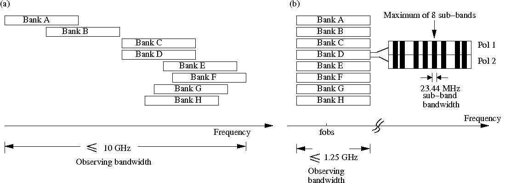
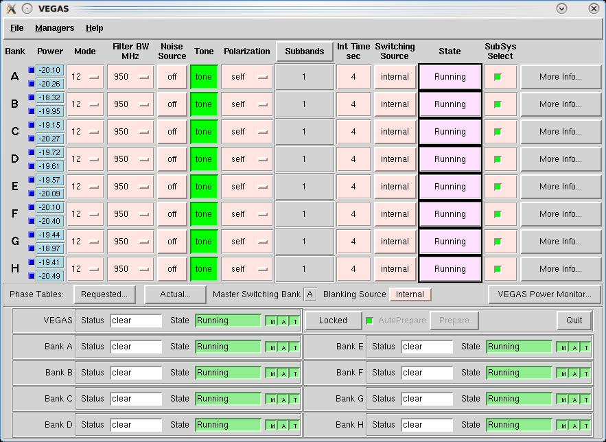
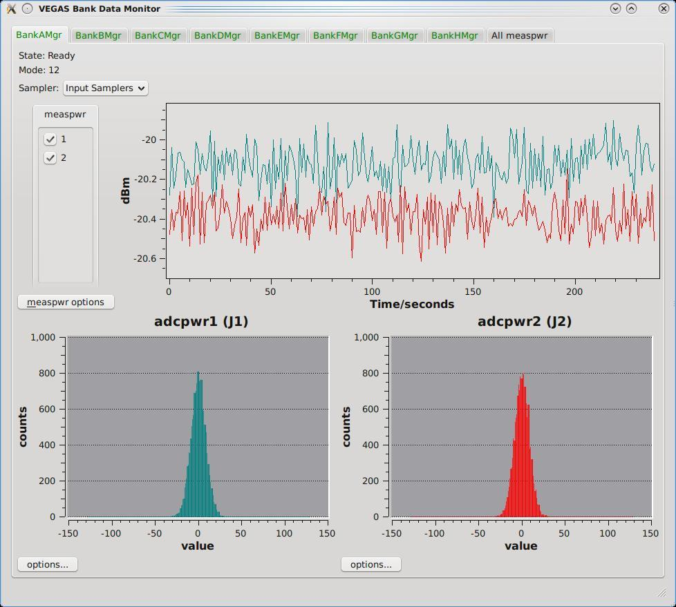
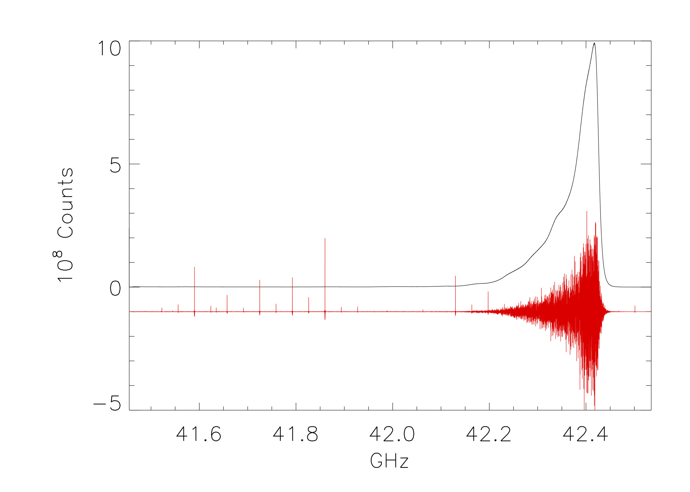

VEGAS
-----

Overview
^^^^^^^^

The VErsatile GBT Astronomical Spectrometer (VEGAS) is an Field-Programmable 
Gate Array (FPGA) based spectrometer that can be used with any receiver except 
MUSTANG-2. It consists of eight independent spectrometers (banks) that can be
used simultaneously. Eight-bit samplers and polyphase filter banks are used to
digitize and generate the spectra -- together they provide superior spectral 
dynamic range and RFI resistance. For details on the design of VEGAS, 
please consult http://www.gb.nrao.edu/vegas/report/URSI2011.pdf.

.. todo:: Move content of that pdf file here or link the file here or add a reference. 

Observers can use between one and eight dual-polarization spectrometers (or banks)
at the same time (see Fig.~\ref{fig:vegasconfig}). 

Each bank within VEGAS can be configured with a different spectral resolution,
bandwidth, and number of spectral windows (subbands). However, the integration 
time (``tint``), switching period (``swper``), and the frequency switching offset 
(``swfreq``) values **must** each be the same for all banks. The resolution and
bandwidth of all subbands in a single VEGAS bank must be identical, but the center
frequencies may be set independently (within limits).

Although the individual banks could be arranged to cover 10 GHz of total bandwidth, 
the maximum bandwidth is typically limited to 4-6 GHz by filters in the GBT IF system
(see your project friend for more information). 

.. todo:: Either replace the reference to the project friend with the helpdesk or provide the information here.

All banks have the same switching signal (i.e., same switching period, same 
integration time, same frequency switching offset), which is controlled by 
spectrometer bank A. Each bank can be configured in one of the 29 modes listed
in :numref:`tab-vegas-modes` below.

.. include:: /material/tables/VEGAS_modes.tab

In short:

* **Modes 1-19** 
  provide a single subband per bank. Modes 1--3 have the following constraints on useable bandwidth:
  
  * **Modes 1-2**: Have a useable bandwidth of 1250 MHz within the baseband bandwidth of 1500 MHz. 
    The useable baseband frequency range is 150-1400 MHz.
  * **Mode 3**: Has a useable bandwidth of 800 MHz within the baseband bandwidth of 1080 MHz. 
    The useable baseband frequency range is 150-950 MHz.
* **Modes 20-29** 
  provide up to eight subbands per bank. To use more than one subband, set subband=8, and the actual
  number of subbands used is then defined by the number of frequencies provided. All subbands must have equal bandwidths
  and be placed within the total bandwidth processed by that bank:

  * **Modes 20-24**: Have a useable bandwidth of 1250 MHz within the baseband bandwidth of 1500 MHz. 
    The useable baseband frequency range is 150-1400 MHz.
  * **Modes 25-29**: Have a useable bandwidth of 800 MHz within the baseband bandwidth of 1080 MHz.  
    The useable baseband frequency range is 150-950 MHz.
   
Each mode provides the polarization products XX, YY, and optionally XY,YX necessary
for observations of polarized emission without requiring a reduction in the number 
of channels or sampling speed. VEGAS can also record only a single polarization 
for single-polarization receivers.

Data Rates
^^^^^^^^^^

The data rate for an individual bank can be calculated using

.. math::

   {Data Rate (GB/hr)} = 1.34 \times10^{-5} \cdot\dfrac{n_{channels}\times n_{spw}\times n_{stokes}\times n_{states}}{t_{int}{(seconds)}},

where :math:`n_{channels}` is the number of channels per spectral window, :math:`n_{spw}` is the number of spectral windows, :math:`n_{stokes}` is the number of stokes parameters (2 for dual polarization, 4 for full polarization), :math:`n_{states}` is the number of switching states (4 for frequency switching and 2 for total power), and :math:`t_{int}` is the integration time. The total data rate for a project can be calculated by adding the data rates for each bank together.

IF Configuration
^^^^^^^^^^^^^^^^

The GBT IF system introduces some constraints on routing signals from the receivers to VEGAS.

* Single beam receivers or a multi-beam receiver that has been configured to use a single beam may be routed to any or all of the VEGAS banks A :math:`\rightarrow` H. No spectral resolution is gained with VEGAS by only using one beam of a multi-beam receiver.
* Dual-beam configurations allow each beam to be routed to a maximum of 4 VEGAS banks.
* When using 3--4 beams, each beam may be routed to up to a maximum of 2 VEGAS banks.
* When using more than 5 beams, each beam may only be routed to a single VEGAS bank.
* When using all 7 beams of the KFPA, each beam may be routed to a single VEGAS bank with an optional second copy of beam 1 being routed to the remaining VEGAS bank. This is known as the "7+1" mode of the KFPA.

Blanking
^^^^^^^^

While the observing system is switching between states (such as switching the noiseDiode
on or off, switching frequencies, running doppler updates, etc...) the collected data 
is not valid, and thus must be 'blanked' by VEGAS. VEGAS allows the user to switch states 
frequently enough that the required blanking time can become a non-negligible percentage 
of the total observing time. For efficient observing, it is important to choose switching
periods that are long enough for the total amount of blanking to be negligible. The amount
of blanking per switching signal is dependent on the VEGAS mode used. Conservative values 
are shown in :numref:`tab-vegas-swper-cal` and :numref:`tab-vegas-swper-nocal` for values with 
the noiseDiode turned either on or off. For a more thorough description of the appropriate 
switching periods for a given amount of blanking, and more accurate estimates of the minimum
switching periods we refer the interested reader to :cite:t:`Kepley2014`.

.. include:: /material/tables/VEGAS_swper_cal.tab

.. include:: /material/tables/VEGAS_swper_nocal.tab

Monitoring VEGAS observations
^^^^^^^^^^^^^^^^^^^^^^^^^^^^^

The Spectral Line tab in the Astrid Data Display is not fully capable of displaying VEGAS
observations in real time (it will display passbands at the end of a scan, and may be used
in offline mode). Rather, there are two monitoring tools that you may find useful as a VEGAS 
user:

The CLEO VEGAS screen 
'''''''''''''''''''''

See the :ref:`CLEO VEGAS description <references/cleo:VEGAS>` for more information.

   
    
VEGAS Data Monitor (VEGASDM)
''''''''''''''''''''''''''''

The VEGAS Data Monitor (VEGASDM) provides a real-time display of the current total power level
as measured by the VEGAS ADC, as well as a histogram of the distribution of ADC counts. VEGASDM
may be launched by:

.. code-block:: bash
    
    source /home/gbt/gbt.bash  # (or .csh)
    VEGASDM

or by clicking the ``VEGAS Power Monitor...`` button from the CLEO VEGAS screen. 

VEGASDM has nine tabs, one for each Bank, and one overview tab. If a Bank is active, the tab label
will be green, otherwise it will be red. Each Bank tab shows whether the Bank is in the running 
state, and what mode it is in. The upper plot shows the total power from each polarization as a 
function of time, while the lower two plots show the distribution of ADC counts for each polarization.
If VEGAS is balanced correctly, the ADC counts should be approximately Gaussian, centered around zero,
with a full-width half maximum of approximately 25-50 counts. If the ADC counts are very centrally
peaked, there is not enough power going into VEGAS, while if the ADC counts have peaks at +/- 127 counts,
VEGAS is being over-driven.

The final tab of VEGASDM gives an overview plot of the total power for all eight banks on a single screen.

.. * vegas_status -- the VEGAS shared memory display, this tool is useful for specialized problem
  diagnosis only.

The Online Filler and filling VEGAS data using SDFITS
^^^^^^^^^^^^^^^^^^^^^^^^^^^^^^^^^^^^^^^^^^^^^^^^^^^^^

VEGAS writes Engineering FITS files. Once a scan is over, the Filler reads these files, combines the data 
with metadata from the Antenna and other FITS files, and produces a single-dish (SDFITS) file. This can
be done automatically, by the on-line filler, or manually by the Observer. Due to the significantly higher
data rate, and some other features of VEGAS, the filling process requires some oversight by the user.

The Online Filler
'''''''''''''''''

The online filler will make every attempt to fill the SDFITS file automatically. In this case, a file
will be produced in ``/home/sdfits/<project>`` and GBTIDL can connect to it automatically using the
:idl:pro:`online`, or :idl:pro:`offline` commands. There are some caveats, however.

* Because of the way VEGAS writes its data, the filler cannot start filling until the scan has finished. 
* For large scans, the filler could potentially fall behind the data acquisition process. To avoid this, 
  the filler will skip scans that it cannot keep up with. The rule is:
 
  .. code-block:: none

        If (integrationTime / totalNumberOfSpectraPerIntegration) < 0.00278s
            skip the scan
        Except if (integrationLength >= 0.9s) it will be filled
    

The total number of spectra per integration is the total across all banks. So, for example, 2 banks, 
8 subbands, 2 polarizions and  4 switching states (e.g. frequency switching with calibration) will 
produce 2*8*2*4 = 128 spectra, and so if the integration time is <0.356s the online filler will not 
fill that data. The 0.9s limit is because for that integration time the online filler can almost keep
up even in the worst case, and interscan latencies, pauses for pointing and focus scans, and so on 
will nromally allow it time to catch up. The online filler prints a summary in ``/home/sdfits/<project>/<project>.log``
indicating what scans were filled, had problems and were skipped, and if any data was skipped because
the data rate was too fast.

The decision on whether to fill or not is made independently for each bank. For cases where the 
integration time is close to the limit it's possible that some banks might be filled while others 
are not filled for the same scan if the number of subbands or the number of polarizations vary 
across the banks. The summary log file will indicate when this happens.

If observers are concerned about the interpolation across the center channel (see \S~\ref{sec:vegas_spike})
they can turn that off in sdfits by using the ``-nointerp`` option.

 
Filling Offline
'''''''''''''''

You may wish to (re-)fill your data offline. In this case, you may use the SDFITS filler program 
in the standard manner.  Note however, that the actual VEGAS data is stored to a high-speed (lustre)
file system.  For a current list of lustre client machines please see 
https://greenbankobservatory.org/portal/gbt/processing/#data-reduction-machines

If you try to fill data without being logged into a lustre client, the filler will fail with the error message:

.. code-block:: none

    VEGAS data expected but not found, this workstation is not a lustre client.
    For a list of public lustre client workstations see: 
    http://www.gb.nrao.edu/pubcomputing/public.shtml

.. todo: The weburl in the filler message needs to be updated.

In this case, ssh to a lustre client (using the domain ``.gb.nrao.edu``), and fill your data there.

Filling using sdfits directly (instead of the output online sdfits) might also be useful if there are
a lot of spectra to be processed in GBTIDL simply because it improves the response times in GBTIDL if
there are not as many spectra to search through. So if there's a convenient way to divide up the scans,
then this sort of syntax works (see ``sdfits -help`` for more details):

.. code-block:: bash

    sdfits -backends=vegas -scans=<scan-list> <PROJECT_SESSION> <OUTPUT_PREFIX>

* ``<scan-list>`` is a list of comma separated scans to fill using colons to denote ranges e.g.,
  ``-scans=1,4:6,10`` would fill scans 1,4,5,6 and all scans from 10 onwards
* ``<PROJECT_SESSION`` is what you'd expect, e.g. ``AGBT14A_252_04``
* ``<OUTPUT_PREFIX>`` is the leading part of the output directory name, e.g. ``scan5to25`` would result
  in a directory named ``scan5to25.raw.vegas``

Instrumental Features and their Cure
^^^^^^^^^^^^^^^^^^^^^^^^^^^^^^^^^^^^

The architecture of the VEGAS hardware, specifically the architecture of the Analog to Digital Converter (ADC),
results in some characteristic features in the VEGAS spectrum. Specifically, these are:

* a strong spurious single-channel wide spike at the exact center of  the ADC passband -- 
  the so-called center spike.
* weak single-channel wide spurs at various locations in the bandpass -- the 32 spurs.

The Spike
'''''''''

The center spike is caused by the FPGA clock. By default, the center spike is interpolated over by the 
SDFITS filler by taking the mean of the adjacent channel on either side of the spike. The center spike 
is also interpolated-over by the real-time spectrum display. We have chosen to interpolate over this 
spike as it is omnipresent, and can cause problems  for data reduction (such as system temperature 
calculations). If you are concerned about this process, you may shift your line from the center of the 
passband using the ``deltafreq`` keyword in your astrid script.

The Spurs
'''''''''

When attempting to search for RFI with VEGAS by running a high-pass filter through the data,
significantly more spikes/spurs were found than naively expected. These spurs could be found 
in the same bins in relatively RFI free wavelengths, such as Q band. The spurs appear at the
same location (in bin space) for a given mode and have relatively stable amplitudes. These 
faint spurs are not always directly visible in the data, but became clear when high-pass 
filtered, as shown here:

After significant testing, it was determined that these spurs are below the spurious-free 
dynamic range of -60dBc specified by the manufacturer, and cannot be fully removed. In overly
simplistic terms, the spurs are caused by the leaking of the FPGA clock into the four interleaved
ADCs. 

These spurs are relatively stable and will remain constant (for a given mode) and the magnitude 
of the spurs is relatively constant. These features are also quite small by most standards 
(Spurious Free Dynamic Range no more than -60dBc), but nevertheless can be problematic when
looking for faint narrow features. The stability of these features allows them to be removed
by standard data practices (such as position and/or frequency switching), but they are an added 
noise source which can bleed through to the final product. Due to the limited and often
negligible effect of these spurs, we do not automatically interpolate across them, but let the
user decide how to handle those channels.

Known Bugs and Features
^^^^^^^^^^^^^^^^^^^^^^^

Data is not filling
'''''''''''''''''''

The online filler checks for project changes when it is not actively filling a scan. This means
that if the previous project was a VEGAS one and it ended on a long scan, the filler may still
be filling that project when the VEGAS scan has finished in your project. If you suspect that 
this is the case, the only solution is to ask the Operator to restart the online filler task.

All data can still be accessed in GBTIDL by running SDFITS offline.

There is a square wave and/or divot in my VEGASDM display
'''''''''''''''''''''''''''''''''''''''''''''''''''''''''

The samples which are taken to produce the VEGASDM total power display run asynchronously to 
the switching signals. Hence, the sampling may occur during the Cal on phase at one point in 
time, and then drift into the Cal off phase sometime later. This may produce an apparent
square wave in the VEGASDM output, with an amplitude of a few tenths of a dB, and a period 
of seconds.

Similarly, it is possible for the VEGASDM data to be acquired when the LO is updating (e.g. 
during a Doppler track). These data are blanked in the true VEGAS spectral data acquisition, 
but may cause drop-outs in the VEGASDM samples.
