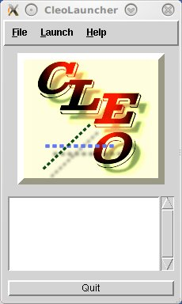
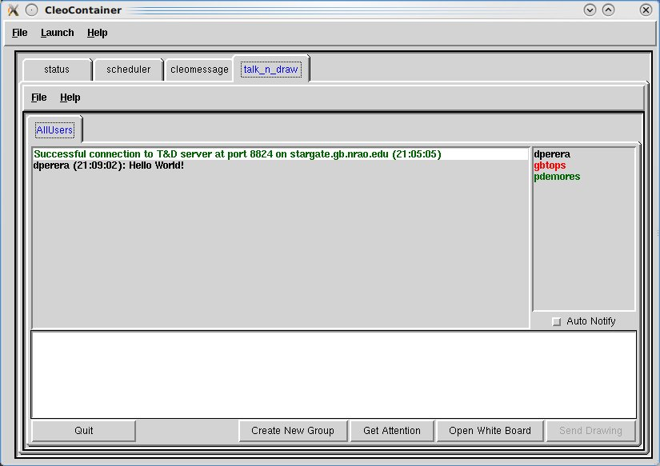
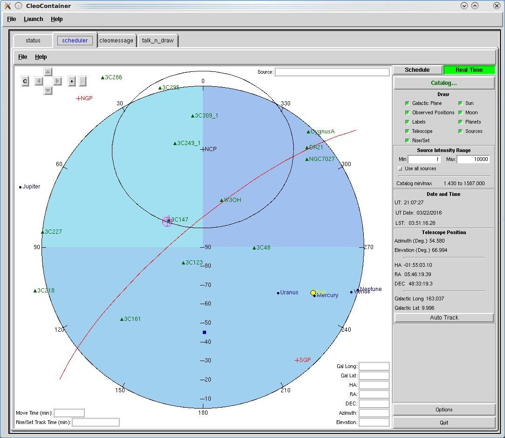
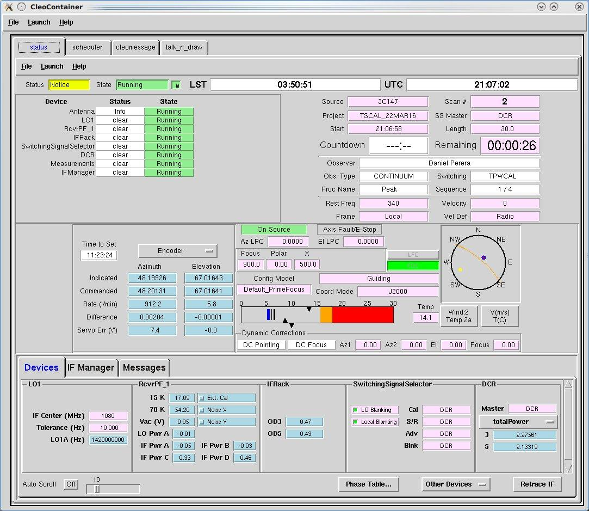
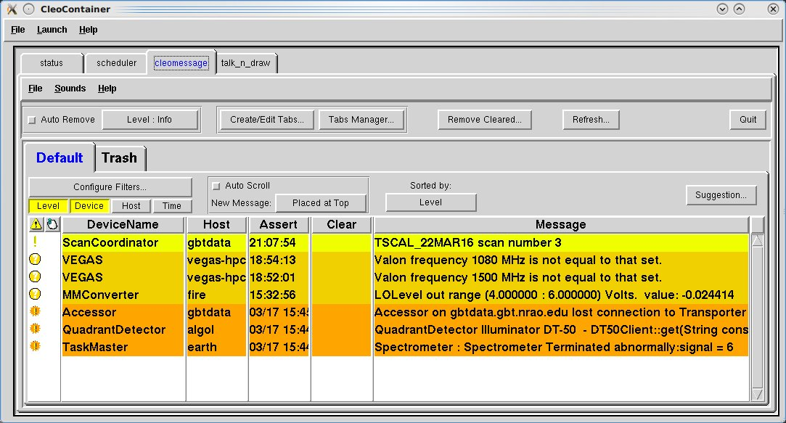
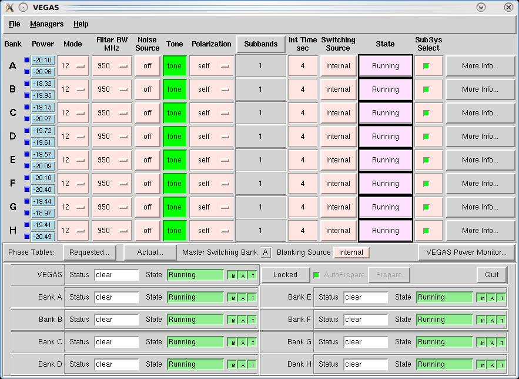

.. cleo:: 

Control Library for Engineers and Operators (CLEO)
--------------------------------------------------

The Control Library for Engineers and Operators (CLEO) system provides a large number of 
utilities for monitoring and controlling the GBT hardware systems. Some of these are 
quite useful for observers, although most are intended for expert users and GBT staff.

Useful help messages pop up when you hover the mouse over any CLEO widget for a few seconds.
Documentation is also available on the following web pages, but is somewhat out of date, so
its best to consult your GBT project friend for details.

* http://www.gb.nrao.edu/~rmaddale/GBT/CLEOManual/index.html
* http://www.gb.nrao.edu/~rmaddale/GBT/CLEOManual/tableofcontents.html

.. todo:: Transfer (relevant) content of the CLEO manual to GBTdocs.

The following section describes just a few \gls{CLEO} utilities that are useful for observers.

Starting CLEO
^^^^^^^^^^^^^

To start CLEO, log in to any Linux workstation in Green Bank, open a terminal  window, and 
type ``cleo``.  A "Cleo Launcher" window will appear.

Click on the ``Launch`` menu to get a list of programs that can be run. Remote observers
working via VNC or FastX may prefer to use a "Cleo Container" which launches and displays
CLEO applications as tabs within a single window. Cleo Container can be opened from the 
terminal by typing ``cleo cleocontainer`` or from the CLEO Launcher via ``Launch``
:math:`\rightarrow` ``Cleo Container...``.

Talk and Draw
^^^^^^^^^^^^^

``Launch`` :math:`\rightarrow` ``Observer Tools`` :math:`\rightarrow` ``Talk and Draw``

Launching "Talk and Draw" will open a window that allows communication with all other users
of the same application including the GBT operator.

.. todo:: Replace image with screenshot of standalong Talk And Draw window.

Messages typed in the white text box near the bottom of the screen will become visible to 
other users after pressing the ``Enter`` key.

You may also create private groups via the ``Create New Group`` button and inviting other
users to join.  The private session will be accessible through a new tab next to the default
``AllUsers`` tab. You may then send messages within your newly created group or to ``AllUsers``
(including the operator) by selecting the relevant tab and entering a message.

Scheduler and Skyview
^^^^^^^^^^^^^^^^^^^^^

``Launch`` :math:`\rightarrow` ``Observer Tools`` :math:`\rightarrow` ``Scheduler & Skyview...``

This displays a plot of the sky in Az/El coordinates as viewed from Green Bank.

.. todo:: Replace image with screenshot of standalong Scheduler window.

You can import a catalog of source positions to be displayed, or display one of the lists of 
standard calibration sources. By default it displays solar system objects. For example, to 
display sources listed in the standard AstrID "xband_pointing" catalog press
``Catalog`` :math:`\rightarrow` ``Add/Select/DeSelect Catalogs...`` :math:`\rightarrow` 
``xband_pointing`` :math:`\rightarrow` ``Apply`` :math:`\rightarrow` ``OK``.

If you select ``Schedule`` (button at upper right), you may enter a date and time and display
the sky for that time.  It shows the corresponding LST, and moving the cursor on the plot 
displays the RA/Dec and Az/EL under the cursor. This is very useful for planning observations.
There is also a ``Real Time`` option in which the location of objects and the direction the
GBT is pointed are displayed for the current time.

Status
^^^^^^

``Launch`` :math:`\rightarrow` ``Status...``

This displays the status of many GBT systems all on one screen.

.. todo:: Replace image with screenshot of standalong Status window.

Messages 
^^^^^^^^

``Launch`` :math:`\rightarrow` ``Messages...``

This shows all system status messages.

   .. todo:: Replace image with screenshot of standalone message window.

It's often useful to identify problems that might arise with any of the GBT devices.

VEGAS
^^^^^

``Launch`` :math:`\rightarrow` ``Backends`` :math:`\rightarrow` ``VEGAS...``

The CLEO VEGAS screen follows standard CLEO conventions, and is fairly self-explanatory.
As for all backend screens, IF system information for a selected bank can be displayed
by clicking on the blue square to the right of the Bank label.

The CLEO VEGAS screen can be used to launch the VEGAS Data Monitor by clicking on the
``VEGAS Power Monitor...`` button.

See here for more information on :ref:`references/backends/vegas:Monitoring VEGAS observations`.
