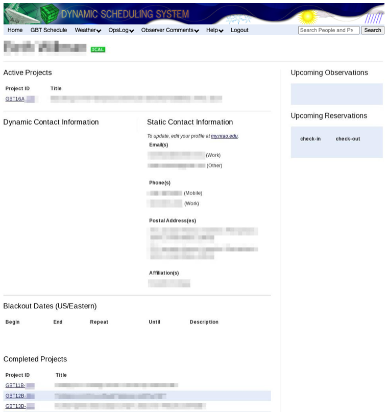
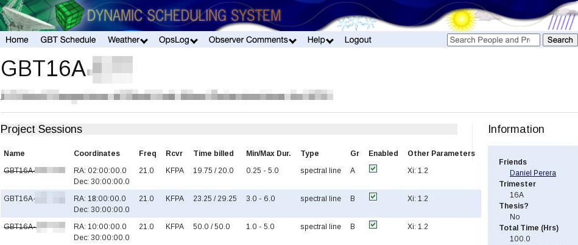
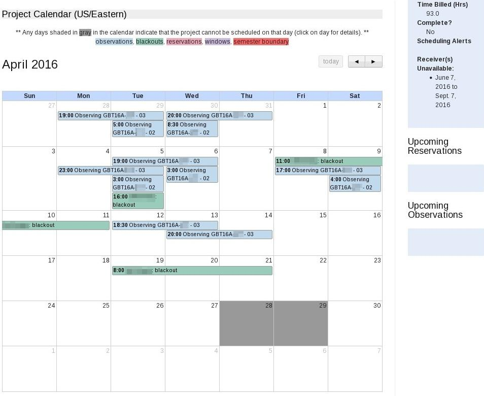
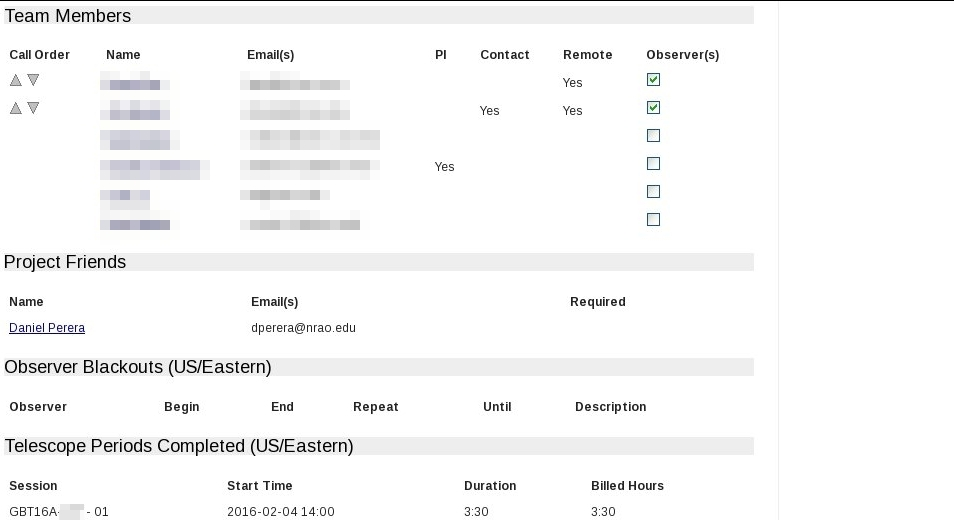
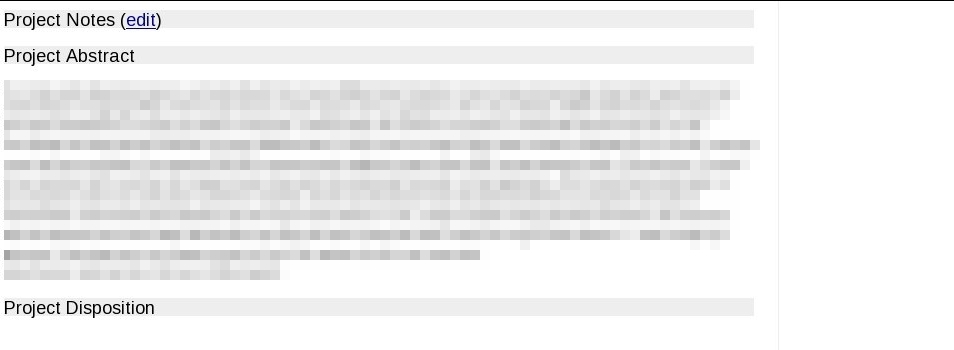

.. _dss:
Dynamic Scheduling System
-------------------------

.. todo:: Add a short paragraph describing why the DSS is important from the perspective of the observer. 

The GBT has been scheduled with the Dynamic Scheduling System (DSS) since October 1, 2009.
You can access the DSS through https://dss.gb.nrao.edu.

Overview of the DSS
^^^^^^^^^^^^^^^^^^^

The Green Bank Telescope Dynamic Scheduling System (DSS) improves observing efficiency by matching
schedules to weather forecasts while preserving observer control of the telescope. Each day, the 
DSS evaluates weather, equipment, and observer availability, then generates a 24-hour schedule for
the following day. Observers therefore usually receive 24–48 hours’ notice before their project will 
observer. 

Observers can use the DSS to pause their projects, set blackout dates, or withdraw if conditions do 
not meet their science goals.

Remote observing is supported, but visiting Green Bank increases the chance of being scheduled. 
Visits should be arranged in advance with the assigned GBT project friend. To improve scheduling
opportunities, we recommend visits of one to two weeks, with high-frequency projects (20 GHz and
above) often requiring stays of two weeks or longer.

DSS Terminology
^^^^^^^^^^^^^^^

The process of scheduling GBT observations begins with the preparation of the proposal using the 
`NRAO Proposal Submission Tool (PST) <https://my.nrao.edu/>`__. Proposals accepted by the NRAO 
Time Allocation Committee (TAC) become GBT projects that appear in the DSS system and are identified
by an assigned project ID (e.g., ``GBT09A-001``).

Projects are divided into sessions, which have associated parameters that define how the observation
should be scheduled. These parameters include sky position, time allocated, observing frequency,
and minimum and maximum durations preferred for a single, contiguous block. Sessions for monitoring
observations have additional parameters describing how often to repeat the observation. The project 
investigator (PI) initially defines the session parameters in the proposal, but the parameters may 
be modified by request to the :email:`DSS helpdesk <helpdesk-dss@nrao.edu>`. Observers can see the 
most critical session parameters on the DSS web pages.

Completing the observations for a session may require scheduling multiple segments. Each contiguous
block of scheduled time is called a **telescope period**.

As telescope periods are completed, the project and associated sessions will be billed for the time.
If any time is lost to weather or an equipment failure, the observer may consult with the telescope 
scheduler (via the helpdesk) and request that the project not be billed for the lost time.

Controlling the Scheduling of a Project}
^^^^^^^^^^^^^^^^^^^^^^^^^^^^^^^^^^^^^^^^

Users can access their DSS account by logging in to the system at https://dss.gb.nrao.edu.
The DSS username and password are the same as those used for NRAO Interactive Services (i.e.,
the Proposal Submission Tool).

From the DSS website, users can view and manage the scheduling information for their projects.
In order for a project session to enter the pool of sessions eligible for scheduling, the user 
is responsible for ensuring that the session is enabled in the DSS, and that a qualified observer
is available to perform the observation. Sessions and observers are enabled for observing simply
by clicking a check box in the :ref:`DSS project page <references/dss:DSS Project Page>`. 

Users can control when their project is scheduled by enabling or disabling individual sessions.

.. important:: 

    Astronomers intending to observe remotely must be trained and approved by GB staff before
    the project can be authorized and made eligible for scheduling.

Observers can enter personal blackout dates. Blackouts can be entered either as one time events 
(e.g., May 1, 20:00 to May 4, 05:00 UT) or as repeating events (e.g., every Monday from 15:30 
to 17:30 ET). If all observers for a given project are blacked out at a given time, that project
will not get scheduled. If at least one observer is not blacked out, the project is eligible for
scheduling. The default time zone used for entering blackouts is set in the *Preferences* tab,
which is linked at the top of every DSS web page. Observers can also override the default by 
selecting a time zone when making a blackout entry.

Observers with more than one project will find that they need to enter blackout dates only
once, and the dates will be applied to all their projects. **Those visiting Green Bank to
observe should use blackout dates to mark the periods of their travel before and after the
run to ensure they are scheduled only when available and ready on-site.**

When entering blackouts, keep in mind, too, that projects do expire, so it is in the interest 
of the observer to keep the projects eligible for scheduling as much as possible.

Guidelines for the use of blackouts
''''''''''''''''''''''''''''''''''

While blackout dates give observers control of the scheduling process, efficient GBT operation
requires that not too much time be blacked out or disabled. It is especially important that 
projects with large observing allocations not have too much time unavailable for scheduling
because of blackouts. As a guideline, projects with more than 20 hours of allocated observing
should limit time that cannot be scheduled to no more than 20% of the total eligible observing 
time over the course of a semester. If a project cannot meet this guideline, the PI is encouraged
to increase observing opportunities by enlisting additional observers who are qualified for
remote observing. Projects that require observers to visit Green Bank for training are excluded
from this guideline until the observers are trained for remote observing.

Caution Regarding Blackouts
'''''''''''''''''''''''''''

If a project has only one observer, that observer should be particularly conscientious of 
blackouts. It can be easy for an observer to inadvertently hamper observing opportunities 
by setting blackout dates too freely, particularly repeating blackouts. Repeating blackouts 
should be used with care. Targets with low declinations, such as the Galactic Center, have 
tightly constrained observing opportunities to begin with, so observers on such projects
should be particularly careful with blackouts that would further limit their observing
opportunities. Consider, as an example, a project that has a session with a 4-hour
minimum duration to observe the Galactic Center. If the observer has a repeating 1-hour
blackout date that intersects the window, the entire session becomes ineligible each time
the blackout intersects the 4-hour window.  The Green Bank Observatory is not responsible
for lost observing opportunities due to excessive blackouts.

Canonical Target Positions
^^^^^^^^^^^^^^^^^^^^^^^^^^

The DSS keeps track of a project's scheduling requirements via the session parameters,
which can be viewed on the project page. The PI should check that session parameters
properly reflect the needs of the project. The project Friend assigned by NRAO can also
offer advice on optimizing session parameters, where appropriate. In some cases, a
session's target position may be representative of a group of objects clustered on the sky.
As the project progresses and some of these targets are observed, this representative
position may need to be updated. In this case, the PI should send an email request to
the DSS helpdesk.

The DSS can automatically update the sky coordinates of common, fast-moving solar system objects,
including comets. The position is updated each day prior to scheduling. On the project page under
*Project Sessions*, an asterisk next to the coordinates indicates that the position for that 
session is automatically updated in this manner.

Many observers find it helpful to use a sky-plotting tool to help plan their observations
and keep track of target locations on the sky. The CLEO :ref:`<references/cleo:Scheduler and Skyview`
tool, which runs on Linux systems in Green Bank and can be run 
:ref:`remotely through VNC or FastX <how-tos/infrastructure/remote-connection:How to connect remotely to the GBO network>`,
is one such tool that allows a GBT user to plot target locations on the sky for any date and time. This
application can read target coordinates from a standard astrid catalog file. Observers will find
this tool handy for identifying the time of day a project may get scheduled, as well as helping to
plan observations in detail after they are scheduled. 

Contact Information and Project Notes
^^^^^^^^^^^^^^^^^^^^^^^^^^^^^^^^^^^^^

Observers can specify how they should be contacted, prior to and during their observations. 
It is critical to keep contact information current. Each observer can provide *dynamic contact*
information in a free-format text box. Here the observer should provide any contact information
not available through the person's (static) NRAO contact information, which is also listed on the
page. Observers can also specify the order in which they should be contacted by GBT operations, 
in the event of any schedule changes or in case there is need to contact the observer for any 
reason prior to the scheduled start time. Specify the order by clicking the arrow icons next to 
the list of team members, on the DSS project page.

Finally, observers can record *Project Notes* on the DSS project web page. Project notes provide
observers a place to store and share observing instructions. The notes are visible to all project
team members as well as the GBT operations staff and schedulers. Observers who need to share
instructions or other information with the GBT operator prior to the start of an observation can 
provide these instructions in the project notes area. Project notes are not intended to be a log 
for observations, but rather a place to store brief instructions or news that should be shared 
among observers and the GBT operator.

The DSS Software
^^^^^^^^^^^^^^^^

DSS Home Page
'''''''''''''

Upon logging in to the DSS system, you will arrive at your DSS home page where you see a list of
active projects on which you appear as (co-)investigator.

From the \gls{DSS} home page, you can:

* access the project page for each of your affiliated projects
* see a list of upcoming observations
* see a list of upcoming Green Bank room reservations
* see your *static* contact information, as entered in the `NRAO services syste <http://my.nrao.edu>`__.
* set *dynamic* contact information
* set blackout dates
* follow a link to the current GBT fixed schedule
* follow a link to the weather forecasts page
* follow a link to the \gls{NRAO} support center
* set the default time zone via the * Preferences* link (under your name)
* access DSS documentation
* establish an iCalendar subscription. Instructions for using iCalendar are available by hovering
  the mouse cursor over the iCal icon on the DSS Home Page.

DSS Project Page
''''''''''''''''

By selecting a project ID, you are presented with the project page. 

Here is a list of what you can do on this page: 

* inspect session parameters
* enable or disable individual sessions
* view total allocated and billed time
* see a project calendar
* view scheduling alerts
* view receiver availability 
* view upcoming reservations
* view upcoming observations
* specify observers from the project team, and set the order they should be
  contacted by GBT operations

  * see a list of blackout dates for all observers on the project
  * see a list of completed telescope periods
  * store and share project notes
  * view your abstract and disposition letter

The project calendar gives observers an idea when their project is eligible for scheduling.
Regardless of the weather, there will be times when a project is not eligible for scheduling,
for example because of no receiver availability, observer blackouts, fixed telescope maintenance
periods, and other fixed projects appearing on the GBT schedule. Times not eligible for 
scheduling will be grayed out on the project calendar.

The project calendar helps with planning in a number of ways. However, it is important to 
understand that a session's eligibility is based on ever-changing constraints, and can 
change from *not eligible* to *eligible* at any time. Therefore, if observers wish to 
take a break from observing based on the calendar outlook, they should either disable
all sessions until they are ready to resume with the observing, or enter blackout dates 
to cover the period they do not wish to observe.

The project page includes a panel with project team members listed. Using a checkbox, 
team members can select or deselect those identified as observers. They can also rearrange
the order observers are listed. The top observer in the list is expected to observe the 
next scheduled session. If there is a change in schedule, this person will be called first.

Responsibilities
^^^^^^^^^^^^^^^^

Each project has a PI and, optionally, a list of additional investigators. An investigator 
is eligible to be an observer for a given project if that person is qualified for remote 
observing or is on site in Green Bank.

It is essential that one of the observers for a scheduled project contact GBT operations 
at least 30 minutes prior to the start of the observation. Observers can contact the GBT
operator by telephone (304-456-2341), by the CLEO chat program ``Talk and Draw``  (for 
qualified remote observers), or by showing up in the GBT control room. If the GBT operator
has not been contacted before the session's start time, the operator will phone observers
in the order they are listed on their project web page.

.. note:: 

    The PI is responsible for:

    * managing the project
    * identifying all associated observers
    * working with project team members and the GBT project friend to ensure that Scheduling
      Blocks are properly and promptly prepared.
    * enabling each session by clicking the ``Enabled`` checkbox on the project's web page. 
      Sessions should be enabled only if they will be ready for observing in the next 24 hours.
    * ensuring that all associated observers have provided contact information including a 
      current telephone number and an email address for each observer.
    * ensuring that a project's scheduling information is current. This includes checking the 
      hours remaining on the project and ensuring that the session parameters are up-to-date 
      and accurate.
    * ensuring that each scheduled telescope period has an observer who is available at least
      30 minutes before the session is scheduled to begin.

.. note:: 

    Observers are responsible for:
    
    * ensuring that the DSS project web page has their current contact information. For remote
      observers, this includes entering telephone numbers where they can be reached at the time of observation.
    * contacting GBT operations 30 minutes prior to the start time of an observation.
    * attending to observations during a scheduled telescope period. The PI is responsible for 
      "no-shows" and the ensuing reduction in their alloted time. 
    * notifying GBT operations if they find conditions unsuitable for their session.
  

Remote Observing
^^^^^^^^^^^^^^^^

To use the GBT remotely, observers must first be trained and certified by Green Bank staff. 
We encourage experienced observers to request additional training from GBO staff when using
instruments or observing modes unfamiliar to them.

Contact your GBt project friend or the :email:`DSS helpdesk <helpdesk-dss@gb.nrao.edu>` if
you believe the DSS does not have you listed properly as a qualified remote observer.

See :ref:`how-tos/infrastructure/remote-connection:How to connect remotely to the GBO network`
for remote connection details.

The Daily Schedule
^^^^^^^^^^^^^^^^^^

Each day between about 7:00 and 12:00 PM ET the telescope schedule is fixed for the 24-hour
period beginning 8:00 AM ET the next day. For example, by 12:00 PM ET Monday, the observing 
schedule is fixed for the period 8:00 AM ET Tuesday through 8:00 AM ET Wednesday. Each morning
this daily schedule is published and can be viewed on the DSS web site by anyone. Those with 
projects on the 24-hour fixed schedule will be notified by email.

Observers must ensure that their blackout dates and session enabled flags are up to date each
day by about 5:00 AM ET. Changes made after this time may not be reflected in the upcoming
day's schedule.

It is possible that weather conditions may change after a schedule is published, compromising 
the observing efficiency for some scheduled telescope periods. The observer or GBT staff may
then decide to cancel a telescope period and substitute an alternate "backup" observation in 
its place. Note that the observer may decide that the weather conditions are too poor even 
after beginning the observation. Equipment failure can also lead to cancellations. If GBT
staff must change the 24-hour schedule for these reasons, affected observers will be notified
immediately by email or telephone.

Backup Projects
^^^^^^^^^^^^^^^

When a scheduled telescope period is cancelled, a backup project will be scheduled on short
notice. By volunteering as a backup project, observers improve their project's chances of 
getting observing time. Backup projects can come in two categories: observer-run and 
operator-run. There are several requirements that must be met before a project can be 
considered for backup status.

Session Types
^^^^^^^^^^^^^

There are four types of sessions defined for astronomy projects:
* open 
* windowed
* elective
* fixed
 
Open sessions have no major constraints on when they can be scheduled, beyond the functional
requirements that an observer is available, the source is above the horizon, and the weather
is suitable. Most sessions fall into this category and provide the most flexibility in the DSS.
At the other extreme are fixed sessions that have no flexibility and are prescheduled at a 
particular date/time; that is, their telescope periods have already been defined.

The other two types are windowed and elective sessions, which have some constraints but are 
not fixed on the schedule. The most common examples are monitoring and VLBI sessions, where 
the science demands that an object must be observed at defined intervals or times.

Windowed sessions are defined by a cadence that may be either periodic or irregular. For 
example, an observer may require observing a target once per month for five months, with 
each observation having a tolerance of plus or minus 3 days. In this example, the window 
size is 7 days.

Currently, windowed sessions are scheduled in the following way. The cadence information from 
the proposal is used to preschedule all windowed sessions whereby all of the telescope periods
are temporarily fixed in what are called default periods. The user is given the window template
(e.g, 8-14 January; 8-14 February; 8-14 March; 8-14 April; and 8-14 May). Within a windowed 
period, a windowed session will be considered like an open session. Near the end of each 
window range is a default period. If the session has not been selected by the time the default
period arrives, the session will be scheduled in the default period. The default period may be
moved manually to a later time slot within the window if the human scheduler notices a problem
with the original default period. When the windowed period is scheduled, the observer will be
informed 24-48 hours in advance, just like an open session. The only difference is that the
observer will be provided with the window template for planning purposes. 

Elective sessions are a restrictive form of windowed sessions.  Here, rather than having a
range of days on which the project session can be scheduled, there is a list of possible days.
As with windows the list of possible days, or * opportunities*, has a default period on which
the session will be scheduled if it has not run in advance of that date.

Projects that can Tolerate Degraded Weather
^^^^^^^^^^^^^^^^^^^^^^^^^^^^^^^^^^^^^^^^^^^

The DSS is designed to schedule projects in weather that is appropriate for the 
frequency being observed. Some projects can tolerate lesser weather conditions than the
DSS would assign by default. For example, consider a project at K-band that observes many
targets, each for a short duration, say 10 seconds. The observing time for this project is
dominated by overheads in slewing from one position to the next, so marginal K-band weather
might be acceptable. The observing team may prefer not to wait for very good K-band weather,
which is rare and would delay their scheduling.

To enable more aggressive scheduling, the observer should send an email to the :email:`DSS helpdesk
<helpdesk-dss@nrao.edu>` requesting that the project be considered for scheduling in lesser
weather conditions. The DSS support team can enter a session-specific factor, :math:`\xi`,
that effectively elevates the score for this session in marginal opacity conditions. The :math:`\xi`
parameter is tunable so the observer can request that the project be scheduled very aggressively,
or modestly so. The factor only affects scoring related to atmospheric opacity, so high frequency
projects that are sensitive to high winds will still not get scheduled when the forecasted winds
preclude accurate pointing.

The DSS support team will help observers decide if their project can tolerate lesser weather. 
Note that this capability will not be used to accelerate scheduling of projects that truly do 
benefit from the most appropriate weather.

Other DSS Control Parameters
^^^^^^^^^^^^^^^^^^^^^^^^^^^^

A list of the most relevant parameters is provided below. Any changes to these parameters must
be requested by contacting the GBT scheduler via the :email:`DSS helpdesk <helpdesk-dss@nrao.edu>`.

* **Required Minimum Duration**
    Minimum time for scheduling a session.

* **Required Maximum Duration**
    Maximum time for scheduling a session.

* **Time Between Sessions**
    Time which must elapse between the end of one scheduled session period and the start of the
    next, typically used to allow the observer to sleep or reduce data.

* **Minimum Effective System Temperature** (:math:`\xi`)
    Some observers may wish to have their project scheduled even if the weather is not ideal.
    For example, projects that use very short integration times are dominated by overheads,
    not the radiometer equation, and so they may wish to get a scoring boost in order to allow
    observing under a wider range of weather conditions. To implement this desire, we allow 
    observers to modify the minimum effective system temperature, :math:`T_{\text{sys}}^{'}e^{\tau^{'}}`.
    This value usually has a default set by the DSS, and depends on observing frequency. Here,
    :math:`T_{\text{sys}}` is the atmospheric system temperature and :math:`\tau` is the opacity.
    Recall the atmospheric observing efficiency is
    
    .. math::
        
        \eta_{\text{atm}} = \left(\frac{{T_{\text{sys}}^{'}e^{\tau'}}}{{T_{\text{sys}}e^{\tau}}}\right)^2,
    
    where the prime denotes the minimum value. The minimum effective system temperature can be 
    scaled by a factor :math:`\xi` to either improve or degrade the atmospheric conditions for 
    a particular session. The default is :math:`\xi = 1.0`. You needs to use caution when modifying
    this parameter, especially because it will have a different effect at different frequencies.
    For example, doubling the minimum effective system temperature will have a much larger effect
    at Ku-band than at K-band.
    
    The parameter :math:`\xi` enters into the scoring in two ways.  It affects the computation of 
    overall observing efficiency, :math:`\eta_{\text{total}} = \eta_{\text{atm}} \times \eta_{\text{tracking}} \times \eta_{\text{surface}}`
    and it also enters by modifying the threshold, minimum value.
    
* **Tracking Error Threshold, Source Size, and Tracking Efficiency**
    To control the effect of the expected tracking error on scheduling a session, you should be 
    able to modify either of two values:
    
    * :math:`f_{\text{max}}`
        the tracking error limit in units of HPBW (default 0.22 for Rcvr68_92, 0.4 for Rcvr_PAR and
        0.2 for all other receivers)}
    * :math:`\theta_{\text{src}}`
         the nominal source size in units of arc seconds (default 0.0)

    The tracking error is called :math:`f`, and the tracking error limit is called :math:`f_{\text{max}}`.
    If :math:`f > f_{\text{max}}` the observation is too inefficient and does not get scheduled. Keep in
    mind that the tracking error :math:`f` comes into play not only in regard to the limit, but also in 
    the scoring equation. The value of :math:`f` is ultimately a function of wind speed and observing
    frequency: 

    .. math:: 
    
        f = \frac{\sigma}{\theta_b},

    where

    .. math:: 

        \left(\frac{\sigma}{\text{arcsec}}\right) \simeq \sqrt{\sigma_0^2+\left(\frac{|v|}{3.5 {\text{ m s}}^{-1}}\right)^4}    
    
    (see Eq. 1, :cite:alp:`Maddalena2014`) and

    .. math:: 

        \left(\frac{\theta_b}{\text{arcsec}}\right) \simeq \frac{748}{\nu},
    
    with :math:`\theta_b` being the HPBW, :math:`\sigma_0` being the rms tracking error in the absence
    of wind, equal to 1.32" at night and 2.19" during the day, and :math:`\nu` being the observing 
    frequency in GHz.

    A value :math:`f_{\text{max}} = 0.2` assures observers that their flux uncertainty due to tracking
    errors will be no more than 10%, assuming they are observing a point source (:math:`\theta_{\text{src}} = 0.0`).
    Observers who wish to do better than 10% may decide to specify a smaller value of :math:`f_{\text{max}}`. For
    example :math:`f_{\text{max}} = 0.14` assures no more than 5% flux uncertainty due to tracking errors.

    Some observers may wish to relax the tracking restrictions because their source is extended, not point-like.
    So the most natural way for them to ease the constraint is to specify a source size: :math:`\theta_{\text{src}}`.
    The default value is :math:`\theta_{\text{src}} = 0.0"`. If the user specifies :math:`\theta_{\text{src}}` then
    the tracking error :math:`f` should be calculated as follows:
    
    .. math::

        f = \frac{\sigma}{\theta_{\text{obs}}}, 
    
    where

    .. math::

        \theta_{\text{obs}} = \sqrt{\theta_{\text{src}}^2 + \theta_{\text{b}}^2}
    

    This new value for the tracking error must then be used in calculating the tracking efficiency,
    :math:`\eta_{\text{tr}}`. So changing the source size impacts the scoring equation through both
    the tracking efficiency and the tracking error limit.

    To summarize, most observers will not need to modify :math:`f_{\text{max}}` or :math:`\theta_{\text{src}}`.
    If they do, it would be most sensible to modify only one or the other. If observing point sources, the
    observer may wish to change :math:`f_{\text{max}}` to tighten or loosen the requirements. If observing 
    extended sources, the observer should stick with :math:`f_{\text{max}} = 0.2` and change the value of 
    :math:`\theta_{\text{src}}`.

    Specifying both :math:`f_{\text{max}}` and :math:`\theta_{\text{src}}` need not be forbidden by the 
    software, but it is probably not the best approach.
  

* **Irradiance** 
    Section 3.4.5 of DSPN5 describes the concept of irradiance, an important concept for continuum observations
    above 2 GHz.  Most continuum observations prefer the default values of irradiance (300 W M\ :math:`^{-2}`),
    there are times when the value should be tunable, and any value of irradiance may be used for the DSS.

    .. todo:: Copy the section from the DSPN here, or make it otherwise available and add reference.

   
* **Elevation Limit**
    This parameter allows the observer to modify the frequency dependent hard elevation limit, and instead 
    set it to any value (in degrees). When using this parameter, the hour angle scoring factor will be set 
    to zero when the source for a session is less than the minimum allowed elevation and set to one otherwise.
    
* **Solar Avoidance**
    The angle by which the project must avoid the sun. The default here is 0.
    
* **Time of Day**
    Time of day restrictions for this session. Options are: 
    * Any Time of Day (default)
    * RFI (8pm - 8am)
    * PTCS (sunset - sunrise+2hours).
    
* **Transit**
    The central coordinates of this session must pass through transit, with  at least 25% of the session on
    either side of the transit window.
    
* **LST Exclude/Include**
    This allows the session to exclude/include LST ranges when scheduling.  More than one range can be given,
    but they must be listed sequentially.
    
* **Keyhole Limit**
    Boolean to set a maximum elevation, specified by the sessions primary (first in list) receiver.  When 
    set to true, sessions not requiring Mustang will not be scheduled when their source will be above 80 degrees
    in elevation during the duration of the telescope period; Mustang observations will not be scheduled when
    the source will be above 78 degrees in elevation during the duration of the telescope period.
    
* **Good Atmospheric Stability (GAS)**
    The atmospheric stability limit, :math:`\ell_{\text{st}}`, is a factor in the scoring algorithm (see DSPN 5).
    It is used only for continuum observations which are sensitive to atmospheric fluctuations. Currently, a 
    forecast downward irradiance, :math:`I_{\text{down}}`, threshold value of 300 W/mi\ :math:`^2`, is used to 
    derive :math:`\ell_{\text{st}}`. However, a different metric has been developed for the 90 GHz Bolometer 
    array, MUSTANG, that uses the atmospheric system temperature (including hydrosols) at the target position
    elevation. GAS is used to set the value of :math:`\ell_{\text{st}}` for MUSTANG only and is ignored for all 
    other receivers, as follows:
    
    For MUSTANG **only** derive the atmospheric stability limit by first calculating the zenith atmospheric 
    system temperature at 90 GHz. (This includes hydrosols, the default in the CLEO command line interface,
    and is described in equation 7 in DSPN 5.)
   
    .. todo:: Either add the eq.7 section from DSPN5 here or make DSPN5 available otherwise.

    The atmospheric system temperature is the last term on the right hand side of the equation, 

    .. math:: 

        T_{\text{sys}}^{\text{atm}}(El = 90^\circ) = T_{\text{k}}\left(1-e^{\left(EL=90^\circ\right)}\right),

    then derive the low opacity atmospheric system temperature}
        
    .. math:: 

        T_{\text{sys}}^{\text{atm}}(El = 90^\circ)/Sin(El)
    
    For MUSTANG, assume a frequency of 90 GHz. 
  
    .. math::

        \begin{align}
            \text{GAS is TRUE ("good"), i.e. } 
            \begin{cases}
                T_\text{sys}^\text{atm}(El = 90^\circ)/Sin(El) <  35K  & \rightarrow \quad\ell_\text{st}=1 \\
                \text{otherwise} & \rightarrow \quad\ell_\text{st}=0
            \end{cases}\\
            %
            \text{GAS is FALSE ("usable"), i.e.} 
            \begin{cases}
                T_\text{sys}^\text{atm}(El = 90^\circ)/Sin(El) <  50K  & \rightarrow \quad\ell_\text{st}=1 \\
                \text{otherwise} & \rightarrow \quad\ell_\text{st}=0
            \end{cases}
        \end{align}
    
    For all other receivers derive the atmospheric stability limit as usual: 
    
    .. math:: 

        \ell_\text{st} =  
        \begin{cases}
            1   & \text{if } I_\text{down} < 300 \text{W/mi}^2 \\
            0   & \text{else}
        \end{cases}
    

There are a number of additional controls and parameters that can be used within the DSS system which
are fully described in DSPN10.6.

.. todo:: It is currently unclear is all parameters described in DSPN10.6 have actually been implemented in the DSS. Eventually we would want to copy the relevant content from DSPN10.6 here.

