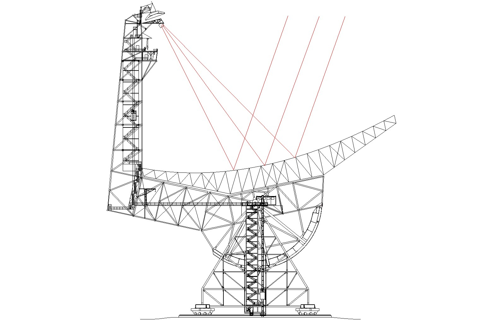
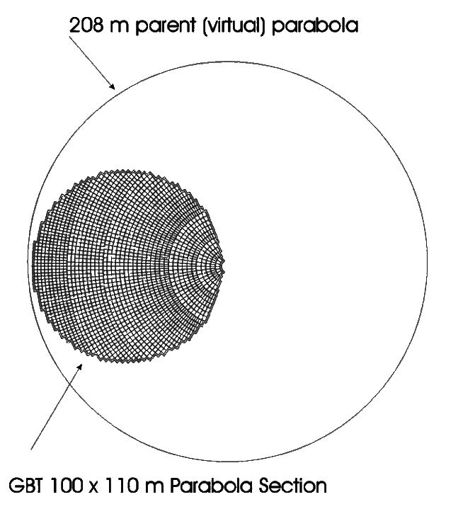

The GBT
-------

The 100 meter Green Bank Telescope (GBT) is intended to address a very broad range of astronomical problems
at radio wavelengths and consequently has an unusual and unique design. Unlike conventional telescopes that
have feed legs projecting over the middle of the surface, the GBT's aperture is unblocked so that incoming
radiation meets the surface directly. This increases the useful area of the telescope and reduces reflection 
and diffraction, which ordinarily complicate a telescope's pattern of response to the sky. To keep the 
aperture unblocked, the design incorporates an off-axis feed arm that cradles the dish and projects upward
at one edge. 

This requires that the figure of the telescope surface be asymmetrical. To make a projected
circular aperture 100 meters in diameter, the dish is actually a 100 by 110 meter section of a conventional,
rotationally symmetric 208 meter figure, beginning four meters outward from the vertex of the hypothetical 
parent structure. 

The GBT's lack of circular symmetry greatly increases the complexity of its design and construction.

To maintain precise surface figures and pointing accuracy at high frequencies the telescope is equipped
with a complex active surface (AS). At higher frequencies gravity distorts the surface figure of the 
telescope to unacceptable levels. Temperature variations and wind can also deform the figure of the dish.
To compensate for these distortions, the surface of the GBT is active i.e. it is made up of 2004 independent
panels and each of these panels are mounted on actuators at the corners, which can raise and lower the panels
to adjust the shape of the dish's surface. 

Main Features of the GBT
^^^^^^^^^^^^^^^^^^^^^^^^

* **Fully steerable antenna**
  
  * :math:`+5^\circ` to :math:`+90^\circ` elevation range (:math:`-46.5^\circ` to :math:`+90^\circ` declination)
  * 85% coverage of the celestial sphere
    
  .. note:: 

    Observing at elevations :math:`>86^\circ` (or :math:`80^\circ` during extremely cold weather) may fail due 
    to the high azimuth rates required.

* **Unblocked aperture**: Reduces sidelobes, RFI, and spectral standing waves.
* **Active surface**: Compensates for gravitational and thermal distortions.
* **Frequency coverage of 290 MHz to 116 GHz**: 3 orders of magnitude of frequency coverage for maximum scientific flexibility.
* **Location in the National Radio Quiet Zone**: Comparatively low RFI environment
* **Dynamic scheduling**: Matching scientific programs to the required weather conditions.

Telescope Specifications
^^^^^^^^^^^^^^^^^^^^^^^^

+------------------------+-----------------+----------------------------------------------------------------------------+
| Location               |                 | Green Bank, West Virginia, USA                                             |
+------------------------+-----------------+----------------------------------------------------------------------------+
| Coordinates            | longitude       | :math:`79^\circ` 50" 23.406' West (NAD83)                                  |
+                        +                 +                                                                            +
|                        | latitude        | :math:`38^\circ` 25" 59.236' North (NAD83)                                 | 
+                        +                 +                                                                            +
|                        | track elevation | 807.43 m (NAVD88)                                                          |
+------------------------+-----------------+----------------------------------------------------------------------------+
| Optics                 |                 | 110m x 100m unblocked section of a 208 m parent paraboloid                 |
+                        +                 +                                                                            +
|                        |                 | offaxis feedarm                                                            |
+------------------------+-----------------+----------------------------------------------------------------------------+
| Telescope Diameter     |                 | 100m (effective)                                                           |
+------------------------+-----------------+----------------------------------------------------------------------------+
| Available Foci         | prime           | f/D = 0.29 (referred to 208m parent parabola)                              |
+                        +                 +                                                                            + 
|                        | prime           | f/D = 0.6 (referred to 100m effective parabola                             |
+                        +                 +                                                                            +
|                        | gregorian       | f/D = 1.9 (referred to 100m effective parabola                             |
+------------------------+-----------------+----------------------------------------------------------------------------+
| Receiver Mounts        | prime           | retractable boom with Focus-Rotation Mount                                 |
+                        +                 +                                                                            +
|                        | gregorian       | rotating turret with 8 receiver bays                                       |
+------------------------+-----------------+----------------------------------------------------------------------------+
| Subreflector           |                 | 8m reflector with Stewart Platform (6 degrees of freedom)                  |
+------------------------+-----------------+----------------------------------------------------------------------------+
| Main reflector         |                 | 2004 actuated panels                                                       |
+                        +                 +                                                                            +
|                        |                 | average intra-panel RMS :math:`68\mu m`                                    |
+------------------------+-----------------+----------------------------------------------------------------------------+
| FWHM Beamwidth         | prime focus     | ~13.01' / :math:`f_{GHz}`                                                  |
+                        +                 +                                                                            +
|                        | gregorian focus | ~12.60' / :math:`f_{GHz}`                                                  |
+------------------------+-----------------+----------------------------------------------------------------------------+
| Elevation Limits       | lower limit     | :math:`5^\circ`                                                            |
+                        +                 +                                                                            +
|                        | upper limit     | :math:`90^\circ`                                                           |
+------------------------+-----------------+----------------------------------------------------------------------------+
| Declination Range      | lower limit     | :math:`-46.5^\circ`                                                        |
+                        +                 +                                                                            +
|                        | upper limit     | :math:`90^\circ`                                                           |
+------------------------+-----------------+----------------------------------------------------------------------------+
| Slew Rates             | azimuth         | :math:`35.2^\circ/min`                                                     |
+                        +                 +                                                                            +
|                        | azimuth-half    | :math:`17.6^\circ/min` (at cold temperatures :math:`\lesssim 16^\circ F`)  |
+                        +                 +                                                                            +
|                        | elevation       | :math:`17.6^\circ/min`                                                     |
+------------------------+-----------------+----------------------------------------------------------------------------+
| Surface RMS            | passive surface | :math:`450\mu m` at :math:`45^\circ` elevation, worse elsewhere            |
+                        +                 +                                                                            +
|                        | active surface  | :math:`\sim 250\mu m`, under benign night-time conditions                  |
+------------------------+-----------------+----------------------------------------------------------------------------+
| Tracking accuracy      |                 | :math:`\sigma_{tr}^2 = \sigma_0^2 + (s/3.5)^4`, where                      |
+                        +                 +                                                                            +
|                        |                 | * :math:`\sigma_0 = 1.32^"` (night)                                        |
+                        +                 +                                                                            +
|                        |                 | * :math:`\sigma_0 = 2.19^"` (day)                                          |
+                        +                 +                                                                            +
|                        |                 | * :math:`s` is the wind speed in m/s                                       |
+------------------------+-----------------+----------------------------------------------------------------------------+
| Pointing accuracy      |                 | :math:`\lesssim 10^"` blind pointing accuracy                              |
+------------------------+-----------------+----------------------------------------------------------------------------+
