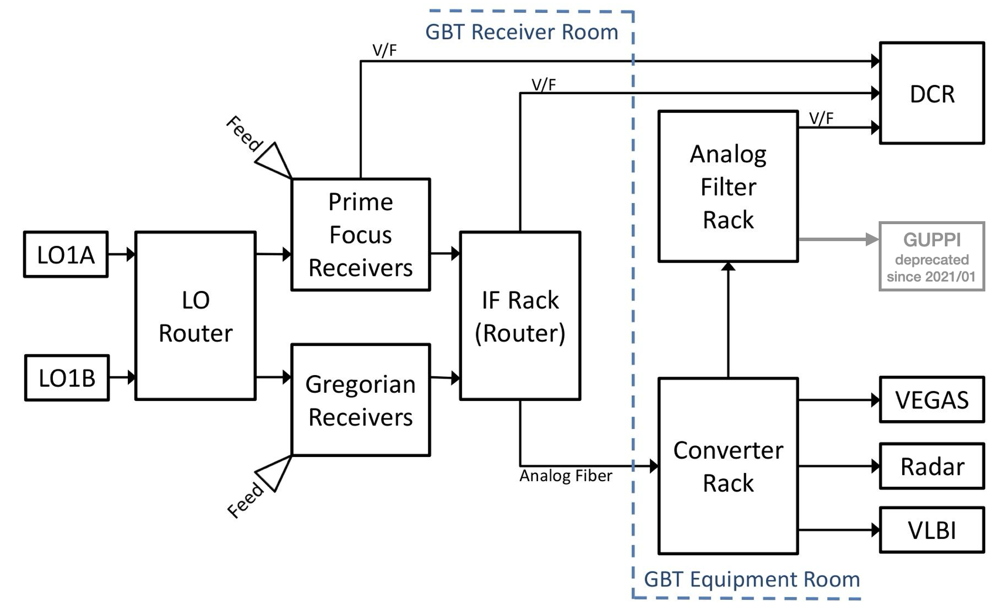
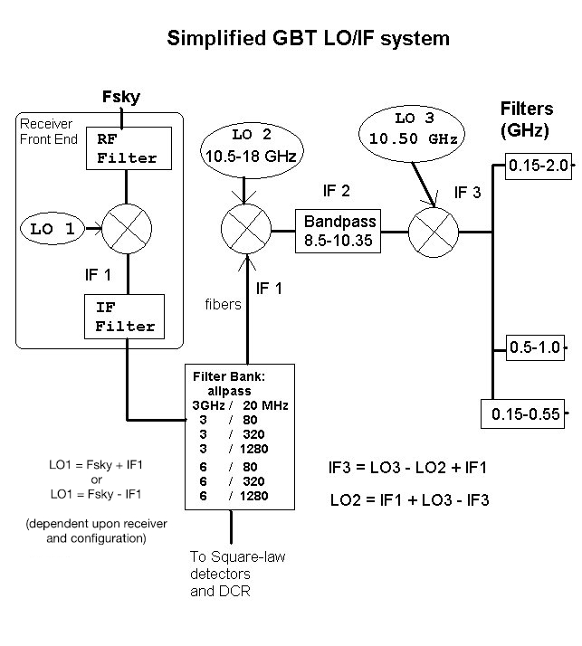
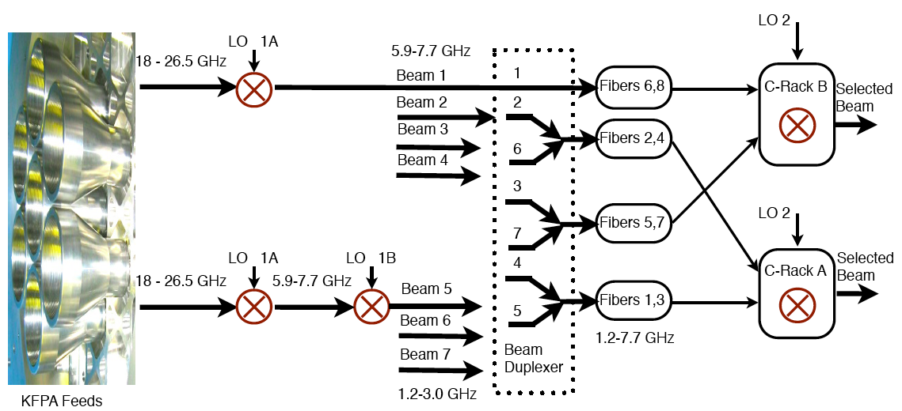

#############
GBT IF system
#############

This is a simplified flow diagram of the GBT IF system routing

This is a simplified flow chart of the GBT IF system

.. information:: 

    MUSTANG-2 is not covered in those figures, since it is a direct detection system.
    
    
.. note:: 

    During each frequency mix, each polarization pair is mixed with a signal from the same synthesizer. All synthesizers are locked to our H-maser frequency standard.

From the Receiver to the IF Rack
--------------------------------

The frequency that is observed is given by :math:`F_{\text{sky}}`.  Within the receiver
the detected signal at :math:`F_{\text{sky}}` is mixed with the LO1 signal. The LO1
frequency is derived from a synthesizer and can vary in time when Doppler tracking the 
velocity of a spectral line.  The result of the mixing of :math:`F_{\text{sky}}` and LO1
is the IF frequency, IF1. The typical IF1 center frequencies are 1080, 3000 and 6000 MHz.
Filters limit the bandwidth in the receivers both before and after the LO1 mix. There are
also filters in the IF rack that limit the bandwidth. The resulting allowed bandwidths 
are 20, 80, 320, 1280 MHz and "All Pass", i.e. no filtering other than the response of
the receiver.  

Before the IF Rack each signal is split into two (single beam receivers only) copies of
the original signal. Each signal in the IF Rack is detected and then sent to the DCR (as
used during pointing and focus observations). Each signal is also sent as an analog signal
over optical fiber to the Jansky Lab to the Converter Rack.

From the Converter Rack to the Backend
--------------------------------------

When the signal reaches the Converter Rack it is split into four separate copies. This 
allows up to eight different copies of the received signal for single beam receivers
and four copies of each received signal for dual beam receivers.  

In the Converter Rack the signal is mixed with the LO2 signal. Each copy of the signal
can be mixed with a different LO2 since there are eight different LO2 synthesizers. The
resultant signals are then sent through a filter to make sure it has a bandpass of no 
more than 1.85 GHz. A final mix with a fixed frequency of 10.5 GHz then gets the signal
within the input band-passes of the backends. There is a final set of filters that ensures
the signal has the correct bandwidth for the backend.

KFPA Combined IF
----------------

The KFPA receiver, with 7 beams, is the first GBT receiver with more IF signals than there
are optical fibers from the GBT to the Jansky Lab. In order to bring the IF signals to the 
control room, pairs of signals from different beams were duplexed on single fibers. The
signal combination was accomplished by an analog addition of the IF of pairs of beams. 
Beams 1, 2, 3 and 4 have IF signals centers at 6800 MHz. The IF signals from beams 5, 6 and 7
are down converted to 2100 MHz center frequency. Beam 2 is paired with 6, beam 3 with 7 and
beam 4 with 5. The next image shows the combination of KFPA beams onto fiber modems and their
selection in the Converter Rack Modules A and B:

At the Converter Rack one of the two beams is selected by appropriately setting the converter 
rack LO frequency. Beams 2, 4, 5 and 6 are routed to Converter Rack A and beams 1, 3 and 7 to
Converter Rack B. This constrains certain multi-beam observing modes, as is described in 
:ref:`KFPA`.

