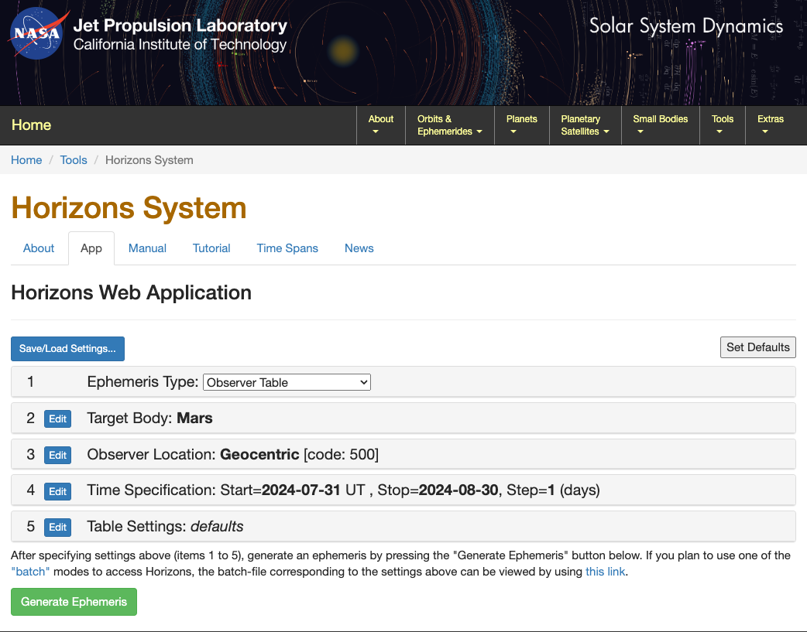
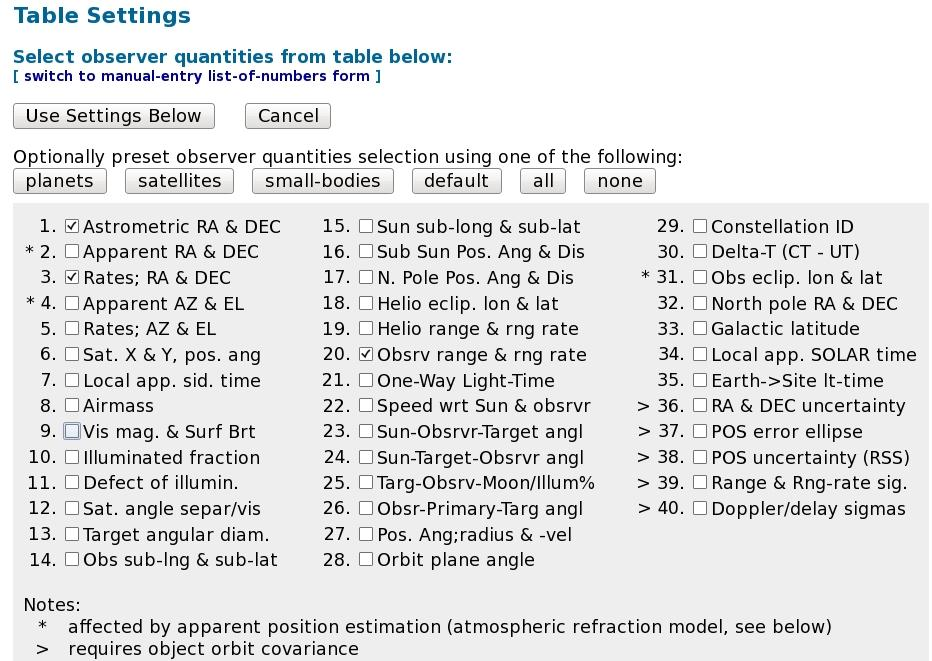

Catalogs
--------

The Source Catalog system in AstrID provides a convenient way for the user to specify
a list of sourcesto be observed, as well as a way to refer to standard catalogs of 
objects. At a minimum for each source there must be a name and a location (RA/Dec or 
Glat/Glon, etc). Other parameters may be set, such as radial velocity. An example of
a simple Catalog is:

.. literalinclude:: scripts/simple_catalog.cat


There are three formats of catalogs:

#. **SPHERICAL**: a fixed position in one of our standard coordinate systems, 
   e.g. RA/Dec, Az/El, Glon/Glat, etc.

#. **EPHEMERIS**: a table of positions for moving sources (comets, asteroids, 
   satellites, etc)

#. **NNTLE NASA/NORAD**: Two-line element sets for Earth satellites.


In addition, the following solar system bodies may be referred to by name, i.e. no 
catalog needs to be invoked for the system to understand these names: ``'Sun'``,
``'Moon'``, ``'Mercury'``, ``'Venus'``, ``'Mars'``, ``'Jupiter'``, ``'Saturn'``, 
``'Uranus'``, ``'Neptune'``, and ``'Pluto'``. These names are case-insensitive and 
may be given to any :ref:`Scan Type function <references/observing/scan_types:Scan Types and other functions - Overview>`.

To use the catalog system, you invoke the :func:`Catalog() <astrid_commands.Catalog>`
command within SBs and pass names of the desired objects to any of the 
:ref:`scan functions <references/observing/scan_types:Scan Types and other functions - Overview>`. 
All sources named in all the catalogs that have been invoked are available within an
SB. If the same name appears in two or more catalogs, the name from the most recently
invoked catalog will prevail. Name comparisons are case-insensitive, hence "b2322+16"
"B2322+16" are equivalent.


Getting a Catalog into AstrID
^^^^^^^^^^^^^^^^^^^^^^^^^^^^^

Although one can include any number of Catalogs in an SB, the standard
practice is to put all the Catalogs into separate files that are then brought
into the SB via multiple calls to the :func:`Catalog() <astrid_commands.Catalog>`
command. This: 

a. keeps SBs simple and without clutter
b. allows changes to be made to a Catalog without having to validate and re-save
   the SB

The best way to learn about how to bring Catalogs into an SB is through an example. 
Let's suppose that there are two Catalogs that you need for your observations. 
These two catalogs are in the following files:

* ``/home/astro-util/projects/GBTog/cats/sources.cat``
* ``/home/astro-util/projects/GBTog/cats/pointing.cat``

These catalogs may be loaded into the SB as shown in the following example:

.. _script-catalog-loaded:
.. literalinclude:: scripts/catalog_loaded.py
    :language: python


All sources from all catalogs are available and referenced by name within the scope
of the SB, with the exception that for duplicate source names only the last entry of
that name will be recognized. After loading a Catalog any scan function may be run
by giving it the source name as shown :ref:`above <script-catalog-loaded>`.


Catalog Format
^^^^^^^^^^^^^^

A Catalog typically has two sections: a header section followed by a table of information
for all the sources. The header section consists of ``KEYWORD = VALUE`` pairs. 
The ``KEYWORD = VALUE`` pairs tell the SB interpreter how to read the information in the
table section of the Catalog.  Once a keyword value is given, its value will persist until
re-set or the end of the Catalog is reached. **The keywords are case-insensitive.**  The 
values for a keyword  must not contain any embedded blanks (except source names in NNTLE format).

A Catalog can contain comments with the beginning of a comment being denoted by the hash symbol,
``#``. All information on a line after the hash symbol is considered to be part of the comment.
After the header, each source in the Catalog occupies a single line. **You should not use the hash
symbol in source names.**


Catalog Header Keywords
'''''''''''''''''''''''

Catalog Header Keywords are used to define how the catalog entries should be read. The keywords
and their values are case insensitive. The example shown below will be used to describe some of
the Catalog Header Keywords:  

.. literalinclude:: scripts/header_keywords.cat
    :language: text


Unless mentioned otherwise, the following keywords should be listed as column headings
under ``HEAD``:

HEAD
""""
This gives the header for tabular data, and consists of a list of any keywords. This should
appear as the last line in the header before lines giving information about the sources in
the catalog. The default header is ``HEAD = NAME RA DEC VELOCITY``. In the above example 
we have added more entries than the default.  We have also created a new keyword named
``type``.


NAME
""""
The source name is any string up to 32 characters long. The name should not contain any 
embedded blanks or hashes.


COORDMODE
"""""""""
The default is J2000. Possible values are:

* J2000
* B1950
* JMEAN (mean coordinate of date given by EQUINOX) 
* GAPPT (geocentric apparent coordinates of date) 
* GALACTIC
* HADEC
* AZEL
* ENCODER

In the above example we put the ``COORDMODE`` keyword in the HEAD line since we have sources
whose positions are given in different coordinate modes (J2000 and B1950). This keyword may be
given as either a header keyword or columnn heading under ``HEAD``.


VEL or VELOCITY
"""""""""""""""
The radial velocity in km/sec. The Default is to use any previous setting or 0.0 if there is none.


VELDEF
""""""
Velocity definition in the FITS convention, e.g. ``VOPT-BAR``, ``VRAD-LSR``, etc.
(see https://safe.nrao.edu/wiki/bin/view/GB/Data/VelDefFits).

.. todo:: Move the content of the wiki page to the Explanation section in GBTdocs.

The default is the velocity definition or reference frame that was previously set. In the a
bove example we put the ``VELDEF`` keyword in the ``HEAD`` line since we have sources whose 
velocity definitions are different. This keyword may be given as either a header keyword or 
columnn heading under ``HEAD``. This value will also override the :ref:`velocity definition in the
configuration <references/observing/configure:Configuration keywords>`.


RESTFREQ
""""""""
The rest frequency, in MHz. The default is to use the previous setting. Again we put the 
``RESTFREQ`` keyword in the ``HEAD`` line since we are defining two different spectral line 
rest frequencies for each source.  Note that this is an "expert" keyword as one has to be 
aware of any conflicts with the hardware configuration. This keyword may be given as either
a header keyword or columnn heading under ``HEAD``.


RA, HA, DEC, AZ, EL, GLON, GLAT
"""""""""""""""""""""""""""""""
A pair of coordinates must be given: RA/DEC, HA/DEC, AZ/EL, or GLON/GLAT. Angle formats may
be either in sexagesimal with colons (e.g. ``dd:mm:ss.ss``) or in decimal format. RA and HA
are always in hours regardless of decimal or sexagesimal notation, while all other coordinates
use degrees of arc in both formats.

EQUINOX
"""""""
Used if the Coordmode is ``JMEAN``.  The value is a float (e.g. 2006 December 1, 12:00 UT 
would be 2006.919178082192). This keyword may be given as either a header keyword or columnn
heading under ``HEAD``.

.. literalinclude:: scripts/equinox.cat
 

DATE
""""
For use in the EPHEMERIS format only. The UTC date, either ``2005-06-23`` or ``2005-Jun-23``
form. This keyword may be given as either a header keyword or columnn heading under ``HEAD``.


UTC
"""
For use in the EPHEMERIS format only. The UTC time in the form ``hh:mm:ss``.


DRA, DHA, DDEC, DAZ, DEL, DLON, DLAT
""""""""""""""""""""""""""""""""""""
For use in the EPHEMERIS format only. The coordinate rate keywords given in arcsec per hour.


DVEL
""""
For use in the EPHEMERIS format only. The radial velocity rate in km/s/hour.


FILE
""""
For use in NNTLE format only. This keyword value may refer to a file or a URL containing
a 2-line element set. This keyword may **not** be listed as a column name under ``HEAD``.

USERADVEL
"""""""""
For use in the NNTLE format only. If this is set to 1,  then the radial velocity tracking
will be performed.  Otherwise, if this is  set to 0 or is missing then radial velocity 
tracking will not be performed. This keyword may **not** be listed as a column name under
``HEAD``.


Ephemeris Catalogs
''''''''''''''''''

A Catalog can also be used as an Ephemeris for the position of a moving object, such as a
comet or asteroid. To make the Catalog into an Ephemeris the first non-comment line of the
Catalog must contain ``FORMAT = EPHEMERIS``.

The header of the Catalog for an Ephemeris can also contain the ``NAME``, ``COORDMODE``, 
``VELDEF`` and ``HEAD`` keywords. The "data lines" in the Catalog must contain at least
the date, the time, and a pair of coordinates for an Ephemeris. Optional parameters are 
coordinate rates, radial velocity and radial velocity rate. User-defined parameters may
also be added.

The dates and times are required to be in UTC. The dates and times can be specified in 
any legal python form, for example:

a. ``YYYY-MM-DD hh:mm:ss`` where MM is month number (e.g August = 09)
b. ``YYYY-MMM-DD hh:mm:ss`` where MMM is the abbreviated month name such as Jan, Feb, etc.

The ephemeris table should contain enough entries to cover a period longer than that 
required by a particular observing session with sufficient time resolution for the
expected motion with respect to the telescope's beam size. The observing system selects
the portion of the table needed for the current scan start time and duration.


Instructions for getting ephemeris from JPL
"""""""""""""""""""""""""""""""""""""""""""

Tracking a comet which does not track at the sidereal rate will require the use of an
external file generated from the NASA JPL Horizons website which holds a database of 
all the orbital parameters of all major and minor bodies in the solar system. First you
must download the ephemeris file for your object of interest from the website: 
https://ssd.jpl.nasa.gov/horizons/app.html. Then you will have to convert the file into
the CATALOG format for AstrID.

When you go to https://ssd.jpl.nasa.gov/horizons/app.html you should see something
like this:



Your entries should be:

* **Ephemeris Type:** Observer Table
* **Target Body:** SELECT YOUR OBJECT. 
    Clicking on the blue ``Edit`` button will open a form to search for the object of interest.
* **Observer Location:** Green Bank (GBT) [-9] (radar) (:math:`280^{\circ}\,09^{\prime}\, 36.7^{\prime\prime}` E :math:`38^{\circ} 25^{\prime} 59.1^{\prime\prime}` N, 873.10m).
    To set the location to Green Bank, first click ``Edit``, then type ```9`` in the search
    bar and press ``Search``; the correct location should now appear.
* **Time Specification:** CHOOSE YOUR RANGE. 
    The ephemeris table should contain enough entries to cover a period longer than that
    required by a particular observing session. The observing system selects the portion
    of the table needed for the current scan start time and duration. If the position of
    the comet is changing rapidly, you should select a "step" range of 5 mins or shorter.
    If the comet is further out in the solar system and is not moving as rapidly with 
    respect to the sidereal rate, a "step" range of 10-15 mins may be adequate to track"
    the comet. Consult your GBT project friend if you are unsure of the step range you 
    should choose.
* **Table Settings:** QUANTITIES=1,3,20. 
    :numref:`fig-jpl-table-settings` shows the quantities that should be selected through
    the web interface to properly generate an ephemeris for tracking a comet. 
  
    .. note:: 
    
        The dates and times are required to be in UTC. The dates and times can be specified
        in any legal python form, for example: 
    
        a. ``YYYY-MM-DD hh:mm:ss`` where MM is month number (e.g August = 09)
        b. ``YYYY-MMM-DD hh:mm:ss`` where MMM is the abbreviated month name such as Jan,
           Feb, etc.


.. _fig-jpl-table-settings:


 
        Selecting quantities to generate an ephemeris.

After clicking ``Generate Ephemeris``, you should save the file to a directory in your area
in Green Bank. The ephemeris file will begin with a large amount of header information followed
by lines containing the date, time and pairs of coordinates as shown here:

.. literalinclude:: scripts/JPLephem.txt
    :language: text

Now that you have your ephemeris, it needs to be converted to a form that AstrID can read. 
You can do this by running the Python script ``jpl2astrid`` from any directory in your area
on the Green Bank computer system. If you just type ``jpl2astrid``, and give it no arguments,
it lists instructions, like this:

.. literalinclude:: scripts/jpl2astrid_usage.txt
    :language: text

If you give it a file name, say by typing ``jpl2astrid jplephemfile.txt``, it produces another
file in the form for AstrID Catalogs. You should verify that the first non-comment line of the
resulting catalog file contains ``FORMAT = EPHEMERIS``.

You now have a valid catalog file that AstrID will be able to use. When you load the catalog
into AstrID, make sure you have the correct path and that the name of the comet is exactly what
is in the .astrid catalog file in "quotations". The catalog file should look something like this:

.. literalinclude:: scripts/horizons_results.astrid
    :language: text

.. note::

    You may wish to edit the ``NAME =`` line to rename the object. The name of the object will
    be used in SBs as an argument to scan functions such as :func:`Track() <astrid_commands.Track>`.


NNTLE - Tracking Earth Satellites
'''''''''''''''''''''''''''''''''
``NNTLE`` stands for NASA/NORAD Two-Line Elements. This refers to a standard NASA format for 
orbital elements for Earth satellites. The first non-comment line of the Catalog must contain
``FORMAT = NNTLE``.

If the FILE keyword is used then one should only give the name of the object in the Catalog 
as the elements of the orbit are retrieved from the file or URL. Note that the full path name
of the file must be given, and the file must have world read permission.

The remainder of the non-comment lines contain the names for one or more satellites and their
orbital elements in the NASA/NORAD Two-Line Element format.

When implementing an NNTLE catalog, the scantype function will pass the 3 lines to a program 
that will calculate positions for the antenna, given the scan start time and duration. The 
source name is the string that appears on the first of the three lines, and that is what one
would pass to the scan function.


Standard Catalogs
^^^^^^^^^^^^^^^^^

Several "standard" catalogs listed in Table~\ref{table:catalogs} are available for use within
the Green Bank computing system. They are all ASCII files in the directory
``/home/astro-util/astridcats``.

Note that for convenience, these standard catalogs may be referred to within Astrid simply 
by name, without the ``.cat`` extension. e.g. 

.. code-block:: python

    c = Catalog(kaband_pointing)


The following Catalogs are present as of April 2022. The flux densities of pointing calibrators 
vary by up to a factor of two on time scales of years at frequencies higher than 8 GHz, so the
pointing calibrators will never be good flux calibrators. The main reason for updating their flux
densities is to make sure the observer gets a strong-enough pointing calibrator. For genuine 
flux-density calibration, we recommend observers use the flux densities of ``3C123``, ``3C286``,
and ``3C295`` :cite:`Perley2017`.

+-------------------------+-------------------------------------------------------------------------+
| Catalog                 | Description                                                             |
+=========================+=========================================================================+
| fluxcal                 | Calibrators with well-determined flux densities. U.S. Government        | 
|                         | Printing Office (Usgpo) 2006, The Astronomical Almanac for the year     |
|                         | 2006, Washington: U.S. Government Printing Office (USGPO), 2006,        |
|                         | U.S. Naval Observatory (USNO), Royal Greenwich Observatory (RGO).       |
+-------------------------+-------------------------------------------------------------------------+
| pointing                | `Condon's master pointing catalog                                       |
|                         | <https://safe.nrao.edu/wiki/bin/view/GB/PTCS/PointingFocusCatalog>`__   |
|                         | for the GBT                                                             |     
+-------------------------+-------------------------------------------------------------------------+
| pf_pointing             | Extracted from pointing catalog for the 50 cm band (0.6GHz).            |
+-------------------------+-------------------------------------------------------------------------+
| lband_pointing          | Extracted from pointing catalog for the 21 cm band (1.4GHz).            |
+-------------------------+-------------------------------------------------------------------------+
| sband_pointing          | Extracted from pointing catalog for the 10 cm band (3GHz).              |    
+-------------------------+-------------------------------------------------------------------------+
| cband_pointing          | Extracted from pointing catalog for the 6 cm band (6GHz).               |
+-------------------------+-------------------------------------------------------------------------+
| xband_pointing          | Extracted from pointing catalog for the 3.5 cm band (9GHz).             |
+-------------------------+-------------------------------------------------------------------------+
| kuband_pointing         | Extracted from pointing catalog for the 2 cm band (14GHz).              |
+-------------------------+-------------------------------------------------------------------------+
| kband_pointing          | Extracted from pointing catalog for the 1.5 cm band (20GHz).            |
+-------------------------+-------------------------------------------------------------------------+
| kaband_pointing         | Extracted from pointing catalog for the 9 mm band (32GHz).              |
+-------------------------+-------------------------------------------------------------------------+
| qband_pointing          | Extracted from pointing catalog for the 7 mm band (43GHz).              |    
+-------------------------+-------------------------------------------------------------------------+
| wband_pointing          | Extracted from pointing catalog for the 3.5mm band (86GHz).             |
+-------------------------+-------------------------------------------------------------------------+
| mustang_pointing        | Extracted from pointing catalog for the 3.3mm band (90GHz).             |
+-------------------------+-------------------------------------------------------------------------+
| HI_strong               | Galaxies with strong HI lines, extracted from `Rich Fisher's database   |
|                         | <http://www.gb.nrao.edu/~rfisher/GalaxySurvey/galaxy_survey.html>`__    |
+-------------------------+-------------------------------------------------------------------------+
| pulsars_all             | All 1533 pulsars in the ATNF database as of 26 Aug 2005.                |
+-------------------------+-------------------------------------------------------------------------+
| pulsars_all_GBT         | All 1054 pulsars visible from Green Bank.                               |
+-------------------------+-------------------------------------------------------------------------+
| pulsars_brightest_GBT   | The brightest pulsars, visible from Green Bank.                         |
+-------------------------+-------------------------------------------------------------------------+
| pulsars_bright_MSPs_GBT | Bright millisecond pulsars visible from Green Bank.                     |
+-------------------------+-------------------------------------------------------------------------+


The GBT pointing catalog has been updated several times to include better positions and
more recent flux densities. These changes are described in the PTCS project notes posted at
https://safe.nrao.edu/wiki/bin/view/GB/PTCS/ProjectNotes.

.. todo:: Check if these PTCS project notes can be made available here.

* PTCS-PN58 introduces PCALS4.1 and "gold standard" pointing calibrators for use at 
  higher frequencies
* PTCS-PN66 introduces PCALS4.4, a catalog upgrade incorporating high-frequency flux
  densities from WMAP5 and accurate positions from the VLBA calibrator surveys through VCS6
* PTCS-PN72 introduces PCALS4.5 with high-frequency flux densities updated by WMAP7, the 
  Planck "Early Release Compact Source Catalog", and the Australia Telescope AT20G survey.
* PCALS 4.7 adds new 30, 44, 70, and 100 GHz flux densities from the final Planck Catalogue
  of Compact Sources :cite:`PlanckCollaboration2014` and 20 GHz fluxes from :cite:`Righini2012`.  
  *There is no PTCS/PN describing this release.*


Catalog Functions
^^^^^^^^^^^^^^^^^

Two useful catalog functions are available.

c.keys()
''''''''

Acts like a Python function that returns a list of all the source names in the Catalog loaded
into the variable ``c``, i.e. via ``c = Catalog('mycatalog')``. The value returned can be used
in the SB to automatically loop through all the sources in a catalog. Here is an example of
how to do this:

.. code-block:: python

    c = Catalog(HI_strong)
    sourcenames = c.keys()
    for s in sourcenames :
        Nod(s,'1','2',120)


c['sourcename']['keyword']
''''''''''''''''''''''''''

Returns the value of the keyword for the named source in the Catalog loaded into the variable 
``c``. This function can be used to pass information in the Catalog on to the SB (e.g. 
specifying different map sizes for different sources/directions).

The ``c['sourcename']['keyword']`` function can be used to get informatio` out of the 
``keyword`` column of the Catalog for use within the SB. In the following example we get
the source's Declinations and only observe those sources above :math:`20^\circ` Declination
(note that the coordinates are always returned in degrees):

.. code-block:: python

    c = Catalog(lband_pointing)
    sourcenames = c.keys()

    for s in sourcenames :
        print c[s]['dec']

        if c[s]['dec'] > 20 :
            Nod(s,'1','2',120)

The c['sourcename']['keyword'] function can also be used to execute more complicated observing
strategies. In the following example we have many sources to observe and we desire a different
amount of total integration time for each source. To accomplish this we add two new columns to
the Catalog. We will call these columns "sourcetime" and "status".  A few lines of the Catalog
(let's call it "mycatalog.cat") would look like:


.. code-block:: 

    head= name ra dec velocity sourcetime status
    SrcA  00:01:02  -03:04:05  -22.0  300  done
    SrcB  06:07:08  +10:11:12  +56.3  120  waiting

The SB would look like:

.. _script-catalog-func3:
.. code-block:: python
    :caption: Example SB that retrieves information for each source from user-defined columns in the catalog.

    c = Catalog('mycatalog.cat')
    sourcenames = c.keys()

    for s in sourcenames :
        if c[s]['status'] == 'waiting' :
            dwelltime = float(c[s]['sourcetime'])
            Track(s,None,dwelltime)

.. note:: 

    ``c['sourcename']['keyword']`` will return a string value. That's why we have to convert 
    ``dwelltime`` in :numref:`script-catalog-func3` to a float value in order to use it
    as a suitable time argument in the :func:`Track() <astrid_commands.Track>` scan function.


Example Catalogs
^^^^^^^^^^^^^^^^


SPHERICAL
'''''''''

.. _script-spherical-catalog1:
.. code-block:: text
    :caption: A simple catalog.

    # My source list
    format=spherical
    coordmode=J2000
    HEAD = NAME   RA        DEC
    Object1  09:56:16.98  +49:16:25.5
    Object2  10:56:16.98  +50:16:25.5
    Object3  11:56:16.98  +51:16:25.5
    Object4  12:56:16.98  +52:16:25.5


Because all the keyword values in :numref:`script-spherical-catalog1` use the defaults, the
following is equivalent:

.. _script-spherical-catalog2:
.. code-block:: text
    :caption: A simple catalog using default header keywords and columns.

    # My source list
    Object1  09:56:16.98  +49:16:25.5
    Object2  10:56:16.98  +50:16:25.5
    Object3  11:56:16.98  +51:16:25.5
    Object4  12:56:16.98  +52:16:25.5


.. _script-spherical-catalog3:
.. code-block:: text
    :caption: A catalog using the ``velocity`` column to specify radial velocity in km/s.

    # My source list with radial velocities
    format=spherical
    coordmode = B1950
    head = name   ra      dec          velocity
    Object1  09:56:16.98  +49:16:25.5  27.23
    Object2  08:56:16.98  +48:16:25.5  28.24
    Object3  07:56:16.98  +47:16:25.5  29.25
    Object4  06:56:16.98  +45:16:25.5  30.26


.. _script-spherical-catalog4:
.. code-block:: text
    :caption: A catalog using the "Galactic" coordinate mode and omitting the ``format=`` line.

    # A list of HII regions 
    coordmode=Galactic
    head= NAME GLON        GLAT     vel       restfreq   
    G350+.07   350.107    +0.079    42.2235   9816.867
    G351+.17   351.613     0.172   -15.553    9487.824
    G352-.17   352.393    -0.176   -52.227    9173.323
    G352-.36   353.4219   -0.3690   22.335    9487.824

 
.. warning::

    Setting the velocity or rest frequency in a catalog only changes the values in the LO1
    manager. If either value is changed by a large amount, the receiver selection or bandpass
    filters or the frequency spacing between spectral windows may change. Thus one should
    re-configure the IF system for a large change in velocity or frequency. The observer should
    be wary of how much the velocity or rest frequency can change for a particular configuration.


.. _script-user-defined-keywords:
.. code-block:: text
    :caption: A catalog with user--defined keywords.

    # a list of pointing references
    format=spherical
    coordmode=j2000
    head= name    ra         dec         BMIN BMAX  S20    S6  
    0011-1434 00:11:40.40   -14:34:04.7    15  45   0.17   0.20
    0012-3321 00:12:17.96   -33:21:57.8    15 180   0.85   0.18
    0012+6551 00:12:37.80   +65:51:10.5    15 360   1.20   0.55
    0012+2702 00:12:38.14   +27:02:40.7    15 180   0.60   0.21
    0012+3353 00:12:47.3826 +33:53:38.459   0  45   0.08   0.08
    0012-3954 00:12:59.9080 -39:54:25.836   0  45   0.49   1.5 

.. note:: 

    You may create custom keywords (or equivalently column headings). These are available within 
    the SB, but are otherwise ignored.


EPHEMERIS
'''''''''


.. _script-simple-ephemeris-catalog1:
.. code-block:: text
    :caption: A simple ephemeris catalog. 
   
    FORMAT    = EPHEMERIS
    NAME      = MyMovingObject
    COORDMODE = J2000
    VELDEF    = VRAD-LSR
    #--------------------------------------------------------------------
    2004-07-16 00:10:00  09:56:16.98  +49:16:25.5  27.234234
    2004-07-16 00:20:00  09:56:17.76  +49:16:36.2  27.456345
    2004-07-16 00:30:00  09:56:18.55  +49:16:46.9  27.568233
    2004-07-16 00:40:00  09:56:19.32  +49:16:57.6  27.623423
    2004-07-16 00:50:00  09:56:20.10  +49:17:08.3  27.723456
    #--------------------------------------------------------------------
 
 
.. note::

    The ``HEAD=`` line has been omitted because the default is ``DATE UTC RA DEC VEL``.


.. _script-ephemeris-catalog2:
.. code-block:: text
    :caption: A more complicated ephemeris catalog for a comet that specifies the coordinate rates.

    FORMAT = EPHEMERIS
    VELDEF = VRAD-TOP
    COORDMODE = J2000
    HEAD = date utc ra dec dra ddec vel
    # 1: soln ref.= JPL#153 
    NAME = 2008CM
    2015-Dec-30 05:00 09:00:46.65 +13:13:58.0 -1045.1405 -1344.9600 4.8196
    2015-Dec-30 05:10 09:00:35.06 +13:10:13.7 -1044.8328 -1344.5100 4.8595
    2015-Dec-30 05:20 09:00:23.47 +13:06:29.5 -1044.4856 -1344.0600 4.8997
    2015-Dec-30 05:30 09:00:11.88 +13:02:45.3 -1044.0885 -1343.6000 4.9405
    2015-Dec-30 05:40 09:00:00.30 +12:59:01.2 -1043.6313 -1343.1400 4.9815
    2015-Dec-30 05:50 08:59:48.72 +12:55:17.2 -1043.1244 -1342.6900 5.0230
    2015-Dec-30 06:00 08:59:37.15 +12:51:33.3 -1042.5679 -1342.2200 5.0648 
 


.. _script-ephemeris-catalog3:
.. code-block:: text
    :caption: An ephemeris catalog for tracking a satellite.

    # PRN14 tracking table (angles in degrees)
    # visible 01:30 to 3:00 UT

    format    = ephemeris
    name      = PRN14
    coordmode = azel
    head=date  utc       az         el
    #-----------------------------------------
    2004-05-16 01:30:06  103.1822   43.0174
    2004-05-16 01:30:14  103.2464   42.9721
    2004-05-16 01:30:22  103.3105   42.9268
    2004-05-16 01:30:30  103.3745   42.8814
    #-----------------------------------------

    
    
NNTLE
'''''


.. _script-nntle-catalog1:
.. code-block:: text
    :caption: An example of a valid NNTLE format Catalog file

    FORMAT = NNTLE
    USERADVEL = 1     # optional keyword
    #
    OSCAR10
    1 14129U          88230.56274695 0.00000042           10000-3 0  3478
    2 14129  27.2218 308.9614 6028281 329.3891   6.4794  2.05877164 10960
    GPS-0008
    1 14189U          88230.24001475 0.00000013                   0  5423
    2 14189  63.0801 108.8864 0128028 212.9347 146.3600  2.00555575 37348
    

It may also be convenient to use TLEs on a file or website as shown in the next two scripts:

.. _script-nntle-catalog2:
.. code-block:: text
    :caption: An example NNTLE format Catalog file using the ``FILE`` keyword

    FORMAT    = NNTLE
    USERADVEL = 0
    FILE      = /home/astro-util/projects/GBTog/other/gps-ops.txt
    Name      = 'GPS BIIR-2'


.. _script-nntle-catalog3:
.. code-block:: text
    :caption: An example NNTLE format Catalog file using the ``URL`` keyword

    FORMAT    = NNTLE
    USERADVEL = 0
    URL       = http://www.celestrak.com/NORAD/elements/gps-ops.txt
    Name      = 'GPS BIIR-2'


The first set of orbital elements whose name matches the name listed in the file will be
used for calculating the satellite position. Note that the generation of tracks for
satellites is based on "pyephem", an implementation of xephem in Python.

