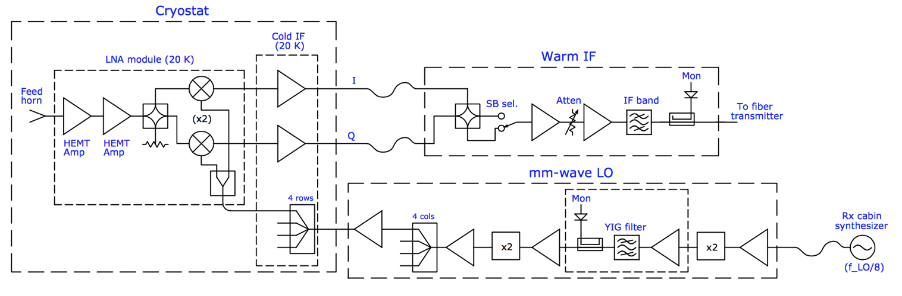
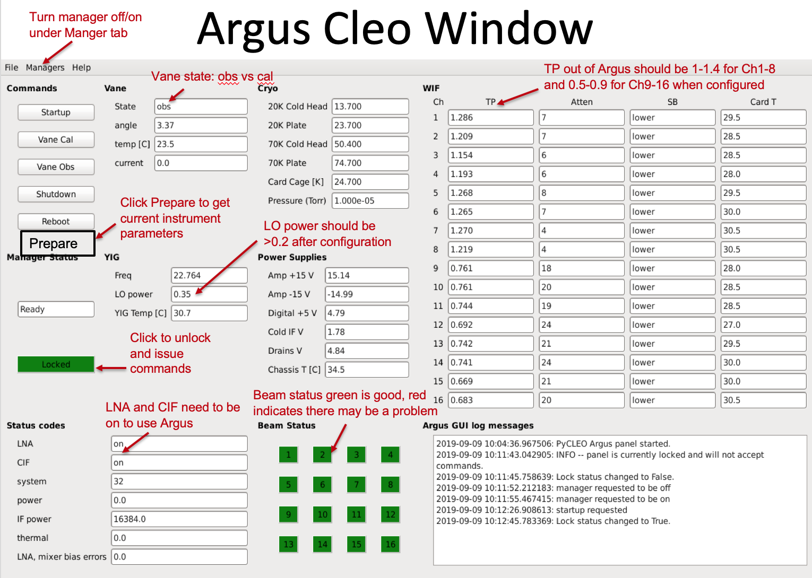

Argus
-------

.. pull-quote::
    
   The documentation below is a copy of the content in the Observer Guide. This is still a big mix-match of Tutorial, How-To Guide, and Reference Guide and will need to get sorted out.

Introduction
^^^^^^^^^^^^^

Argus is a 16 element focal-plane-array operating from 74 GHz o 116 GHz. The feeds are configured in a 4x4 array and are each separated by 30.4 arcsec on the sky. 

.. image:: images/argus_footprint.png

Argus has an absorber vane that can be placed over the entire array for calibration. The 16 Argus beams can be connected to the 16 separate VEGAS channels (VEGAS has 8 bank, each of which have two channels [A1, A2, B1, B2, ..., H1, H2]). Each of the 16 beams only measure 1 polarization (linear, X). Argus uses an IQ-mixer scheme to separate the USB and LSB, and the side-band isolation is aproximately 15-20 dB.

The instantaneous bandwidth for Argus is ~1.5 GHz, which is similar to the VEGAS spectrometer bandwidth. Users can observe multiple lines simultaneously using the VEGAS sub=banding modes (modes 20-29) for lines separated by less than the ~1.25 GHz effective bandwidth of an individual VEGAS bank. For spectral line mapping experiments, Argus is typically configured with each of the Argus beams connected to an individual VEGAS channel. BEams 9-16 use the regular GBT IF system and can be configured with multiple VEGAS banks, or the DCR for pointing, focus and OOF. Beams 1-8 have dedicated IF paths that are only connected to specific VEGAS banks.

For the chopper-vane calibration technique that Argus adopts, teh natural temperature scale measures is T_A* (GBT Memo 302). This temperature scale has the advantage of correcting for atmosphericattenuation while its derivation is nearly independent of opacity. Users need to take a vane calibration sequence whenever the configuration changes or whenever the IF system is balanced to calibrate the data.

Argus does not have noise diodes.

Configuration
^^^^^^^^^^^^^^^^^

Argus uses the standard config-tool software that automatically configures the system based on user input (e.g., frequency and bandwidth). Example Argus configuration files are given in /home/astro-util/projects/Argus/OBS. The configuration keywords specific to Argus are the following:

.. code-block::

    receiver     = "RcvrArray75_115"
    beam         = "all"                # or list the beams separately, e.g., beams="10,11"
    swmode       = "tp_nocal"           # or "sp_nocal"
    polarization = "linear"
    sideband     = "LSB"                # for best performance: LSB < 112 GHz, USB >= 112 GHz

Observing
^^^^^^^^^^^

The observing strategies for Argus are similar to those presented for the 4mm W-Band receiver. To maximize the telescope efficiency for targets smaller or similar in size to the beam (~8 arcsec), observations should be carried out during the night under stable thermal conditions. Depending on the science goal, successful daytime observations are possible for extended sources, where accurate beam shapes are not as crucial. Example Argus observing scripts are located at /home/astro-util/projects/Argus/OBS. The recommended observing procedures are the following

#. Startup Astrid and go online (with control of the telescope, when given permission by the operator)
#. Run the argus_startup script. This script checks the instrument status, turns ON the instrument if it is currently off and pre-configures Argus for the default 90 GHz parameters. 
#. At the start of the observing session, run an AutoOOF to optimize teh surface, unless the exact beam shape is not important for your science goals. This procedure will correct the surface for the current thermal conditions and derive the initial pointing and focus corrections. For AutoOOF it is recommended to use the brightest point source in the sky between 25-80 degrees elevation. If the Ka-Band receiver is available, run the AutoOOF at Ka-Band instead of Argus for more accurate surface corrections. When running AutoOOF with Argus, it is recommended to avoid using the calSeq=False keyword, so the data will be properly calibrated in the fitting for the surface model. The Astrid Observation Management Log will report the system temperatures on the sky from the initial vanecal scans. The same Astrid command "AutoOOF(source)" can be used for any of the receivers that use AutoOOF (i.e., Ka, Q, W-Band, Argus, Mustang-2) and the software will adopt the appropriate defaults for each band.
#. After the AutoOOF solutions are applied, run a point and focus with Argus to confirm the telescope collimation offsets.
#. For Argus, run AutoPeakFocus() with a bright pointing source (>1.5 Jy) within ~ 30 degree of the target region; brighter sources are better than closer sources, since the GBT gregorian pointing model is fairly accurate. Choose a frequency that is the approximate frequency of your science frequency since the YIG filter system can take time to adjust to large frequency shifts. For the best science results, AutoPeakFocu() should be run every 30-50 minutes depending on conditions (point more often during the day and after sunrise and sunset). Avoid pointing in the keyhole (el>80deg). Since the elevation pointing offsets can be larger than those observed typically in azimuth, use the elAzOrder=True keyword to observe the elevatin Peak scans first. An example pointing command showing the usage of the frequency, calSeq, and elAzOrder keyword is AutoPeak(source, frequency=90000., calSeq=False, elAzOrder=True). 
#. If pointing is problematic with Argus, e.g., observations during the day, or in periods of marginal weather, or in cases where the pointing source is too weak, observers can point and focus in X-band and use these telescope corrections for their Argus observations. Also, if there are no nearby bright sources to point with Argus and the telescope is at slow slew rate (at cold temperatures), it can be faster to switch receivers for pointing than to slew far away and point with Argus. Pointing and focus using Argus requires special attention, and users should not blindly accept the default solutions provided by the software system.  Users can enter solutions manually as needed as discussed in Section~\ref{sec:gfmsendcorrections}. If you are unsure of the Argus pointing results, point in X-band (which is adjacent to Argus in the turret).
#. After configuration and balancing VEGAS for science observations, check the power levels in the system. The VEGAS levels should be ~ -20+/i 3 dBm. 
   
    .. image:: images/argus_vegas.png

#. The target power levels in the IF rack (for beams 9-16) are 1.5 Volts. The YIG LO power level going into the instrument should range from ~0.2--0.6 Volts (above 84 GHz).  The power coming out of the warm electronics of Argus should read about ~1.0--1.4 for beams 1-8 and ~0.5-0.9 for beams 9-16 (under the TP column of the WIF section of the Argus pyCLEO window.

    .. image:: images/argus_cleo.png

#. Users must run the argus_vanecal procedure to calibrate the data (located in /users/astro-util/projects/Argus/OBS/argus\_vanecal) after each configuration and/or balance for observations that need to be calibrated.  The vane calibration is stable over longer periods than is needed for pointing and focusing, so only one argus_vanecal procedure is required for each set of VEGAS observations between the pointing and focus observations.  Under stable temperature conditions, the vane calibration is consistent over several hours while it is recommended to point and focus every 30--50 minutes for Argus.
#. It is best to observe similar frequencies together in time since it can take a few minutes for the YIG system to adjust to large frequency jumps.  If you need to switch by a large amount in frequency (e.g., >4 GHz), configure and wait a couple of minutes before observing.  If the YIG LO power is low after a large frequency shift (e.g., <0.2), re-configure again.
#. Only beams 9-16 that go through the GBT IF Rack can be configured with the DCR.  All 16 beams can be configured with VEGAS using the 8 dedicated optical fibers for Argus beams 1-8.
#. Beam-8 has very little sideband rejection and will show higher noise when using the LSB at high frequency (e.g., when the oxygen atmospheric line is in the USB).
#. The "Auto" procedures will run vanecal observations by default. For pointings/focus scans that do not need to be calibrated, observers can use the calSeq=False keyword, e.g., AutoPeak(source, frequency=90000., calSeq=False).  The use of the calSeq=False keyword will save a minute or two of time.  However, it is recommended to run the vanecal observations while pointing between science blocks of observations in order to track the performance of the system from the calibrated peak scans.  If your frequency is not specified, the default frequency for the Argus Auto procedures is 86000 MHz.
#. Beam 10 is the default signal beam and beam 11 is the default reference beam for pointing, focus, and OOF observations.
#. The instrument performance using VEGAS can be checked by running the vanecal.pro procedure within GBTIDL.  Example Argus data reduction scripts are located at /users/astro-util/projects/Argus/PRO. The vanecal.pro routine uses the getatmos.pro procedure which derives the opacities and atmospheric conditions from the Green Bank Weather database.
#. For absolute calibration carryout PEAK scans after applying good surface, pointing, and focus corrections for a source of known flux density (e.g., ALMA source catalog (https://almascience.eso.org/sc/). The ALMA calibrator catalog can also be used to check the strength of your pointing/focus source. The calibration methods and performance of the telescope are presented in GBT Memo #302.

Monitoring and Diagnostics
^^^^^^^^^^^^^^^^^^^^^^^^^^^

The Argus pyCleo page can be used to monitor the status of the instrument. 

This tool can be started from the CleoLauncher under the Receivers tab labeled "RcvrArray75_115". The pyCleo can be used for running basic instrument commands, such as startup or the vane control. Before issueing a command, you must unlock the CLEO window by clicking the green "locked" button to unlocked (red). The instrument parameters showin by pyCleo for Argus are updated after a configuration, at the start of each scan during observing, and every 30 minutes when not observing. Updated instrument values can be obtained by issuing a "prepare" command, which is done under the top managers tab (prepare) or the prepare button under the reboot button.

The Beam Status buttons are color coded, where green means the signal associated with the beam is good and red indicates a potential issue with the beam. If a beam is read, the data may still be usable depending on the system temperature associated with the beam.

The Vane state is "obs" when Argus feeds are looking at the sky (with an angle of ~ 3.4) and "cal" when the vane is covering Argus during the Vane calibration scan (angle of ~ 1.6).

The LNA and CIF (low noise amplifiers and cold IF electronics) need to be in the on state to carry out observations. After configuration, the YIG LO power (listed under the YIG section) should be ~ 0.2-0.6 V. The total power levels of the WIF (warm IF electronics) should read ~ 1.0-1.4 for beams 1-8 and ~0.5-0.9 for beams 9-16 after configuration and while observing.

IF Routing
^^^^^^^^^^^^^

The mapping between the VEGAS channels, Converter Modules, IF channels, and the VEGAS beams is shown below

Observers should verify the VEGAS power levels ~-20+/-3 dBm via the VEGAS Cleo window.

As an example shown by Figure fig:argusvegas, the VEGAS channel H1 is $-33$ dBm which is too low to yield useful data.  The H1 VEGAS bank corresponds to VEGAS channel J15, converter module CM12, dedicated fiber "6", and Argus beam 6.  In this example, the data associated with Beam-6 from Argus would be bad and would show non-physical system temperatures.

Troubleshooting Guide
^^^^^^^^^^^^^^^^^^^^^^

The Argus CLEO window can be used to troubleshoot Argus issues, which can be launched from cleo under the Receivers tab by selecting "RcvrArray75-115"

* To control the instrument unlock the system by selecting the green button "Locked" on left to unlock the window (it turns red when unlocked).
* To get the current status of the instrument click the "Prepare" button which is the last Command listed in the upper left.
* When done, lock the system to avoid accidently issuing a command by clicking the red unlocked button to green (locked).

* Confirm that the CIF and LNA are both on. If off, run the Argus startup script.
* Make sure the vane is in the desired position (e.g., obs for looking at the sky).  If the vane is "stalled"or in an unknown state, click the Vane Obs button to move the vane to the obs position.  If the vane is not already in the obs position, a configuration will also command the vane to the obs position.  If the vane fails to move have the operator contact a support scientist.
* Confirm there is LO power from YIG after configuration.
* The status of the instrument is checked before each scan, and the scan will be aborted if there is not enough YIG LO power, or for other major issues.  If the YIG power is too low, or the WIF power levels are low, and/or if one or more of the beam Status colors are red, reconfigure.  If one or more the beams are bad, observations with the remaining beams can continue, but one must have sufficient YIG LO power to carry out Argus observations.
* Sometimes the GBT M&C system will report old Argus errors when everything is working. You can ignore and continue observing, or try to clear the lingering error messages with the following procedure.

    * "Prepare" to retrieve updated instrument paramaters which may clear the error.  
    * If the error persists, turn the manager off and back on from the Managers pull-down menu at the top of the CLEO window.  Click off,  wait a couple of seconds, and then click on.
    * This usually clears the error messages.  Sometimes the error message(s) need to be cleared manually from the messageMux system by the software group.   
      
* If Argus communication errors occur (e.g., Netburner time out error), then the recent commands given to Argus may not have been done and you may need to re-configure and re-issue your observing script.  Within the Argus CLEO window, click the "Prepare" button to collect the current state of the instrument.  If the LNA/CIF are off under the Status Codes, run the Startup script and then reconfigure.  Turn the manager off and back on again to clear the Netburner errors.
* If Argus is in a "fault" state after configuration and you are unable to collect data after multiple attempts then:
    
    * Turn manager off and back on again (under the Managers tab at the top of the Argus CLEO window) and reconfigure.
    * If cycling the manager does not work, have the operator restart turtle and/or "grail" and reconfigure.
    * If neither of the above work, then have the operator contact a support scientist.

Data Reduction
^^^^^^^^^^^^^^^^

Argus is calibrated on the T_A* antenna temperature scale. Observations need to run a set of vanecal observations for each set of science data.  For absolute flux calibration, a source of known flux density should be observed.  The ALMA Calibrator Source Catalog has an extensive record of the flux density histories for many of the bright 3mm point sources (https://almascience.eso.org/sc/).  By using ALMA flux density values as a function of time, ~10% absolute calibration uncertainties can be obtained for Argus data. The methods and equations for calibrating Argus data are presented in GBT Memo #302.

The standard GBTIDL scripts (getps, getnod, getfs) do not work with Argus data, since these assume a noise diode for calibration. Example Argus scripts for the reduction of spectral line data can be found at /home/astro-util/projects/Argus/PRO.  Users can use the vanecal.pro procedure within GBTIDL to derive the Tcal value and the system temperatures for each of the Argus beams.  Frequency switched data can be reduced using argus_fsw.pro, and position switch data can be reduced using argus_onoff.pro.

Documentation
^^^^^^^^^^^^^^

* **Argus Web Page**: http://www.gb.nrao.edu/argus/
* **GBT Calibration Memo**: https://library.nrao.edu/public/memos/gbt/GBT_302.pdf
* **Argus configuration and observing scripts which are used in Astrid**: /home/astro-util/projects/Argus/OBS

    * **argus_startup**:  Script that turns Argus on if it is not already on. The script configures the instrument with the default settings. This is run at the start of an Argus observing session.
    * **argus_vanecal**: Script that runs the vanecal observations.  It observes with the vane over the array as well as blank sky scan with a default 6 arcmin offset from the commanded position to avoid a bright calibrator object. If observing the Moon or a very bright extended continuum source, one can use the argus_vanecal_bigoffset2 or argus_vanecal_bigoffset to observe blank sky.
    * **autooof**:  Script that runs the AutoOOF observations. The sources listed are the brightest W-band sources in the sky.
    * **autopeak_focus**: Script that runs pointing and focus observations.  The pointing observations are run first, and then the script issues a break to allow the user to enter the solutions manually into the system before the focus scan.
    * **autopeak_calibrate**: Calibration script to run on a known calibrator to compute the aperture and main-beam efficiency of the  telescope after good pointing and focus corrections have been applied.
    * **argus_config_example**: Example total power configuration (tp_nocal) for Argus.
    * **mapRA**: Example frequency switching (sp_nocal) observing script for a RA/Dec map.

* *GBTIDL reduction scripts*: /home/astro-util/projects/Argus/PRO

    * **getatmos.pro**: Script that returns the atmospheric opacity and effective atmospheric noise and temperature for a specific time and frequency from the Green Bank Observatory weather database. This needs to be run on a Green Bank computer since using special code that only runs locally.
    * **vanecal.pro**: Script that computes the system temperature for each of the Argus beams from the vanecal observations.   The script uses getatmos.pro to compute the Tcal value (see GBT Memo\#302).
    * **argus_fsw.pro**: Script that calibrates a frequency switched observation.
    * **argus_onoff.pro**: Script that calibrates a position switched observation.

* **ALMA Source Catalog**: https://almascience.eso.org/sc/

