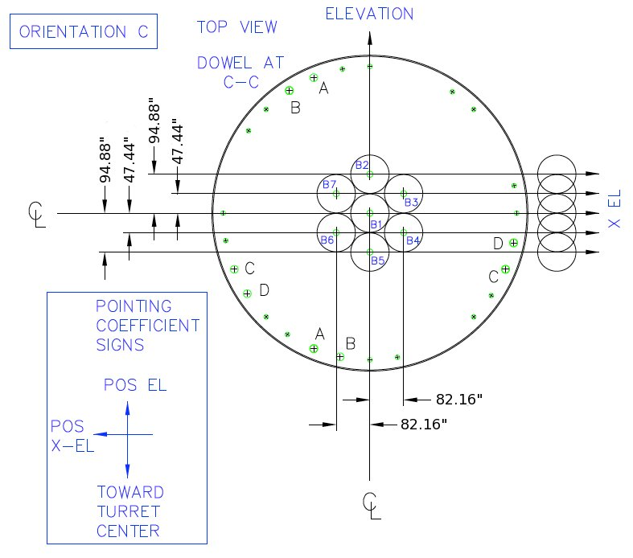
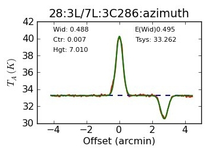
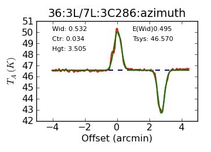

K-Band Focal Plane Array (KFPA)
-------------------------------

The K-band Focal Plane Array (KFPA) has seven beams total, each with dual circular polarization.
Each beam covers the 18-27.5 GHz frequency range with fixed separations on the sky with nominal
offsets listed in the table below

.. list-table:: Nominal beam offsets for each feed of the KFPA at orientation C.
    :widths: 20 20 20
    :header-rows: 1

    * - Beam
      - :math:`\Delta` X-El ["]
      - :math:`\Delta` El ["]
    * - 1
      - 0.00
      - 0.00
    * - 2
      - 0.00
      - 94.88
    * - 3
      - -82.16
      - 47.44
    * - 4
      - -82.16
      - -47.44
    * - 5
      - 0.0
      - -94.88
    * - 6
      - 82.16
      - -47.44
    * - 7
      - 82.16
      - 47.44

The feeds have cooled polarizers producing circular polarization. 
The only internal switching mode is frequency switching. 
The seven feeds are laid out in a hexagon with one central feed:

The hexagon is oriented such that the central feed is not at the same cross-elevation
or the same elevation as any of the other beams.  Beam pairs (3,7) and (4,6) are at 
equal elevations and are appropriate choices for nodding and peak/focus observations.

Unlike other receivers, KFPA uses variable noise diodes for each beam (~10% of the system temperature)
that can change, so it is very important for observers to calibrate their data every session. 
The maximum instantaneous bandwidth for the receiver, in normal observing modes, is currently 1.8GHz.
A "broadband" mode has been developed for the KFPA in which it is possible to route 7.5 GHz of bandwidth
from beam 1 of the receiver to the VEGAS backend. Alternatively, using this mode allows for ~4 GHz of 
bandwidth to be routed from both beams 1 and 2 simultaneously. Advice should be sought from a staff
scientist if this mode is desired.

Configuration
^^^^^^^^^^^^^

Beam selection with VEGAS banks
'''''''''''''''''''''''''''''''

Observers can use all 7 KFPA beams simultaneously, or select a only subset of them. To maximize versatility
and observing efficiency when mapping, most observers will want to use the full set of 7 beams paired with 
the observations with the VEGAS backend.

An equal number of beams must be routed to Converter Rack Modules A and B, imposing the following constraints
on mapping beams to VEGAS banks:

- A single beam may be routed to any  or all of the VEGAS banks A$\rightarrow$H.
- Dual-beam configurations allow each beam to be routed to a maximum of 4 VEGAS banks.
- When using 3--4 beams, each beam may be routed to up to a maximum of 2 VEGAS banks.
- When using more than 5 beams, each beam may only be routed to a single VEGAS bank.
- When using all 7 beams, each beam may be routed to a single VEGAS bank with an 
  optional second copy of beam 1 being routed to the remaining VEGAS bank. This 
  is known as the "7+1" mode of the KFPA.

An example configuring for the 7+1 mode of the KFPA is given in Script 5.9

.. todo:: 

    Adjust the following configuration to match an actual/typical 7+1 spectral line setup.

.. literalinclude:: scripts/kfpa_config.py

Instantaneous Bandwidth
'''''''''''''''''''''''

- **Narrowband mode** is the default setting and must be used with any KFPA multi-beam configuration.
  In this mode all frequencies must have a maximum frequency separation of 1.8 GHz and lie within 
  900~MHz of the doppler tracking frequency.

- **Broadband mode**  allows the system to process up to 7.5 GHz of bandwidth. This mode is only 
  available for single beam observations using beam 1 and is achieved by setting ``broadband=1`` 
  in the configuration).

Calibration
^^^^^^^^^^^

The KFPA receiver has variable noise-diodes that can change so it is important that users calibrate 
their data for every session.  The diodes have effective temperatures that can drift slowly over time
or change after a thermal cycle of the cyrostat.

We currently recommend that users calibrate their data by carrying out :func:`Nod() <astrid_commands.Nod>` 
/ :func:`OnOff() <astrid_commands.OnOff>` observations on a known flux calibrator using the same configuration 
that they would use for their science observations. This is an example SB for performing this type of calibration using 
all 7 beams of the KFPA:

.. literalinclude:: scripts/kfpa_calibration.py

It is also possible to use the sky at different elevations to flat-field the relative gains of the beams 
and then absolute calibrate the data with an :func:`OnOff() <astrid_commands.OnOff>` / :func:`Nod() <astrid_commands.Nod>`
observation of one reference beam using a known flux calibrator. Calibration using resolved sources such as planets or the Moon adds the requirement for an accurate temperature model of the source plus a model for coupling the GBT beam to the planet disk.  Observers wishing to use such methods should consult their project friend to devise the best strategy for calibration.

   

Realigning the Noise Diodes
'''''''''''''''''''''''''''

Sometimes the effective temperature of the noise diodes can suddenly change by significant 
amounts due to firmware configuration glitches that may occur after resetting the manager, 
updates to receiver parameters, and power failures. A large change the effective temperature 
of a noise diode could result in unusual :math:`T_{sys}` values or a large difference 
between the amplitude of beams in azimuth Peak scans as shown here: 

If you suspect that the noise diode temperatures have drifted and need to be aligned, let
the GBT operator know to contact the on-duty support scientist who can examine the data 
and realign the noise diodes if necessary. 

The next figure shows a repeat of the scan after the noise diodes were realigned:

