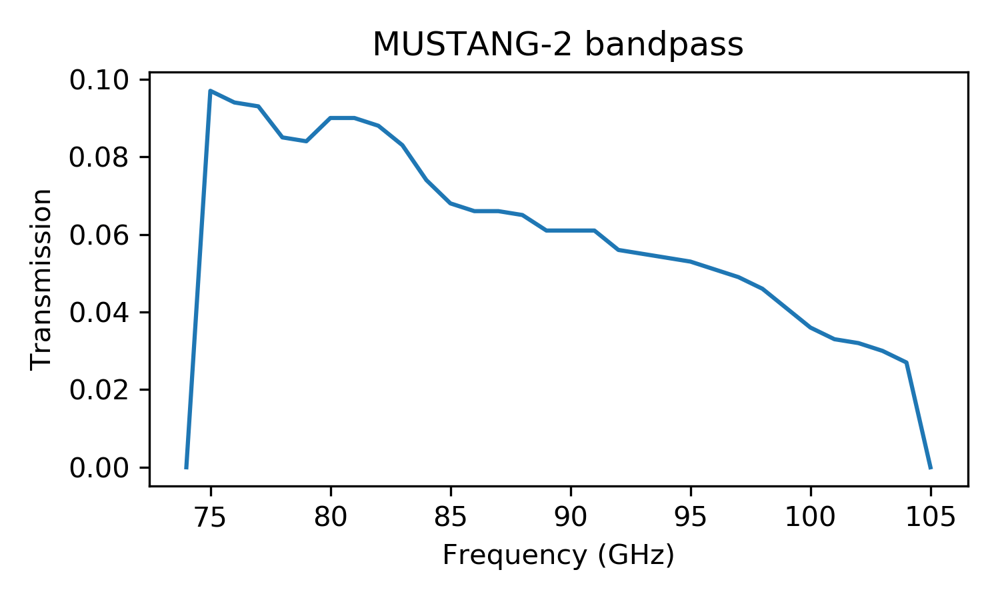

##############################
MUSTANG-2 Bandpass Information
##############################

.. list-table:: Spectral Index Information
   :header-rows: 1

   * - Spectral Index
     - Center Frequency
   * - -4.0
     - 85.453782
   * - -3.5
     - 85.822352
   * - -3.0
     - 86.199666
   * - -2.5
     - 86.585006
   * - -2.0
     - 86.977568
   * - -1.5
     - 87.376465
   * - -1.0
     - 87.780735
   * - -0.5
     - 88.189355
   * - 0.0
     - 88.601248
   * - 0.5
     - 89.015301
   * - 1.0
     - 89.430375
   * - 1.5
     - 89.845321
   * - 2.0
     - 90.258998
   * - 2.5
     - 90.670285
   * - 3.0
     - 91.078096
   * - 3.5
     - 91.481391
   * - 4.0
     - 91.879194
   * - 4.5
     - 92.270596
   * - 5.0
     - 92.654768

You can download a text file with these spectral index and frequency values :download:`here </_static/mustang2_documents/M2_center_frequencies_07082023.txt>`.