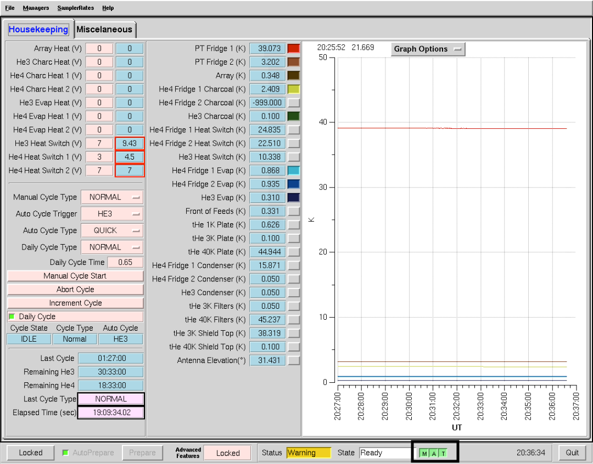
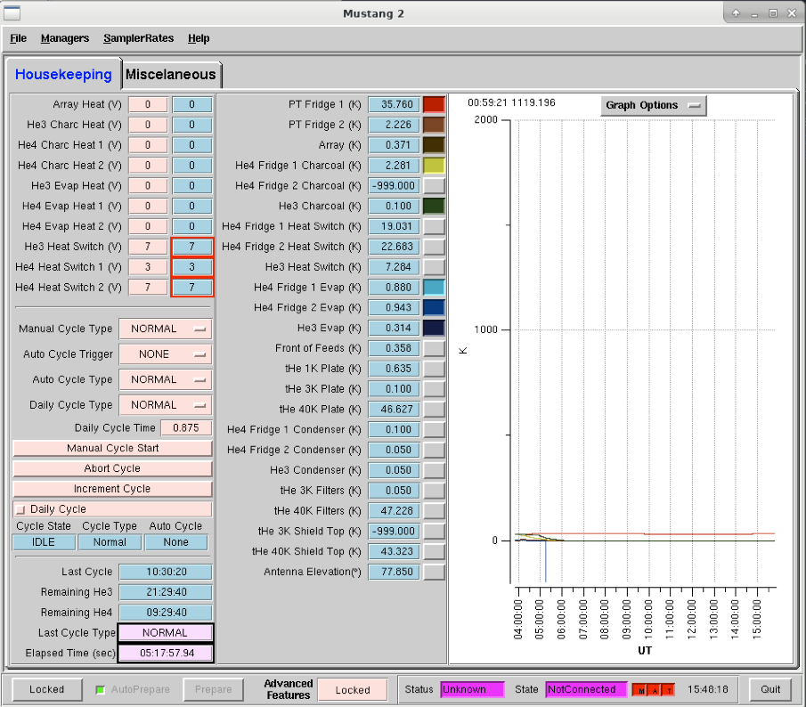

.. _mustang2_manager:

#################
MUSTANG-2 Manager
#################
The MUSTANG-2 manager is run on the computer egret and we typically interface with the manager through CLEO. 

At the bottom of the manager, you will see MAT each in a box (marked in image above by black box). These boxes show the state of the following: M = manager, A = accessor, and T = transporter. If the boxes are green, they are up and running. If any of them are red, they are down. You can check on the status of and reboot the manager and transporter on egret (see instructions `here <https://safe.nrao.edu/wiki/bin/view/GB/Pennarray/OnGbtOps#Restart_Manager_by_Hand>`_).

CLEO M2 Manager Status
======================
A typical, good state for the M2 manager is *Status* = "Warning" (yellow coloring) and *State* = "Ready" (white coloring) - see image above.

MAT are red
-----------
There can be situations where one of the MAT are red or all are red. When all red, *Status* will be "Unknown" (and pink) and *State* will be "NotConnected" (pink). 

In this case, the manager has crashed and you'll need to check on the status and perhaps restart the manager by hand (see instructions `here <https://safe.nrao.edu/wiki/bin/view/GB/Pennarray/OnGbtOps#Restart_Manager_by_Hand>`_). And if only M or T are red, you should still check their status on egret.

Boxes are yellow
----------------
.. image:: images/manager/m2_manager_yellow.png

The manager is out of sync. Simply enter in some command (like turn the daily cycle off then on again) and it should resync.

Boxes are pink
--------------
.. image:: images/manager/m2_manager_off_state_pink.png

The manager is out of sync. Simply enter in some command (like turn the daily cycle off then on again) and it should resync.

When the *State* = "Off" (see previous image), you need to go to the menu for the M2 manager that says *Managers* and click "On."

Troubleshooting
===============

Restart the manager
-------------------
To restart the manager, do the following:

#. Ask the operator to restart the MUSTANG manager using TaskMaster. Restarting machines through TaskMaster is a responsibility that is supposed to only be held by the operator. But if you need to do it yourself, the instructions on how to do so are `here <https://safe.nrao.edu/wiki/bin/view/GB/Pennarray/OnGbtOps#Restart_Manager_by_Hand>`_.

#. When the operator has told you that they have restarted the M2 manager:
    #. Go to your Cleo Mustang Manager screen
    #. In the drop down menu go to *Managers*→*Off* and then again to click *Managers*->*On* to to turn the manager off and back on.
    #. Re-check the daily cycle to make sure that it is turned off.

#. Restarting the manager *before* biasing: You're done!

#. Restarting the manager *after* biasing:
    #. Re-check that the det-biases are what you expected them to be.
    #. Check that the *DataXinit* buttons are on.

Manager not starting
--------------------
Sometimes the MUSTANG-2 manager refuses to start (i.e., you try to start it and you get a failure every time either by using TaskMaster or asking the operator to do this for you).

The solution is to 
    - log onto egret
    - shut the computer down
    - log onto the iboot bar
    - power off egret and the housekeeping
    - leave it off for 30 seconds
    - turn these back on
      
Egret may take a while to reboot but once it does you should be able to restart the manager.
Assuming this works you should also make sure to press the ``reset heater card`` button on the manager twice.

Manager crashes on 1st scan
---------------------------
It is a known issue that sometimes the manager will crash on the first scan (the skydip). A classic telltale sign of the manager crashing is that the biases are set to 0 and data is not flowing. Check the status of the manager in CLEO and on egret (see instructions `here <https://safe.nrao.edu/wiki/bin/view/GB/Pennarray/OnGbtOps#Restart_Manager_by_Hand>`_) and diagnose from there. Likely you'll have to :ref:`references/receivers/mustang2/mustang2_manager:Restart the manager`.
