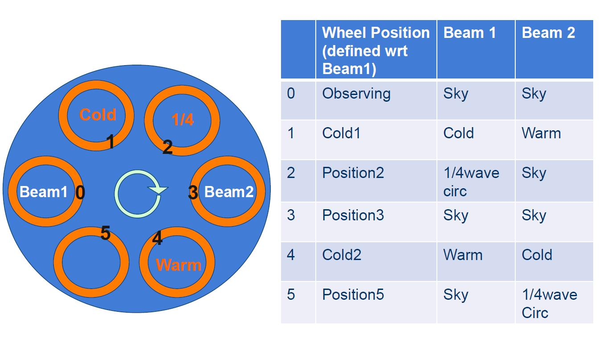

.. _w_rx:

W-Band receiver
---------------

Overview
^^^^^^^^
The W-band ("4 mm") receiver is a dual-beam, dual-polarization receiver which covers 
the frequency range of approximately 67-92 GHz.  A key difference between the W-band 
receiver and other GBT receivers is that there are no noise-diodes for the W-band
receiver.  This impacts the observing and calibration techniques for the receiver.  
Users need to take a calibration sequence whenever the configuration changes or 
whenever the IF system is balanced for any data that needs to be calibrated. 
The receiver has an optical table with an ambient and cold load that is used for
calibration

The optical table can also convert linear polarization into circular polarization 
using a 1/4-wave plate in front of one of the beams for VLBI observations.  
The two beams are separated by 286" in the cross-elevation direction 
on the sky (i.e., along azimuth).

Here we present information for carrying out W-band observations. 
We concentrate on items specific to W-band, and assume the user is familiar with the
other chapters of the observing guide. Please contact Green Bank Observatory support 
scientists through the NRAO helpdesk if you have questions.

Configuration
^^^^^^^^^^^^^

The W-band receiver uses the standard config-tool software that automatically 
configures the GBT IF system based on user input (e.g., frequency and bandwidth).
Example W-band configuration files are given in /home/astro-util/projects/4mm/.  

The IF system for the W-band receiver is broken into four separate bands:

* FL1: 67-74 GHz
* FL2: 73-80 GHz
* FL3: 79-86 GHz
* FL4: 85-92 GHz

You can only use one of these bands at a time (i.e., you cannot simultaneously 
observe lines in more than one band).  The millimeter down-converter filters of
the system limits the instantaneous bandwidth to 4 GHz for 73-92 GHz 
(filters FL2, FL3,FL4), while up to 6 GHz of total bandwidth is available 
for 67-74 GHz (filter FL1).

The configuration items specific to the 4mm receiver are the following:

* ``receiver     = 'Rcvr68\_92'``: Name of the receiver
* ``beam         = 'B12'``, ``'B1'``, or ``'B2'``: Dual beam receiver
* ``swmode       = 'tp\_nocal'``  or ``'sp\_nocal'``: There are no noise diodes
  with this receiver. 
* ``polarization = 'linear'`` or ``'circular'``: (Default is linear). If user
  selects circular, then the 1/4-wave plate is placed in front of the chosen
  beam.  There is only one 1/4-wave plate, so users can have circular 
  polarization for only one of the beams.

Observing
^^^^^^^^^

To maximize the telescope efficiency for targets smaller or similar in size 
to the beam (~10"), observations should be carried out during the night under 
stable thermal conditions.  During the daytime, the effective point-source
aperture efficiency decreases significantly since the beam shape increases 
in size.  Depending on the science goals, successfuldaytime observations
are possible for extended sources.

* Start the project with an AutoOOF (unless observing extended sources during 
  the day).  This sets the active surface, including the thermal corrections, 
  as well as getting initial pointing and focus corrections.  For AutoOOF,
  it is recommended to use the brightest point source in the sky between 
  25-80 degree (25-75 degree at half-slew rate) elevation. If the Ka-band
  receiver is available, run the AutoOOF at Ka-band instead of W-band for
  more accurate surface corrections. The S/N ratios observed with the Ka+CCB 
  system are much higher than is possible at W-band, and the winds affect 
  the Ka-band data to a lesser degree due to the larger beam-size. 
 
* After the AutoOOF solutions are applied, run a point and focus at W-band.

* After configuration and balancing, check the RF power levels in the IF rack
  to confirm that power is going through the channels and that the power levels
  are not saturated (<10).  Beam-1 uses channels 1 and 3, and beam-2 uses 
  channels 5 and 7.  The target power level for W-band is 1.5, and the software
  adjusts theattenuation to reach this level. 

* Users must run the CalSeq procedure to calibrate the data (see :func:`CalSeq() <astrid_commands.CalSeq>` 
  below). During the calibration sequence, users can watch the movement of the
  calibration wheel from the Rcvr68_92 CLEO page
 
  .. image::  images/w-band__rx_cleo.jpg

 
AutoOOF Thermal Corrections
'''''''''''''''''''''''''''

Optimal point-source observations should be carried out with regular AutoOOF 
measurements (every 2-4 hours) during the nighttime when the thermal stability
of the dish is best.  The AutoOOF corrections can improve the point-source
aperture efficiency by 30--100\% at W-band. Application of the AutoOOF
corrections during the day are typically not practical at W-band given the
thermal environment of the dish is generally not sufficiently stable.  During
the day, the measured beam sizes can vary significantly (e.g., 10-14"),
but the main-beam shape typically remains fairly symmetric and Gaussian. Although
the variation of beam size has a direct impact on the point-source aperture
efficiency (:math:`\eta_{a}`), it has less of an impact on the effective main-beam 
efficiency (:math:`\eta_{mb}`) used for the calibration of extended sources.  Therefore,
extended sources may be observed during the day without the AutoOOF corrections
if the science is not impacted by the primary beam variations.

Pointing and Focus
''''''''''''''''''

Blind pointing at the start of the observing run may not be successful since 
the blind pointing errors can be similar to the beam size, and the source may
be missed in the simple Az-El scans used by the Peak procedure.  Initial 
pointing offsets can be found with the AutoOOF procedure, or users may want
to point first with X-band.  If pointing is problematic at W-band, e.g., 
observations during the day, or in periods of marginal weather, or in cases
where the pointing source is too weak, observers can point and focus in 
X-band and use these telescope corrections for their W-band observations.  
Pointing and focus for W-band requires special attention, and users should
not blindly accept the default solutions provided by the software system. 
You can enter solutions manually as needed as shown
:ref:`here <references/astrid:Sending Corrections>`.

Calibration and Data Reduction
^^^^^^^^^^^^^^^^^^^^^^^^^^^^^^

For calibration of the antenna temperature scale, users need to run a CalSeq 
for each set of source data.  For absolute flux calibration, a source of known
flux density should be observed.  The ALMA Calibrator Source Catalog has an 
extensive record of the flux density histories for many of the bright 3mm 
point sources (https://almascience.eso.org/sc/).  By using ALMA flux density
values as a function of time, ~10% absolute calibration uncertainties 
can be obtained for W-band data.  

.. list-table:: W-band channel definitions
    :widths: 20 40 40 
    :header-rows: 1

    * - Channel
      - Polarization
      - Beam
    * - ch1 
      - beam 1 (`fdnum=0`)
      - X or L (`plnum=0`)
    * - ch3
      - beam 1 (`fdnum=0`)
      - Y or R (`plnum=1`)
    * - ch5
      - beam 2 (`fdnum=1`)
      - X or L (`plnum=0`)
    * - ch7
      - beam 2 (`fdnum=1`)
      - Y or R (`plnum=1`)

.. note:: 

    The GBT IF channel numbers 1,3,5,7 and their corresponding beam and
    polarization definitions. The parameters fdnum and plnum are GBTIDL keywords.

The standard GBTIDL scripts (:idl:pro:`getps`, :idl:pro:`getnod`, :idl:pro:`getfs`)
do not work since these assume a noise diode for calibration.  Example W-band scripts
for the reduction of spectral line data can be found at ` `/home/astro-util/projects/4mm/PRO`` . 
Users can use the calseq.pro within GBTIDL to derive the gains for each of the channels.
After deriving the gains, users can reduce the spectra line data, for example, using
``wonoff\_gain.pro``.

The equations and methods for calibrating W-band data are given in GBT Memo \#302.

Additional Resoures
^^^^^^^^^^^^^^^^^^^

* W-Band Web Page: http://www.gb.nrao.edu/4mm
* GBT Calibration Memo: \citet{Frayer2014}
* W-band configuration and observing scripts: ``/home/astro-util/projects/4mm``
* GBTIDL reduction scripts: ``/home/astro-util/projects/4mm/PRO`` 
* ALMA Source Catalog: https://almascience.eso.org/sc/

