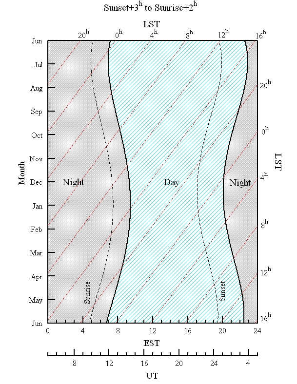

Weather Effects on Observations
-------------------------------

The weather affects observations in three ways:

#. winds affect the telescope pointing,
#. differential heating and cooling affect the telescope pointing and efficiency, 
#. atmospheric opacity affect the received signal and the system temperature. 

Winds
^^^^^

Winds can set the feed arm into motion. The current recommendations for wind limits can be found in 
:ref:`how-tos/general_guides/point-focus:Pointing and Focusing Strategies` (specifically in 
:numref:`tab-peak-focus-recommendations`). 

Ries (PTCS-PN 68.1) show the cumulative percentages when wind speeds are below a certain value:

    The cumulative fraction when wind speeds are below a certain value. Data from August 2008 to
    July 2009 are shown in blue; green shows winter data, and red shows winter nights.

The :ref:`references/dss:Dynamic Scheduling System` uses forecasted wind speeds when it determines what 
projects are suitable for scheduling, so one should rarely see any negative impacts from winds.

Differential Heating and Cooling
^^^^^^^^^^^^^^^^^^^^^^^^^^^^^^^^

Differential heating and cooling of the telescope alters the surface of the telescope, resulting in 
degradation of telescope efficiencies, and "bends" the telescope, resulting in pointing changes. At 
high frequencies, these effects are important. The current recommendations are that, for best work, 
observing above 40 GHz should only be done at night, from 3 hours after sunset to 2 hours after sunrise. 
At 40 GHz and above it is recommended to use :ref:`AutoOOF <AutoOOF_strategy>` at the start of an observing session.

Time of Day
^^^^^^^^^^^

Low frequency observers may want to consider night time observing for two reasons. RFI is usually lower
at night; and, in some cases, the sun has a slight negative impact on baseline shapes. By default, we
assume that daytime observing will be acceptable for all observations below about 16 GHz.

Here is an illustration of the range of UT, EST, and LST for our definition of "night-time" observing: 

Atmospheric Opacities
^^^^^^^^^^^^^^^^^^^^^

The frequency range covered by the GBT extends from low frequencies where the opacity is relatively low 
(~0.008 nepers) to high frequencies where opacity is very high (>1 nepers). Atmospheric opacity hits 
observing twice - it attenuates the astronomical signal and it increases the system temperature, and 
thus the noise in the observation, due to atmospheric emission.  

.. _fig-tsysopacity:

    The top panel shows opacities under three typical weather conditions. The black, blue, and red 
    curves represent the opacity under the best 25, 50, and 75 percentile weather conditions.  (The 
    'average' opacity over the winter months is best described by the 50 percentile graph.) The middle
    panel is an estimate of the contribution to the system temperature at the zenith from the atmosphere,
    spillover, and cosmic microwave background. The bottom panel shows the number of air masses the 
    astronomical signal must pass through as a function of elevation.

:numref:`fig-tsysopacity` shows opacities, atmospheric contributions to the system temperature and 
number of air masses the astronomical signal must pass through vs. elevation  under three typical 
weather conditions as calculated using the method described on the GBT "High Frequency Weather Forecasts"
web page (\href{http://www.gb.nrao.edu/~rmaddale/Weather/index.html}).
Please note the airmass curve in :numref:`fig-tsysopacity` is a better approximation than the csc(elevation)
approximation which is only correct above about :math:`20^\circ` elevation. 

Zenith system temperatures for typical weather conditions are shown here:

.. image:: images/weather_TsysTotalWinter.jpg

The opacities shown in :numref:`fig-tsysopacity` are for planning purposes only and observers should
not use them at high frequencies for calibrating data. Instead, one should use the actual opacities 
and the air mass from the bottom of :numref:`fig-tsysopacity` to approximate the amount of attenuation
a signal will experience at the expected elevation of the observation. The signal is attenuated by 
:math:`\exp^{\tau} A`, where :math:`\tau` is the opacity and :math:`A` is the total number of air masses.
Since opacity is very weather dependent, please consult with a local support staff on how best to 
determine opacities for your observing run.

During the cold months, high frequency observers can expect to be observing with opacities that are 
at or below the average (50 percentile) winter conditions for Green Bank. Thus, high frequency observers
can anticipate that the typical weather conditions under which they will observe will be best represented
by the top 25 percentile conditions. In contrast, low-frequency, winter observers should expect they will
observe under conditions that are worse than the 50 percentile and more like those of the 75 percentile 
conditions.

During the warm season (June through September), high-frequency observing is much less productive and 
we almost exclusively schedule low frequency observing. During these months, low frequency observers 
can plan on observing under the average, 50 percentile conditions.

GBT Weather Restrictions
^^^^^^^^^^^^^^^^^^^^^^^^

During weather conditions that pose a risk for the safety of the GBT, the GBT operators will cease all 
observations and take the appropriate action to ensure the safety of the GBT.  The operator is fully 
responsible for the safety of the GBT and their judgement is final. The operators decisions should not
be questioned by the observer.

Winds
'''''

The following guidelines exist for periods of high winds. If the average wind speed exceeds 35 mph 
(15.6 m/s) over a one minute period, the operator will stop antenna motion. If wind gusts exceed 40 mph
(17.9 m/s), or if winds are expected to exceed 40 mph for a period of time, the operator will move the 
antenna into the survival position. Only after the wind speeds have been below these criteria for 15 minutes
will observations be allowed to resume.

Safety measures for high winds will take precedence over those for snow and ice.

Snow
''''

If snow is sticking to any of the GBT structure, the operator will move the GBT to the "snow-dump"
position. The decision to halt and resume observations is solely the responsibility of the GBT operator.
If dry snow appears to be accumulating, the operator may periodically interrupt operations to dump snow,
and then resume observations.

Ice
'''

If ice is accumulating on any part of the GBT structure, the operator will move the GBT to the survival 
position.  The decision to halt and resume observations is solely the responsibility of the GBT operator.

Temperature
'''''''''''

When the air temperature drops to 16$^\circ$ Fahrenheit (-8.9\celsius), the Azimuth slew rate of the GBT will be reduced to half of its normal rate.  (This is due to the changing properties of the grease used in the Azimuth drive bearings.)  Half rate speed (18$^\circ/$min instead of 36$^\circ/$min) will be utilized until the temperature returns above 17$^\circ$ Fahrenheit (-8.3\celsius). When the temperature drops below -10$^\circ$ Fahrenheit (-23.3\celsius) observations will cease until the temperature is above 0$^\circ$ Fahrenheit (-17.8\celsius) and the operator has determined that the Azimuth drive motors are ready for use.

Feed Blowers
''''''''''''

The feed blowers blow warm air over the radomes of the feeds to prevent condensation and frost.
Although beneficial for most receivers, they produce vibrations that contaminate the MUSTANG-2 data. 
Thus, users of MUSTANG-2 can request that the operator turn off the feed blower at the start of their
observing session. One hour before the end of a MUSTANG observing session, the operator will decide
whether or not the blower needs to be turned back on in order to ensure the feeds for all receivers
are in good shape for the next observer. The operators use the criteria that the blowers will be turned
back on for the last hour if either: 

* the dew point is within :math:`5^\circ` Fahrenheit of the air temperature
* the air temperature went from above to below freezing anytime during the MUSTANG-2 run

