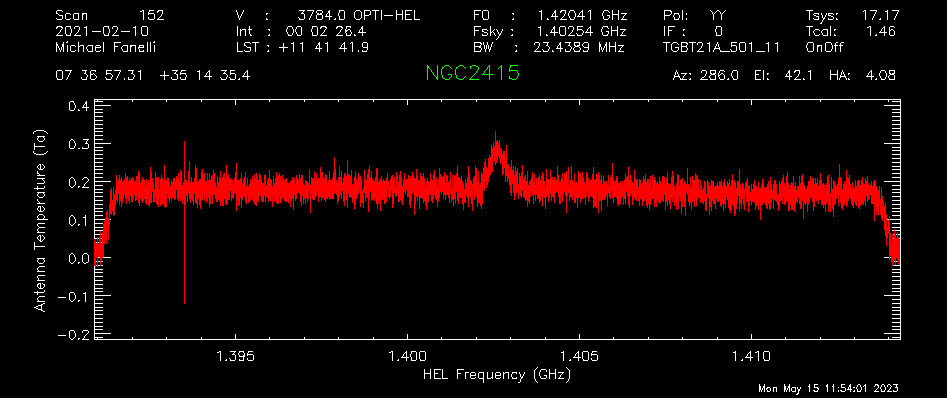
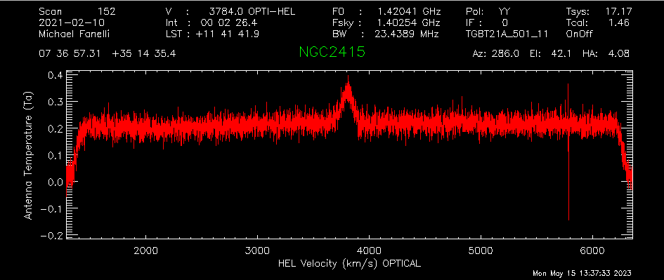
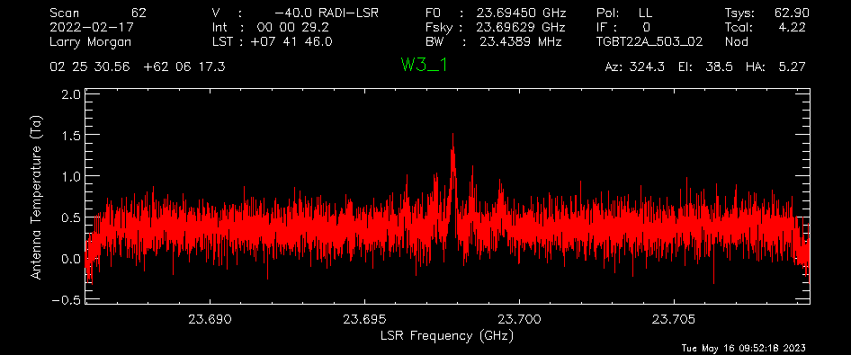
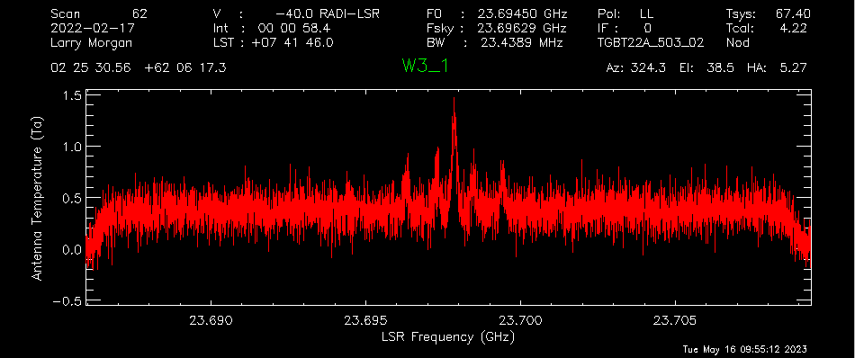
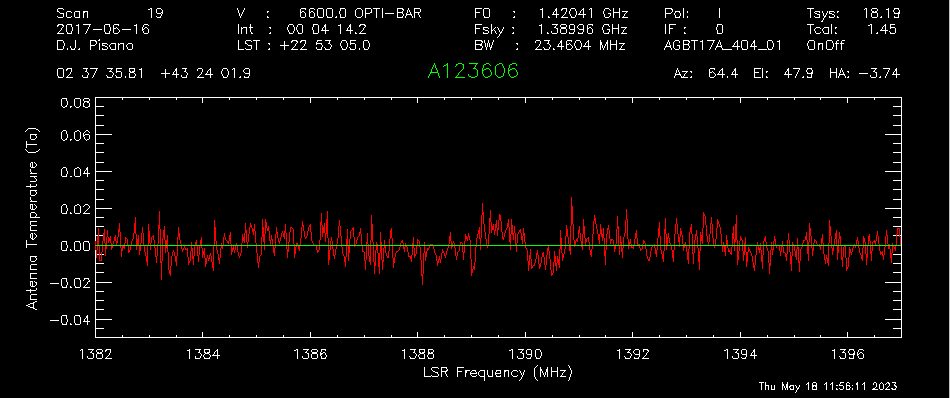
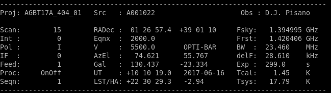
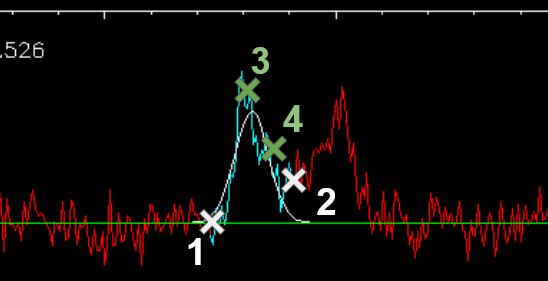
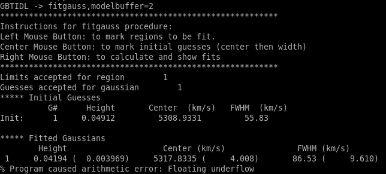

##############################
GBTIDL Data Reduction Examples
##############################

Below are a series of common data reduction GBTIDL processes with explanations and screenshots mixed in.
To get an in-depth explanation for any gbtidl-specifig procedure or function, you can type "usage" with the procedure/function name and the "/verbose" option: 

.. code:: idl
        
    usage, “getps”, /verbose

Basic On/Off
============

Here is an example of a basic data reduction process on an L-band On/Off procedure.

.. admonition:: Data
    
    ngc2415.fits

Load the data into gbtidl.

.. code:: idl

    filein, "data/ngc2415.fits"
    
Display a summary of its contents.

.. code:: idl

    summary

We can see that this data set has two scans on the galaxy NGC 2415, with one slightly offset in position. The catalog used for this observation says the galaxy has a velocity of 3784 km/s, the rest frequency of the observed line in the first frequency window is 1420 MHz/1.420 GHz, there are 5 frequency windows, 151 integrations, 1 beam/feed, and lastly the azimuth/elevation values of the GBT at the time of the scan.

For a first look at the spectrum, we call the “getps” procedure, which calibrates the On vs. Off scans and averages up all 151 integrations. Without designating the polarization or spectral window, it will default to the first polarization (Linear YY for the L-band receiver) and first spectral window (centered on the redshifted HI line in this case).

.. code:: idl

    getps, 152

.. image:: images/gbtidl_basic-onoff_01-getps.png

In order to see anything useful, we may have to smooth the data. This is usually done with the procedures “gsmooth” or “boxcar”, with the latter using a gaussian smoothing kernel and the latter using a flat kernel. The first input “N” is the size of the kernel in channels and the second option keeps only every N-th channel.

.. code:: idl

    gsmooth, 5, /decimate

We can convert the data to the same velocity frame specified in the observing configuration with “setxunit”. By default this will apply a doppler correction. This can also be done by selecting “km/s” in the GUI - the fourth dropdown menu from the left.

.. code:: idl

    setxunit, "km/s"

We may learn that the TCAL value in the database is out of date, and the signals are too weak by a factor of 1.2. “scale” removes this systematic offset.

.. code:: idl

    scale, 1.2

Now we may want to save these results for posterity or further analysis. You can also use “write_csv” to make a csv file instead of an ascii-columned text file, or “write_ps” to output a “publication-quality” postscript image of the spectrum.

write_ascii,"NGC2415_HI.ascii"

gbtidl also allows for multi-line input and loops in the same line. We can use this to quickly check the other spectral windows. The line breaks are made with the “&” character. First, let’s freeze the plotter so it doesn’t auto-update after each loop:

.. code:: idl

    freeze

And change the x-axis back to frequency so that each spectral window is plotted correctly.

.. code:: idl

    setxunit,"GHz"

Now finally type in the loop:

.. code:: idl

    for k=1,4,1 do begin & getps,152,ifnum=k & gsmooth,5,/decimate & scale,1.2 & oshow & endfor

Note that the third and fourth spectral windows overlap significantly. We’re not going to save these spectra. We can zoom into the OH line:

.. code:: idl

    setxy,1.64,1.66,-0.5,1

.. image:: images/gbtidl_basic-onoff_04-loop.png

And it doesn’t look like there is anything there.

Basic Frequency-Switched (fsw)
==============================

Here is an example of a basic data reduction process on a nearby ammonia cloud.

.. admonition:: Data

    TGBT22A_503_02.raw.vegas

Load in the data. This is a directory, so either “dirin” or “filein” will work.

.. code:: idl 

    filein, "data/TGBT22A_503_02.raw.vegas"
    summary

In here, there is one frequency-switched scan (#64), and two nodding scans (#62 and #63). For the KFPA, which is 7 beams arranged in a hexagon, the :func:`Track() <astrid_commands.Track>` command will use the central beam by default, so fdnum=0. The frequency-switched scan is calibrated with 

.. code:: idl

    getfs,64,fdnum=0

.. image:: images/gbtidl_basic-fsw_00-getfs.png

It looks like there is a small detection at around 23.698 GHz. We can smooth the spectrum to see a little more clearly.

.. code:: idl

    gsmooth,5,/decimate

There is a very nice detection of ammonia! Let’s average the two polarizations to reduce the noise even further. First, put the current spectrum in the primary accumulation buffer;

.. code:: idl

    accum

And load the other polarization, smooth it to the same frequency resolution, and add it to the primary accumulation buffer. You can press the up arrow in GBTIDL for an input history.

.. code:: idl

    getfs,64,fdnum=0, plnum=1
    gsmooth,5,/decimate
    accum

Now we average the two spectra in the accumulation buffer together, which will automatically drop the result in the primary data container.

.. code:: idl

    ave

We can output this spectrum to an sdfits file with the “keep” procedure. We have to set a filename first.

.. code:: idl

    fileout, “W3_1_NH3.fits”
    keep

To compare with the nodding scans in the next example, we can save this to the next data container in GBTIDL.

.. code:: idl

    copy,0,1

Basic Nodding
=============

Here is an example of a basic data reduction process on a nearby ammonia cloud, from a nodding scan.

.. admonition:: Data

    TGBT22A_503_02.raw.vegas

Nodding scans are only done with multibeam receivers on the GBT. They are performed by tracking the source with one beam for a certain amount of time, then moving the whole telescope in azimuth/elevation so that a different beam tracks the source for the same amount of time. It effectively functions like a double On/Off scan. The same data file we used above has two nodding scans on the same ammonia cloud.

.. code:: idl

    filein, "data/TGBT22A_503_02.raw.vegas"

Normally, nodding scans are calibrated with “getnod”, which is currently broken for KFPA data. We can use “getsigref” instead, which functions almost identically. We just have to define the signal and reference scans for each beam. For this data, the nodding was between beams 3 and 7, which correspond to fdnum values of 2 and 6. First, “sclear” makes sure the accumulation buffer from the previous example is cleared.

.. code:: idl

    sclear

Beam 3 was on source in scan 62 (the “signal” scan) and offset in scan 63 (the “reference” scan).

.. code:: idl

    getsigref, 62, 63, fdnum=2
    gsmooth, 5, /decimate

.. code:: idl

    accum

Beam 7 was also part of the nod, but was offset in the opposite way. So, scan 63 is now the signal scan, and 62 is the reference scan. 

.. code:: idl

    getsigref, 63, 62, fdnum=6
    gsmooth, 5, /decimate
    accum
    ave
  

The continuum is slightly offset from 0, so we can use the baseline feature to subtract that out. “setregion” sets the areas the fitting procedure uses, and this can be done either on the GUI with the left/right mouse buttons or by designating a series of start/stop points in channel number from the command line input. The regions in this case should be everything except for the rolloff at the edges of the band and around the signal itself.

.. code:: idl

    setregion

“baseline” by default uses a 0th order polynomial - a flat line - to fit. The continuum is already pretty flat, so this is all that’s needed.

.. code:: idl

    baseline

Now the spectrum’s baseline should be centered about Ta = 0 Kelvin. Next, to compare with the frequency-switched data, we use “oshow” with the number of the data container we saved to.

.. code:: idl

    oshow,1

Advanced On/Off
===============

RFI excision and baselining
---------------------------

.. admonition:: Data

    AGBT17A_404_01.raw.vegas

Load in the data:

.. code:: idl

    filein, “data/AGBT17A_404_01.raw.vegas”

You can see there are two sets of position-switched L-band scans here. We will start with the latter two and see if we can find an HI detection:

.. code:: idl

    getps,19
    zline

“zline” will help with modelling the baseline later. We can see there is a huge GPS-L3 RFI signal flooding out the left side of the band. We can step through one integration at a time (there are 60 total plus one blanked integration) to see how bad/pervasive the GPS is.

.. code:: idl

    for i=0,61 do begin & getps, 19, intnum=i, plnum=0 & end

This will step through all 60 integrations as fast as your computer can calibrate and plot them. If you want to see it a little slower, you can add a wait statement:

.. code:: idl

    for i=0,61 do begin & getps, 19, intnum=i, plnum=0 & wait, 0.3 & end

From this, we can see there is only a portion in the latter half of the OFF scan that is blocked by RFI. Stepping through the integrations manually, we can see the trouble starts in integration #43 and ends at integration #51.

.. code:: idl

    getps,19, intnum=42
    getps,19, intnum=43
    getps,19, intnum=51
    getps,19, intnum=52

So let’s accumulate all the clean integrations for both polarizations, and see if there’s any HI detection. Keep in mind the IDL for loops are inclusive on both ends.

.. code:: idl

    sclear
    for i=0,42 do begin & getps, 19, intnum=i, plnum=0 & accum & end
    for i=0,42 do begin & getps, 19, intnum=i, plnum=1 & accum & end
    for i=52,60 do begin & getps, 19, intnum=i, plnum=0 & accum & end
    for i=52,60 do begin & getps, 19, intnum=i, plnum=1 & accum & end
    ave
   

Smooth is:

.. code:: idl

    boxcar, 5, /decimate

There may be a small detection at 1389.5 MHz. Let’s try to fit a baseline - we may have to fit either a 2nd or 3rd order polynomial. First, we will set a checkpoint here by copying the current spectrum to the second data container so we can go back to this step. Then, setregion to everything but the bandpass edges and the possible signal in the middle:

.. code:: idl

    copy, 0, 1
    setregion

We can trial baseline fits with the “bshape” procedure.

.. code:: idl

    bshape, nfit=2
    bshape, nfit=3, color=!green

The 3rd order fit (green) looks much better than the 2nd order fit (white). Next, the “bsubtract” procedure applies the last fit computed and subtracts it from the data - in this case, our 3rd order fit.

.. code:: idl

    bsubtract
    sety, -0.05, 0.08
   

There may be a tiny detection, but the baseline fit is not the best, particularly noticeable in the 1384 - 1389 MHz range. We might go back and see if we can apply a more strict fit, setting the region to be closer in to our possible detection and avoiding more of the bandpass edge.

.. code:: idl

    copy,1,0
    setregion                       ; see image below for the range I chose
    bshape, nfit=3
    bshape, nfit=4, color=!green
 
.. image:: images/gbtidl_advanced-onoff_07-setregion.png

The fourth order fit looks to follow that hump at 1385 MHz a little better, so we might pick that despite the large divergence towards the edges of the band. 

.. code:: idl

    bsubtract
    setxy, 1382,1397,-0.05,0.08
   

The possible signal looks slightly more significant, but maybe not quite enough to warrant a detection.

Double Gaussian feature
-----------------------

Now let’s turn our attention to scan 15. First, accumulate both polarizations together.

.. code:: idl

    sclear
    getps,15
    accum
    getps,15, plnum=1
    accum
    ave
    boxcar, 5, /decimate

It does look like there is some GPS-L3 interference on the left side again, we can ignore that since it is far away. Let’s grab some info about the spectrum and switch to velocity units.

.. code:: idl

    header

The sky frequency, :math:`\nu_\text{sky}`, is 1395 MHz and the smoothed frequency resolution, :math:`d\nu`, is 28.61 kHz, which corresponds to a velocity resolution, :math:`dv`, of 6.15 km/s.

:math:`dv = c * \frac{(\nu_\text{sky} - (\nu_\text{sky}-d\nu)}{(\nu_\text{sky} - d\nu)}`

There seems to be a slight downward curve in the baseline, so I will fit a 2nd order baseline.

.. code:: idl

    velo
    setregion
    bshape, nfit=2

.. code:: idl

    bsubtract
    sety, -0.05, 0.08

Now we will fit two gaussians to this detection. Since this is a rotating HI galaxy, the actual model should be a two-horn profile, but two gaussians should be enough to fit this. GBTIDL does not have a native two-horn profile fitting procedure.

.. code:: idl

    setx,4000,6500
    fitgauss,modelbuffer=2

The program will tell you what to do, but the process involves left clicking the boundaries of the signal, then giving it guesses to model with the middle mouse button. In the zoomed in image below, I left click at the white X marks on either side, then use the middle mouse button to click at the top of the signal, then the half-power point in the order shown:
   

And finally, a right click tells GBTIDL to model the Gaussian:

   

We’ll copy the original spectrum to data container 4, then subtract this gaussian out so we can model the other one.

.. code:: idl

    copy,0,4
    subtract, 4, 2, 0

So now the primary data container has the results of DC4 - DC2.

Fit the other Gaussian:

.. code:: idl

    fitgauss, modelbuffer=3

 
And then show the original spectrum with the two models overlaid:

.. code:: idl 
    
    copy, 4, 0
    add, 2, 3, 5
    oshow, 5

