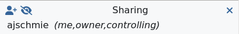

###########################################
How to connect remotely to the GBO network?
###########################################

This connection is needed for performing observations and is also available to process data. 

There are multiple ways to connect remotely to the GBO network:

1. :ref:`FastX connection`
2. :ref:`VNC connection`

.. Only those observers who have used the GBT before and have demonstrated that they are fully able to set up and observe on the GBT without staff assistance may observe remotely. All observers must come to Green Bank at least once before they can be approved for remote observing. Also, observers may be required to come to Green Bank to be re-qualified for remote observing if the observations are significantly different than previous observations or if the observer has not used the GBT recently.

FastX connection
================

We recommend the FastX connection using your browser. FastX is a commercial product that provides remote access to Linux systems by giving you a full graphical interface within your browser. No software is required on your machine except a browser. This service is available from anywhere that has a reasonable internet connection.

.. caution::

   You should avoid accessing this service from public machines such as at hotels or conferences as these machines are highly likely to be compromised and will record your login credentials.

Accessing the GBO network
-------------------------

Point your browser at https://ssh.gb.nrao.edu:3443/. You will be prompted for a username and password. This should be your NRAO/GBO username and your UNIX password.

.. image:: images/fastX_gb_login.png

Once you have logged in, you will be greeted by a screen informing you to abide by the terms of the NRAO Computing Security and Computing Use Policies. Click "Proceed".

.. image:: images/fastX_gb_login-success.png

Next you will see the FastX dashboard.

.. image:: images/fastX_gb_dashboard.png

In the top right corner you can access your User Preferences, learn about FastX and Sign Out. 

For your convenience shortcut connections to our different computing machines are provided in the left-hand panel. If **you're actually observing**, pick *ariel* or *titania*. If **you want to process your data**, please choose *euclid*, *fourier*, *maxwell*, *newton*, *planck*, or *thales*. 

After selecting your target machine, and if your system supports it, you might see a page that allows you the choice between running the FastX session in the browser or via an app on your computer. For the latter to work, you are required to download and install the app.

You will be asked for your UNIX password one more time and then you should see your XFCE desktop on the machine of your choice. FastX session should resize your Linux screen automatically to adjust to the size of your browser.

FastX session controls
----------------------

While in a FastX session, there is a small drop-down menu in the top part of the window that appears when you hover over it and allows some control over the session.

.. image:: images/fastX_gb_session-controls.png

From left to right: 

    1. **House** brings you back to the FastX dashboard.
    2. **Keyboard** allows you to set the keyboard.
    3. **People** controls the sharing of the session (more :ref:`here<Sharing a session>`).
    4. **Folder** allows to open files to the clipboard. 
    5. **Settings** allows you to change other settings such as the window size. Tinkering with these settings should not generally be required but on a very slow connection lowering refresh rates and picture quality may be helpful. 

Ending a FastX session
----------------------

When you are finished, click the home button in the control menu (see above) and close the browser tab that contains the session you were working in. In the FastX starting page you will see a session in the center (Disconnected Sessions). This will expire automatically after 7 days, but if you don’t need it anymore, please terminate the session to help save ressources for your fellow observers.

You can reconnect to a disconnected session by clicking the “play” button.

.. image:: images/fastX_gb_disconnectedSession.png

.. note::

    Be aware that if a host is rebooted the session will also disappear.  Please also bear in mind that due to licensing only a limited number of concurrent sessions are possible.

Is this secure?
---------------

Short answer: Yes! Access to this service is only available over the HTTPS protocol and as such all traffic between your browser and the server is encrypted.

What can't I do?
----------------
You cannot fire up a browser in a session and access the FastX service in that browser. This kind of recursion is not permitted. As usual the `NRAO Computer Use Policy <https://www.nrao.edu/policy/usepolicy.shtml>`_ applies to all use of this service.

Sharing a session
-----------------

This software makes it possible to share a session in a similar manner to VNC but the sharing is accomplished through a web link containing the session key rather than sharing a VNC password. Sharing of sessions **should only occur where there is a genuine need to do so**, for instance when a member of staff is assisting an observer with actual observations or data reduction.

Sharing a session is accomplished by using the sharing icon in the session control drop menu. This will open a second menu in the top-right corner of the browser window.

Click the first icon in the top left (human figure with a plus sign), which will open yet another box.

Click on Public link and switch the options from Restricted to Public.

.. image:: images/fastX_gb_sharing_3.png

You can copy the link and share with e.g. the staff member. **This must be done in a secure manner** such as encrypted IM or through Green Banks talk and draw system. **Email is not a secure method**. As the dialogue states, anyone with this link can connect to the session.

.. attention::

    Once a session has been shared it must be terminated after use and not left running to connect to later!

What to do if the GBO network is down/slow
------------------------------------------

Occassionally we are experiencing network issues where either the entire Green Bank network is down or FastX and VNC sessions through Green Bank are extremely slow. In such a case you can try to establish a FastX connection through Charlottesville. Point your browser to https://fastx.cv.nrao.edu. You will be prompted for a username and password. This should be your NRAO/GBO username and your UNIX password (the same you're using to connect to the GBO network described above).

.. image:: images/fastX_cv_login.png

Once you have logged in, you will be greeted by the same screen informing you to abide by the terms of the NRAO Computing Security and Computing Use Policies again. Click "Proceed" to continue to your FastX dashboard.

.. image:: images/fastX_cv_dashboard.png

In the application panel on the left-hand side, you might not see a lot of preset connections yet. You can create your own connection by clicking the circled plus sign next to "Applications". A pop-up will open. Provide the following details:

- Command \*: :code:`ssh <machine-name>.gb.nrao.edu startxfce`
- Run As User: :code:`<your user name>`
- Name: :code:`<name of the machine or whatever identifier you want to use>`

Available machine names are: 

- **for observing only**: *ariel*, *titania* 
- **for data processing**: *euclid*, *fourier*, *maxwell*, *newton*, *planck*, *thales*

.. image:: images/fastX_cv_new-application.png

You can permanently save the connection details, by clicking the down-arrow next to Launch and selecting "Create Application". Then click Launch to start the connection.

.. image:: images/fastX_cv_new-application_create.png

You will be asked for your password twice: (1) to establish the ssh connection to a machine called polaris and then (2) to log into the machine you choose (ariel in the example here). You may experience longer load times to start the session, but once you're logged in, things usually work well.

.. image:: images/fastX_cv_ssh-login.png

.. image:: images/fastX_cv_ariel_login.png
  

If you don't see your newly created application in the dashboard, you might need to change the filter settings by clicking the filter icon and selecting "User".

.. image:: images/fastX_cv_filter.png

VNC connection
==============

.. What is a Virtual Network Connection (VNC)?
.. -------------------------------------------
.. 
.. VNC allows remote connections from a client computer to a server, creating a virtual desktop (desktop image) of the server screen on the client computer screen. The user of the client computer can work almost as if he or she were sitting in front of the screen of the remote computer. VNC continuously compresses and transfers screen shots from the server to the client, which makes for a much faster experience than normal X-forwarding.
.. 
.. 
.. Why is a VNC useful for GBT remote observing?
.. ---------------------------------------------
.. 
.. VNC allows the remote GBT observer to connect to a computer in the GBT control room (*titania*, *ariel*) from the observer's home/work machine in order to observe. Once the VNC session is set up, the remote observer can open astrid, cleo, gbtidl, etc. and perform other functions, just as if they were actually in the GBT control room sitting in front of one of the GBT computers.

How do I get the necessary software?
-------------------------------------

VNC comes with most Linux distributions and is easily set up, the same applies to an SSH client. Mac OS and Windows users should download and install a VNC Viewer.

.. tab:: Mac OS

        Note Chicken of the VNC is no longer supported. Mac users can use the built-in VNC viewer, RealVNC or TigerVNC.

        Mac OS includes a SSH client. You can open a terminal by launching either Terminal or X11, both of which are in your Mac's Applications > Utilities folder.

.. tab:: Windows

        VNC for Windows is available from `TightVNC <www.tightvnc.com>`_ or `RealVNC <www.realvnc.com>`_. Several commercial versions of VNC are available, but the free edition is suitable for remote GBT observations. For purposes of remote GBT observations, only the VNC viewer has to be installed on your computer. The VNC server has already been installed on the GBT control room computers and other appropriate machines in Green Bank.

        You will also need an SSH client. An SSH client allows you to make a secure SSH connection from your work/home machine to the Linux machines in the GBT control room. That is, with SSH client software running on your computer, you can open a terminal window to the remote Linux computer. For Windows users, PuTTY is a freeware SSH client. It is available from `www.chiark.greenend.org.uk/~sgtatham/putty/download.html`. Although other SSH client software exists (e.g. SSH Secure Shell, Secure CRT), our instructions assume you are using PuTTY.

        Thus, remote Window users should:

        - Download and install VNC unless it is already installed. You only need to install the VNC viewer.
        - Download and install PuTTY unless it is already installed on your machine.

VNC setup instructions
----------------------

The example below uses the computer :code:`titania.gb.nrao.edu` for the VNC server. :code:`titania.gb.nrao.edu` is currently the computer usually available to host VNC sessions. As our computer infrastructure changes, this might not always be the case. You should always check with the operator the name of the computer that you should use, and if it is different substitute that computer's name for :code:`titania.gb.nrao.edu` in the instructions below.

If this is your first session ever with VNC, you need to setup a VNC server password and specify which window manager you would like to use.

Log into the gateway machine
____________________________

Log into the GBO gateway machine. The steps for Linux and Mac OS  are different from those for Windows users:

.. tab:: Mac OS and Linux

       Open a terminal on your local computer and type

       .. code-block:: bash
            
            ssh stargate.gb.nrao.edu

       If you are not using an SSH agent, you will be asked to enter your NRAO Linux account username and password. 

.. tab:: Windows

        Start up PuTTY on your Windows machine. A PuTTY configuration window will appear. In the configuration window, specify the host name (*stargate.gb.nrao.edu*) and click on 'Open' to obtain a terminal window to the host. After specifying the host name, one can choose 'Save' to save the session for future use. If the host name already appears among the 'Saved Sessions", double click on the host name to open a terminal window to that host.
        
        .. todo::

            Add a better quality screenshot here.

        In the PuTTY terminal window to :code:`stargate.gb.nrao.edu` log in to your GBO Linux account if you are not using an SSH agent.

How do I provide a VNC password?
________________________________

.. warning::
   
   Choose a VNC password that is different from your NRAO Linux account as you may later wish to share your VNC password with other who can then watch your VNC session. For example, if you are having difficulties during a remote observing session, you might wish to share your VNC password with a Green Bank staff member who can access your virtual desktop and suggest solutions to your problems.

To create a VNC password, you must :ref:`log into a GBO computer <Log into the gateway machine>`. Once you are logged into the GBO computer, and regardless of your remote computer OS, type at the Linux prompt in the terminal window on the remote computer

.. code-block:: bash
    
    vncpasswd

Then enter your chosen VNC server password. 

How do I set up a Window Manager?
_________________________________

By default, you will be given *Tom's Window Manager* (TWM) for VNC sessions, which is probably one of the most arcane and archaic window managers around. If you would like to use the more intuitive and modern K Desktop Environment (KDE) window manager, you can perform the following steps:

:ref:`Log into a GBO computer <Log into the gateway machine>`. Once you are logged into the GBO computer, and regardless of your remote computer OS, type at the Linux prompt in the terminal window on the remote computer

.. code-block:: bash

    mkdir ~/.vnc

.. note::

    If you have already used VNC in the past, this step is not necessary an you will get a message stating that the 'file' already exists. This is normal.

If you want to use the kdewindow manager, at the Linux prompt, type:

.. code-block:: bash

    cp /users/cclark/xstartup-KDE ~/.vnc/xstartup

        
VNC session instructions
------------------------

Each time you observe remotely with the GBT, you will need to follow these instructions.

.. caution::

    Please do not start more than one VNC session at a time! There is only a limited total number of sessions and ports available at any time. Likewise, don't forget to end your VNC server session when you have finished observing. For instructions on ending your VNC server, please read :ref:`How do I close my VNC session?`.

How do I start a VNC session?
_____________________________

To set up a session at the remote machine your must first :ref:`log into a GBO computer <Log into the gateway machine>`.  Once you are logged into the GBO computer, and regardless of your remote computer, type at the Linux prompt

.. code-block:: bash

    ssh titania.gb.nrao.edu

If you are not using an SSH agent, you will be asked to enter your GBO Linux account username and password. At the Linux prompt on *titania* type:

.. code-block:: bash

    vncserver

.. note::

    If this is your first session in Green Bank, you will be asked which password should protect your future sessions. As noted above, choose a VNC password that is different from your Linux account password as you may later wish to share this password with a Green Bank staff member for troubleshooting your problem.

Once you have typed :code:`vncserver`, the system will reply with e.g.

.. code-block:: bash
   
    New 'titania:2 (USERNAME)' desktop is titania:2
   
In this example the VNC session number is 2. Remember this number since you will need it later. In the instructions below, the VNC session number is designated as **n**.

Leave this connection to the server open, as it will be used later to kill processes on *titania* associated with the VNC session.

How do I start a VNC viewer on my local machine?
________________________________________________

You will need to establish a SSH tunnel and start a VNC viewer in order to view the session on your local machine (work/home). The process is different for each computer platform:

.. tab:: Mac OS

        To establish an SSH tunnel, open a terminal on your Mac and type:
 
        .. code-block:: bash

            ssh -N -C -L 590n:titania.gb.nrao.edu:590n YOURLOGIN@stargate.gb.nrao.edu
            
        Replace **n** with the desktop number from the previous step and YOURLOGIN with the name of your GBO Linux account.
        If you are not using an SSH agent, you will be prompted for your GBO Linux account password. 
        
        
        To start a VNC viewer, launch TigerVNC from your Mac's Applications folder.

        .. todo::

            Add screenshot of tiger vnc.

        Set Host to localhost, set Display to **n**, enter your VNC password, check Remember Password, and check Allow other clients to connect and hit the Connect button. The VNC Viewer window to titania will now appear. In this window you can start astrid and cleo, open xterm, etc, almost as if you were sitting in front of a titania screen.

.. tab:: Linux

        To establish an SSH tunnel AND start a VNC viewer, open a terminal on your local computer and type:
 
        .. code-block:: bash
        
            vncviewer -Shared -via YOURLOGIN@stargate.gb.nrao.edu titania.gb.nrao.edu:n

        Replace **n** with the desktop number from the previous step and YOURLOGIN with the name of your GBO Linux account. The -Shared option allows support staff to "snoop" on your session when assisting you. If you are not using an SSH agent, you will be prompted for your GBO Linux account password. You will next be prompted for your VNC password, which should be different from your GBO Linux account password and sharable with support staff. You will be asked for this password regardless of whether or not you have an SSH agent running.
       
        .. note::

            If your Linux version does not support the -via option you might want to install `Tight VNC <www.tightvnc.com>`_ or use the following equivalent to -via. Open a terminal on your local computer and type:
 
            .. code-block:: bash

                ssh -N -C -L 590n:titania.gb.nrao.edu:590n YOURLOGIN@stargate.gb.nrao.edu &

            Open a terminal on your local computer and type:
 
            .. code-block:: bash
            
                vncviewer -Shared localhost:n

        The VNC Viewer window to titania will now appear. In this window you can start astrid and cleo, open xterm, etc, almost as if you were sitting in front of a titania screen.

.. tab:: Windows

        **To establish an SSH tunnel**: 
        
        Start another instance of PuTTY and bring up another PuTTY Configuration window. In this second PuTTYwindow, enter the following information under each Category (listed in the left panel of the window). This information can be saved for future use. Session - Host Name is stargate.gb.nrao.edu. (If stargate.gb.nrao.edu is already listed among the Saved Sessions, click on it and choose Load to place that name in the Host Name section of the window.)

        Connection > Data - Enter your Green Bank Linux account login name as the Auto-loginusername.
        
        Connection > SSH - Select Enable compression.
        
        Connection > SSH > Tunnels - Remove any previously used ports with the Remove button. For Source port enter 590n, where n is the VNC session number reported in the first PuTTY window (the VNC server). For Destination, enter titania.gb.nrao.edu:590n Then choose Add, then Open.

        A terminal screen will open to stargate.gb.nrao.edu. If you are not using an SSH agent, you will be prompted for your GBO Linux account password.

        You need to type nothing else in this window except exit at the end of the VNC session. The existence of this window serves only to provide the tunnel from your Windows machine to the Green Bank system.

        **To start the VNC viewer**:

        Start the VNC viewer on your Windows machine. If using TightVNC, please select the viewer having the "best compression." A popup window will appear, VNC Viewer: Connection Details. Click on Options. Search for and select the option for sharing the connection and then click OK. For Server enter localhost:n, where **n** is the VNC session number, as before.

        Next a VNC Viewer: Authentication window will pop up. Enter your vncserver password (not your GBO Linux password).

        The VNC Viewer window to titania will now appear on the screen of your Windows machine. In this window you can start astrid and cleo, open xterm, etc, almost as if you were sitting in front of a titaniascreen.

What special features does the VNC viewer window have?
______________________________________________________

- Depressiing the left mouse button inside the main VNC Viewer window brings up a menu, allowing you, for example, to open another xterm.

- Minimizing a window - Click on the upper left part of a window.

- Resizing a window - Use the icon at the upper right of a window.

- To configure your VNC Viewer, press F8 and a menu should appear.

How do I close my VNC session?
______________________________

.. important::

   If you stop using your VNC viewer but don't kill the :code:`vncserver`, your session stays alive and uses computing resources. If you run your VNC viewer a few hours later or from a different computer, you can continue where you left off. However, there is a limited number of sessions and ports available at any one time. Unless you know you will be using the session again within a few hours, please do not leave vncserver running. If you do, the GBT operator is likely to kill your vncserver session within 24 hours.

Also, please **do not start more than one VNC server at a time**.

To stop your VNC session, first close your VNC viewer, then kill your VNC server. You'll need a terminal window that is logged into an NRAO computer. In the terminal window on the remote GBO computer, at the Linux prompt type:

.. code-block:: bash

    ssh titania.gb.nrao.edu

Once you are on *titania* type

.. code-block:: bash

    vncserver -kill :n

where **n** is the VNC session numbers. Disconnect from *titania.gb.nrao.edu* by typing :code:`exit` and then disconnect from *stargate.gb.nrao.edu* by typing :code:`exit` again.

Troubleshooting Information
---------------------------

There have been times when a local port is taken by another user or another VNC session. In these rare cases, the recommended port forwarding won't work. To determine if a port is used, the terminal command,

.. code-block:: bash
    
    netstat -a | grep :59

This will list all used ports (they may be a delay of a few seconds before this list appears). In these cases, the tunnel has to be changed to :code:`590m:stargate.gb.nrao.edu:590n` where 590m is some unused port numbered somewhere above 5900. And wherever :code:`localhost:n` occurs in the above instructions, substitute with :code:`localhost:m`.

If you would like to check if you are already running a VNC server (really, there should only be one), use any terminal that is logged into an NRAO computer and type:

 
.. code-block:: bash

    ls ~YOURLOGIN/.vnc | grep .pid

Windows short instructions
---------------------------

Once you have done remote observing with VNC under Windows, the instructions below will serve as a reminder of the steps involved.

**1. Start VNC server on titania**

- Start PuTTY, Host Name is *stargate.gb.nrao.edu* (prospero on site), choose 'Open' to open terminal window, log in to Linux account.
- :code:`ssh titania.gb.nrao.edu`
- :code:`vncserver -geometry 1200x1000 -depth 8` (switches and numeric values may vary)
- Note VNC session number, **n**

**2. Set up SSH tunnel**

- Start PuTTY again, Host Name is *stargate.gb.nrao.edu* (prospero on site)
- *Connection* > *Data* - Set Auto-login username to linux account user name
- *Connection* > *SSH* > *Tunnels* - Source port is :code:`590n`, destination is :code:`titania.gb.nrao.edu:590n`
- Choose 'Add', then 'Open' to open the second terminal window, enter GBO Linux account password

**3. Start VNC viewer on Windows machine**

- First popup window, enter :code:`localhost:n` for Server
- Second popup window, enter VNC password

**4. Closing down VNC session**

- X out of VNC window after closing astrid, cleo etc.
- In first PuTTY terminal window (where vncserver was started) enter :code:`vncserver -kill :n`
- exit out of second PuTTY window.

-----------

.. admonition:: Acknowledgement

    We would like to thank Joeri van Leeuwen (UBC), Tom Troland (U. Kentucky), and Jeff Mangum (NRAO CV) who kindly provided the entire content of these VNC instructions. We appreciate the time they took to make VNC easier for all remote observers.

