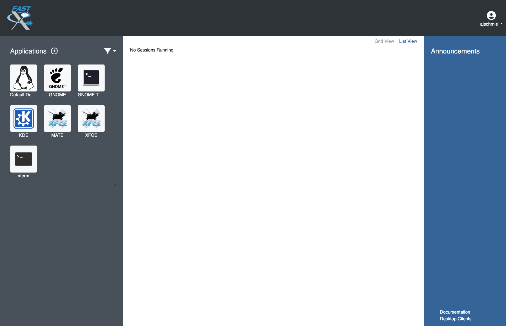

###########################################
How to connect remotely to the GBO network?
###########################################

This connection is needed for performing observations and is also available to process data. 

There are multiple ways to connect remotely to the GBO network:

1. :ref:`FastX connection`
2. :ref:`VNC connection`

FastX connection
================

We recommend the FastX connection using your browser. FastX is a commercial product that provides remote access to Linux systems by giving you a full graphical interface within your browser. No software is required on your machine except a browser. This service is available from anywhere that has a reasonable internet connection.

.. caution::

   You should avoid accessing this service from public machines such as at hotels or conferences as these machines are highly likely to be compromised and will record your login credentials.

Accessing the GBO network
-------------------------

Point your browser at https://ssh.gb.nrao.edu:3443/. You will be prompted for a username and password. This should be your NRAO/GBO username and your UNIX password.

Once you have logged in, you will be greeted by a screen informing you to abide by the terms of the NRAO Computing Security and Computing Use Policies. Click "Proceed".

Next you will see the FastX dashboard.

.. image:: images/fastX_gb_dashboard.png

In the top right corner you can access your User Preferences, learn about FastX and Sign Out. 

For your convenience shortcut connections to our different computing machines are provided in the left-hand panel. If **you're actually observing**, pick *ariel* or *titania*. If **you want to process your data**, please choose *euclid*, *fourier*, *maxwell*, *newton*, *planck*, or *thales*. 

After selecting your target machine, and if your system supports it, you might see a page that allows you the choice between running the FastX session in the browser or via an app on your computer. For the latter to work, you are required to download and install the app.

.. image:: images/fastX_gb_connection-choice.png

You will be asked for your UNIX password one more time and then you should see your XFCE desktop on the machine of your choice. FastX session should resize your Linux screen automatically to adjust to the size of your browser.

FastX session controls
----------------------

While in a FastX session, there is a small drop-down menu in the top part of the window that appears when you hover over it and allows some control over the session.

From left to right: 

    1. **House** brings you back to the FastX dashboard.
    2. **Keyboard** allows you to set the keyboard.
    3. **People** controls the sharing of the session (more :ref:`here<Sharing a session>`).
    4. **Folder** allows to open files to the clipboard. 
    5. **Settings** allows you to change other settings such as the window size. Tinkering with these settings should not generally be required but on a very slow connection lowering refresh rates and picture quality may be helpful. 

Ending a FastX session
----------------------

When you are finished, click the home button in the control menu (see above) and close the browser tab that contains the session you were working in. In the FastX starting page you will see a session in the center (Disconnected Sessions). This will expire automatically after 7 days, but if you don’t need it anymore, please terminate the session to help save ressources for your fellow observers.

You can reconnect to a disconnected session by clicking the “play” button.

.. image:: images/fastX_gb_disconnectedSession.png

.. note::

    Be aware that if a host is rebooted the session will also disappear.  Please also bear in mind that due to licensing only a limited number of concurrent sessions are possible.

Is this secure?
---------------

Short answer: Yes! Access to this service is only available over the HTTPS protocol and as such all traffic between your browser and the server is encrypted.

What can't I do?
----------------
You cannot fire up a browser in a session and access the FastX service in that browser. This kind of recursion is not permitted. As usual the `NRAO Computer Use Policy <https://www.nrao.edu/policy/usepolicy.shtml>`_ applies to all use of this service.

Sharing a session
-----------------

This software makes it possible to share a session in a similar manner to VNC but the sharing is accomplished through a web link containing the session key rather than sharing a VNC password. Sharing of sessions **should only occur where there is a genuine need to do so**, for instance when a member of staff is assisting an observer with actual observations or data reduction.

Sharing a session is accomplished by using the sharing icon in the session control drop menu. This will open a second menu in the top-right corner of the browser window.

.. image:: images/fastX_gb_sharing.png

Click the first icon in the top left (human figure with a plus sign), which will open yet another box.

.. image:: images/fastX_gb_sharing_2.png

Click on Public link and switch the options from Restricted to Public.

.. image:: images/fastX_gb_sharing_3.png

You can copy the link and share with e.g. the staff member. **This must be done in a secure manner** such as encrypted IM or through Green Banks talk and draw system. **Email is not a secure method**. As the dialogue states, anyone with this link can connect to the session.

.. attention::

    Once a session has been shared it must be terminated after use and not left running to connect to later!

What to do if the GBO network is down/slow
------------------------------------------

Occassionally we are experiencing network issues where either the entire Green Bank network is down or FastX and VNC sessions through Green Bank are extremely slow. In such a case you can try to establish a FastX connection through Charlottesville. Point your browser to https://fastx.cv.nrao.edu. You will be prompted for a username and password. This should be your NRAO/GBO username and your UNIX password (the same you're using to connect to the GBO network described above).

.. image:: images/fastX_cv_login.png

Once you have logged in, you will be greeted by the same screen informing you to abide by the terms of the NRAO Computing Security and Computing Use Policies again. Click "Proceed" to continue to your FastX dashboard.

In the application panel on the left-hand side, you might not see a lot of preset connections yet. You can create your own connection by clicking the circled plus sign next to "Applications". A pop-up will open. Provide the following details:

- Command \*: :code:`ssh <machine-name>.gb.nrao.edu startxfce`
- Run As User: :code:`<your user name>`
- Name: :code:`<name of the machine or whatever identifier you want to use>`

Available machine names are: 

- **for observing only**: *ariel*, *titania* 
- **for data processing**: *euclid*, *fourier*, *maxwell*, *newton*, *planck*, *thales*

.. image:: images/fastX_cv_new-application.png

You can permanently save the connection details, by clicking the down-arrow next to Launch and selecting "Create Application". Then click Launch to start the connection.

.. image:: images/fastX_cv_new-application_create.png

You will be asked for your password twice: (1) to establish the ssh connection to a machine called polaris and then (2) to log into the machine you choose (ariel in the example here). You may experience longer load times to start the session, but once you're logged in, things usually work well.

.. image:: images/fastX_cv_ariel_login.png
  

If you don't see your newly created application in the dashboard, you might need to change the filter settings by clicking the filter icon and selecting "User".

VNC connection
==============

.. todo::
    Instructions pending.

