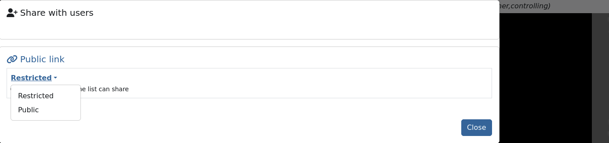

###########################################
How to connect remotely to the GBO network
###########################################

This connection is needed for performing observations and is also available to process data. 

There are multiple ways to connect remotely to the GBO network:

1. :ref:`FastX connection`
2. :ref:`VNC connection`

.. Only those observers who have used the GBT before and have demonstrated that they are fully able to set up and observe on the GBT without staff assistance may observe remotely. All observers must come to Green Bank at least once before they can be approved for remote observing. Also, observers may be required to come to Green Bank to be re-qualified for remote observing if the observations are significantly different than previous observations or if the observer has not used the GBT recently.

FastX connection
================

We recommend the FastX connection using your browser. FastX is a commercial product that provides remote access to Linux systems by giving you a full graphical interface within your browser. No software is required on your machine except a browser. This service is available from anywhere that has a reasonable internet connection.

.. caution::

   You should avoid accessing this service from public machines such as at hotels or conferences as these machines are highly likely to be compromised and will record your login credentials.

Accessing the GBO network
-------------------------

Point your browser at https://ssh.gb.nrao.edu:3443/. You will be prompted for a username and password. This should be your NRAO/GBO username and your UNIX password.

.. image:: images/fastX_gb_login.png

Once you have logged in, you will be greeted by a screen informing you to abide by the terms of the NRAO Computing Security and Computing Use Policies. Click "Proceed".

.. image:: images/fastX_gb_login-success.png

Next you will see the FastX dashboard.

In the top right corner you can access your User Preferences, learn about FastX and Sign Out. 

For your convenience shortcut connections to our different computing machines are provided in the left-hand panel. If **you're actually observing**, pick *ariel* or *titania*. If **you want to process your data**, please choose *euclid*, *fourier*, *maxwell*, *newton*, *planck*, or *thales*. 

After selecting your target machine, and if your system supports it, you might see a page that allows you the choice between running the FastX session in the browser or via an app on your computer. For the latter to work, you are required to download and install the app.

.. image:: images/fastX_gb_connection-choice.png

You will be asked for your UNIX password one more time and then you should see your XFCE desktop on the machine of your choice. FastX session should resize your Linux screen automatically to adjust to the size of your browser.

FastX session controls
----------------------

While in a FastX session, there is a small drop-down menu in the top part of the window that appears when you hover over it and allows some control over the session.

.. image:: images/fastX_gb_session-controls.png

From left to right: 
    1. **House** brings you back to the FastX dashboard.
    2. **Keyboard** allows you to set the keyboard.
    3. **People** controls the sharing of the session (more :ref:`here<Sharing a session>`).
    4. **Settings** allows you to change other settings such as the window size. Tinkering with these settings should not generally be required but on a very slow connection lowering refresh rates and picture quality may be helpful. 

Ending a FastX session
----------------------

When you are finished, click the home button in the control menu (see above) and close the browser tab that contains the session you were working in. In the FastX starting page you will see a session in the center (Disconnected Sessions). This will expire automatically after 7 days, but if you don’t need it anymore, please terminate the session to help save ressources for your fellow observers.

You can reconnect to a disconnected session by clicking the “play” button.

.. note::

    Be aware that if a host is rebooted the session will also disappear.  Please also bear in mind that due to licensing only a limited number of concurrent sessions are possible.

Is this secure?
---------------

Short answer: Yes! Access to this service is only available over the HTTPS protocol and as such all traffic between your browser and the server is encrypted.

What can't I do?
----------------
You cannot fire up a browser in a session and access the FastX service in that browser. This kind of recursion is not permitted. As usual the `NRAO Computer Use Policy <https://www.nrao.edu/policy/usepolicy.shtml>`_ applies to all use of this service.

Sharing a session
-----------------

This software makes it possible to share a session in a similar manner to VNC but the sharing is accomplished through a web link containing the session key rather than sharing a VNC password. Sharing of sessions **should only occur where there is a genuine need to do so**, for instance when a member of staff is assisting an observer with actual observations or data reduction.

Sharing a session is accomplished by using the sharing icon in the session control drop menu. This will open a second menu in the top-right corner of the browser window.

.. image:: images/fastX_gb_sharing.png

Click the first icon in the top left (human figure with a plus sign), which will open yet another box.

.. image:: images/fastX_gb_sharing_2.png

Click on Public link and switch the options from Restricted to Public.

You can copy the link and share with e.g. the staff member. **This must be done in a secure manner** such as encrypted IM or through Green Banks talk and draw system. **Email is not a secure method**. As the dialogue states, anyone with this link can connect to the session.

.. attention::

    Once a session has been shared it must be terminated after use and not left running to connect to later!

VNC connection
==============
.. What is a Virtual Network Connection (VNC)?
.. -------------------------------------------
.. 
.. VNC allows remote connections from a client computer to a server, creating a virtual desktop (desktop image) of the server screen on the client computer screen. The user of the client computer can work almost as if he or she were sitting in front of the screen of the remote computer. VNC continuously compresses and transfers screen shots from the server to the client, which makes for a much faster experience than normal X-forwarding.
.. 
.. 
.. Why is a VNC useful for GBT remote observing?
.. ---------------------------------------------
.. 
.. VNC allows the remote GBT observer to connect to a computer in the GBT control room (*titania*, *ariel*) from the observer's home/work machine in order to observe. Once the VNC session is set up, the remote observer can open astrid, cleo, gbtidl, etc. and perform other functions, just as if they were actually in the GBT control room sitting in front of one of the GBT computers.

Quick VNC Reference
-------------------

.. tab:: Mac OS X

    #. (Once) Login to GBO ``ssh [username]@ssh.gb.nrao.edu``
    #. (Once) SSH to your machine of choice by ``ssh <machine>``. If you're actively observing, pick either titania or ariel, otherwise use one of our data reduction machines ``fourier``, ``planck``, ``newton``, ``euclid``, ``thales``, or ``arcturus``. 
    #. (Once) Start vnc session with ``vncserver -geometry [horiz_len]x[vert_len]``, with the lengths given in pixels, e.g. ``-geometry 1800x1000``. This command starts the persistent VNC session and will give you your session number.
    #. Every time you want to connect to the VNC session, open a new terminal on your computer and type

        .. code-block:: bash

            ssh -N -C -L 590n:titania.gb.nrao.edu:590n username@ssh.gb.nrao.edu	
            
        where ``n`` is the number you were given in step 3. 
        
        .. note::

            * If ``n`` is a double-digit number replace the ``0`` in the ssh command.
            * Replace ``titania`` with the name of the machine you ssh-ed into in step 2. 
        
        After entering your password, this terminal window will just keep the tunnel open, and there is no need to interact with it anymore.  
    #. You can e.g. use the MacOS native application "Screen Sharing" to view your session, with ``localhost:590n`` as the VNC session name. Alternative applications are `RealVNC <https://realvnc.com/en/connect/download/viewer/>`_ or `TigerVNC <https://tigervnc.org>`_.

.. tab:: Linux
	
	#. (Once) Login to GBO ``ssh [username]@ssh.gb.nrao.edu``
	#. (Once) SSH to your machine of choice by ``ssh <machine>``. If you're actively observing, pick either titania or ariel, otherwise use one of our data reduction machines ``fourier``, ``planck``, ``newton``, ``euclid``, ``thales``, or ``arcturus``.
	#. (Once) Start vnc session with ``vncserver -geometry [horiz_len]x[vert_len]``, with the lengths given in pixels, e.g. ``-geometry 1800x1000``. This command starts the persistent VNC session and will give you your session number.
	#. Every time you want to connect to the VNC session and view it, open a new terminal on your computer and type

	    .. code-block:: bash
    
        	    vncviewer -Shared -via [username]@ssh.gb.nrao.edu titania.gb.nrao.edu:n
    
	    where `n` is the number you were given in step 3.

        .. note::

            * If `n` is a double-digit number replace the `0` in the ssh command.
            * Replace ``titania`` with the name of the machine you ssh-ed into in step 2.
            * If your Linux version does not support the "-via" option, see the note in the detailed instructions.

.. tab:: Windows

	#. (Once) Start PuTTY, Host Name is *ssh.gb.nrao.edu*, choose 'Open' to open terminal window, log in to Linux account.
	#. (Once) SSH to your machine of choice by ``ssh <machine>``. If you're actively observing, pick either titania or ariel, otherwise use one of our data reduction machines ``fourier``, ``planck``, ``newton``, ``euclid``, ``thales``, or ``arcturus``.
	#. (Once) ``vncserver -geometry [horiz_len]x[vert_len]``, with the lengths given in pixels, e.g. ``-geometry 1800x1000``. This command starts the persistent VNC session and will give you your session number "n".
	#. Every time you want to connect to the VNC session, start PuTTY again with the following options:

		* Host Name:*ssh.gb.nrao.edu*
		* Connection > Data - Set Auto-login username to linux account user name
		* Connection > SSH > Tunnels - Source port is ``590n``, destination is ``titania.gb.nrao.edu:590n``. Replace ``titania`` with the name of the machine you ssh-ed into in step 2.

	#. Choose 'Add', then 'Open' to open the second terminal window, then enter your GBO Linux account password
	#. Use your vnc viewer on your computer to view your session, with "localhost:n" as the VNC session name.

How do I get the necessary software?
-------------------------------------

VNC comes with most Linux distributions and is easily set up, the same applies to an SSH client. Mac OS and Windows users should download and install a VNC Viewer.

.. tab:: Mac OS

        Mac users can use the built-in VNC viewer (Screen sharing application), `RealVNC <https://realvnc.com/en/connect/download/viewer/>`_ or `TigerVNC <https://tigervnc.org>`_. Note: Chicken of the VNC is no longer supported. 

        Mac OS includes a SSH client. You can open a terminal by launching either Terminal or X11, both of which are in your Mac's Applications > Utilities folder.

.. tab:: Windows

        VNC for Windows is available from `TightVNC <www.tightvnc.com>`_ or `RealVNC <www.realvnc.com/en/connect/download/viewer/>`_. Several commercial versions of VNC are available, but the free edition is suitable for remote GBT observations. For purposes of remote GBT observations, only the VNC viewer has to be installed on your computer. The VNC server has already been installed on the GBT control room computers and other appropriate machines in Green Bank.

        You will also need an SSH client. An SSH client allows you to make a secure SSH connection from your work/home machine to the Linux machines in the GBT control room. That is, with SSH client software running on your computer, you can open a terminal window to the remote Linux computer. For Windows users, `PuTTY <www.chiark.greenend.org.uk/~sgtatham/putty/download.html>`_ is a freeware SSH client. Although other SSH client software exists (e.g. SSH Secure Shell, Secure CRT, Git Bash), our instructions assume you are using PuTTY.

        Thus, remote Window users should:

        - Download and install VNC unless it is already installed. You only need to install the VNC viewer.
        - Download and install PuTTY unless it is already installed on your machine. All of the default install options are OK.

Detailed VNC Setup Instructions
-------------------------------

The example below uses the computer ``titania.gb.nrao.edu`` for the VNC server. ``titania`` is currently the computer usually available to host VNC sessions where the primary purpose is to observe with the GBT. As our computer infrastructure changes, this might not always be the case. You may check with the operator to ensure that this is the case. If you are starting a VNC session on a data reduction machine, you will simply replace ``titania`` with the name of the machine you want to use. These machines are all accesible through our external gateway machine ``ssh.gb.nrao.edu``.

Log into the host machine
____________________________

Log into your host machine of choice through the GBO gateway machine. Please use ``titania`` and ``ariel`` for active observing only. For observing script preparation, data processing etc, please use one of our data reduction machines: ``fourier``, ``planck``, ``newton``, ``euclid``, ``thales``, or ``arcturus``. In all steps below replace ``titania`` with the machine you want to work on. The steps for Linux and Mac OS  are different from those for Windows users:

.. tab:: Mac OS and Linux

       Open a terminal on your local computer and type

       .. code-block:: bash
            
            ssh [username]@ssh.gb.nrao.edu
            ssh titania

       If you are not using an SSH agent, you will be asked to enter your NRAO Linux account username and password. 

.. tab:: Windows

	Start up PuTTY on your Windows machine. A PuTTY configuration window will appear. In the configuration window, specify the host name as "ssh.gb.nrao.edu" and click on 'Open' to obtain a terminal window to the host. After specifying the host name, one can choose 'Save' to save the session for future use. If the host name already appears among the 'Saved Sessions", double click on the host name to open a terminal window to that host.
        
	.. image:: images/puTTY_titania_1.png

	The PuTTY terminal window will ask for your NRAO Linux account username and password. then, ssh to titania with ``ssh titania``

How do I provide a VNC password?
________________________________

If this is your first session ever with VNC, you need to setup a VNC password. If you already have a VNC password, you can change it with these same instructions.

.. warning::
   
   Choose a VNC password that is different from your NRAO Linux account as you may later wish to share your VNC password with other who can then watch your VNC session. For example, if you are having difficulties during a remote observing session, you might wish to share your VNC password with a Green Bank staff member who can access your virtual desktop and suggest solutions to your problems.

To create a VNC password, you must :ref:`log into a GBO computer <Log into the host machine>`. Once you are logged into the GBO computer, type at the Linux prompt in the terminal window on the remote computer

.. code-block:: bash
    
    vncpasswd

Then enter your chosen VNC password. 

.. caution::

    Please do not start more than one VNC session at a time! There is only a limited total number of sessions and ports available at any time. Likewise, don't forget to end your VNC server session when you have finished observing. For instructions on ending your VNC server, please read :ref:`How do I close my VNC session?`.

Starting a VNC session
_____________________________

You only need to do this section once, upon starting the VNC session. As long as the session isn't ended, you may skip ahead to :ref:`Starting a VNC viewer on your local machine<Starting a VNC viewer on your local machine>`. Once you are logged into the GBO host machine you want to start the VNC session in, and regardless of your remote computer, type at the Linux prompt

.. code-block:: bash

    vncserver -geometry [horiz_len]x[vert_len]

With the lengths given in pixels, e.g. ``-geometry 1800x1000``. Without this flag, the system will use the default screen resolution, which can be pretty small. You may want to change these values to suit your preferences. You can also append ``:n`` at the end to manually choose a session number "n", as long as it is unclaimed.

.. note::

    If this is your first session in Green Bank, you will be asked which password should protect your future sessions. As noted above, choose a VNC password that is different from your Linux account password as you may later wish to share this password with a Green Bank staff member for troubleshooting your problem.

Once you have typed :code:`vncserver`, the system will reply with something like:

.. code-block:: bash
   
    New 'titania:2 (USERNAME)' desktop is titania:2
   
In this example the VNC session number is 2. Remember this number since you will need it later. In the instructions below, the VNC session number is designated as **n**.

Leave this connection to the server open, as it will be used later to kill processes on ``titania`` associated with the VNC session.

Starting a VNC viewer on your local machine
________________________________________________

You will need to establish a SSH tunnel and start a VNC viewer in order to view the session on your local machine. The process is different for each computer platform:

.. tab:: Mac OS

        To establish an SSH tunnel, open a terminal on your Mac and type:
 
        .. code-block:: bash

            ssh -N -C -L 590n:titania.gb.nrao.edu:590n [username]@ssh.gb.nrao.edu
            
        Replace **n** with the desktop number from the previous step and [username] with the name of your GBO Linux account. As mentioned above, if you are using a data reduction machine, you will replace ``titania`` with the name of your machine (e.g. ``euclid``, ``fourier``, etc.)
        If you are not using an SSH agent, you will be prompted for your GBO Linux account password. 
        
        
        To start a VNC viewer, launch Screen Sharing by typing Cmd+Space  and searching for the application. It can be found under System > Library > Core Services > Applications.

        .. image:: images/RemoteInstructions_Screenshot3.png

        Select File > New Connection, type in ``localhost:590n``, and type in your VNC password. The VNC Viewer window to titania will now appear. In this window you can start astrid and cleo, open xterm, etc. Alternatively you can open Finder, type Cmd+K or click `Go` in the top bar and select `Connect to Server...` at the very bottom of the drop-down menu. Enter `vnc:localhost:590n` in the new window and click "Connect".

.. tab:: Linux

        To establish an SSH tunnel AND start a VNC viewer, open a terminal on your local computer and type:
 
        .. code-block:: bash
        
            vncviewer -Shared -via [username]@ssh.gb.nrao.edu titania.gb.nrao.edu:n

        Replace **n** with the desktop number from the previous step and [username] with the name of your GBO Linux account. The -Shared option allows support staff to "snoop" on your session when assisting you. If you are not using an SSH agent, you will be prompted for your GBO Linux account password. You will next be prompted for your VNC password, which should be different from your GBO Linux account password and sharable with support staff. You will be asked for this password regardless of whether or not you have an SSH agent running.
	
	As mentioned above, if you are using a data reduction machine, you will replace ``titania`` with the name of your machine (e.g. ``euclid``, ``fourier``, etc.)
       
        .. note::

            If your Linux version does not support the -via option you might want to install `Tight VNC <www.tightvnc.com>`_ or use the following equivalent to -via. Open a terminal on your local computer and type:
 
            .. code-block:: bash

                ssh -N -C -L 590n:titania.gb.nrao.edu:590n [username]@ssh.gb.nrao.edu &

            Open a terminal on your local computer and type:
 
            .. code-block:: bash
            
                vncviewer -Shared localhost:n

        The VNC Viewer window to titania will now appear. In this window you can start astrid and cleo, open xterm, etc.

.. tab:: Windows

        **To establish an SSH tunnel**: 
        
        Start another instance of PuTTY. In this second PuTTY window, enter the following information under each Category (listed in the left panel of the window). This information can be saved for future use. 

	* Session - Host Name is ssh.gb.nrao.edu.

        * Connection > Data - Enter your Green Bank Linux account login name as the Auto-login username.
        
        * Connection > SSH - Select Enable compression.
        
        * Connection > SSH > Tunnels - Remove any previously used ports with the Remove button. For Source port enter ``590n``, where n is the VNC session number reported in the first PuTTY window (the VNC server). For Destination, enter ``titania.gb.nrao.edu:590n`` Then choose Add, then Open. As mentioned above, if you are using a data reduction machine, you will replace ``titania`` with the name of your machine (e.g. ``euclid``, ``fourier``, etc.)

	.. image:: images/puTTY_titania_2.png

        A terminal screen will open to ssh.gb.nrao.edu. If you are not using an SSH agent, you will be prompted for your GBO Linux account password.

        You do not need to type anything else in this window except exit at the end of the VNC session. The existence of this window serves only to provide the tunnel from your Windows machine to the Green Bank system.

        **To start the VNC viewer**:

        Start the VNC viewer on your Windows machine. If using TightVNC, please select the viewer having the "best compression." A popup window will appear, VNC Viewer: Connection Details. Click on Options. Search for and select the option for sharing the connection and then click OK. For Server enter localhost:n, where **n** is the VNC session number, as before.

	If using RealVNC, select File > New Connection and fill in localhost:n under the VNC server field. You may want to switch to the Options tab and deselect the options for passing media/audio keys to the VNC server.

	.. image:: images/realVNC_titania_3.png

        Next a VNC Viewer: Authentication window will pop up. Enter your vncserver password (not your GBO Linux password).

        The VNC Viewer window to titania will now appear on the screen of your Windows machine. In this window you can start astrid and cleo, open xterm, etc.

To configure your VNC Viewer, press F8 and a menu should appear.

How do I close my VNC session?
______________________________

.. important::

   After observing, if you stop using your VNC viewer but don't kill the VNC session, it stays alive and uses computing resources. If you run your VNC viewer a few hours later or from a different computer, you can continue where you left off. However, there is a limited number of sessions and ports available at any one time. Unless you know you will be using the session again within a few hours, please do not leave the VNC session running. If you do, the GBT operator is likely to kill your ``titania`` VNC session within 24 hours.

Also, please **do not start more than one VNC session at a time**. Note that you do not need to start a new VNC session every time you want to connect to an already existing VNC. If you are using a data reduction machine to perform long-running scripts, you do not need to worry about closing the VNC session until you are done with data reduction.

To stop your VNC session, use a separate terminal window on your local machine and connect to the computer hosting the VNC session as described :ref:`above <Log into the host machine>`. This can be the same window you used to start the VNC session, if you still have it open. Type:

.. code-block:: bash

    vncserver -kill :n

where **n** is the VNC session number. Disconnect from the host machine by typing :code:`exit` or closing the terminal window itself. If you left the VNC viewer application running, it should automatically disconnect and/or close.

Troubleshooting Information
---------------------------

Local port already taken
________________________

There have been times when a local port is taken by another user or another VNC session. In these rare cases, the recommended port forwarding won't work. To determine if a port is used, the terminal command,

.. code-block:: bash
    
    netstat -a | grep :59

This will list all used ports (there may be a delay of a few seconds before this list appears). In these cases, the tunnel has to be changed to :code:`590m:stargate.gb.nrao.edu:590n` where 590m is some unused port numbered somewhere above 5900. And wherever :code:`localhost:n` occurs in the above instructions, substitute with :code:`localhost:m`.

Check if a vnc session is already running
_________________________________________

If you would like to check if you are already running a VNC session (really, there should only be one), use any terminal that is logged into an NRAO computer and type:

 
.. code-block:: bash

    ls ~YOURLOGIN/.vnc | grep .pid

``n`` has two digits
____________________

On Mac OS X, if your ``n`` is larger than 9, i.e. it has two digits, then the following command 

.. code-block:: bash

    ssh -N -C -L 590n:titania.gb.nrao.edu:590n [username]@ssh.gb.nrao.edu

becomes

.. code-block:: bash

    ssh -N -C -L 59nn:titania.gb.nrao.edu:59nn [username]@ssh.gb.nrao.edu

A similar fix must be applied to the puTTY Tunnels tab as well, for Windows users.

VNC screen remains black
________________________

You followed the quick instructions (:ref:`Quick VNC Reference above <Quick VNC Reference>`), you're asked for your VNC password, a new screen opens, but it is entirely black. If that's the case, check the content of the ``xstartup`` file in your .vnc folder. This folder is located in your home folder on the GBO network. 

The file ideally contains these first lines:

.. code-block:: bash

    #!/bin/sh
    dbus-launch xfce4-session

If it doesn't, add these two lines at the top of the ``xstartup`` file, then after step 2 of the :ref:`Quick VNC Reference above <Quick VNC Reference>` kill your vnc server using ``vncserver -kill :n`` and then proceed with the remaining instructions as given in the :ref:`Quick VNC Reference above <Quick VNC Reference>`.

What to do if the GBO network is down/slow
==========================================
Occassionally we experience network issues where either the entire Green Bank network is down or intermittent which causes FastX and VNC sessions through Green Bank to be extremely slow. 

Suggested checks:

- If you are unsure which end of the internet is slow, try running a speed test on your network connection. If your speed levels are where they should according to your internet provider, the problem is likely on the Green Bank end of the network. 
- Check `this status page <https://status.gb.nrao.edu/>`_ to see the status of the ssh gateways. Orange means that it was down for a small portion of that time slice. Red is down for a significant portion of the time span that slice of the bar covers. Each vertical bar is a day.

In the case that the internet issue is on the GBO side, you can run your FastX or VNC connection through Charlottesville. Or with FastX, if you get kicked out, just keep trying to re-connect.

FastX through Charlottesville
------------------------------
Point your browser to https://fastx.cv.nrao.edu. You will be prompted for a username and password. This should be your NRAO/GBO username and your UNIX password (the same you're using to connect to the GBO network described above).

Once you have logged in, you will be greeted by the same screen informing you to abide by the terms of the NRAO Computing Security and Computing Use Policies again. Click "Proceed" to continue to your FastX dashboard.

.. image:: images/fastX_cv_dashboard.png

In the application panel on the left-hand side, you might not see a lot of preset connections yet. You can create your own connection by clicking the circled plus sign next to "Applications". A pop-up will open. Provide the following details:

- Command \*: :code:`ssh <machine-name>.gb.nrao.edu startxfce4`
- Run As User: :code:`<your user name>`
- Name: :code:`<name of the machine or whatever identifier you want to use>`

Available machine names are: 

- **for observing only**: *ariel*, *titania* 
- **for data processing**: *euclid*, *fourier*, *maxwell*, *newton*, *planck*, *thales*

You can permanently save the connection details, by clicking the down-arrow next to Launch and selecting "Create Application". Then click Launch to start the connection.

You will be asked for your password twice: (1) to establish the ssh connection to a machine called polaris and then (2) to log into the machine you choose (ariel in the example here). You may experience longer load times to start the session, but once you're logged in, things usually work well.

.. image:: images/fastX_cv_ssh-login.png

.. image:: images/fastX_cv_ariel_login.png
  

If you don't see your newly created application in the dashboard, you might need to change the filter settings by clicking the filter icon and selecting "User".

.. image:: images/fastX_cv_filter.png

VNC through Charlottesville
------------------------------
If you cannot even connect to green bank to start your VNC session through Charlottesville instead:
    .. code-block:: bash

        ssh username@ssh.cv.nrao.edu
        ssh titania
        vncserver -geometry [horiz_len]x[vert_len] :n

    .. hint::

        Manually choose a higher number session to decrease the likelihood that that number is being used on either a GBO or Charlottesville computer.

Then make your tunnel
    .. code-block:: bash

        ssh -N -C -L 590n:titania.gbt.nrao.edu:590n [username]@ssh.cv.nrao.edu

And with your VNC viewer connect to `localhost:590n`

.. hint::

    You may encounter an error when trying to create a tunnel through Charlottesville ``bind [\:\:\#]:590\#: address already in use, channel_setup_fwd_listener_tcpip: cannot listen to port: 590\#, could not request local forwarding`` This was thought to mean that that # port was already taken on a Charlottesville computer so you will have to choose a different VNC session number. Hence the earlier suggestion to manually choose a session number that is higher initially to avoid such issues.

-----------

.. admonition:: Acknowledgement

    We would like to thank Joeri van Leeuwen (UBC), Tom Troland (U. Kentucky), and Jeff Mangum (NRAO CV) who kindly provided the basis of these VNC instructions. We appreciate the time they took to make VNC easier for all remote observers.

