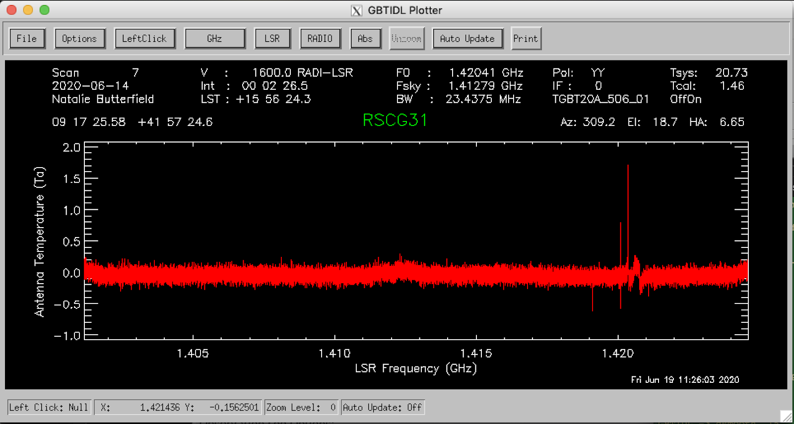
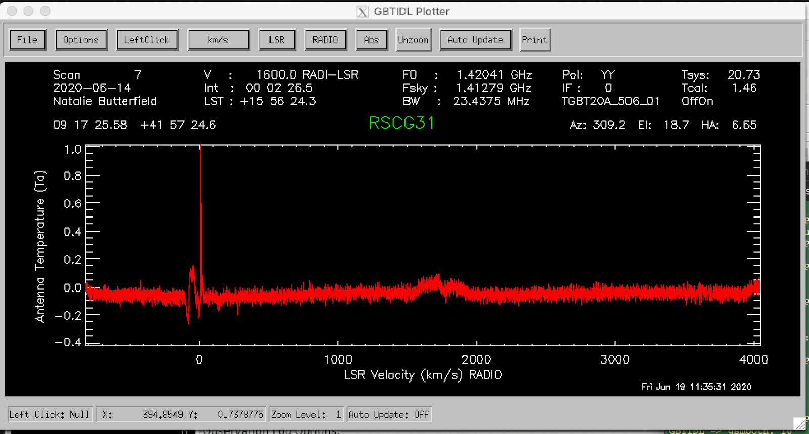

############################################
How to observe an HI spectrum and process it
############################################

The instructions below will run you through the steps required to setup your scheduling blocks to execute an HI pointed observation (using either frequency- or position-switching) and how to calibrate the data.

Observing Script
================

At the GBT we use AstrID to prepare and execute scheduling blocks.

Catalog
-------
Before you start writing your scheduling block it is helpful to prepare a source catalog in a separate file. This is especially advised if you have a long list of sources. For a short catalog it is also possible to add the sources directly in your scheduling block (not described here). 

To find out more about catalogs: GBT Observer's Guide: Section 6.3

Here is an example of a RA/Dec coordinate system catalog with velocity:

.. code-block:: python

    # Source List for HI observing with RA/Dec coordinates.

    Coordmode = J2000
    HEAD = NAME		RA		DEC		VEL
    RSCG31		09:17:26.5	41:57:18	1600
    RSCG64		12:41:33.2	26:03:56	4800

VEL is source velocity in units of km/s. Reference frames can be set using the VDEF keyword in the config. You can also include any number of user defined keywords. See Observer’s guide for more information.

We advise to save this catalog as a ‘.cat’ file, in a known location. We will call it later from our scheduling block(s).

Configuration
-------------

.. tab:: Position-switching (psw)

    .. code-block:: python

        # Configuration parameters for spectral line observations of HI using position switching.

        psw_HI_config='''
        receiver        = 'Rcvr1_2'         # Specifies L-Band receiver for HI
        obstype         = 'Spectroscopy'    # Specifies spectral line observations
        backend         = 'VEGAS'           # Specifies spectral line backend
        restfreq        = 1420.4058         # Specifies rest frequency for HI (MHz)
        deltafreq       = 0.0               # Specifies offsets for each spectral window (MHz)
        bandwidth       = 23.44             # Defined by chosen VEGAS mode (MHz)
        nchan           = 32768             # Specifies number of channels in spectral window
        vegas.subband   = 1                 # Specifies single or multiple spectral windows (1 or 8)
        swmode          = 'tp'              # Specifies switching mode, switching power with noise diode
        swtype          = None              # Specifies type of switching, no switching
        swper           = 1.0               # Specifies length of full switching cycle (seconds)
        swfreq          = 0, 0              # Specifies frequency offset (MHz)
        tint            = 6.0               # Specifies integration time (sec; integer multiple of swper)
        vframe          = 'lsrk'            # Specifies velocity reference frame
        vdef            = 'Optical'         # Specifies Doppler-shifted velocity frame
        noisecal        = 'lo'              # Specifies level of the noise diode, use ‘lo’ for ‘fsw’
        pol             = 'Linear'          # Specifies ‘Linear’ or ‘Circular’ polarization
        notchfilter     = 'In'              # Specify ‘In’ to block 1200-1310 MHz RFI signal
        '''
        
.. tab:: Frequency-switching (fsw)

    .. code-block:: python
        
        # Configuration parameters for spectral line observations of HI using frequency switching.

        fsw_HI_config='''
        receiver        = 'Rcvr1_2'         # Specifies L-Band receiver for HI
        obstype         = 'Spectroscopy'    # Specifies spectral line observations
        backend         = 'VEGAS'           # Specifies spectral line backend
        restfreq        = 1420.4058         # Specifies rest frequency for HI (MHz)
        deltafreq       = 0.0               # Specifies offsets for each spectral window (MHz)
        bandwidth       = 23.44             # Defined by chosen VEGAS mode (MHz)
        nchan           = 32768             # Specifies number of channels in spectral window
        vegas.subband   = 1                 # Specifies single or multiple spectral windows (1 or 8)
        swmode          = 'sp'              # Specifies switching mode, switching power with noise diode
        swtype          = 'fsw'             # Specifies type of switching, no switching
        swper           = 1.0               # Specifies length of full switching cycle (seconds)
        swfreq          = 0, -5.0           # Specifies frequency offset (MHz)
        tint            = 6.0               # Specifies integration time (sec; integer multiple of swper)
        vframe          = 'lsrk'            # Specifies velocity reference frame
        vdef            = 'Optical'         # Specifies Doppler-shifted velocity frame
        noisecal        = 'lo'              # Specifies level of the noise diode, use ‘lo’ for ‘fsw’
        pol             = 'Linear'          # Specifies ‘Linear’ or ‘Circular’ polarization
        notchfilter     = 'In'              # Specify ‘In’ to block 1200-1310 MHz RFI signal
        '''

.. note::	
    
    Your parameters may differ based on your specific science goals.

Scheduling Block(s)
-------------------

To find out more about scripts: GBT Observer's Guide: Section 6.1

AstrID is used to submit scheduling blocks for GBT observations. Astrid is python-based and can incorporate custom user scripts. Here is an example of a basic position switched, tracking observation for HI observing.

.. tab:: Position-switching (psw)

    .. code-block:: python

        # Observing script for spectral line observations of HI using position switching.

        # Reset configuration from prior observation.
        ResetConfig()

        # Import catalog of flux calibrators and user defined sources.
        Catalog(fluxcal)
        Catalog('/home/astro-util/projects/quick_guide/catalogs/ps_HI.cat')

        # Define configuration parameters
        psw_HI_config='''
        receiver        = 'Rcvr1_2'
        obstype         = 'Spectroscopy'
        backend         = 'VEGAS'
        restfreq        = 1420.4058
        bandwidth       = 23.44
        nchan           = 32768
        vegas.subband   = 1
        swmode          = 'tp'
        swtype          = None
        swfreq          = 0, 0
        swper           = 1.0
        tint            = 6.0
        vframe          = 'lsrk'
        vdef            = 'Optical'
        noisecal        = 'lo'
        pol             = 'Linear'
        notchfilter     = 'In'
        '''

        # Configure telescope.
        Configure(psw_HI_config)

        # Slew to your source or calibrator.
        Slew('3C196')

        # Perform position and focus correction on nearby calibrator.
        AutoPeakFocus('3C196')

        # Slew to your source.
        Slew('RSCG31')

        # Reconfigure after calibrator corrections.
        Configure(psw_HI_config)

        # Balance the IF system.
        Balance()

        # OffOn produces two scans each of the specified duration (in seconds) which tell the GBT to take data for 10 minutes.
        OffOn('RSCG31', Offset('J2000', '-00:05:00', 0.0, cosv=True), 300)
        OnOff('RSCG31', Offset('J2000', '00:05:00', 0.0, cosv=True), 300)

        # Repeat for second source.
        Slew('RSCG64')

        Balance()

        OffOn('RSCG64', Offset('J2000', '-00:05:00', 0.0, cosv=True), 300)
        OnOff('RSCG64', Offset('J2000', '00:05:00', 0.0, cosv=True), 300)

.. tab:: Frequency-switching (fsw)

    .. code-block:: python

        # Observing script for spectral line observations of HI using frequency-switching.

        # Reset configuration from prior observation.
        ResetConfig()

        # Import catalog of flux calibrators and user defined sources.
        Catalog(fluxcal)
        Catalog('/home/astro-util/projects/quick_guide/catalogs/ps_HI.cat')

        # Define configuration parameters
        fsw_HI_config='''
        receiver        = 'Rcvr1_2'
        obstype         = 'Spectroscopy'
        backend         = 'VEGAS'
        restfreq        = 1420.4058
        bandwidth       = 23.44
        nchan           = 32768
        vegas.subband   = 1
        swmode          = 'sp'
        swtype          = 'fsw' 
        swfreq          = 0, 0
        swper           = 1.0
        tint            = 6.0
        vframe          = 'lsrk'
        vdef            = 'Optical'
        noisecal        = 'lo'
        pol             = 'Linear'
        notchfilter     = 'In'
        '''

        # Configure telescope.
        Configure(fsw_HI_config)

        # Slew to your source or calibrator.
        Slew('3C196')

        # Perform position and focus correction on nearby calibrator.
        AutoPeakFocus('3C196')

        # Slew to your source.
        Slew('RSCG31')

        # Reconfigure after calibrator corrections.
        Configure(fsw_HI_config)

        # Balance the IF system.
        Balance()

        # OffOn produces two scans each of the specified duration (in seconds) which tell the GBT to take data for 10 minutes.
        OffOn('RSCG31', Offset('J2000', '-00:05:00', 0.0, cosv=True), 300)
        OnOff('RSCG31', Offset('J2000', '00:05:00', 0.0, cosv=True), 300)

        # Repeat for second source.
        Slew('RSCG64')

        Balance()

        OffOn('RSCG64', Offset('J2000', '-00:05:00', 0.0, cosv=True), 300)
        OnOff('RSCG64', Offset('J2000', '00:05:00', 0.0, cosv=True), 300)

Data Reduction
==============

To find out more about data reduction: GBTIDL User's Guide

.. todo::
    
    Add GBTIDL API in references and then link properly.

Our current data reduction routines are written in IDL. Users can build custom scripts incorporating generic IDL commands. We will run through some common GBT IDL commands below. From the Green Bank Observatory data reduction machine arcturus, start GBTIDL by typing in a terminal

.. code-block:: bash
   
    gbtidl

Position-switched spectra
-------------------------

.. admonition:: Data

    TGBT20A_506_01

.. todo::
    
    Make sure this is the right data directory.

To access test the data presented in this reference guide type ‘offline’ followed by the project name: 

.. code-block:: idl

    offline, "TGBT20A_506_01"

‘Connecting to file’ tells you where the raw data files are located. File updated shows how long ago the last scan was updated.
   

.. note::

    To view data from a different observing project, replace the (TGBT20A_506_01) with the information for your project:
        - Semester number (e.g., AGBT20A)
        - Project number (e.g., 108)
        - Session number (e.g., 01)

    To access current observations, or see real-time data during an observing session, type 'online' from the command line. The project code is not needed in online mode.

View a summary of the observations:

.. code-block:: idl

   summary

.. todo:: 

    Add screenshot of the output here.

For more information on what each column is, please see the GBTIDL User’s Guide GBTIDL User's Guide: Section 4.7.

To view the position-switched observations type

.. code-block:: idl

   getps, 6

  
You can change the x-axis to the Doppler shifted velocity of the rest frequency (F0) by clicking on the 'GHz' GUI button and selecting 'km/s'.    

To get the second polarization, type

.. code-block:: idl

   getps, 6, plnum=1

To stack/average multiple scans together to improve signal to noise in the spectrum type

.. code-block:: idl

   getps, 6
   accum
   getps, 8
   accum
   ave

To smooth your spectra by a specific number of channels, you can use the ‘gsmooth’ command:

.. code-block:: idl

   getps, 6
   gsmooth, 5

You can do all this for the second source as well.

.. note::

    If you have multiple IF tunings, you may view those other IFs by indicating ifnum=0, 1, 2, etc.

Saving and/or exporting your data can be done in multiple ways.  All of these procedures are located in the GBTIDL User's Guide: Section 9. One way to write a spectrum to file is using

.. code-block:: idl

    write_ascii, "mydata.txt"

This will write the spectrum into a file called "mydata.txt" into the current directory.

Frequency-switched spectra
--------------------------

.. admonition:: Data

    TGBT20A_506_02

.. todo::
    
    Make sure this is the right data directory.

To access test the data presented in this reference guide type ‘offline’ followed by the project name: 

.. code-block:: idl

    offline, "TGBT20A_506_02"

‘Connecting to file’ tells you where the raw data files are located. File updated shows how long ago the last scan was updated.
   

.. note::

    To view data from a different observing project, replace the (TGBT20A_506_02) with the information for your project: 
        - Semester number (e.g., AGBT20A)
        - Project number (e.g., 108)
        - Session number (e.g., 01)

    To access current observations, or see real-time data during an observing session, type 'online' from the command line. The project code is not needed in online mode.

View a summary of the observations:

.. code-block:: idl

   summary

.. todo:: 

    Add screenshot of the output here.

For more information on what each column is, please see the GBTIDL User’s Guide GBTIDL User's Guide: Section 4.7.

To view the position-switched observations type

.. code-block:: idl

   getfs, 6

.. todo::

    Add screenshot

You can change the x-axis to the Doppler shifted velocity of the rest frequency (F0) by clicking on the 'GHz' GUI button and selecting 'km/s'.    

To get the second polarization, type

.. code-block:: idl

   getfs, 6, plnum=1

To stack/average multiple scans together to improve signal to noise in the spectrum type

.. code-block:: idl

   getfs, 6
   accum
   getfs, 8
   accum
   ave

To smooth your spectra by a specific number of channels, you can use the ‘gsmooth’ command:

.. code-block:: idl

   getfs, 6
   gsmooth, 5

.. todo::
   
   Add screenshot.

You can do all this for the second source as well.

.. note::

    If you have multiple IF tunings, you may view those other IFs by indicating ifnum=0, 1, 2, etc.

Saving and/or exporting your data can be done in multiple ways.  All of these procedures are located in the GBTIDL User's Guide: Section 9. One way to write a spectrum to file is using

.. code-block:: idl

    write_ascii, "mydata.txt"

This will write the spectrum into a file called "mydata.txt" into the current directory.
