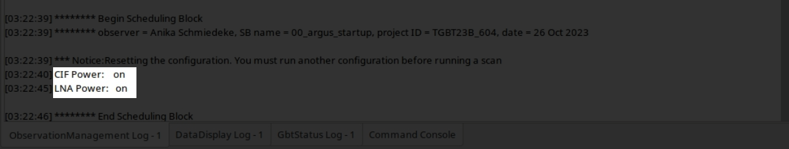
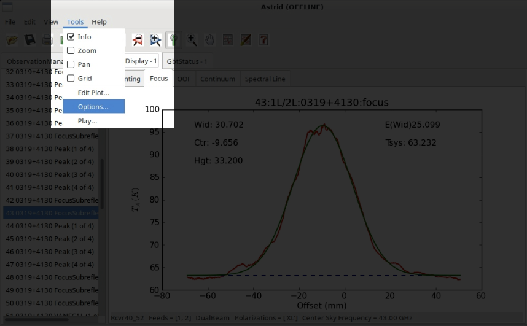
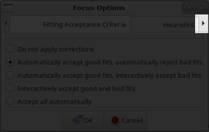
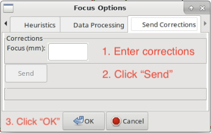

###########################
How to observe using Argus?
###########################

This guide contains instructions for the recommended observing procedure for the 23B semester.
Check that Argus is turned on.

1. Turn on Argus
================

Run the script below and then make sure Argus is turned on. 

.. code-block:: python

    ResetConfig()
        
    # start up Argus by calling the 'presets'command
    # this will turn on CIF/LNA if necessary

    SetValues("RcvrArray75_115", {"presets": "on"})
    print "CIF Power: ", GetValue("RcvrArray75_115", "cif_power")
    print "LNA Power: ", GetValue("RcvrArray75_115", "lna_power")

In the "ObservationManagement Log" in Astrid, make sure you see the lines "CIF Power: on" and "LNA Power: on". If not, reissue the startup script above.

2. Primary Calibrator
=====================

Go to your primary calibrator (the brightest calibrator available at the time of your observations).

2.1 Set the surface
-------------------

Run **AutoOOF** using *Q-band* to set the surface (you can use Argus, if your calibrator is strong enough).
    
.. code-block:: python

    Catalog('fluxcal')
    Catalog('/home/astro-util/astridcats/wband_pointing.cat')

    source = '0319+4130'                            # replace with your calibrator
    Break("Ask the operator to switch to Q-Band")
    AutoOOF(source)

2.2. Absolute flux calibration, focus reference
-----------------------------------------------

Run **AutoPeakFocus** and **AutoPeak** using *Argus* at your target frequency with elAzOrder=True for absolute flux calibration

.. code-block:: python

    source = '0319+4130'                    # replace with your calibrator
    freq_argus = 93173.0                    # replace with your target frequency in MHz
        
    Break("Ask the operator to switch to Argus. Click yes when Argus is in place.")
    SetValues("ScanCoordinator", {"receiver": "RcvrArray75_115"})
    SetValues("LO1", {"restFrequency_A": freq_argus})      

    AutoPeak(source, frequency=freq_argus, elAzOrder=True)     
    Break("Check the pointing solution")
    Focus(source)
    Break("Check the focus solution")
    AutoPeak(source, frequency=freq_argus, elAzOrder=True)

2.3 Determine focus offset
--------------------------

Run **AutoPeakFocus** using *KFPA* to determine the focus offset between Argus (at your frequency) and KFPA (at the standard KFPA pointing frequency).
         
.. code-block:: python

    source = '0319+4130'                            # replace with your calibrator
    Break("Ask the operator to switch to KFPA. Click yes when KFPA is in place.")
    SetValues("ScanCoordinator", {"receiver": "RcvrArray18_26"})
    SetValues("LO1", {"restFrequency_A": 25000})

    AutoPeakFocus(source)

Step 2.2 provides :math:`\text{focus}_\text{Argus}` at your target frequency and Step 2.3 provides :math:`\text{focus}_\text{KFPA, primary}`. Using those two numbers we can calculate the focus offset, :math:`\Delta_\text{focus}`, as :math:`\Delta_\text{focus} = \text{focus}_\text{Argus} - \text{focus}_\text{KFPA, primary}`. 

.. admonition:: Example

    :math:`\text{focus}_\text{Argus} = -4 \text{ mm}`

    :math:`\text{focus}_\text{KFPA, primary} = -1 \text{ mm}`
    
    :math:`\Delta_\text{focus} = -4 \text{ mm} - (-1 \text{ mm}) = -3 \text{ mm}`

3. Secondary Calibrator
=======================

Go to your secondary calibrator (nearby your science target).

3.1 Pointing and Focus Correction
---------------------------------

Run **AutoPeakFocus** using *KFPA*.

.. code-block:: python

    Catalog('/home/astro-util/astridcats/kband_pointing.cat')

    source = '0336+3218'                    # replace with your calibrator
    freq_argus = 93173.0                    # replace with your target frequency in MHz

    Break("Ask the operator to switch to KFPA. Click yes when KFPA is in place.")
    SetValues("ScanCoordinator", {"receiver": "RcvrArray18_26"})
    SetValues("LO1", {"restFrequency_A": 25000})
    AutoPeakFocus(source)

    Break("Ask the operator to switch back to Argus. Click yes when Argus is in place.")
    SetValues("ScanCoordinator", {"receiver": "RcvrArray75_115"})
    SetValues("LO1", {"restFrequency_A": freq_argus})

3.2 Add the focus correction factor
-----------------------------------

Add the focus offset, :math:`\Delta_\text{focus}`, you calculated in step 2.3 to the determined focus correction, LFC.

.. admonition:: Example

   :math:`\text{focus}_\text{KFPA, secondary} = +2 \text{ mm}`

   :math:`\text{LFC} = \text{focus}_\text{KFPA, secondary} + \Delta_\text{focus} = +2 \text{ mm} + (-3 \text{ mm}) = -1 \text{ mm}`

To add this LFC value in the system, you have to be in the "DataDisplay" Tab in Astrid, and there in the subtab "Focus". Then click "Tools" in the top left menu of the Astrid applications and choose "Options".

A pop-up window "Focus Options" will open. Click the right arrow a few times, to switch to the last tab "Send Corrections".

In the "Send Corrections" tab enter your determined LFC, click the send button and then click OK after you have confirmed that the corrections have been send to the telescope, e.g. by checking the LFC value in the CLEO Status page. 

Alternatively you can ask the Operator to enter the LFC value for you.

4. Science Target
=================

Go to your science target, configure Argus for your science observations, check the YIG power. Run a vanecal and execute your observations. We recommend to verify your configuration/setup by executing short track or OnOff observation on a known source at the beginning of each observing run.

5. Subsequent observing procedure
=================================

Alternate between observations of your science target (step 4 above) and observations of the secondary calibrator (step 3 above) every 30-40 min, depending on weather conditions. 

Remember to re-run an AutoOOF every 3-6 hours, depending on weather (and more often if you've been scheduled at or shortly after sunset while the temperature was still dropping.

