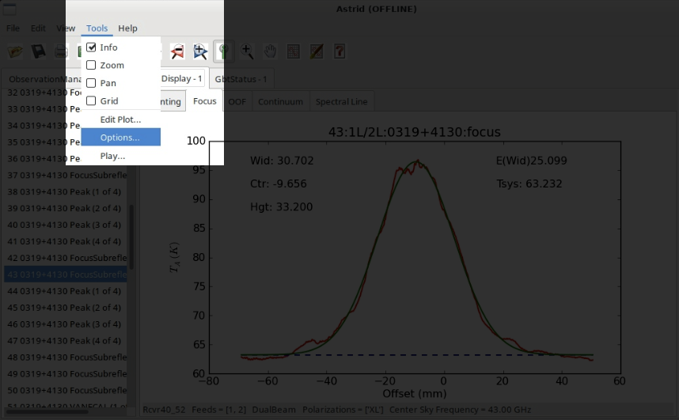

.. _argus_obs:

###########################
How to observe using Argus?
###########################

This guide contains instructions for the recommended observing procedure for the 23B/24A winter observing season.

.. admonition:: Change Log

    2024-01-04: 
       - Adjusted instructions to reflect change of available receivers
       - Modified code snippet in :ref:`3.1 Pointing and Focus Correction` to apply  :math:`\Delta_\text{focus}` when switching from Argus to "peak/focus receiver"        
    2023-11-13: 
       - Added code snippet in :ref:`3.1 Pointing and Focus Correction` to automatically apply :math:`\Delta_\text{focus}`.

1. Turn on Argus
================

Run the script below and then make sure Argus is turned on. 

.. code-block:: python

    ResetConfig()
        
    # start up Argus by calling the 'presets'command
    # this will turn on CIF/LNA if necessary

    SetValues("RcvrArray75_115", {"presets": "on"})
    print "CIF Power: ", GetValue("RcvrArray75_115", "cif_power")
    print "LNA Power: ", GetValue("RcvrArray75_115", "lna_power")

In the "ObservationManagement Log" in Astrid, make sure you see the lines "CIF Power: on" and "LNA Power: on". If not, reissue the startup script above.

2. Primary Calibrator
=====================

Go to your primary calibrator (the brightest calibrator available at the time of your observations).

2.1 Set the surface
-------------------

Run **AutoOOF** using *Ka-band* to set the surface (you can use Argus, if your calibrator is strong enough; e.g. 0319+4130 is a very strong calibrator that Argus can use for autooof).
    
.. code-block:: python

    Catalog('fluxcal')
    Catalog('/home/astro-util/astridcats/wband_pointing.cat')

    source = '0319+4130'                            # replace with your calibrator
    Break("Ask the operator to switch to Ka-Band") 
    AutoOOF(source)

2.2. Absolute flux calibration, focus reference
-----------------------------------------------

Run **AutoPeakFocus** and **AutoPeak** using *Argus* at your target frequency for absolute flux calibration. You can optionally use `elAzOrder=True`, which will run the elevation pointing scans first, followed by the azimuth pointing scans. We typically have larger offsets in elevation than in azimuth, so using this option facilitates finding the pointing solutions.

.. code-block:: python

    source = '0319+4130'                    # replace with your calibrator
    freq_argus = 93173.0                    # replace with your target frequency in MHz
        
    Break("Ask the operator to switch to Argus. Click yes when Argus is in place.")
    SetValues("ScanCoordinator", {"receiver": "RcvrArray75_115"})
    SetValues("LO1", {"restFrequency_A": freq_argus})      

    AutoPeak(source, frequency=freq_argus, elAzOrder=True)     
    Break("Check the pointing solution")
    Focus(source)
    Break("Check the focus solution")
    AutoPeak(source, frequency=freq_argus, elAzOrder=True)

2.3 Determine focus offset
--------------------------

Run **AutoPeakFocus** using *Ka-Band* to determine the focus offset between Argus (at your frequency) and Ka-Band (at the standard Ka-Band pointing frequency).
         
.. code-block:: python

    source = '0319+4130'                            # replace with your calibrator
    Break("Ask the operator to switch to Ka-Band. Click yes when Ka-Band is in place.")
    SetValues("ScanCoordinator", {"receiver": "Rcvr26_40"})
    SetValues("LO1", {"restFrequency_A": 32000})

    AutoPeakFocus(source)

Step 2.2 provides :math:`\text{focus}_\text{Argus}` at your target frequency and Step 2.3 provides :math:`\text{focus}_\text{Ka, primary}`. Using those two numbers we can calculate the focus offset, :math:`\Delta_\text{focus}`, as :math:`\Delta_\text{focus} = \text{focus}_\text{Argus} - \text{focus}_\text{Ka, primary}`. Determining the focus offset with a single decimal point is sufficient. 

.. admonition:: Example
    :class: note

    :math:`\text{focus}_\text{Argus} = -4 \text{ mm}`

    :math:`\text{focus}_\text{Ka, primary} = -1 \text{ mm}`
    
    :math:`\Delta_\text{focus} = -4 \text{ mm} - (-1 \text{ mm}) = -3 \text{ mm}`

3. Secondary Calibrator
=======================

Go to your secondary calibrator (nearby your science target, i.e. within ~30 deg in Az and ~10-20 deg in El, the closer the better to minimize slew times).

3.1 Pointing and Focus Correction
---------------------------------

Run **AutoPeakFocus** using *Ka-Band*, this script will at the end automatically apply your determined :math:`\Delta_\text{focus}`. If you have the run the script more than once, please make sure you comment out line 14 ``SetValues("Antenna",{"local_focus_correction,Y": new_lfc}`` before re-issuing the script, to avoid adjusting the focus multiple times. 

.. code-block:: python
    :linenos:

    Catalog('/home/astro-util/astridcats/kband_pointing.cat')

    source = '0336+3218'                    # replace with your calibrator
    freq_argus = 93173.0                    # replace with your target frequency in MHz
    delta_focus = 4.0                       # replace with your focus offset value in mm

    Break("Ask the operator to switch to Ka-Band. Click yes when Ka-Band is in place.")
    SetValues("ScanCoordinator", {"receiver": "Rcvr26_40"})
    SetValues("LO1", {"restFrequency_A": 32000})
    # adjust focus for Ka-Band
    lfc = float(GetValue("Antenna", "local_focus_correction,Y"))
    new_lfc = lfc - delta_focus
    SetValues("Antenna",{"local_focus_correction,Y": new_lfc})

    AutoPeakFocus(source)

    Break("Ask the operator to switch back to Argus. Click yes when Argus is in place.")
    SetValues("ScanCoordinator", {"receiver": "RcvrArray75_115"})
    SetValues("LO1", {"restFrequency_A": freq_argus})

    # adjust the focus for next Argus observations
    lfc = float(GetValue("Antenna", "local_focus_correction,Y"))
    new_lfc = lfc + delta_focus
    SetValues("Antenna",{"local_focus_correction,Y": new_lfc})

    print ""
    Comment("----------------"
    Comment("LFC-Y changed from %f to %f   (shift of %f mm)" % (float(lfc), float(new_lfc), float(delta_focus)))
    Comment("----------------"
    print ""

3.2 Add the focus correction factor manually
--------------------------------------------

If you don't use the code snippet provided in :ref:`3.1 Pointing and Focus Correction` to add the focus offset, :math:`\Delta_\text{focus}` you calculated in step 2.3 to the determined focus correction, LFC, you will need to do it manually. 

.. admonition:: Example
    :class: note

    :math:`\text{focus}_\text{Ka, secondary} = +2 \text{ mm}`

    :math:`\text{LFC} = \text{focus}_\text{Ka, secondary} + \Delta_\text{focus} = +2 \text{ mm} + (-3 \text{ mm}) = -1 \text{ mm}`

To add this LFC value in the system, you have to be in the "DataDisplay" Tab in Astrid, and there in the subtab "Focus". Then click "Tools" in the top left menu of the Astrid applications and choose "Options".

A pop-up window "Focus Options" will open. Click the right arrow a few times, to switch to the last tab "Send Corrections".

In the "Send Corrections" tab enter your determined LFC, click the send button and then click OK after you have confirmed that the corrections have been send to the telescope, e.g. by checking the LFC value in the CLEO Status page. 

.. image:: images/astrid_focus_sendCorrections.png

Alternatively you can ask the Operator to enter the LFC value for you. You will also want to adjust the focus when you switch from Argus to Ka before executing peak/focus calibration.

4. Science Target
=================

Go to your science target, configure Argus for your science observations, check the YIG power. Run a vanecal and execute your observations. We recommend to verify your configuration/setup by executing short track or OnOff observation on a known source at the beginning of each observing run.

5. Subsequent observing procedure
=================================

Alternate between observations of your science target (:ref:`Step 4 above <4. Science Target>`) and observations of the secondary calibrator (:ref:`Step 3 above <3. Secondary Calibrator>`) every 30-40 min, depending on weather conditions. 

Remember to re-run an AutoOOF every 3-6 hours, depending on weather (and more often if you've been scheduled at or shortly after sunset while the temperature was still dropping).

