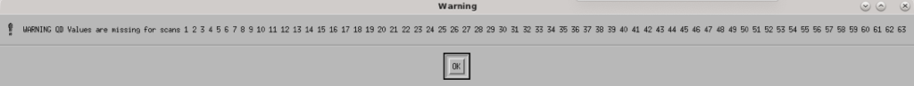

.. _mustang2_obs:

#############################
How to observe with MUSTANG-2
#############################

1. Project Preparation
======================

1.1 Calibrator and Source Preparation
-------------------------------------

You are expected to have your pointing calibrators, flux calibrators, OOF sources, and science sources planned out **at least a few hours before** the time of your observation. You can use CLEO's Scheduler and Skyview to do this.

- **Flux calibrators**:
    - Find those that are closest to your source. You can use planets or any of the ALMA grid cals listed in the following catalog: 
        .. code:: bash
          
            /users/penarray/Public/Catalogs/alma_gridcal.cat

      You will need to observe at least one of these during your observing session to ensure flux calibration. Preferably 2-3, but if you are ok with a 10-20% error in your flux measurement 1 calibrator is ok.

- **OOF sources**
    - It is efficient to use the flux calibrators as your first OOF source of the night. For OOF sources, a general guide is that you want a bright source that is > 1 Jy and 25 < elevation < 60. Planets, if available, are often preferred as flux calibrators (especially Mars, Uranus, or Neptune), though potentially only Uranus is also a preferred OOF target. A more intricate way of thinking about an OOF source is to consider the elevation of your science target: if it will be "low" (average observing elevation is ~35 or less), or "high" (average observing elevation ~60 or higher) then one would prefer to OOF on a source with a similar elevation. If the science target is in between, then the OOF elevation will be less important.

- **Pointing calibrators**
    - You can find suitable calibrators using CLEO's Scheduler & Skyview
        - Click ``Catalog...`` in the upper right-hand corner
        - Click ``Add/Select/DeSelect Catalogs ...``
        - Select ``mustang_pointing``
        - Click ``Apply`` 

    - The goal is to find a calibrator that is 10-15 deg from your target and > 0.5 Jy (though if have good weather a better choice is something close that is 0.1 Jy). To find a source that is > 0.5 Jy fo the following in CLEO's Scheduler & SkyView:
        - Go to the box in the right-hand corner that says ``Source Intensity Range`` and in the ``Min`` box put 0.5
        - Hit enter
        - Load your science source catalo
        - Enter the time you will be observing in the ``UT Date and Time`` box
        - Find a source that is showing and is 10-15 deg from your target.

- **Science source catalog**
    You will either need to make one or a M2 team member has already made one for you.

1.2 Observing Scripts
---------------------

You are expected to have your scripts ready **several hours before** the time of your observation. Ideally at the start of the observing semester.

Template observing scripts are located in: 
.. code:: bash

    /users/penarray/Public/m2_template_scripts/

Read the README for instructions on editing these scripts once you have them in your project directory.

If you are creating the scripts for the first time for your project, you will want to copy 
    #. Standard calibration scripts
        - ``1_m2setup``
        - ``2_m2oof``
        - ``3_m2quickDaisyOOF``
        - ``4_m2quickDaisyPC``
         
    #. One of the science scripts
        - ``5_XXX``
        .. note::

            The radius of the daisy will depend on your science - reach out to the M2 instrument team for guidance.
           
The scripts m2quickDaisy and skydip are extra but can be of use.

1.3 Observing Notes
-------------------

During observing, you are expected to edit the MUSTANG-2 observing run notes wiki and take notes of what's occurred throughout the night.

#. Create a new page and entry at the bottom of the page by clicking "Edit Wiki text" 
#. Follow the naming convention of entry above <AGBTsemester_project-code_session-number>, e.g. ``AGBT18A_014_01``

.. note::

    If you don't have permissions yet to edit the wiki and are observing, you can take notes in a text document and email them to the MUSTANG-2 team afterwards to upload to the wiki for you.

2. Observing Preparation
========================

2.1 VNC
-------

Open and connect to VNC session on ``titania`` or ``ariel`` via FastX or tunneling+VNC viewer.

.. todo::
   
   Replace these instructions here with a link to the remote connection instructions.

FastX
^^^^^

Choose to start an XFCE session on ``titania`` or ``ariel``. 

Tunneling+VNC
^^^^^^^^^^^^^

#. Login to GBO 
    .. code:: bash
        
        ssh username@ssh.gb.nrao.edu
#. From there continue on to ``titania`` or ``ariel``
    .. code:: bash
    
        ssh ariel

#. Start vnc session
    .. code:: bash
        
        vncserver -your_screen_geometry

    This will give you your vnc session number.
#. Open a new terminal on your computer
    .. code:: bash
        
        ssh -N -C -L 59xx:titania.gbt.nrao.edu:59xx username@ssh.gb.nrao.edu

    where xx is the vnc session number you were given in step 3. After entering your password, it will just sit there and that's good. 
#. Use your vnc viewer on your computer to view your session.

2.2 AstrID 
-----------

Open an AstrID session and navigate to your corresponding MUSTANG-2 project. The MUSTANG-2 instrument team should have already populated your Astrid area with appropriate scripts.

2.3 CLEO
--------

The following are suggested CLEO windows to have open during observing:

- Launch → Receivers → **Mustang2**
    - To monitor specific thermometers, click the gray box next to the titles:
        - PT Fridge 1
        - PT Fridge 2
        - Array
        - HE4 Fridge 1 Charcoal
        - He4 Fridge 2 Charcoal
        - He3 Charcoal
        - He4 Fridge 1 Evap
        - He4 Fridge 2 Evap
        - He3 Evap. 
          
        These thermometers are of interest because they can indicate that things are wrong before they affect the array, or help diagnose what is wrong and how to fix it if the array temperature starts to go up.  Sometimes a cryocycle gets started by accident - in which case if you are looking at the charcoal you can hit abort quickly and no damage is done. Other times a helium4 might run out and that can pull up the array temperature - not much you can do but often you can still collect some good data for a while.

- Launch → **Status**

- Launch → **Antenna**

- Launch → Observer Tools → **Scheduler & Skyview**
    - Click on ``Real-time mode``
    - Load in catalogs:
        - mustang_pointing
        - your science target catalogs
- Launch → Observer Tools → **Talk and Draw** 

3. Observing Procedure
======================

3.1. Communicate with operator 
------------------------------

A few minutes before your observing start time (say 15 minutes, better 30 minutes), get on Talk & Draw, tell the operator who you are and what project you are observing for. Also ask who the operator is. 

3.2. Fill AstrID info
---------------------

In Astrid under ObservationManagement, go to the Run tab and fill in the Observer and Operator information. 

3.3. Take control
-----------------

Once the member of the M2 instrument team has finished biasing and the operator tells you are in the gateway/gives you the go ahead, in Astrid → File → Real time mode ... → Select ``work online with control of the telescope``.

3.4. Configure
--------------

Run the ``1_m2setup`` script in Astrid.

3.5. OOF
--------

#. Make sure that you have changed ``mySrc`` in ``2_m2oof`` and run the ``2_m2OOF`` script in Astrid. 

#. For the first OOF of the night, you need to have ``calSeq=True`` so that a skydip is done as a part of the OOFing process. An OOF will take ~20 minutes to run. 

#. Check the OOF results in Astrid → DataDisplay → OOF and re-rerun if necessary. 
    For M2, we typically apply the z5 corrections. When the corrections are available, press the green button that reads ``After selecting the Zernike solution above, click this green button to send the solutions to the telescope.``
   
    .. note::
        
        Sometimes OOF may time out and you will get a red screen if this happens. 

.. hint:: 

    While your OOF is running, it is a good time to:

    - Write down the weather conditions from the GbtStatus tab in Astrid in the log 
        - Pyrgeometer - if working
        - Temperature
        - Humidity
        - IR Cloud Cover
        - Wind Velocity.

    - Start the m2gui which is used to check M2 data while observing. Execute in a terminal (in a directory where you have write-access):
        .. code:: bash
                
            ~penarray/Public/startm2idl
            m2gui

    - In the m2gui check
        - the skydip
        - that you can see the OOF images
              

.. todo::

    Add link to section 4, which holds information on how to use the M2 GUI.

3.6 Quick daisy on OOF source
-----------------------------

#. Run the `2_m2quickDaisyOOF` script on your OOF/calibrator source
    It's best if you can make your OOF source and your calibrator source the same. 

#. Use the m2gui and determine
    - beam shape (``WidthA`` & ``WidthB``)
    - peak of the source (``Peak_Height``)
     
#. Record these values in your observing log

3.7 Quick daisy on pointing calibrator
--------------------------------------

#. Run the ``3_m2quickDaisyPC`` script on your pointing source. 

#. Use the m2gui again and determine
    - beam shape (``WidthA`` & ``WidthB``)
    - peak of the source (``Peak_Height``)
     
#. Record these values in your observing log

.. note:: 

   During this initial data acquisition (and to some extent, throughout the night) check your Mustang2 CLEO screen, and make sure that the numbers are continuing to change with time (if so, the boxes will mostly be blue) if they stop (indicated when the boxes turn lavender) then the Mustang2 manager has crashed, and you’ll need to reset it.

    .. todo:: 
        
        Add reference to Restarting the Manager here.
 

3.8 Take science data
---------------------

Take ~30 minutes of science data followed by a quick daisy on your pointing calibrator. Often this is accomplished by running the ``5_science_rX`` scheduling blocks in Astrid as many times as needed (or other types of scripts). Each individual "beauty" scan is ~8-9 minutes in length. So if you are submitting individual beauty scans (which 5_science_rX are), you can submit 4 of the science scripts in a row followed by your pointing calibrator scan. 

.. note:: 

    If you try to look at the science data in the m2gui, make sure you choose the "faint science" option under ``source type``.

.. admonition:: What is science_r2p5 and science_r3?

    Science_r2p5 and science_r3 are the science scans of the observation. The difference between the two is the radius size of the scans in arcminutes (one is 2.5' and one is 3' respectively). If you only see science scans, unlabeled otherwise, then they are likely 3' in diameter. Legacy M2 scripts will have labels like beauty_r3.

3.9 Continue to take science data
---------------------------------

#. Continue to do ~30 minutes of science data followed by a quick daisy on the pointing calibrator for the rest of the night. 
#. Monitor the beam size (WidthA and WidthB) and the Peak_Height using the m2gui to determine if you need to OOF again.

3.10 When to OOF?
-----------------

If the new Peak_Height is down by more than ~15%, or if WidthA and WidthB become very different from one another (indicating that the beam has become overly elliptical) you'll want to do an OOF. 

.. admonition:: Optional
    :class: note

    If you don't have much observing time left, once the PeakHeight is down by more than 15%, instead of redoing the OOF scan, you can do another m2QuickDaisy on the pointing source to be sure that it is that low, and then do two more Beauty scans until the PeakHeight has gone down by another 15% (so a cumulative 30%).

3.11 Be aware - Issue with quadrant detector
--------------------------------------------

In early 2023 it was discovered that over the past year or two the quadrant detector sometimes isn't workint and doesn't write files to ``/home/gbtdata/project_code_sesion/QuadrantDetector`` as we expect. The GUI now will pop up a warning box (``WARNING QD Values are missing for scans: ...``) if it detects that the quadrant detector files are not being written.

If this happens during observing, press ok and ask the operator to restart the quadrant detector manager.

4. Checking data with the m2gui
===============================

4.1 Start-up m2gui
------------------

To open up the m2gui, execute in a terminal (in a directory where you have write-access):

.. code:: bash
                
    ~penarray/Public/startm2idl
    m2gui

After you have opened the m2gui follow these steps to check the tipping scan, monitor the beam shape (``width``, ``widthA``, ``widthB``) and peak of calibrators (``Peak_Height``), or to just check the data.

#. **Go online**
    Click the ``online`` button.

    .. image:: images/06_m2gui_online.png

4.2 Check Tipping Scan
----------------------

.. admonition:: What is a Skydip?

    What is a skydip? And what are the plots that we looking at? A skydip is a flat field. If you look at the detector bias curves some are inverted and even those with the same sign will have a different response to bias. We use the fact that the atmosphere is not transparent and has a :math:`\frac{1-\exp^{-\tau}}{\cos(\text{elevation})}` dependance.  With a fair guess of the opacity :math:`\tau`, you can do a fit on each detector to get them roughly Kelvin_RJ.  These calibrations are used to make maps of known sources and the results scaled to bring them to the correct amplitude.

#. **Select tipping scan**
    Under Calibration, click ``Select Tip Scan`` and choose the most recent scan number from the bottom labeled “tip” under “scan type.” This should be from the beginning of the 4 OOF scans.

    .. image:: images/07_m2gui_tip_scan.png

    .. image:: images/08_m2gui_tip_scan_2.png

#. **Inspect plots**
    Many plots will pop up - one for each roach showing the results of the tipping scan for each roach. You can click out of these once they finish unless you are particularly curious about specific roaches. After these plots have been produced, you will see a graph to the right in the main gui window, showing the results of the tip scan - each roach is plotted in black with a fit in green. Check to make sure that it looks reasonable.

    .. admonition:: Examples

        .. tab:: Good Tip Scan 

            The black lines (one for each roach) should be fairly free of wiggles and the dashed green line (which is the fit) should follow the black lines fairly closely. 

            .. image:: images/09_tip_scan_good_example.png

        .. tab:: Bad Tip Scan 

            The black lines (one for each roach) are full of wiggles and the dashed green line (the fit) is not following the black lines well.

            .. image:: images/10_tip_scan_bad_example.png

    If the tipping scan doesn’t look right (a lot of wiggles), try running the ``skydip`` script in AstrID. This reruns the tipping scan without having to redo the whole OOF. If it still looks bad, check the weather conditions in CLEO. The weather might not be good enough to observe. You can also call one of the M2 instrument team and get their advice.

#. **Check the number of live detectors**
    At this stage, check the number of live detectors, as well as throughout the night. Record this in your observing log.

    In the image below, you can see where to check the number of live detectors:

    .. image:: images/11_m2gui_live_detectors.png

    Generally it's good to have 170+ live detectors, however it can sometimes be as low as 160 if the tuning step didn't go very well. If you see this number as low as the 150s or 140s (especially if it's lower than that, which it shouldn't be) be sure to contact a M2 team member. You can also try re-tuning (see section A) and hope that that fixes it.

#. **Continue**
    If the tipping scan and number of live detectors look good.

4.3 Checking Calibrator/Beam Parameters
---------------------------------------

#. **Make map**
    To make a map of a calibrator, after you have run the ``m2quickDaisy`` script on a source in AstrID
        - Click ``Update Scan List`` to find the source scan number of the source you just observed
        - Set the ``Scan Numbers`` to that scan number
        - Set ``Source Type`` to ``Calibrator``
        - Click ``Make Map``

        .. image:: images/12_m2gui_make_map.png

    This will open up an image of the daisy map that you selected. The map should look something like this:

    .. image:: images/13_m2gui_made_map_example.png

    What you see at this stage is an image of the daisy scan. In the center is your calibrator source, visible because it is a bright source. Later, when looking at daisy scans of your science source, it's very likely that you will only see a flat map in the center because it's so much more faint.

    The units of the color-coding of this map are in Kelvin of the forward beam. The forward beam is calibrated for the estimated sky temperature at that elevation that we gleaned from our tipping scan earlier on in the night. Therefore, the forward beam temperature should hover around zero if everything is calibrated correctly.

    .. admonition:: What is a Daisy Map?

        The maps that the M2 team makes are called daisy scans. This is because they loop many times around a central point, looking somewhat like daisy petals. This emphasizes exposure time on the center of the map, with less exposure on the outside edges of the map, making the center of the map more accurately calibrated. They then use the outside of the map to calibrate the sky temperature and remove these effects in the center of the daisy in later post-processing.

        .. image:: images/14_m2gui_daisy_explanation.png

        The lines drawn on the map designate the beam path of the GBT on the sky relative to your source. As you can see, each loop begins at the source, extends out, and then returns to the source. This is done throughout the space around your source. Because every loop returns to your source, this results in a higher exposure time on your source relative to the rest of the sky. However, because the units are in Kelvin of the forward beam, this does not mean a higher temperature, but instead simply less noise in the map.

#. **Fit Map**
    Click ``Fit Map``. 

    .. image:: images/15_m2gui_fit_map.png

    This will produce the following plots in the gui.

    .. image:: images/16_m2gui_fit_map_example.png

#. **Check fitting parameters**
    The fit parameters will be printed out in your terminal.

    .. image:: images/17_m2gui_fit_map_terminal.png

    .. note:: 

        The Floating underflow error you see in the output is **not** a concern.

#. **Record values**
   Write down the values for ``PEAK_HEIGHT``, ``WIDTHA``, and ``WIDTHB`` to compare to later pointing scans to monitor the beam and decide if you need to re-OOF. 

4.4 Checking Science Scans
--------------------------

If you would like to make a map of of a science scan(s), you can do so by following the same steps as making a map of a calibrator with the following modification
    - under ``Source Type`` select ``Faint Science`` 

.. note::

    You can add several science scans together by putting them all separated by commas in the scan list.

4.5 Checking Time Streams (optional)
------------------------------------

This is optional, but if you would like you can check the time streams (checking how the sky temperature is changing over time). After making your map

- Make your map (see :ref:`4.4 Checking Science Scans`)
- Click ``show time stream`` button underneath the ``Fit Map`` button after making your map
    .. image:: images/18_show_time_stream_button.png

    .. admonition:: Examples

        .. tab:: Good time stream

            .. image:: images/19_m2gui_time_stream_good_example.png

        .. tab:: Bad time stream

            .. image:: images/20_m2gui_time_stream_bad_example.png

4.6 Troubleshooting: m2gui hangs
--------------------------------

If your m2gui is hanging (won't quit) do the following in a terminal:

.. code:: bash

    ps -u

Find the PIDs of startm2gui and idl and kill both.

.. code:: bash
   
    kill -9 PID

    
5. Changing M2 Projects/Second M2 Project of the Night
======================================================

If you are observing for an M2 project that is not the first M2 project of the night then before observing you will need to create a link for the tuning so that OOF & data reduction can find the right tuning. 

5.1. Make symlink
-----------------

Before you begin observing, login to egret and type:

.. code:: bash

    cd /home/gbtlogs/Rcvr_MBA1_5tuning/
    ln -s <old_project_session> <new_project_session>

where ``old_project_session`` is the full name of the previous M2 project and ``new_project_session`` is the second M2 project of the night that you are observing for. 

.. warning::

    Be very careful to put in the right project and session ID or this step will not work and you won't get any data. You can ask the previous observer for the old project session ID, or look for it by typing:

    .. code:: bash
        
        ls -ltr /home/gbtdata/

    The last modified file will tell you what the most recent project ID was.

5.2 ``Run m2setup``
----------------

When the observing time for the second project starts, you need run m2setup in AstrID again. This is already outlined in the directions.

.. warning::
   
   Some people think they can skip this step when changing from another MUSTANG-2 run. This is not the case. It's very important to still run ``m2setup`` at the beginning of your session.

5.3 Skydip/OOF 
--------------

You can possibly skip OOFing at the beginning of this second project. You can ask the previous observer when they last did an OOF and what the progression of the beam was.

- If you need to re-OOF
    - make sure that ``calSeq=True`` to get a skydip

- If you do **not** need to re-OOF
    - do a stand-alone skydip and change ``myAz`` to the Azimuth of whatever your first source will be (calibrator, etc.). The telescope will slew to that Az.

5.3 Flux calibrator
-------------------

You'll also want to still observe your flux calibrator using the ``m2quickdaisy`` script. 

.. warning::

    This is another thing people think they can skip, but it makes reduction later more difficult. Check the beam with this flux calibrator.

    
6. Observing Troubleshooting
============================

6.1 MUSTANG-2 Manager
---------------------

Sometimes the MUSTANG-2 manager refuses to start - you try to start it and you get a failure every time (using TaskMaster or asking the operator to do this for you). 

The solution is to 
    - log onto egret
    - shut the computer down
    - log onto the iboot bar
    - power off egret and the housekeeping
    - leave it off for 30 seconds
    - turn these back on
      
Egret may take a while to reboot but once it does you should be able to restart the manager.
Assuming this works you should also make sure to press the ``reset heater card`` button on the manager twice.

7. Closing up for the night
===========================

7.1 Go offline
--------------

In AstrID, go from ``working online`` to ``working offline``:
    - ``File`` → ``Real time mode`` ... → ``work offline``. 

7.2 Shutdown
----------------------

For the shutdown process you can either do this **(a) automatically** or **(b) manually**.

.. tab:: Automatic Shutdown

    Run the following script in a terminal:
        .. code:: bash
        
            /users/penarray/Public/stopMUSTANG.bash 
            cd /users/penarray/Public  
            ./stopMUSTANG.bash

.. tab:: Manual Shutdown

    #. **Set detector biases to zero**
        - Go to the Mustang Manager in CLEO
        - Click on the miscellaneous tab
        - In the top middle, you will see 4 rows of Det Bias 1-4, corresponding to the 4 roaches.
        - Unlock the manager
        - roach-by-roach:
            - type ``0`` in the left DetBias box
            - press enter
            - wait until the blue box (right DetBias box) shows a DetBias of 0
            - repeat this step for all 4 roaches.

    #. **Turn off data transmission**
        - Mustang2 CLEO scan turn off ``DataXinit`` for all four roaches. 
          
        .. note::
            
            You will need to be in gateway AND unlock both the ``unlock`` and ``advanced features unlock`` buttons to do this.

    #. **Turn off components**
        In VNC session, go to http://mustangboot.gbt.nrao.edu and turn off the *roaches*, *HEMTs*, and *Function Generator* by checking those three boxes then go to left of the screen and click ‘Off’ (gray button).

    #. **Turn on daily cycle**
        Mustang2 CLEO window
            - go to ``Housekeeping``
            - unlock
            - recheck daily cycle to be on and put autocycle trigger to HE4
                This means that if either of the He4 fridges run out it starts a cycle. 
            - set the ``daily cycle time`` = 0.65 of a day in UT
                This is the time of day that the daily cycle starts measured in fraction of a day (UT).  0.65 is a nice balance between ensuring the cycle is over by the time any observations are likely to come up, yet not so early that there is no time to work with the receiver in the morning.

7.3 Kill VNC session
--------------------

Either kill your FastX session or your VNC session via the terminal.

.. admonition:: Congratulations!
    :class: important
  
    You’re all done! Happy Observing!
