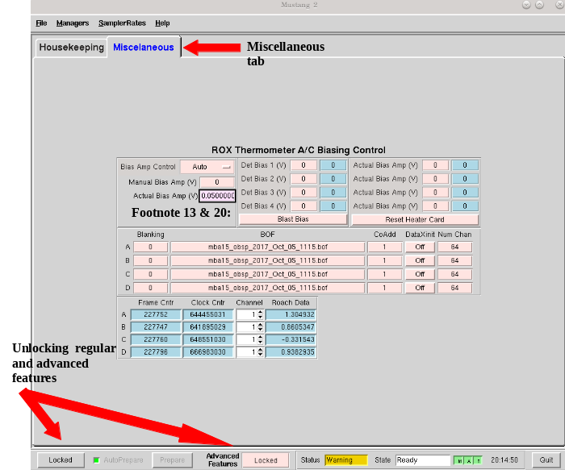
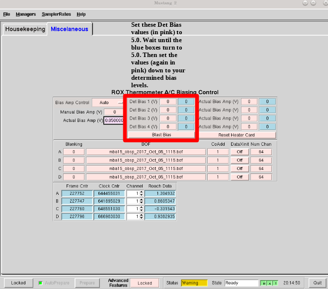

.. _mustang2_setup:

######################
How to setup MUSTANG-2
######################

Tuning
======

Detailed M2 instrument team instructions on tuning and biasing that can be used as a reference can be found here: https://safe.nrao.edu/wiki/bin/view/GB/Pennarray/OnGbtOps.

.. admonition:: What is Tuning? 

    Tuning is kind of like MUSTANG’s equivalent to balancing. It has multiple channels of data and tuning is trying to ensure that the attenuation levels are all roughly equivalent. You do not need to be anywhere specific on the sky nor does MUSTANG need to be in the GBT turret for this step to be done.

    Mustang has ~256 channels, ~215 feed horns, of which about ~211 are populated. It has 4 roaches, which are a type of Field Programmable Gate Array (FPGA, which is essentially a specialized CPU for data acquisition and manipulation). These 4 roaches process 64 channels each, adding up to the 256 channels. However, since not all the feed horns are populated, some of the channels in these roaches are already unused.

    The IQ plots and many graphs for each roach represent all the different channels for each roach. Since some of those channels are unused, it’s not abnormal to see some channels that don’t look right. As long as the majority look okay, then things are working fine.

.. note:: 

    All tuning steps can take place in the 1-hour prep before your allotted observing time. That is, before you are given control of the GBT.

1. Preparation
--------------   

1. Start an observing VNC

2. Ask the operator to put you in the gateway for M2

2. Run startup + tuning script
------------------------------

#. **Check that the array is cool and not cycling**
    Go the CLEO M2 housekeeping tab and check that the array temperature is ~400mK. Also check that the "Cycle State" on the left side of the window is IDLE and not in stages 1-5. If it is in a "stage" this means that it is cycling. If either the temperature of the array is warm or it is cycling, the array is not ready and/or not cool enough for tuning yet. 

#. **Change directories** to where the startup + tuning script is
    .. code:: bash

        cd /users/penarray/Public

#. **Run script**
    .. code:: bash

        ./startMUSTANG.bash <projectCode_sessionNumber>

    where ``projectCode`` is your proposal number (e.g. ``AGBT18A_014``) and ``sessionNumber`` is your current (AstrID) session number (e.g. ``01``). The session number is **not** the source code from the DSS e-mail. It is very important to get this right or data reduction will fail to pick up the tuning which in turn affects focusing. If you make a mistake and get it wrong after tuning is done it can be corrected by creating soft links in the same way as you do when changing projects.

    .. note:: 
    
        It’s important when typing out your session number that the session number has two digits. For example, if this is your 9th session, type out ``AGBTProjectID_09`` NOT ``AGBTProjectID_9``. If you do the latter option then you will not be able to take data correctly.

    If you’ve accidentally mislabeled your Project ID and session number, ssh to egret using lmonctrl and type this command:

    .. code-block:: bash

        cd /home/gbtlogs/Rcvr_MBA1_5tuning/

    In this directory you should be able to see your projectID and session number. Simply rename it by typing:

    .. code-block:: bash

        mv <WRONG_ProjectID_sessionNumber> <CORRECT_ProjectID_sessionNumber>

    This will fix any issues with data acquisition.

#. **Follow process of script**
    #. The script will ask you if you really want to do this: **Use the arrow keys to select yes**.
    #. Then it will ask you to **enter the lmonctrl password on egret**
        .. hint::
            
            Ask the M2 instrument team if you don't know it.

    #. Then the script will do the following:
        #. Log into egret and restart the manager

        #. Telnet into the iboot bar and turn on the roaches, function generator, and HEMTs

        #. Start a gnome-terminal with tabs running ipython sessions which tune each roach - sometimes gnome-terminal fails in which case it will bring up seperate x-terms

        #. During tuning it will ssh into each roach every 5 seconds

        #. After tuning has finished it will bring up the tuning plots

        #. Then it will set the manager into observing mode and check if data are flowing - if not it will attempt to fix this.

#. **Check the IQ, Flux Ramp, and Phase Response plots output** by the script.
    See https://safe.nrao.edu/wiki/bin/view/GB/Pennarray/TuningResults for explanations and examples.

3. Check that data is flowing
-----------------------------

Go to the Mustang Manager in CLEO. Click the miscellaneous tab, and click the “Locked” on the bottom left of the window to unlock the regular features, then also unlock advanced features by clicking the “Locked” next to Advanced Features.

Click through the channels and look for:

- The "Frame Cntr" numbers should be changing and not be really low or 0.
- The "Roach Data" numbers changing.
- The Frame and Clock Cntr columns next to the Channel and Roach data should be similar across the 4 roaches (if they finished tuning at the same time).

If there is no data flowing in one or more roaches, you have a few potential solutions:

- You can try resending the channel numbers by going to "Num Chan"  -> enter 64 -> press enter.
- Or turn "DataXinit" off then on.
- SSH to the problematic roach(es), e.g. "ssh root@mustangr1-1".
- If these steps do not solve the problem, you may need to either restart the manager, or worst case, turn off data streaming (zero biases if you notice a problem after biasing the detectors) and power cycle the roaches (in the ibootbar). If after restarting the manager, the problem persists, restart the roaches (in ibootbar). If you restart the ROACHes, you will need to redo the tuning steps.

.. note:: 

    Be sure to lock the Mustang Manager back when you are done to prevent any accidental miss-clicks. You press the same "Locked" buttons as you did in the beginning of this step, only now they will appear as "unlocked" until you click them again.

Biasing
=======

.. admonition:: What is Biasing? 

    Biasing is finding the voltage that puts the TES detectors on the transition from superconducting to normal, the point at which the resistance of the superconductor is changing with temperature (and makes a good thermometer) for measuring the power landing on the bolometer.

.. admonition:: More background information 

    The MUSTANG-2 receiver is a continuum receiver that uses a bolometric thermometer to make its measurements. Essentially, it is a highly sensitive thermometer with a filter for its bandwidth. Therefore, any photons in the bandwidth hitting the receiver will raise the temperature slightly.

    It is able to be this sensitive by taking advantage of the science behind superconductors. This can be explained using the graph below:

    .. image:: images/02_superconductor_example1.png

    This graph is for a specific superconductor, but the concept is the same, even if the exact temperature and resistance is different. Don’t pay attention to the numbers, but rather the trends.

    As you can see, the material is only superconducting at lower temperatures. Once it gets hot enough, it becomes a regular resistor, with higher resistance with higher temperatures. What the MUSTANG-2 receiver takes advantage of is the portion of the graph called the “transition edge,” the area in between the material being a regular resistor and being a superconductor. Here, the resistance changes very rapidly with even a slight change in temperature.

    What biasing does, is ensure that each roach, when observing blank sky, is set in such a way that the maximum number of channels are placed at this transition edge, in order to ensure maximum sensitivity of the receiver. You will be seeing graphs for each channel, and the point which the AI is choosing is what it believes to be the transition edge of that graph.

    Because we are only able to choose one setting for each roach, hence the attempt to simply maximize the effectiveness of all the channels, usually at the expense of certain channels in that roach.

1. Run biasing
--------------

All previous steps (tuning) can take place in the 1-hour prep before your allotted observing time, i.e. before you are given control of the GBT. However, **biasing must be done on blank sky**, therefore **you must have control of the telescope** for this and all subsequent steps (else just seeing the subreflector/ground spill over). You must be on your own account, logged onto titania or ariel, and also have permission to be in the gateway from the operator.

#. **Navigate to the proper directory to run biasing** 
    .. code:: bash

        cd /home/gbtlogs/Rcvr_MBA1_5tuning/detbias

#. **Configure the appropriate bash profiles**
    .. code:: bash

        source /home/gbt/gbt.bash
        source /home/gbt/sparrow/sparrow.bash 

#. **Run the bias script**
    .. code:: bash
   
        python new_detbiasV3.py <projectCode_sessionNumber>

    where ``<projectCode_sessionNumber>`` is e.g. ``AGBT18A_014_01``. 
    
#. **Inspect the bias plots**
    They are typically referred to as det bias files, as det bias is a shortened way of referring to the determined bias. You will see the speed of data coming going quickly and ‘Det Bias’ (in Misc tab) changing. After waiting a while (5 min or more), you will get a set of graphs.

    A good set of biases will look like this:

    .. image:: images/03_detbias_good_example.png

    You will get 4 sets of graphs like this, one for each roach. This one is for roach D, or roach 4, as shown in the title. See  https://safe.nrao.edu/wiki/bin/view/GB/Pennarray/TuningResults for some examples of bad detbias plots.

    The solid black lines indicate the AI-decided detbias for each channel. It’s okay to see some of the lines reversed in direction (like in detectors 56 to 59 in this example) however something is wrong with that detector when it doesn’t have that general shape (such as in detector 20-23, or 60-63). Having a couple bad detectors isn’t unheard of, it’s more bothersome if a large percentage of detectors don’t look right.

#. **Close plots**
    when you're done inspecting them

#. **Send Bias values to roaches**
    In the terminal, enter ``Y`` to send bias values to roaches and anything else to ignore calculated values.
    
#. **Note calculated values**
    Make note of what the calculated values are by checking the Bias values in Misc!!! In case the manager crashes, you know what values to re-enter.

2. Short session: Enter biases manually
---------------------------------------

If you have a short observing session, you can manually enter the biases to save some time. To do this

- unlock the manager
- roach-by-roach
    - set the DetBias to 5.0
    - press enter
    - wait until the blue box shows a DetBias of 5.0
    - then enter 1.2 into the DetBias

.. important:: 

    Check with an experienced M2 team member as to what the current reliable `Det Bias` value is.

If the manager crashed and you need to re-enter the values that were previously calculated, follow the same process but put in your recorded values. 

Crash Mitigation - Restart the Manager
======================================

#. Ask the operator to restart the MUSTANG manager using TaskMaster, even if you've been told how to do this yourself. Restarting machines through TaskMaster is a responsibility that is supposed to only be held by the operator.

#. When the operator has told you that they have restarted the M2 manager:
    #. Go to your Cleo Mustang Manager screen
    #. In the drop down menu go to Managers→Off and then again to click Managers->On to to turn the manager off and back on.
    #. Re-check the daily cycle to make sure that it is turned off.

#. Restarting the manager *before* biasing: You're done!
#. Restarting the manager *after* biasing:
    #. Re-check that the det-biases are what you expected them to be.
    #. Check that the dataXinit buttons are on.

