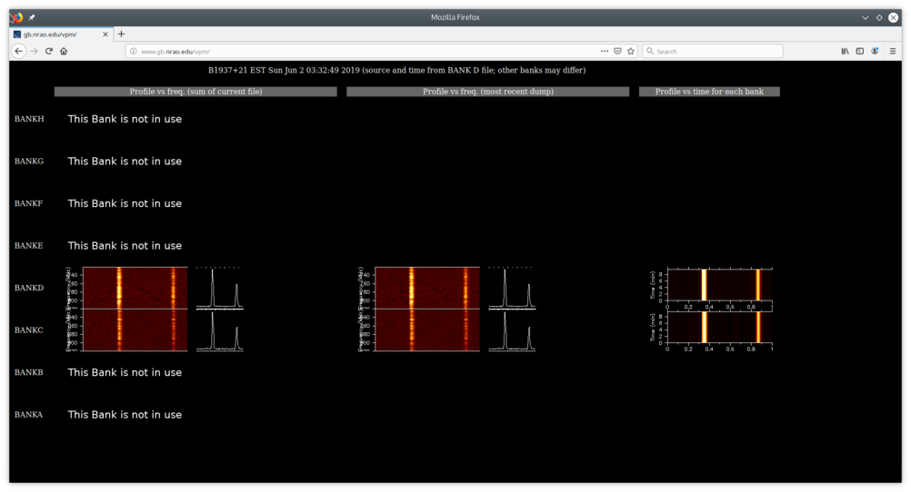

Pulsar Observing Reference
==========================

Overview
--------

VEGAS can be used in pulsar observing modes (VEGAS pulsar modes, or VPM) that are similar to those available with the old GUPPI backend (see the GBT Observer's Guide). VEGAS consists of eight CASPER ROACH2 FPGA boards and eight high performance computers (HPCs) equipped with nVidia GTX 780 GPUs, which together comprise a spectrometer **bank** (labeled A--H). VPM offers many combinations of observing modes, dedispersion modes, numbers of spectral channels, bandwidths, and integration times. Data are written in the PSRFITS format using 8-bit values. 

Observing Modes
---------------

VPM can operate in one of three **observing modes**. All three modes can be used with **coherent** or **incoherent** dedispersion.

* **search**: This mode is used to record spectra with very high time resolution (typically < 100 μs) and moderate frequency resolution (> 200 kHz). It is most often used when searching for new pulsars, observing known pulsars when a timing solution is not yet available, observing multiple pulsars simultaneously, or when resolution of individual pulses is required.
* **fold**: This mode is used to phase-fold spectra modulo the instantaneous pulsar period. This requires a user-supplied pulsar timing solution that can be used by TEMPO1 in prediction mode (i.e., to generate "polycos"). Fold-mode is most often used for pulsar timing observations of individual pulsars.
* **cal**: This mode is used for polarization and flux calibration observations of the GBT noise diodes. It is actually a specialized fold-mode in which data are phase-folded at a constant frequency of 25 Hz (or a period of 40 ms). This requires that the GBT noise diodes be turned on and set to a switching period of 0.04 s (see below).

 
Dedispersion Modes
------------------

VPM can operate in **incoherent** or **coherent** dedispersion modes. When using incoherent dedispersion, spectra are written without any removal of intrachannel dispersive smearing, and dedispersion must be performed offline (i.e. incoherently). When using coherent dedispersion, the intrachannel dispersive delay is removed prior to detection, providing higher effective time resolution.

When operating in incoherent dedispersion modes, each FPGA and HPC form an independent spectrometer bank (labeled A--H). The center frequency of each bank can be tuned independently, and each can process a maximum instantaneous bandwidth of up to 1500 MHz, though filters in the IF system limit the *maximum usable bandwidth to 1250 MHz per spectrometer bank.* The center frequencies of each bank can thus be arranged to contiguously cover up to 8 x 1250 Hz = 10 GHz, though, once again, IF limitations generally limit the maximum available bandwidth from any receiver to < 4 GHz (up to 8 GHz is available for certain receivers; see the GBT Observer's Guide).

.. todo:: 

    Remove reference to Observer's guide and replace with link to receiver frequency ranges

When operating in coherent dedispersion modes with 800 or 1500 MHz of sampled bandwidth, one FPGA sends output to all eight HPCs. Since all the HPCs are in use the maximum total bandwidth in coherent dedispersion modes is 1500 MHz, *1250 MHz of which usable.*

When operating in coherent dedispersion modes with 100 or 200 MHz of bandwidth, one FPGA sends output to one or two HPCs, respectively. In these cases, additional HPCs will not be active or write data. The exception is Bank A, which acts as the switching signal master and will always appear as active in CLEO, although it will not always write data.

Generally speaking, incoherent dedispersion is only recommended in the following use cases:

#. Blind searches for new pulsars.
#. Observations at frequencies higher than 4 GHz (i.e., C-Band), when > 1250 Hz of bandwidth is desired.
#. Observations of long-period pulsars in which very high time resolution is not needed (i.e., intrachannel dispersive delays can be tolerated). 

Observations of known pulsars, especially for high-precision timing, observations of multiple pulsars with similar dispersion measures (e.g. globular cluster MSPs), and pulsar searches for which a good estimate of the dispersion measure is available should usually use coherent dedispersion. 

Available VPM Modes
-------------------

All configurations are subject to a maximum data rate of 400 MB/s per bank. The data rate per bank can be calculated as

.. math::

    R = 1 \,\text{byte} \cdot \frac{ n_{\text{pol}} \cdot n_{\text{chan}} }{ t_{\text{int}} }

where n\ :sub:`pol` \ is the number of polarization products (4 for full Stokes parameters, 1 for total intensity), n\ :sub:`chan` \ is the number of spectral channels, and t\ :sub:`int` \ is the integration time (i.e. sampling time).

The following tables list all currently supported VPM modes and the vegas.scale values for each. Observers should still use the `VPM monitor webpage <https://www.gb.nrao.edu/vpm/vpm_monitor/>`_ or vpmMonitor tool to double check the value of vegas.scale for their particular observing setup.

.. todo:: 
    Add reference to vpmMonitor tool lower down this page

.. csv-table:: Coherent Modes
    :file: files/coherent_VPM_modes.csv
    :header-rows: 1
    :class: longtable
    :widths: 1 1 1 1 1 1

.. attention::

    ** **Observers should not use longer integration times in coherent dedispersion modes. Due to the way blocks of data are sized for FFTs on the GPUs, longer integration times can result in artifacts in the final data products.**

.. csv-table:: Incoherent Modes
    :file: files/incoherent_VPM_modes.csv
    :header-rows: 1
    :class: longtable
    :widths: 1 1 1 1 1 1

.. attention::

    Note that low bandwidth modes may be routed differently than high bandwidth modes.

    * When using incoherent dedispersion and and 100 or 200 MHz of bandwidth, Bank A should be the only active bank. The exception to this rule is when using the 342 MHz feed of the prime focus receiver, in which case the IF path is routed to Bank E. Bank A will still be active because it is always the switching signal master.
    * When using coherent dedispersion and 200 MHz of bandwidth, Banks A, C, and D will be active, but only bank C and D will record data. Bank A is active because it is the switching signal master.
    * When using coherent dedispersion and 100 MHz of bandwidth, Banks A and D will be active, but only Bank D will record data. Bank A is active because it is the switching signal master.

    The reason for this setup is that the VEGAS FPGA boards cannot be clocked at rates slow enough to natively sample 100 or 200 MHz. Instead, they are clocked at a rate of 800 MHz, but only a portion of the sampled bandwidth is sent to the HPCs for processing. 

Configuring VEGAS Pulsar Modes
------------------------------

.. todo::

    Remove Observers guide reference.

VPM is configured using the standard Astrid keyword/value configuration block, which is discussed in detail in the GBT Observer's Guide. Here we review only those keywords relevant for VPM.

* **obstype** will always be **"Pulsar"**.
* **backend** will always be **"VEGAS"**. GUPPI has been decommissioned and is no longer installed.
* **bandwidth** will be either **100**, **200**, **800**, or **1500**.
* **dopplertrackfreq** is not always required, but it is safe to include. It should be equal to the center of your observing band. If you are using one spectral window (i.e., one value of the restfreq keyword) then the value of dopplertrackfreq will be equal to the value of restfreq. If you are using multiple spectral windows (i.e. multiple values for the restfreq keyword), then dopplertrackfreq should be equal to the center of the overall observing band.
* **ifbw** will always be **0**
* **tint** is the integration time. Under the hood, it is controlled by the hardware accumulation length, so that **tint = acclen x nchan/BW**. acclen can take on values from 4 to 1024 in powers of two. If you select an integration time that does not use a power of two acclen, acclen will be rounded down to the nearest power of two (resulting in a shorter integration time). Most observers will want to keep their integration times fast enough to resolve fast MSPs, while keeping the data rate < 400 MB/s.
* **swmode** will either be **"tp"** for calibration scans or **"tp_nocal"** for pulsar scans.
* **swper** will always be 0.04.
* **noisecal** will be **"lo"** for calibration scans (this uses the low-power noise diodes) and **"off"** for pulsar scans.

The following keywords are VPM specific.

* **vegas.obsmode** controls both the dedispersion and observing mode. Allowed values are
    * **"search"**: Incoherent dedispersion search-mode
    * **"fold"**: Incoherent dedispersion fold-mode
    * **"cal"**: Incoherent dedispersion cal-mode
    * **"coherent_search"**: Coherent dedispersion search-mode
    * **"coherent_fold"**: Coherent dedispersion fold-mode
    * **"coherent_cal"**: Coherent dedispersion cal-mode 
* **vegas.polnmode** controls whether full Stokes or total intensity data are recorded. Allowed values are **"full_stokes"** and **"total_intensity"**, though total intensity can only be used in incoherent search-mode.
* **vegas.numchan** sets the number of spectral channels. See the tables above for allowed values for various bandwidths. Care must be taken not to exceed the maximum data rate.
* **vegas.outbits** controls the number of bits used for output values. The only allowed value is **8**.
* **vegas.scale** controls the VPM internal gain so that the output data is properly scaled for 8-bit values. This values are empirically measured and reccommended values are in the tables above.
* **vegas.dm** controls the DM used for coherent dedispersion fold and search modes. It is not used by any other modes.
* **vegas.fold_parfile** specifies the path to the ephemeris (parfile) used for either incoherent or coherent dedispersion fold-modes. *The parfile must be compatible with the TEMPO1 prediction mode.*
* **vegas.fold_bins** controls the number of pulse phase bins used for either incoherent or coherent dedispersion fold- or cal-modes. Enough bins should be used to fully resolve fine profile structure. Typical values are **256** in incoherent dedispersion modes and **2048** in coherent dedispersion fold- or cal- modes.
* **vegas.fold_dumptime** controls the length of a sub-integration in either incoherent or coherent dedispersion fold- or cal-modes. The value is specified in seconds, with **10** s being typical. It must be shorter than the total scan length.
* **vegas.subband** is always **1** for pulsar observing.

Experienced observers will recognize that these keywords are very similar to those used by GUPPI. This is by design. Note that the **guppi.datadisk** keyword has no analog in VPM. As mentioned above, GUPPI has been retired. Dual backend operation with VEGAS and GUPPI is no longer supported.

VPM Observing Tools
-------------------

Once you start observing you will want to check the quality of your data and make sure that things run smoothly. A number of tools have been designed to facilitate this, many of which are similar to those used for GUPPI.

The VEGAS CLEO Screen
^^^^^^^^^^^^^^^^^^^^^

.. todo::

    Observer's Guide reference

Unlike GUPPI, VEGAS has its own CLEO application that can be used for spectral line and pulsar observing modes (see the GBT Observer's Guide for more information on CLEO). There are two ways to launch the VEGAS CLEO application:

* From the main CLEO launcher, go to **Backends** and select **VEGAS**.
* Type cleo vegas from any command prompt.

Figure 1 shows an example of the VEGAS CLEO screen when in high bandwidth pulsar mode. The upper panels display information about setup on individual banks. The most relevant parameters for pulsar observers are the mode and integration time. The bottom panels show the state of the VEGAS managers on each bank.

When using incoherent dedispersion, anywhere from one to eight banks may be active, depending on how the system was configured. In this case, *it is completely normal for inactive banks to be configured for a different mode (possibly a spectral line mode) and/or to be in an off state*. In high bandwidth coherent dedispersion modes only the FPGA on Bank A is active, but all the managers and HPCs will be used and configured in the same way. However, the power monitors on other banks will *not* be in use (because they are tied to the inactive FPGAs), and may not be near the target value of -20 dB (see below). 

    Figure 1: The VEGAS CLEO screen when operating in pulsar modes. In this case VPM is configured for coherent dedispersion, so all eight banks are active and configured in the same way. However, only the power monitor for Bank A will be in use. Note the VEGAS Power Monitor button on the right-hand side. 

.. attention::

    Note that in low bandwidth modes, not all banks may be active. This is normal behavior. In general, Bank A will always be active as the switching signal master, but other banks (example C and D) may be the only banks recording data. See the section on Available VPM Modes for more information. 

The VEGAS Data Monitor
^^^^^^^^^^^^^^^^^^^^^^

The VEGAS data monitor is used to check the input power levels for each bank and replaces the ``guppi_adc_hist`` tool used for GUPPI. There are two ways to launch the data monitor:

* From the VEGAS CLEO application, click on the **VEGAS Power Monitor** button (see Figure 1).
* Type ``vegasdm`` from any command prompt.

Figure 2 shows the data monitor. The top panel shows the input power level in chart recorder form for both polarization channels. *The target power level is -20 ± 1.5 dB*. The plot is auto-scaling, so if the power levels change (e.g., during balancing) the plot may change abruptly. Note that there are separate tabs at the top of the application for each bank, though only active banks will update. The ``All measpwr'' tab shows the chart recorder for each bank. The bottom two panels show a histogram of 8-bit values from each ADC, one for each polarization channel. *These should have zero mean and a FWHM of approximately 30 counts once the system is balanced.*

    Figure 2: The VEGAS Data Monitor screen. Data for Bank A is selected in this example, but all eight banks are active. The chart recorder shows proper input values of approximately -20 dB. The histograms of 8-bit ADC output values are also in an acceptable range, with a FWHM of approximately 30 counts.

Note that the active banks are the same as described in the previous section for low bandwidth modes. 

The vpmStatus Tool
^^^^^^^^^^^^^^^^^^

VPM makes use of shared memory to pass configuration parameters between the managers and data acquisition programs. To check the status shared memory type ``vpmStatus`` at the command prompt *while logged into one of the VEGAS HPCs*. These HPCs are named ``vegas-hpc11`` for Bank A, ``vegas-hpc12`` for Bank B, etc. Shared memory will only be properly configured on banks that are in use.

vpmStatus plays the same role as guppi_status.

.. note::

    Note that as of Aug 26, 2021, the VEGAS HPC names have changed. ``vegas-hpc1`` through ``vegas-hpc8`` should not be used. Instead, use ``vegas-hpc11`` through ``vegas-hpc18``.

The vpmHPCStatus Tool
^^^^^^^^^^^^^^^^^^^^^

When using a multi-bank incoherent dedispersion mode or coherent dedispersion mode it is useful to check the status of all the active banks at once. This is done by typing ``vpmHPCStatus`` at the command prompt of a computer on the GBO network (note: must be a RHEL7 machine). This tool displays the center frequency, status of various processing threads (network communication and dedispersion), the current data block index, and a fractional running total of any dropped packets. It also displays the last few lines from the manager logs.

Note that inactive banks may have values like "Unk" (for unknown). This may occur if those banks are configured for spectral line observing. Inactive banks also will not update during data taking. *This is normal behavior. You need only pay attention to the status of banks currently in-use.*

``vpmHPCStatus`` plays the same role as ``guppi_gpu_status.`` Figures 3 and 4 show example status screens.

.. figure:: files/vpmHPCStatus.png

    Figure 3: The vpmHPCStatus screen. VEGAS is configured for coherent dedispersion at L-band in this example. 

    Figure 4: The vpmHPCStatus screen. VEGAS is configured for coherent dedispersion at at 820 MHz with 200 MHz of bandwidth in this example.

Coherent Dedispersion VPM Data Display Webpage
^^^^^^^^^^^^^^^^^^^^^^^^^^^^^^^^^^^^^^^^^^^^^^

Data from each HPC that is collected in coherent dedispersion fold- or cal-modes is displayed on a public webpage: `<https://www.gb.nrao.edu/vpm/>`_. The page refreshes every few seconds and should reflect the most recently written scan in close to real-time. The source name and modification time are displayed at the top of the page. The first column shows observing frequency vs pulse phase summed over the entire data file. The middle column shows frequency vs pulse phase for the most recent sub-integration. The last column shows observing time vs pulse phase summed over all frequencies. 

.. note::
    
    Note that long scans will be broken into multiple output files, and when a new file is opened the S/N may seem to suddenly drop. This is expected and the S/N should recover as more data is written to that file. Also note that under certain browsers (e.g. Chrome) the page not always automatically refresh. If VPM seems to be running but the plots are not updating, first try clearing your browser's cache and then reopening the page. If it still is not updating ask the GBT operator to make sure that the VPM coherent dedispersion autoplotting script is still running.

Note that in low bandwidth modes, not all banks may be active. A text box will appear next to those banks that are not configured to record data.

This page plays the same role as www.gb.nrao.edu/guppi.

    The VPM data monitoring webpage. In this case, VEGAS is configured for coherent dedispersion with 200 MHz of bandwidth at a center frequency of 820 MHz. Only two banks are active.

Incoherent Dedispersion VPM Monitor Webpage
^^^^^^^^^^^^^^^^^^^^^^^^^^^^^^^^^^^^^^^^^^^

When operating in incoherent dedispersion mode, bandpass plots are displayed on a public webpage: `<www.gb.nrao.edu/vpm/vpm_monitor>`_. The page refreshes every few seconds and so should be close to real-time. Note that there is a separate panel for each bank, but only active banks will display data. The red curve shows the mean and the blue curves show the minimum and maximum values for the current data block. The average value should be around 30-40 counts and can be adjusted using the **vegas.scale parameter**. The relationship is linear for incoherent dedispersion modes. This page can also be used to monitor the RFI environment.

If you wish, you can run the same tool manually for more current data. To do this, type ``vpmMonitor`` at the command prompt *while logged into one of the VEGAS HPCs*. VPM must be taking data at the time. Use of the webpage is preferred.

These tools play the same role as www.gb.nrao.edu/guppi/guppi_monitor and ``guppi_monitor``.

Monitoring the VEGAS Manager Output
^^^^^^^^^^^^^^^^^^^^^^^^^^^^^^^^^^^

Output from the VPM data acquisition programs (as well as the spectral line programs) is captured by the VEGAS managers and written to log files. These log files can be found in ``/home/gbt/etc/log/vegas-hpcN`` where N is the bank number, e.g. ``vegas-hpc11`` for Bank A. You can access these files from any GBO computer. A new log is started each time the VEGAS managers are started, so type ``ls -tr`` in the appropriate directory to find the name of the most recent log. Once you have this, you can follow the output by typing ``tail -f <logName>``, where you replace ``<logName>`` with the appropriate file name.

Users typically will not have to check the logs unless they are trying to diagnose a problem. These log files play the same role as ``/tmp/guppi_daq_server.log``, but they record output for all scans, both in incoherent and coherent dedispersion mode. 

Accessing Your Data
-------------------

VPM data are written directly to the lustre file system, and can be accessed from any of the machines listed as lustre clients at `<www.gb.nrao.edu/pubcomputing/public.shtml>`_ (e.g. euclid or thales).

In coherent dedispersion modes data are written to

``/lustre/gbtdata/<projectID>/VEGAS_CODD/<bankID>``

where ``<projectID>`` is your GBT project code with the session number in Astrid appended, e.g. AGBT18A_100_01, and ``<bankID>`` is the one-letter bank name (A--H).

In incoherent dedispersion modes data are written to

``/lustre/gbtdata/<projectID>/VEGAS/<bankID>``

File names follow the forms:

``vegas_<MJD>_<secUTC>_<sourceName>_<scanNumber>_<fileNumber>.fits``(fold- and search-modes)

``vegas_<MJD>_<secUTC>_<sourceName>_cal_<scanNumber>_<fileNumber>.fits`` (cal-mode)

where ``<MJD>`` is the modified Julian date of the observation, ``<secUTC>`` is the number of seconds after midnight UTC at the start of the scan, ``<sourceName>`` is the source name as identified from the Antenna manager, ``<scanNumber>`` is the scan number within the current Astrid session, and ``<fileNumber>`` is the file number within the current scan (long scans are broken across multiple files to avoid any one file from being very large). ``<secUTC>`` is a zero-padded five-digit integer and and ``<fileNumber>`` are zero-padded four-digit integers. Example file names are

``vegas_58150_05400_B1937+21_0001_ca_0001.fits``

``vegas_58150_05490_B1937+21_0002_0001.fits``

.. note::

    This format differs slightly from GUPPI, which does not have the ``<secUT>`` element. This has been added to avoid corner cases where GUPPI file names may not be unique.

Data are recorded in the PSRFITS standard, which can be processed by all common pulsar data analysis packages (e.g. `PRESTO <https://github.com/scottransom/presto>`_, `PSRCHIVE <https://psrchive.sourceforge.net/>`_, and `DSPSR <https://dspsr.sourceforge.net/>`_). Data in all modes are recorded in the ``/lustre/gbtdatafile`` store.

Fold- and cal-mode data will be archived per typical GBO data archiving policies. Due to large data volumes, search-mode data will not be included in the long-term archive. *Please make arrangements to move large data sets off of the lustre file system as quickly as possible.* Data can be transferred over internet (preferred) or shipped on hard disks. Please contact your project friend if you need help managing data. 

Timing Offsets
--------------

Each VPM mode has a different backend timing delay. To determine the tiing offset for your observing mode use ``/home/pulsar_rhel7/bin/vpmTimingOffsets.py``

This delay accounts for delays arising from the polyphase filterbanks employed on the ROACH2's. Because GUPPI and VEGAS have slightly different signal paths there are some additional offsets between the two backends. Empirically these are less than 1 microsecond.

Note that overlap delays in coherent dedispersion search mode are already applied to the data via a PSRFITS keyword. This was not the case with GUPPI. 

Putting it All Together
-----------------------

In summary, a typical VPM observing session will consist of the following steps.

#. Create scheduling blocks *well in advance of being scheduled*. Contact your project friend if you have questions.
#. At the beginning of your observing session:
    * Launch the CLEO VEGAS and VEGAS Data Monitor applications.
    * Launch the ``vpmHPCStatus`` and/or ``vpmStatus`` tools, as appropriate.
    * Log in to a lustre client and prepare to navigate to your data output directory (the directory will only be made once data start being recorded).
    * Navigate to `<www.gb.nrao.edu/vpm>`_ to monitor coherent dedispersion fold- and cal-mode observations and `<www.gb.nrao.edu/vpm/vpm_monitor>`_ to check the bandpass for incoherent dedispersion observations. 
#. Once VEGAS has configured, check that the observing mode and various parameters are set properly using the VEGAS CLEO application and the ``vpmStatus`` and/or ``vpmHPCStatus`` tools.
#. Once VEGAS has balanced, check the input power and ADC output using the Data Monitor.
#. Once you have started recording data, check your fold- or cal-mode scans using the online viewers or by accessing data directly on disk. You should also check the bandpass using the VPM monitor webpage or the ``vpmMonitor`` tool.
#. Once you have started your main science scans, keep an eye on the output data and the data-taking status using the status monitors.
#. Start processing large data sets as soon as possible after your sessions ends. 

Tips and Tricks
^^^^^^^^^^^^^^^

* Before writing scheduling blocks from scratch, ask your project friend if there are any already available from other projects that might suit your needs. This minimizes the possibility of an incorrect set-up or scheduling block.
* If you are searching for pulsars or observing a new source, consider observing a well known pulsar as a test source at the start of your session to make sure that things are working properly. A cal-mode scan can also be used.
* If ``vpmStatus`` and/or ``vpmHPCStatus`` show unexpected values, the system seems to be having trouble balancing, or you experience other issues, ask the operator to cycle the VEGAS managers off/on, or do so yourself if you know how. This is usually sufficient to resolve any odd states that could arise out of a partial or incorrect configuration. If this fails, ask the operator to fully restart (stop/start) the VEGAS managers. If this still doesn't work, ask the operator to contact the on-duty support scientist.
* The GBT noise diodes are stable over short-to-medium time scales, and a number of continuum flux calibration scans are available for common observing set-ups (this is especially true of 820 MHz and L-band NANOGrav set-ups because NANOGrav observes flux calibrators at least once a month). If you're project requires flux calibration, consider contacting your project friend to see if appropriate calibration data already exist.
* If you are observing multiple sources with relatively short scan lengths, and the operator needs to take control for a wind-stow or snow-dump, ask if you can let the current scan finish and then use Pause to let the operator take control. Once control is released back to you, you can simply un-pause and pick up where you left off. But if the operator needs to take control immediately, abort your scan and let them take over. 

.. warning::

    Important Note on Calibration: when calibrating coherent search mode data using coherent calibration scans, the resulting fluxes must be multiplied by a factor of exactly 20 to account for a scaling factor that is applied during online processing. 

Use of the **dopplertrackfreq** Keyword
^^^^^^^^^^^^^^^^^^^^^^^^^^^^^^^^^^^^^^^

The Doppler tracking frequency impacts how the first LO is tuned. This is true even if Doppler tracking is not actually used (which is the case for pulsar observing). The dopplertrackfreq keyword does not always need to be specified. If it is not specified, the Config Tool will simply set it equal to the first value specified for restfreq. For most pulsar observations, only a single restfreq is used, so we have not generally been in the habit of explicitly specifying a value for dopplertrackfreq.

However, for VEGAS observations using multiple banks to cover a wide bandwidth, we recommend explicitly specifying a value of dopplertrackfreq that is equal to the center of the observing band.

The problem is that Config Tool was intentionally designed to remember and preserve it's state from one configuration to the next unless a keyword is explicitly assigned a new value, or the configuration is manually reset using the ResetConfig command. Unfortunately, this behavior runs counter to what many observers expect, even experienced GBT observers.

When an observer manually specifies a value of dopplertrackfreq, this value will persist, even into the next observing session, unless a new value is specified or a ResetConfig is performed. When this happens it can cause an error in calculating which sideband sense VEGAS receives -- in nearly all situations it should be lower sideband, meaning that the highest frequency is in the lowest channel. When dopplertrackfreq is incorrect, it can cause the sideband to be incorrectly labeled as upper. This reverses the frequency labeling in VEGAS. For incoherent dedispersion the labels can be corrected after the fact without any impact on data quality, but for coherent dedispersion the wrong dedispersion filter will be applied online, corrupting the data.

This only occurs for certain configuration sequences, namely when switching from a pulsar mode that specifies dopplertrackfreq to one that doesn't (it would also happen if switching from to a spectral line mode that specifies dopplertrackfreq to one that doesn't). Switching from a pulsar to a spectral line mode (or vice versa) will reset things so that this isn't an issue.

There are two ways to avoid this problem:

Option 1:

* Reset the GBT configuration at the start of your observing session. It is easiest to do this by simply adding this one line to a stand-alone Astrid scheduling block and submitting it at the start of your session.

* ResetConfig()

* That's it! Most projects will only have to do this once at the start of a session, however, if you are using multiple receivers and/or center observing frequencies with different values of the "dopplertrackfreq" keyword during a session, you should also run this ResetConfig () command before you submit a script with a different configuration.

Option 2:

* Modify your configuration strings to always explicitly specify a value for dopplertrackfreq. This keyword specifies the Doppler tracking frequency. Even though pulsar observers don't use Doppler tracking, it still impacts how the IF system is set up. The value of dopplertrackfreq should be equal to the center frequency of your overall observing band. If you are only using a single value for the restfreq keyword, then use the same value for dopplertrackfreq. If you are using multiple VEGAS banks to cover a wider bandwidth by specifying multiple values for restfreq, the value of dopplertrackfreq would be equal to the center of the overall observing band.

If you adopt Option 1 then Option 2 isn't necessary, and vice versa. Of course, there is no harm in adopting both. 

Transitioning From GUPPI to VPM
-------------------------------

Experienced pulsar observers will recognize that GUPPI and VPM observing are very similar, especially the parameters used in scheduling blocks. The following table summarizes the similarities and some differences between GUPPI and VPM.

    **Astrid**: Most **"guppi."** parameters can be replaced with **"vegas."**. The exceptions are **guppi.datadisk**, which has no VPM equivalent.
    **File names:** VPM output file names include a new element, the number of seconds after midnight UTC.
    ``vegas_<MJD>_<secUTC>_<sourceName>_<scanNumber>_<fileNumber>.fits``
    ``vegas_<MJD>_<secUTC>_<sourceName>_cal_<scanNumber>_<fileNumber>.fits``

The table below can be used a cheat-sheet for navigating between some common GUPPI and VPM tasks. 

.. csv-table:: Quick Reference for Transitioning from GUPPI to VPM
    :file: files/guppi2vpm.csv
    :header-rows: 1
    :class: longtable
    :widths: 1 1 1

