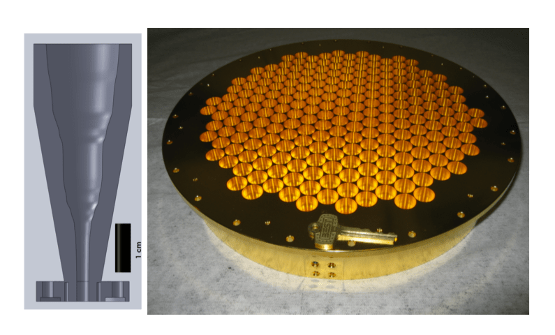
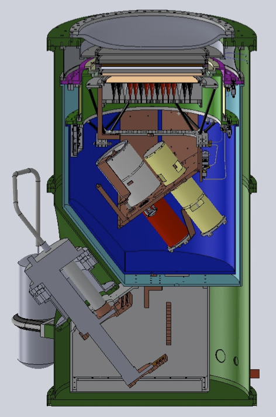
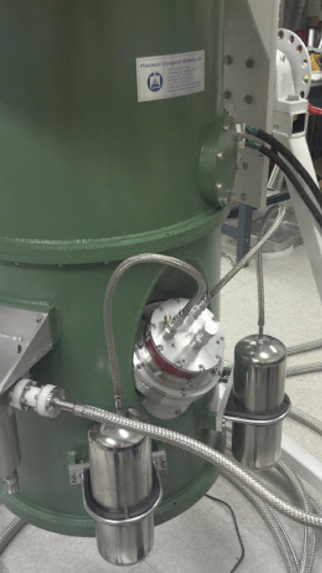
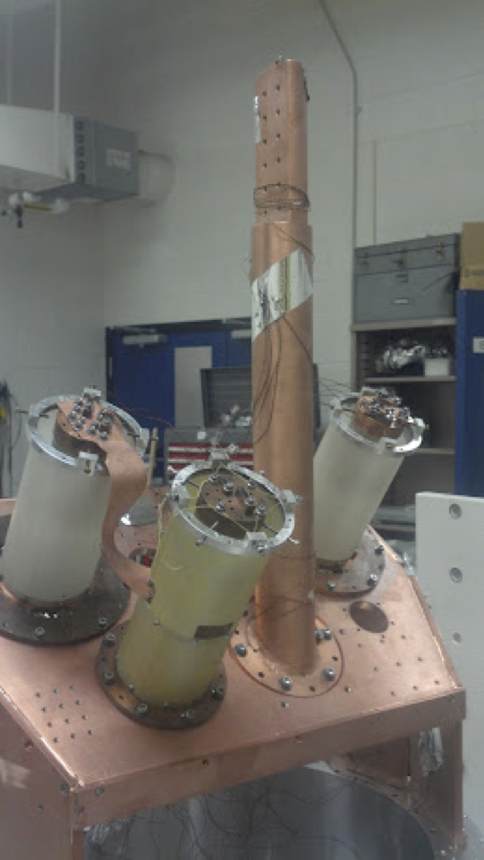
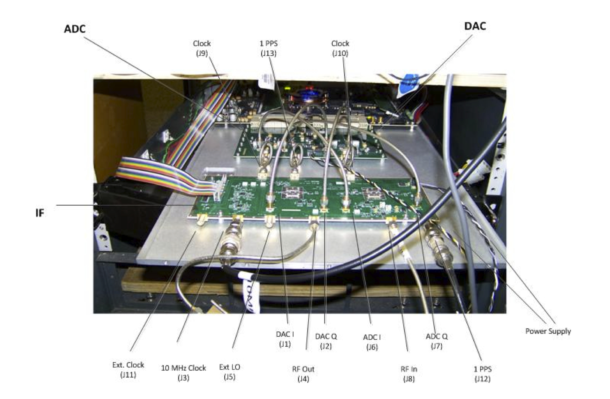

################################
MUSTANG-2 Historical Development
################################

Historical Updates
------------------

**Dec 2016: MUSTANG-2 on GBT to Commence Science Observing**
	- MUSTANG-2 has been installed on the GBT with upgraded readout multiplexers and 211 detectors working. Observing on shared risk science proposals in collaboration with the instrument team have begun.

**May 2016: MUSTANG-2 First Light on GBT**
	- The full MUSTANG-2 camera achieved first light on the GBT in May, 2016! It will return to the GBT in fall 2016 for shared-risk science through the 2017-A Green Bank Observatory proposal call.

**July 2015: MUSTANG-2 green-lighted for full production**
	- The NSF ATI program has funded our proposal to fully populated the MUSTANG-2 focal plane with 215 dual polarization detectors. The completed MUSTANG-2 receiver is expected to arrive at the GBT for commissioning & early science observations early in 2016.

**May 2015: MUSTANG-1.5 completes successful engineering run on the GBT**
	- MUSTANG-1.5 was successfully integrated with the GBT and first light observations of a variety of sources obtained. This run allowed the team to shake out final integration issues with the telescope and software systems, and constituted the first astronomical use of MKID-style microwave resonators to read out TES detectors.

**December 2, 2014: MUSTANG-1.5 Arrives at the GBT**
	- MUSTANG-1.5 arrived in Green Bank and is preparing for first light on the GBT later this month!

**MUSTANG-2 is Under Construction!**
	- MUSTANG-1.5 is currently being integrated and tested in the lab at U.Penn., with first light on the GBT scheduled for winter 2014.

**June 2014: MUSTANG-2 Detectors delivered to U.Penn!**
	- In June 2014 72 packaged detectors were delivered to U.Penn for testing and characterization.

**MUSTANG retired at the end of 2013**
	- MUSTANG – the original 90 GHz, 64 pixel GBT bolometer camera– was retired at the end of calendar year 2013 in anticipation of the arrival of its successor, MUSTANG-1.5 MUSTANG proposals were accepted from June 2009 through Feburary 2012.

Photos
------

	Left: Cutaway view of tapered feed design. Right: the final MUSTANG-2 feed horn array as fabricated (223 feeds). The feed array weighs 8kg and has been successfully cooled to 300 mK in the MUSTANG-2 cryostat.

	Cutaway showing the design of the MUSTANG-1.5 receiver

	Receiver in the lab at U.Penn.

	Receiver in the lab at U.Penn.

	One ROACH board with its custom daughter cards for the microwave resonator readout.