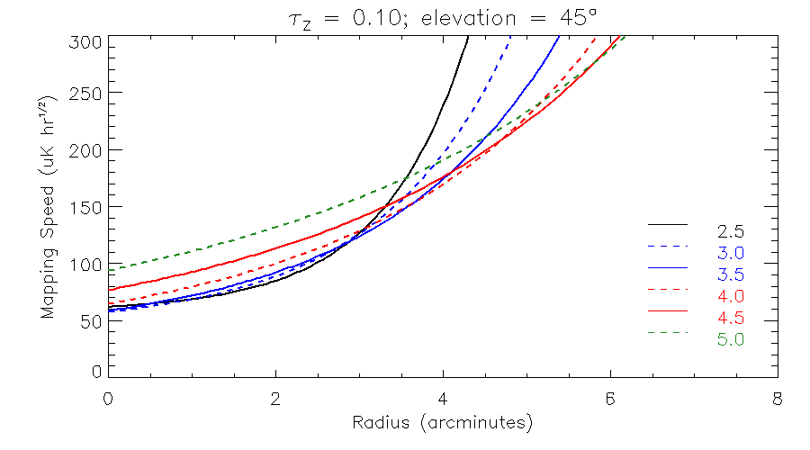

#############################
MUSTANG-2 Mapping Information
#############################

MUSTANG-2’s primary scanning method is that of a Lissajous Daisy of varying radii. The mapping speed profiles have been scaled to a zenith opacity of 0.1 and elevation of 45 degrees.

This sensitivity assumes an effective smoothing of 10.0" FWHM. If heavier smoothing is acceptable the sensitivity is better by a factor of (FWHM/10.0 arcsec).

Historically, we have reported mapping speeds based on the RMS within a circle of radius 2 arcminutes. These values have now been extended to a range of scan sizes seen below.

Mapping speeds and corresponding sensitivities
----------------------------------------------
We define mapping speed (ms) as :math:`\sigma \times \sqrt{t}`. Historically, we have reported mapping speeds based on the RMS within a circle of radius 2’. These values have now been extended to a range of scan sizes. Listed below are the mapping speeds within the central 2’ in various units. Each mapping speed can be thought of as the corresponding sensitivity/RMS reached within one hour of observation which gives that :math:`\mathrm{ms}=\sigma \times \sqrt{1}` so the mapping speeds below can be thought of the sensitivity/RMS reached within one hour for a given daisy radius.

.. list-table:: 
	:header-rows: 1
	
	* - Scan size (radius, arcminutes)
	  - Mapping speed :math:`( \mu \mathrm{K~hr}^{1/2})`
	  - Mapping speed :math:`( \mu \mathrm{Jy/beam~hr}^{1/2})`
	  - Mapping speed :math:`(\mathrm{Compton-y~hr}^{1/2})`
	* - 2.5
	  - 73
	  - 56.2
	  - 2.0E-5
	* - 3.0
	  - 74
	  - 57
	  - 2.0E-5
	* - 3.5
	  - 77
	  - 59.3
	  - 2.1E-5
	* - 4.0
	  - 85
	  - 65.5
	  - 2.3E-5
	* - 4.5
	  - 98
	  - 75.5
	  - 2.7E-5
	* - 5.0
	  - 117
	  - 90.1
	  - 3.2E-5

Notes on the above table:
	* The mapping speeds above are calculated based on the RMS in the central 2 arcminutes. For small scans, this region has roughly uniform noise.
	* The conversion from :math:`\mu \mathrm{K}` to :math:`\mu \mathrm{Jy/beam}` is roughly 0.77; i.e. multiply the :math:`\mu \mathrm{K}` noise by 0.77 to get a noise estimate in :math:`\mu \mathrm{Jy/beam}`.
	* The conversion from :math:`\mu \mathrm{K}` to Compton-y is roughly 2.74E-7; i.e. multiple the :math:`\mu \mathrm{K}` noise by 2.74E-7 to get a noise estimate in Compton-y.
	* Extended signal on scales up to 5' should be imaged with reasonable fidelity, but faint signal more extended than this may be difficult to detect. Bright emission (20 mJy/beam or more) can be reconstructed over scales of many arcminutes. The angular resolution of MUSTANG on the GBT is typcally 9" (FWHM) and the instantaneous field of view is a 4' diameter circle. Recovery of signal depends on data processing.

Mapping Memo
------------
Here is a :download:`MUSTANG-2 mapping speeds memo </_static/mustang2_documents/MUSTANG_2_Mapping_Speeds_Public.pdf>`.