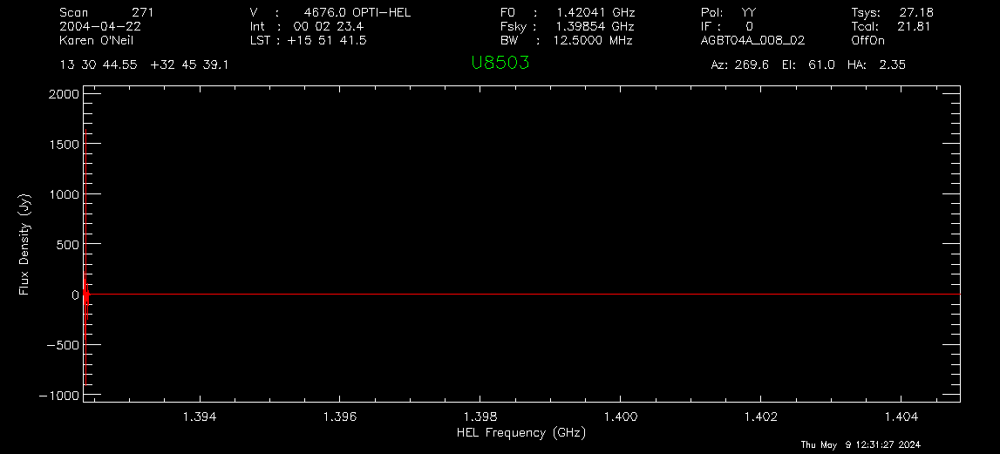
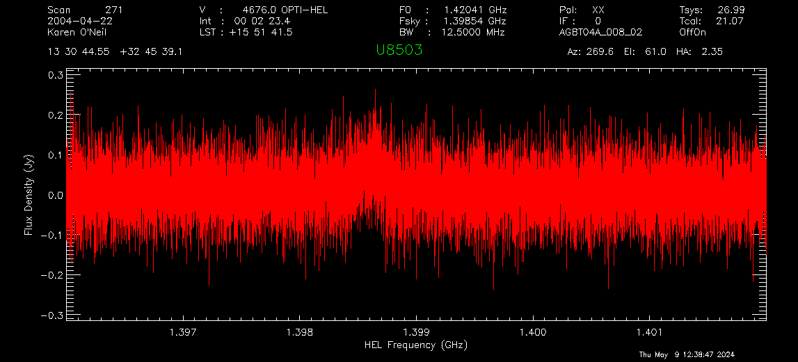
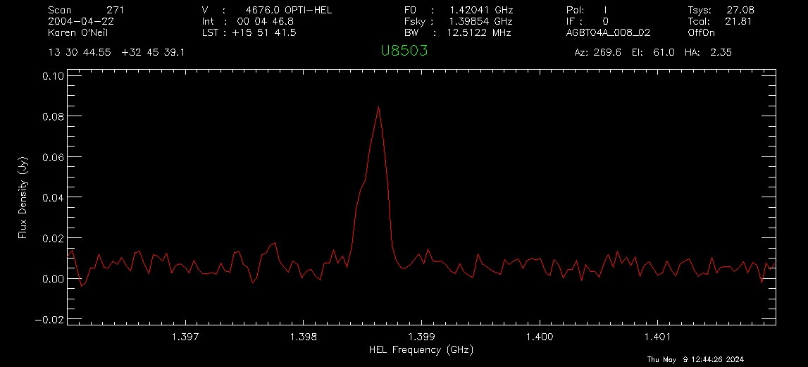
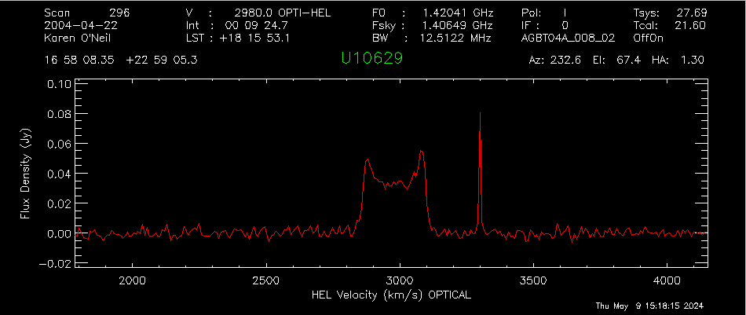

.. _hi_psw_tutorial:

###################################
HI Position Switched (psw) Spectrum
###################################

This tutorial will run you through the steps required to setup your scheduling blocks to execute an HI observation using position switching and how to calibrate the data.

.. admonition:: What you should already know
    :class: note

    In order to complete this tutorial, you need a GBO computing account. You should be relatively familiar with using the command line, and starting AstrID. 

.. admonition:: Data

   This example is from the HI survey dataset http://greenbankobservatory.org/~koneil/HIsurvey/index.shtml

1 Observation Preparation
=========================

The instructions below will run you through the steps required to setup your scheduling blocks to execute an HI pointed observation (using position-switching) and how to calibrate the data.

1.1 Catalog
-----------

Before you start writing your scheduling block(s) it is helpful to prepare a source catalog in a separate file. This is especially advised if you have a long list of sources. For a short catalog it is also possible to add the sources directly in your scheduling block (not described here). 

Here is an example of a RA/Dec coordinate system catalog with velocity, showing the header lines of the catalog and then 5 sources. The full catalog is available at `/home/astro-util/HIsurvey/HI_survey.cat`.

.. literalinclude:: material/HI_survey.cat
    :lines: 1-4,68-72
  

Here `Name` is the name of the source (choose a name that uniquely identifies the source in your catalog), `RA` is the right ascension, `Dec` is the declination, and `VEL` is the source velocity in units of km/s. 

We advise to save this catalog as a `.cat` file, in a known location. We will call it later from our scheduling block(s).

.. todo:: 

   Add link to reference material for catalogs.

1.2 Configuration and Observing Scripts
---------------------------------------

At the GBT we use `AstrID` to prepare and execute scheduling blocks. `AstrID` is an application that you can use to edit and submit custom python-based scheduling blocks for GBT observations. `AstrID` is python-based and can incorporate custom user scripts. Here we show the full `AstrID` script, including reference to the HI catalog and the configurations. The script is available at `/home/astro-util/HIsurvey/HI_survey.py`

.. literalinclude:: material/HI_survey.py
    :language: python

2. Observations
===============

To learn how to execute your observing scripts, please follow the :ref:`GBT observations 101` guide.

2.1 AutoPeakFocus observations
------------------------------

Recall that after slewing near your source, the script looks for a nearby bright point source and runs a series of Peak (pointing) and Focus scans. When everything is working well, the scans look like this (switch to the DataDisplayTab in AstrID to see them).

    
    L-Band peak observations. Four scans are taken, two scanning in Azimuth, two scanning in Elevation.

    
    L-Band focus observation.

.. warning::

   Sometimes, though, the focus curve fails to fit properly. This is typically due to the chosen source not having enough power. When this happens, you can look at the results and decide if they are close enough to simply have the operator put the focus offset into the system. This will also be true as long as the peak appears to be at :math:`-20\pm10` mm. 
   
   A couple examples of this situation are shown below.

   .. image:: material/HI_observing_astrid_DataDisplay_focus_poor_01.png
   .. image:: material/HI_observing_astrid_DataDisplay_focus_poor_02.png

.. danger::

   **When you're online (observing), you should never click on any of the scan numbers.** This will cause AstrID to re-process the data and can change your pointing and focus values.

.. note::

   You can always look at your observations after your observing session has ended. Start AstrID in offline mode and then under the DataDisplay Tab, open the ScanLog.fits file in the directory of your observations of interest.

2.2 Source observations
-----------------------

Once the AutoPeakFocus routines are complete, the telescope should configure for your spectral line observations, go to your source and balance the power, and then observe! You can check the status of your observations using the GBTStatus tab in AstrID. 

.. note::

   The DataDisplay - Spectral Line subtab is often not able to keep up with the incoming data, and so issues with not displaying data can be ignored.

Once your first set of data is written to disk (here when the first ON scan is complete, after 5 minutes),  you should go into gbtidl and look at the data. 

.. note:: 

   You cannot look at the fully processed spectrum (ON+OFF) in gbtidl until the ON+OFF pair is complete (after about 10.5 minutes). You can, however, look to see that the data looks ok, using gbtidl and the :code:`gettp, 5` command (where 5 is the scan number of interest). 
   
More information on data processing in the :ref:`next section <3. Data Reduction>`. Happy Observing!

3. Data Reduction
=================

We will show two examples of how to process the obtained spectra:

.. admonition:: Example 1

    :ref:`Simple example <3.1 Simple Example>`
   
    Data taken with standard ONOFF command with cals (noise diodes) firing.

.. admonition:: Example 2

    :ref:`More complicated example <3.2 More Complicated Example>`
    
    Many observations were taken with the noise diodes turned off, followed by a short period where the noise diodes are firing. As a result you need to determine :math:`T_{sys}` and then apply it to the on+off scans.

3.1 Simple Example
------------------

This simple example is from the HI survey dataset (http://greenbankobservatory.org/~koneil/HIsurvey/index.shtml). It also matches the observation technique in Observing, example 1. 

3.1.1 Start gbtidl
^^^^^^^^^^^^^^^^^^

Open a terminal. At the prompt enter

.. code-block:: bash

   gbtidl

You should see the following welcome screen:

.. literalinclude:: material/gbtidl_startup.txt
    :language: text

3.1.2 Load files of interest
^^^^^^^^^^^^^^^^^^^^^^^^^^^^

.. code-block:: text
    
    GBTIDL -> dirin, '/home/astro-util/HIsurvey/Session02'

3.1.3 Look at file content
^^^^^^^^^^^^^^^^^^^^^^^^^^

.. code-block:: text
    
    GBTIDL -> summary

.. literalinclude:: material/HI_survey_Session02_summary.txt
    :language: text

3.1.4 Empty the buffer memory
^^^^^^^^^^^^^^^^^^^^^^^^^^^^^

Make sure the buffer memory is empty

.. code-block:: text

    GBTIDL -> sclear

3.1.5 Process single on+off pair
^^^^^^^^^^^^^^^^^^^^^^^^^^^^^^^^

3.1.5.1 Process first polarization
''''''''''''''''''''''''''''''''''

Process the first polarization of the on+off pair (scan #270, 271), setting the intensity unit to Jansky.

.. code-block:: text

    GBTIDL --> getps, 270, plnum=0, units='Jy'

3.1.5.2 Adjust x-axis
'''''''''''''''''''''

Set the x-axis to an interesting frequency:

.. code-block:: text

    GBTIDL -> setx, 1.396, 1.402

3.1.5.3 Accumulate results
''''''''''''''''''''''''''

Accumulate the results from first polarization in the buffer. 

.. code-block:: text

    GBTIDL -> accum

3.1.5.4 Process second polarization
'''''''''''''''''''''''''''''''''''

Now process the second polarization of the same on+pff pair (scan #270, 271), again setting the intensity unit to Jansky.

.. code-block:: text

    GBTIDL -> getps, 270, plnum=1, units='Jy'

3.1.5.5 Accumulate results
''''''''''''''''''''''''''

Accumulate the results from second polarization in the buffer. 

.. code-block:: text

    GBTIDL -> accum

3.1.5.4 Average polarizations
'''''''''''''''''''''''''''''

.. code-block:: text

    GBTIDL -> ave

3.1.6 Smooth the result
^^^^^^^^^^^^^^^^^^^^^^^

.. code-block:: text

    GBTIDL -> gsmooth, 100, /decimate

3.1.7 Fit the baseline
^^^^^^^^^^^^^^^^^^^^^^

3.1.7.1 Choose region
'''''''''''''''''''''

To choose the region for baseline fitting, mark the start and end of the baseline region on either side of the source interactively. Use the left button of your mouse to mark the region and the right button to exit.

.. code-block:: text

    GBTIDL -> setregion

This is what the plotter window will look like after marking the basline regions (white vertical lines) while still in interactive more (green crosshair cursor).

This is what the plotter window will look like after exiting the interactive mode. The selected regions are now marked with the cyan rectangular boxes.

3.1.7.2 Set order of baseline fit
'''''''''''''''''''''''''''''''''

We will use a polynomial baseline fit of order 3.

.. code-block:: text

    GBTIDL -> nfit, 3

3.1.7.3 Show the fitted baseline
''''''''''''''''''''''''''''''''

.. code-block:: text

    GBTIDL -> bshape

   

3.1.7.4 Subtract the fitted baseline
''''''''''''''''''''''''''''''''''''

.. code-block:: text

    GBTIDL -> baseline

3.1.8 Switch the x-axis
^^^^^^^^^^^^^^^^^^^^^^^

Switch the x-axis from frequency to velocity

.. code-block:: text

    GBTIDL -> velo

3.1.9 Determine statistics
^^^^^^^^^^^^^^^^^^^^^^^^^^

3.1.9.1 RMS
'''''''''''

Determine the statistics in the velocity ranges surrounding the galaxy, i.e. 4000 km/s - 4400 km/s and 4800 km/s - 5200 km/s.

.. code-block:: text

    GBTIDL -> stats, 4000, 4400

.. literalinclude:: material/HI_survey_processing_stats_01.txt
    :language: text

.. code-block:: text

    GBTIDL -> stats, 4800, 5200

.. literalinclude:: material/HI_survey_processing_stats_02.txt
    :language: text

3.1.9.2 Line properties
'''''''''''''''''''''''

Using the AWV (area, width, velocity) routine, determine the line's properties, including the velocity width at 20% of the line's peak velocity.

.. code-block:: text

    GBTIDL -> gmeasure, 1, 0.2, brange=4610, erange=4735, rms=0.0039

.. literalinclude:: material/HI_survey_processing_gmeasure.txt
    :language: text

3.1.10 Compare with online database
^^^^^^^^^^^^^^^^^^^^^^^^^^^^^^^^^^^

Check your results against the online database available here: http://greenbankobservatory.org/~koneil/HIsurvey/index.shtml.

3.2 More Complicated Example
----------------------------

This example is from the HI survey dataset (http://greenbankobservatory.org/~koneil/HIsurvey/index.shtml). 

It also matches the observation technique in Observing, example 1. Note, though, that not all the data in this
dataset was taken using the standard ONOFF command with the cals (noise diodes) firing. Instead many of the
observations were taken with the noise diodes turned off, followed by a short scan where the noise diodes are
firing. As a result you need to determine the Tsys and then apply it to the on+off scans.

3.2.1 Start gbtidl
^^^^^^^^^^^^^^^^^^

Open a terminal. At the prompt enter

.. code-block:: bash

   gbtidl

You should see the following welcome screen:

.. literalinclude:: material/gbtidl_startup.txt
    :language: text

3.2.2 Load files of interest
^^^^^^^^^^^^^^^^^^^^^^^^^^^^

.. code-block:: text
    
    GBTIDL -> dirin, '/home/astro-util/HIsurvey/Session02'

3.2.3 Look at file content
^^^^^^^^^^^^^^^^^^^^^^^^^^

.. code-block:: text
    
    GBTIDL -> summary

Here we're showing only the scans of interest for this example. We have two OffOn pairs (scans pairs 295+296, 297+298) and one track scan (scan 299).

.. literalinclude:: material/HI_survey_Session02_summary.txt
    :language: text
    :lines: 1, 55-59

3.2.4 Double-check the scans
^^^^^^^^^^^^^^^^^^^^^^^^^^^^

.. code-block:: text

    GBTIDL -> list, scan=295

Here you can see that there is no noise diode (cal) firing during the on + off scans. We're only showing the first few lines of the output, when you run the command, the output list will be a bit longer.

.. literalinclude:: material/HI_survey_Session02_list295.txt
    :language: text
    :lines: 1-11

.. code-block:: text

    GBTIDL -> list, scan=296

.. literalinclude:: material/HI_survey_Session02_list296.txt
    :language: text
    :lines: 1-11

.. code-block:: text

    GBTIDL -> list, scan=299

.. literalinclude:: material/HI_survey_Session02_list299.txt
    :language: text

3.2.5 Determine :math:`T_{sys}`
^^^^^^^^^^^^^^^^^^^^^^^^^^^^^^^

We will use the track scan (scan 299) to determine the system temperature, :math:`T_{sys}` for each polarization.

.. code-block:: text

    GBTIDL -> gettp, 299, plnum=0

.. code-block:: text

    Scan:   299 (IF:0 FD:0 PL:0)    Tsys:  27.98

.. code-block:: text

    GBTIDL -> gettp, 299, plnum=1

.. code-block:: text

    Scan:   299 (IF:0 FD:0 PL:1)    Tsys:  27.40

3.2.6 Empty the buffer memory
^^^^^^^^^^^^^^^^^^^^^^^^^^^^^

Make sure the buffer memory is empty

.. code-block:: text

    GBTIDL -> sclear

3.2.7 Process on+off pairs
^^^^^^^^^^^^^^^^^^^^^^^^^^

Here you have to use the `getsigref` command, and explicitly give the command the on and off scan numbers. 

.. code-block:: text

    GBTIDL -> getsigref, 296, 295, plnum=0, tsys=27.98, unit='Jy'

.. code-block:: text

    SigScan:   296  RefScan:   295 (IF:0 FD:0 PL:0)   units: Jy  tau:0.008 ap_eff:0.710  Tsys:  27.98

.. code-block:: text

    GBTIDL -> accum
    GBTIDL -> getsigref, 296, 295, plnum=1, tsys=27.40, unit='Jy'

.. code-block:: text

    Blanked spectra: ignored 2 integrations
    SigScan:   296  RefScan:   295 (IF:0 FD:0 PL:1)   units: Jy  tau:0.008 ap_eff:0.710  Tsys:  27.40

.. code-block:: text

    GBTIDL -> accum
    GBTIDL -> getsigref, 298, 297, plnum=0, tsys=27.98, unit='Jy'

.. code-block:: text

    SigScan:   298  RefScan:   297 (IF:0 FD:0 PL:0)   units: Jy  tau:0.008 ap_eff:0.710  Tsys:  27.98

.. code-block:: text

    GBTIDL -> accum
    GBTIDL -> getsigref, 298, 297, plnum=0, tsys=27.40, unit='Jy'

.. code-block:: text

    SigScan:   298  RefScan:   297 (IF:0 FD:0 PL:1)   units: Jy  tau:0.008 ap_eff:0.710  Tsys:  27.40

.. code-block:: text

    GBTIDL -> accum
    GBTIDL -> ave

3.2.8 Adjust x-axis
^^^^^^^^^^^^^^^^^^^

Set the x-axis to avoid the edges.

.. code-block:: text

    GBTIDL -> setx, 1.401, 1.412

3.2.9 Smooth the spectrum
^^^^^^^^^^^^^^^^^^^^^^^^^

.. code-block:: text

    GBTIDL -> gsmooth, 100, /decimate

3.2.10 Remove baseline
^^^^^^^^^^^^^^^^^^^^^^

Set regions avoiding the RFI spike. 

.. code-block:: text

    GBTIDL -> setregion

Remove baseline (after inspection) using first order polynomial (i.e. a line).

.. code-block:: text

    GBTIDL -> nfit, 1
    GBTIDL -> bshape
    GBTIDL -> baseline

3.2.11 Determine statistics
^^^^^^^^^^^^^^^^^^^^^^^^^^^

3.2.11.1 RMS noise
''''''''''''''''''

Determine the statistics in the velocity ranges surrounding the galaxy, i.e. 2000 km/s - 2500 km/s and 3500 km/s - 4000 km/s.

.. code-block:: text

    GBTIDL -> stats, 2000, 2500

.. literalinclude:: material/HI_survey_processing_stats_03.txt
    :language: text

.. code-block:: text

    GBTIDL -> stats, 3500, 4000

.. literalinclude:: material/HI_survey_processing_stats_04.txt
    :language: text

3.2.11.2 Line properties
''''''''''''''''''''''''

Using the AWV (area, width, velocity) routine, we can determine the line's properties, including the velocity width at 20% of the line's peak velocity. Here we will use a few methods:

#. **Fraction of mean** 
    As a fraction of the mean within the region of interest. The mean of data from brange through erange is calculated. The edges are then those locations where the data values are greater than fract*mean for 3 consecutive channels starting from the end points of the region of interest and searching towards the center (method #1), first using 50% of the peak intensity and then 20%

    .. code-block:: text

        GBTIDL -> gmeasure, 1, 0.5, brange=2815, erange=3142, rms=0.00252

    .. code-block:: text

          Area, Width, Velocity (followed by errors in same order) =    9.45  252.76 2979.57    0.27    0.00    0.00

    .. code-block:: text

        GBTIDL -> gmeasure, 1, 0.2, brange=2815, erange=3142, rms=0.00252

    .. code-block:: text

          Area, Width, Velocity (followed by errors in same order) =    9.45  277.50 2974.64    0.26    0.00    0.00

#. **Fraction of maximum value** 
    As a fraction of the maximum value within the region of interest. The peak of data from brange to erange is found. The edges are then those locations where the data values are greater than fract*(peak-rms) for 3 consecutive channels starting from the end points of the region of interest and searching towards the center (method #2) , first using 50% of the peak intensity and then 20%.

    .. code-block:: text

        GBTIDL -> gmeasure, 2, 0.5, brange=2815, erange=3142, rms=0.00252

    .. code-block:: text

          Area, Width, Velocity (followed by errors in same order) =    9.45  238.38 2980.15    0.26    0.00    0.00

    .. code-block:: text

        GBTIDL -> gmeasure, 2, 0.2, brange=2815, erange=3142, rms=0.00252

    .. code-block:: text

          Area, Width, Velocity (followed by errors in same order) =    9.45  258.82 2979.04    0.25    0.00    0.00

#. **Fraction of each of two peaks -- identified by user**
    You use the cursor to mark two peaks in the region of interest or those peaks are identified through the lefthorn and righthorn parameters. The maximum value within 10 channels of each user-supplied peak location is found. The left edge is where the data value falls below fract*(peak-rms) for 3 consecutive channels searched from the location of the peak. The right-channel peak is similarly used to find the right edge (method #3) , first using 50% of the peak intensity and then 20%.

    .. code-block:: text

        GBTIDL -> gmeasure, 3, 0.5, brange=2815, erange=3142, rms=0.00252

    .. code-block:: text

        click on the positions for the two peaks
          Area, Width, Velocity (followed by errors in same order) =    9.49  239.90 2979.39    0.26    0.00    0.00

    .. code-block:: text

        GBTIDL -> gmeasure, 3, 0.2, brange=2815, erange=3142, rms=0.00252

    .. code-block:: text

        click on the positions for the two peaks
          Area, Width, Velocity (followed by errors in same order) =    9.49  259.96 2978.47    0.25    0.00    0.00

4. Data Reduction - scripted
============================

This example is from the HI survey dataset (http://greenbankobservatory.org/~koneil/HIsurvey/index.shtml). 

* You can download the example script shown below here: |HI_survey_process.pro|

.. |HI_survey_process.pro| replace::
    :download:`HI_survey_process.pro <material/HI_survey_process.pro>`

.. literalinclude:: material/HI_survey_process.pro
    :language: idl

Let's say you have the script saved as HI_survey_process.pro. You can execute the script doing the following
 in a regular terminal

.. code-block:: bash

    gbtidl

.. code-block:: text

    GBTIDL -> @HI_survey_process.pro

Once done you should see this output from the code:

.. code-block:: text

    % ACCUMAVE: Average of :           4 spectra
    Push return to continue:
    % Program caused arithmetic error: Floating divide by 0
        Chans    bchan    echan        Xmin        Xmax        Ymin        Ymax
           63      222      284      1996.4      2503.1  -0.0052186   0.0062189
    
                           Mean      Median         RMS    Variance        Area
                     8.7379E-05 -4.4913E-05   0.0025822  6.6675E-06    0.045062
        Chans    bchan    echan        Xmin        Xmax        Ymin        Ymax
           62       40      101      3496.8      4000.3  -0.0062437   0.0065244

                           Mean      Median         RMS    Variance        Area
                    -1.8582E-06 -0.00018846   0.0024669  6.0857E-06 -0.00095242
      Area, Width, Velocity (followed by errors in same order) =    9.43  252.71 2979.58    0.27    0.00    0.00
      Area, Width, Velocity (followed by errors in same order) =    9.43  277.39 2974.65    0.26    0.00    0.00

As well as this spectrum in the GBTIDL Plotter (separate window)

