.. _argus_n2hp_fsw_tutorial:

#################################################
Argus N\ :sub:`2` H\ :sup:`+`\ (1-0) Observations
#################################################

This tutorial walks you through the process of observing N2H+ with Argus on the GBT in frequency-switching mode. In this
tutorial we will walk through observational setup, observing strategy, and data reduction resulting in a dataset that is ready
for scientific analysis. 

.. admonition:: What you need and should already know
    :class: note

    - You need a GBO computing account.
    - You are familiar with the Linux command line.
    - You know how to start ``AstrID`` and ``GBTIDL``.
    - You know how to look at a fits datacube using e.g. ``ds9``.

    You can find general instructions for using AstrID, as well as starting CLEO, contacting
    the operator, etc. :ref:`here <how-tos/general_guides/gbt_observing:GBT observations 101>`.

.. admonition:: Data

   The data we will be working with in this tutorial was obtained during the Fall 2022 GBT Observer Training Workshop. 
   The raw sdfits files are accessible at ADD PATH HERE.

Observing Script Preparation
============================

Argus Startup Script
--------------------

Before we can start any observations using Argus, we have to check the instrument status, turn the instrument on if it
is currently off and re-configure Argus for the default 90 GHz parameters. This is done using a standard ``argus_startup``
script. 

.. literalinclude:: material/Argus_tutorial/00_argus_startup.py
    :language: python
    :linenos:

Calibration source selection
----------------------------

For most Argus observations you will need to choose a primary calibrator as well as a secondary calibrator. 

At the observing frequency range of Argus (74 - 115 GHz), there are not many calibrators available that are strong
enough for detection with Argus and the DCR. We recommend to pick the brightest available calibrator during your
observations as your primary calibrator. You will run your AutoOOF on that calibrator as well as a number of peak and
focus scans. We are providing more details on this in the next subsections. 

If your primary calibrator is nearby your science target, you are very lucky! 

In most cases, you will need to pick a secondary calibrator that is closer to your science target. This calibrator might
not be strong enough to be observed with Argus and you may have to switch to a lower-frequency receiver (e.g. X-Band, KFPA,
Ka-Band, Q-Band) to perform regular pointing and focus calibration measurements throughout your observations. 

In this tutorial we used the primary calibrator `2253+1608`

AutoOOF
-------

Prior to running science observations, we need to run the :func:`AutoOOF() <astrid_commands.AutoOOF()>` command to optimize
the surface, unless the exact beam shape is not important for your science goals.

.. literalinclude:: material/Argus_tutorial/01_autooof.py
    :language: python
    :linenos:

The same AstrID command :func:`AutoOOF(source) <astrid_commands.AutoOOF()>` can be used for any of the receivers that use AutoOOF, i.e.
Ka-Band, Q-Band, W-Band, Argus, and MUSTANG-2. The software will automatically adopt the appropriate defaults for each receiver. For
your Argus observations, you can choose any of those receivers except MUSTANG-2, which requires to complete dedicated 
biasing and tuning routine prior to it being usable. 

Please note, not all receivers are installed at all times. So when planning your observations it is worth checking in 
with your project friend to learn which receiver options for AutoOOF are available. The operator will also always be able to tell
you which of the AutoOOF capable receivers are currently installed. 

.. admonition:: Links to more information available on GBTdocs

   - an :ref:`Explanation of Out-of-focus (OOF) Holography <explanations/OOF:An Explanation of OOF>`
   - an :ref:`AutoOOF Guide <how-tos/general_guides/autooof:AutoOOF Guide>` 

Pointing and Focus
------------------

We strongly recommend to run a peak-focus-peak sequence on your primary calibrator using Argus. 

.. literalinclude:: material/Argus_tutorial/02_argus_pfp_primaryCalib.py
    :language: python
    :linenos:

This allows you to verify the pointing and focus solutions obtained from the AutoOOF and to measure the aperture efficiency.

We recommend using :func:`Break() <astrid_commands.Break()>` after the first set of peak and focus measurements,
respectively. This allows for time to check the pointing and focus solutions and adjust them in the system in case the
automatic determination has failed for some reason. 

If you are planning to observe your secondary calibrator with a different receiver than Argus, you will need to account
for the fact that there is a frequency-dependent focus offset between Argus and all other receivers. To measure this offset,
you will need to run an additional peak-focus sequence on your primary calibrator using your pointing receiver. 

.. admonition:: Focus offset measurement

   Information on how to calculate the focus offset between Argus and your pointing receiver is available 
   :ref:`here <how-tos/receivers/argus/argus_obs:2.3 Determine focus offset>`.

.. todo:: Add script for peak focus measurement with receivers X, Ka, KFPA, or Q on primary calibrator.

.. todo:: Add script for peak focus measurement with receivers X, Ka, KFPA or Q on secondary calibrator. 

Science Observations
--------------------

Configuration
_____________

Argus uses the standard config-tool software that automatically configures the system based on user input. Comprehensive
details on how to configure the GBT is available :ref:`here <references/observing/configure:Configure the GBT system>`.

For the frequency-switched observations of N2H+ presented in this tutorial we used the following configuration: 

.. literalinclude:: material/Argus_tutorial/argus_fsw_n2hp_vegas.config
    :language: python
    :linenos:

* Argus receiver is ``RcvrArray75_115``.
* Argus has no noise diode, so for the ``swmode`` one can either select ``tp_nocal`` for total power  
  observations or ``sp_nocal`` for switched-power observations as done here. 

  * Since we have selected ``sp_nocal``, we need to select a ``swmode``. Here we want frequency-switched observations so we need to select ``'fsw'``.
  * We also have to define the switching period (``swper``) and the switching frequencies (``swfreq``)

* VEGAS is setup for VEGAS mode 5, i.e. bandwidth of 187.5 MHz and 65536 channels. This provides a spectral resolution of
  2.9 kHz.

* Since we are observing below 100 GHz, we are using the recommended lower sideband (``'LSB'``). 
* Argus is a single polarization receiver. The only polarization option available is ``'Linear'``. 

.. todo:: Add reference to VEGAS spectral line mode table. 

Pointed Observations
____________________

.. literalinclude:: material/Argus_tutorial/05_argus_science_obs_fsw_track.py
    :language: python
    :linenos:

As an alternative you can replace lines 36-45 with the following one-liner

.. code-block:: python

    execfile('/home/astro-util/projects/Argus/OBS/balanceArgusAndCheckYIGpower')

This script will attempt to balance the IF system, check the Argus YIG power and if the YIG power is below a threshold it will
re-balance. In total the script will attempt to rebalance Argus twice, if all attempts fail, it will pop-up an alert. 

Mapped Observations
___________________

.. literalinclude:: material/Argus_tutorial/06_argus_science_obs_fsw_map.py
    :language: python
    :linenos:

As an alternative you can replace lines 38-47 with the following one-liner

.. code-block:: python

    execfile('/home/astro-util/projects/Argus/OBS/balanceArgusAndCheckYIGpower')

This script will attempt to balance the IF system, check the Argus YIG power and if the YIG power is below a threshold it will
re-balance. In total the script will attempt to rebalance Argus twice, if all attempts fail, it will pop-up an alert. 

Observing
=========

During the 2022 Fall Training Workshop observing session we were faced with bad weather conditions (normally Argus
observations wouldn't get scheduled in those conditions). We decided to try setting the surface using the Ka-Band 
receiver and then ran a peak-focus measurement using X-band. We did not measure the focus offset (this was discovered 
later on) and we did not measure the aperture efficiency with Argus. 

Here are some screenshots of what we saw in AstrID's DataDisplay tab during the observing run.

AutoOOF with Ka-Band
--------------------

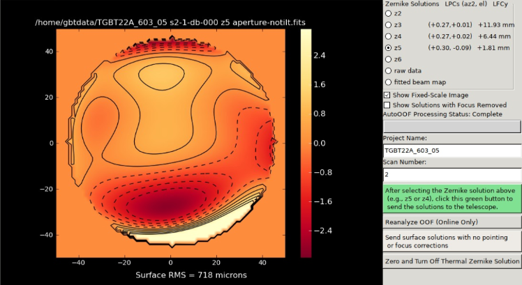

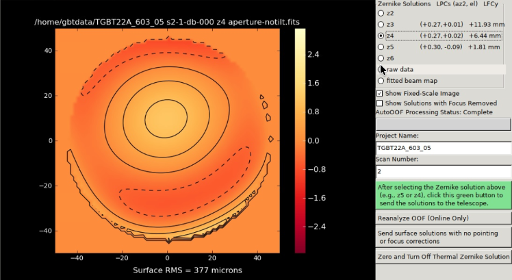

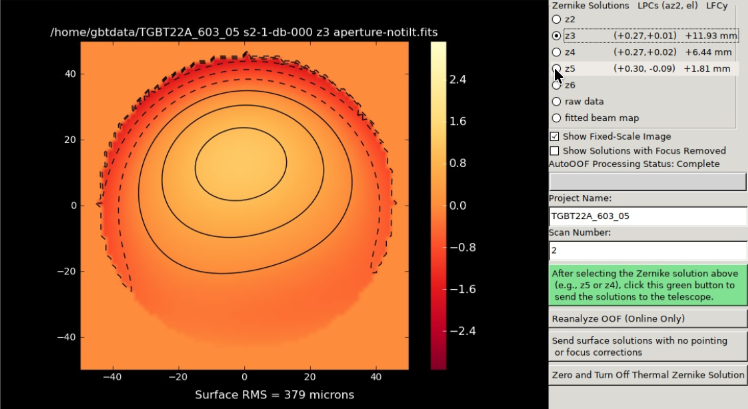

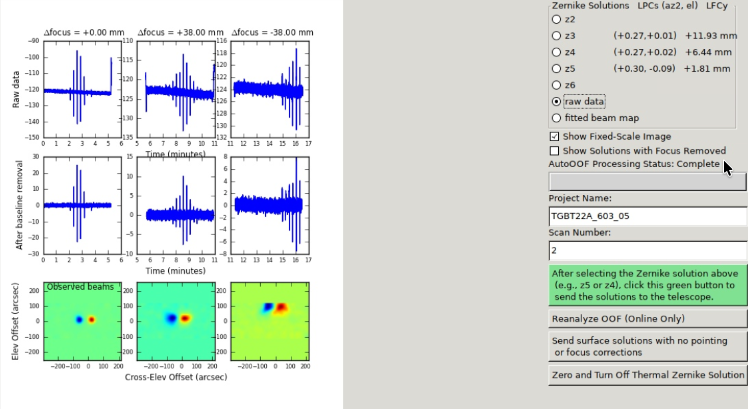

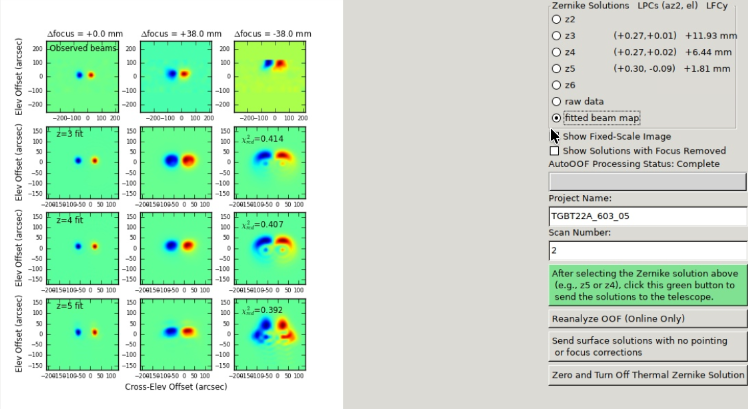

Peak and focus with X-Band
--------------------------

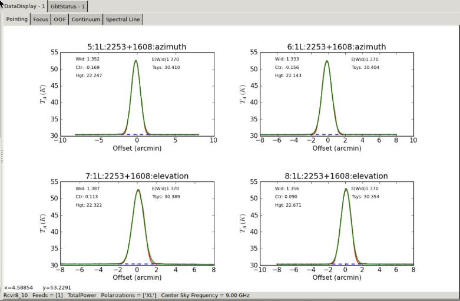

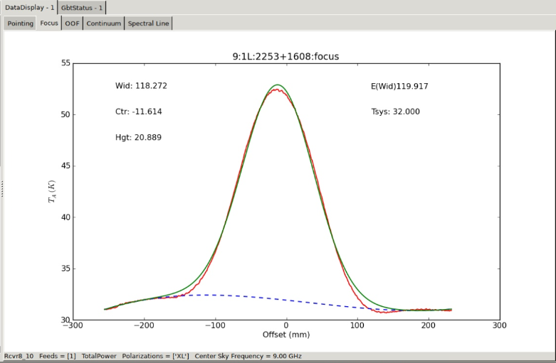

Science observations with Argus
-------------------------------

AstrID (or actually GFM) is not able to handle science Argus observations. For those scans you will always see a message 
similar to this ``"Scan XX (Procedure Type, Procedure Name) not handled by any plugin."``, where, for example, *Procedure Type*
could be ``SIMPLE``, ``MAP``, etc. and *Procedure Name* could be ``TRACK``, ``RALongMap``, etc. 

This is normal and nothing to worry about. To check that the incoming data looks ok, we will be using GBTIDL. 

Quick Data Inspection
---------------------

Vanecal
_______

.. note:: 

   Please note, this step is described here for completeness only, at this stage of the tutorial, you will not be able
   to actually perform these quick checks. 

To monitor your science data, we recommend to - at the bare minimum - check all vanecal observations. A vanecal is a set of 2 scans,
the first called ``VANE Track`` followed by ``SKY Track``, for example scan pair 10 and 11 here. 

To check your vanecal, copy the following scripts to your home directory (``/users/<your-user-name>/gbtidlpro``). If the
``gbtidlpro``  folder doesn't exist, create it. 

- ``vanecal.pro``
- ``getatmos.pro`` 

During your observing run, you would just open ``gbtidl`` in a terminal and then execute the following:

.. code-block:: idl

    online
    vanecal, 10             

To execute the vanecal script, you only need to provide it the vane scan, it'll assume that the sky scan is vane scan +
1.

You would see the following:

.. literalinclude:: material/Argus_tutorial/Argus_vanecal_10.txt
    :language: text
    :linenos:

Science Observations
____________________

If you take a pointed observation with your science data (Track measurement), you can have a quick look at your data
following the :ref:`instructions <tutorials/argus_n2hp_fsw_tutorial:Calibrate a single track scan>` further below in this tutorial.

If you take mapped observations, you will want to coadd all integrations from a single (or multiple) scanlines, once
they have been obtained. This is to boost signal-to-noise and check for line detection. We provide a more detailed description of
how this is done :ref:`at the end of this tutorial <tutorials/argus_n2hp_fsw_tutorial:Alternative way to determine baseline parameters>`.

Data Calibration
================

The observations had been carried out with a very narrow spectral resolution, producing raw data file size of >20 GB. For this tutorial we have spectrally smoothed the raw data to reduce the filesize to 1.2 GB. 

Copy data
---------

The training data for this tutorial is available on our GBO data processing machines

- as a compressed archive file (for easy copy-paste):

  ``/home/dataproducts/training_data/Argus_tutorial_n2hp.tar.gz``

- or as the actual folder:

  ``/home/dataproducts/training_data/Argus_tutorial_n2hp``

For the remainder of this tutorial we assume that you have copied and unpacked the compressed tar file in your scratch
area:

.. code-block:: bash

    cp /home/dataproducts/training_data/Argus_tutorial_n2hp.tar.gz /home/scratch/<your-gbo-computing-username>
    cd /home/scratch/<your-gbo-computing-username>
    tar xf Argus_tutorial_n2hp.tar.gz
    cd Argus_tutorial_n2hp
    ls

This folder should contain the following files:

- raw data folder: ``Argus_DR21_n2hp_smoothed.raw.vegas``
- GBTIDL procedures:
   - ``argus_fsw_coadd.pro``
   - ``argus_fsw.pro``
   - ``argus_mapfsw.pro``
   - ``getatmos.pro``
   - ``vanecal.pro``

Inspect raw data
----------------

As a first step open ``GBTIDL``, load the data and get an overview

.. code-block:: idl

    filein, 'Argus_DR21_n2hp_smoothed.raw.vegas' 
    summary 

You should see the following: 

.. literalinclude:: material/Argus_tutorial/GBTIDL_output_00_overview.txt
    :language: text
    :linenos:

Here you can see that we have the following measurements:

- 3 vanecal (scans 10+11, 35+36, 61+62)
- 3 track scans (scans 12-14)
- 24 RALongMaps (scans 37-60; Seq 1-24)

The first vanecal (scans 10+11) is used to calibrate the pointed (track) measurements. The other two vanecals bracket
the RALongMap observation. Most Argus calibration procedures use only the first vanecal to calibrate the data. However
it is useful to bracket mapping observation to monitor the atmospheric conditions before and after. If for example system
temperatures vary significantly between the pre- and post-map vanecal measurement, one could use various weighting
techniques to account for that. In this tutorial we will only show the standard procedure and leave it to the user to
adjust those scripts. As we will see in the next section, there is only a minimal difference in the present observations
between the pre- and the post-map vanecal.

Check all vanecals
------------------

It is a good habit to check the vanecals during the observations and to note the system temperature ranges of the beams
in an observing log file. Since we couldn't do this in the observing section above, we are now going to show you how to
do this on any Argus dataset. You will need the procedure called ``vanecal.pro``. The most important input this
procedure is taking is the vane scan number. If you have multiple spectral windows, you will also want to specify the 
``ifnum`` parameter. It defaults to 0, meaning the first spectral window. Since we only have a single spectral window in 
this training dataset, we don't need that here.

.. code-block:: IDL
   
    vanecal, 10

You will see the following output. Please note that this shows the output for all three vane+sky scan pairs obtained in
this observation.

.. literalinclude:: material/Argus_tutorial/GBTIDL_output_01_vanecals.txt
    :language: text

The system temperatures recorded for those observations are in the range of (217 - 285 K), (2019 - 288 K), and (225 - 295 K),
respectively. They are increasing, which is due to the source setting, i.e. the elevation is decreasing meaning the
telescope is observing through more atmosphere. Overall the system temperature is rather high for Argus observations at
this frequency. As mentioned above the weather conditions during the Observer Training Workshop were not favorable for
high-frequency observations. This is reflected in the opacity, :math:`\tau` = 0.4, which is high for this frequency.
Typical system temperatures for Argus at this frequency are around 100 - 120 K, but have been observed in the past below
100 K in exceptionally good conditions. 

Calibrate a single track scan
-----------------------------

In the observing run, we have obtained a number of single-pointing track scans. The tracking beam was beam number 10. In GBTIDL this 
corresponds to feed number 9, `fdnum=9` (beam numbers in AstrID start at 1, but IDL is 0-indexed, so `fdnum` starts at 0).

In the sample dataset, we've provided 3 of those pointed track measurements (scans 12-14). 

It is worth noting, that Argus has not internal rotator, so one can only perform pointed observations with a single
beam. All other beams (if configured to collect data), effectively perform drift scans. In these observations, Argus was 
configured to obtain data with all 16 beams. As mentioned before, beam 10 was the tracking beam.

To process each single Track scan, we utilize the procedure `argus_fsw.pro`. This procedure calibrates the spectrum to
the T\ :sub:`A`\ :sup:`*` temperature scale. 

.. todo:: Add link to temperature scale explanation.

.. code-block:: idl

    argus_fsw, 12, 10, fdnum=9

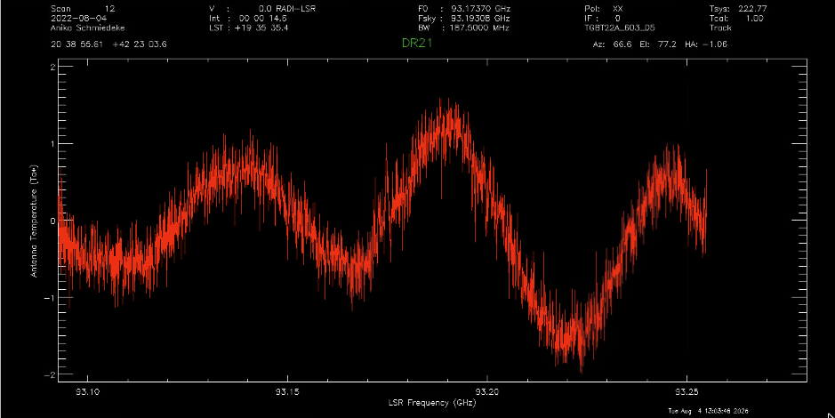

Here you can see a sinusoidal baseline. The spectral line of interest (N :sub:`2`\ H :sup:`+`) is visible at 93.173 GHz.  

.. code-block:: idl

    argus_fsw, 13, 10, fdnum=9

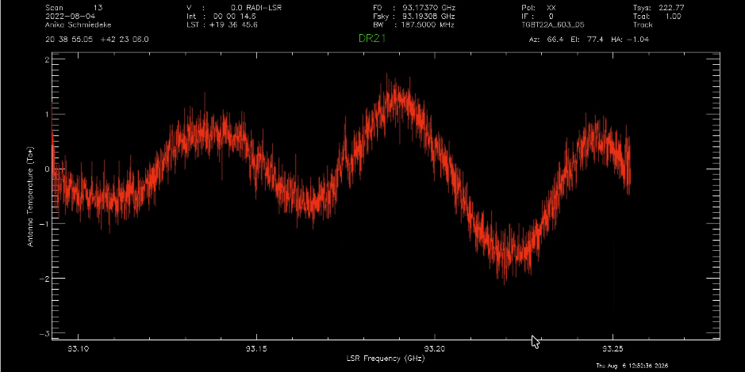

.. code-block:: idl

    argus_fsw, 14, 10, fdnum=9

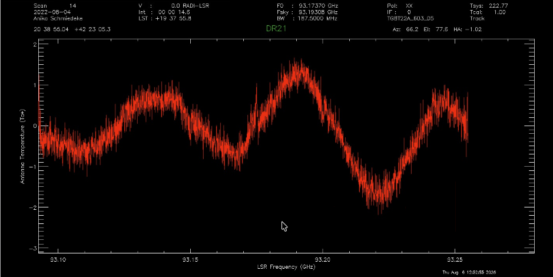

Since we have three single-pointing observations, we can improve the signal-to-noise ratio of the spectrum by averaging
all three track measurements: 

.. code-block:: idl

    sclear
    argus_fsw, 12, 10, fdnum=9
    accum
    argus_fsw, 13, 10, fdnum=9
    accum
    argus_fsw, 14, 10, fdnum=9
    accum
    ave

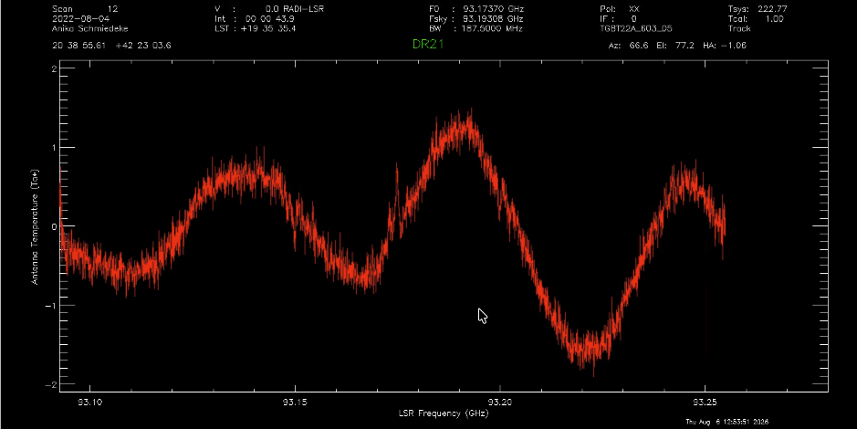

In this averaged spectrum, we can also better identify the characteristic absorption dips for frequency-switched observations, with the intensity of the absorption dips being half the intensity of the emission peak. Please note that you will see multiple emission peaks (and hence absorption dip per grouping), this is due to the hyperfine splitting of the N\ :sub:`2`\ H\ :sup:`+`\ (1-0) transition.

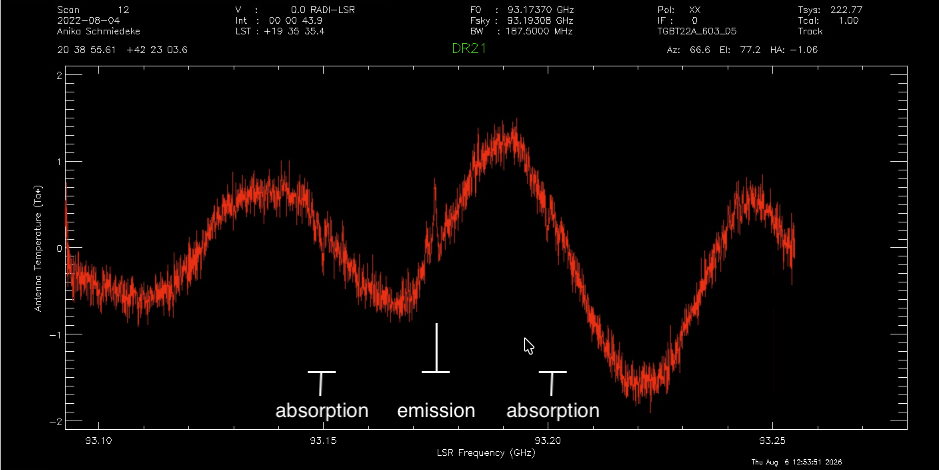

.. _argus_tutorial_baseline_correction:

Now we will look into correcting the baseline. To do this, we need to define the line-free channels. We will use the
:func:`idl:setregion` procedure for that:

.. code-block:: idl

    setregion

A cursor will appear and we can click in our spectrum. In this tutorial we have opted to specify four line-free regions. Use left-click to mark the start and end of each region and then right-click to exit the interactive mode. 

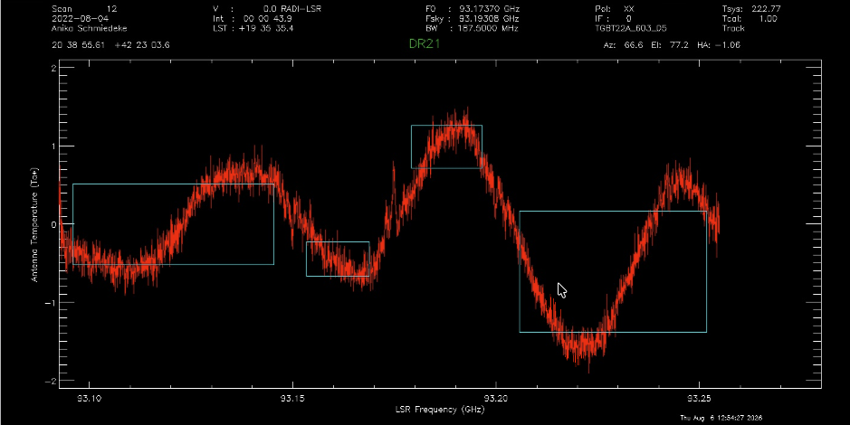

We can get detailed information on those regions using the following commands: 

.. literalinclude:: material/Argus_tutorial/GBTIDL_output_02_regions.txt
    :language: text

With this information, you can set also set your regions as follows:

.. _argus_n2hp_tutorial_baseline_fit:

.. code-block:: idl

    !g.nregion=4
    !g.regions=[622, 1668, 1820, 2218, 2389, 2788, 2936, 4009]
    showregion
 

We will use the bshape command to look at various polynomial baselines.

.. code-block:: idl 

    bshape, nfit=7, color=!green
    nshape, nfit=14, color=!white

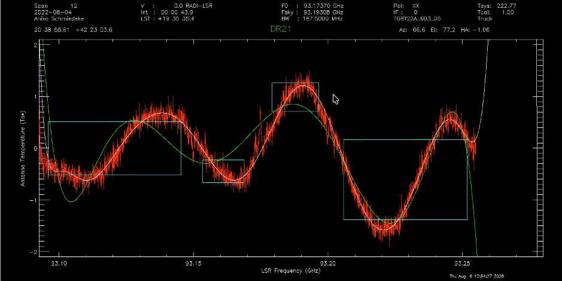

We will apply the 14th order polynomial here. 

.. code-block:: idl

    baseline, nfit=14

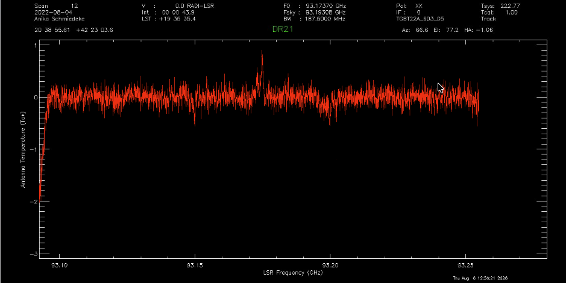

You can zoom in either by clicking the middle mouse button and dragging a rectangle across the spectrum indicating the
desired zoom-in window. You finalize the selection by clicking the middle-mouse button again. You can also use the
GBTIDL command line:

.. code-block:: idl

   sety, -0.75, 1.0

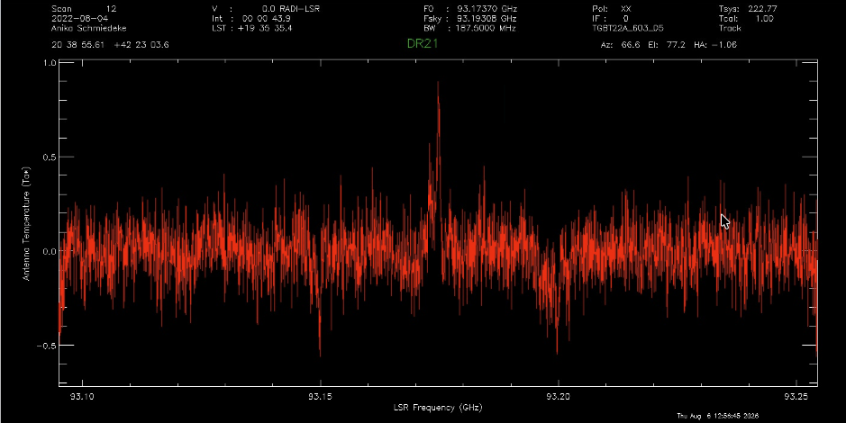

Calibrate mapped observations
-----------------------------

In the observing run, we have obtained a small map consisting of 24 RALongMap scanlines, i.e. we the telescope was
scanning in the Right Ascension direction, while stepping in Declination between scanlines. The tracking beam was to
``beamName = 'C'``, i.e. the center of the array which is in the middle of beams 6, 7, 10, and 11, so effectively
all beams have been performing drift scans. 

To process the map scans (scans 37-60). The map scans were bracketed with vane calibration scans (scans 35+36 and
61+62). We have already verified, that the system temperatures haven't changed significantly between scan pair 35+36 and
61+62, indicating that the atmospheric conditions were stable during those measurements.

To calibrate the map scans, we will utilize the procedure `argus_mapfsw.pro`. This procedure calibrates the spectrum to
the  T\ :sub:`A`\ :sup:`*` temperature scale. 

.. todo:: Add link to temperature scale explanation.

Before we can run the procedure, we need to update the baseline fitting parameters. Here we will utilize the results
from fitting a baseline to the pointed track observations. Open the procedure `argus_mapfsw.pro` using your favorite
editor and find the lines starting with:

.. code-block:: IDL

    !g.nregion =  
    !g.regions = 
    nfit = 

Make sure you enter the parameters we determined in the previous step (:ref:`here <argus_n2hp_tutorial_baseline_fit>`):

.. code-block:: IDL

    !g.nregion = 4 
    !g.regions = [622, 1668, 1820, 2218, 2389, 2788, 2936, 4009]
    nfit = 14

Save and close the procedure. Now open gbtidl again and then run the procedure with the following parameters:

.. code-block:: IDL

    filein, 'Argus_DR21_n2hp_smoothed.raw.vegas'
    .comp argus_mapfsw
    argus_mapfsw, 37, 60, 35, 75

The `argus_mapfsw` procedure takes the following input parameters: 

- first scanline
- last scanline
- vane scan
- number of integrations in a scanline (check ``nInt`` column in the summary output of GBTIDL)

You should see output like the following: 

.. literalinclude:: material/Argus_tutorial/GBTIDL_output_03_mapping.txt
    :language: text

These lines should repeat 15 more times, with increasing fdnum from 1 - 15 (corresponding to beams 2-16).
The procedure will write the calibrated integrations into a single fits file per beam. It will also create 
an index file for each beam. The basename of those files should be `keep_beam_<fdnum>`.

Once GBTIDL has successfully completed the calibration of all integrations in all scanlines for all beams, 
you can exit GBTIDL. We are now going to use the commandline tool ``gbtgridder`` to create a map from the 
calibrated integrations.

In the most simplistic approach just use:

.. code-block:: bash

    gbtgridder *.fits

This will grid all fits files using default input values. You should see the following output:

.. literalinclude:: material/Argus_tutorial/GBTGRIDDER_output_04_gridding.txt
    :language: text

Check the numbers and make sure to confirm with ``Y`` at the prompt. After about 3 minutes or so, gbtgridder 
should have completed (depending on your computing machine). The gbtgridder will create two files: A fits data
cube and a weight cube. The weight cube can be used to stitch together various maps. Here we will focus on the 
data cube. Since we used the default parameters, this file will be called: ``DR21_93174_MHz_cube.fits``.

You can open it in `ds9` (or any other fits file viewer) and after a bit of clicking in the application, you can get a
channel map and averaged spectrum displayed like shown here. In the averaged spectrum, you can still see a baseline
ripple, so in order to use these data for scientific analysis, we would work further on the baseline either by
fine-tuning the baseline parameters used during the calibration, or in a second step using e.g. python-based tools 
after the data cube has been created using gbtgridder. 

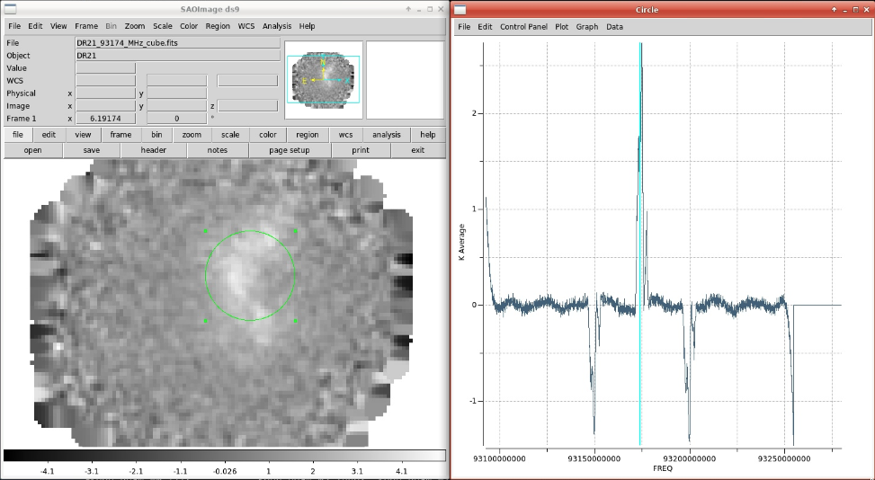

Alternative way to determine baseline parameters
________________________________________________

If you only took mapped observations and no pointed scan, you would still want to be able to  

a. check if your line is being detected
b. determine the baseline fitting parameters

A single integration from a scanline will usually have insufficient signal-to-noise to clearly detect the spectral line. 
In this case, you will want to coadd all integrations from a single (or even multiple scanlines). To do this use the 
GBTIDL procedure ``argus_fsw_coadd.pro``. Assuming you are in GBTIDL and have already loaded the Argus dataset, you will
use the following input parameters:

.. code-block:: IDL

    argus_fsw_coadd, first-scanline, last-scanline, vane-scan

So for example, the following command

.. code-block:: IDL

    argus_fsw_coadd, 37, 39, 35

will calibrate all integrations using the vane+sky pair 35+36 (it is sufficient to specify only the vane scan) and then coadd
all integrations from scanlines 37 to 39. GBTIDL will show the following output:  

.. literalinclude:: material/Argus_tutorial/GBTIDL_output_05_coadd.txt
    :language: text

together with this spectrum: 

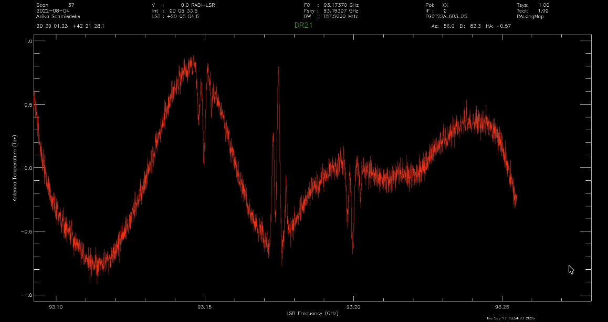

Using that spectrum you can determine the baseline parameters using the instructions given :ref:`here <argus_tutorial_baseline_correction>`. 

