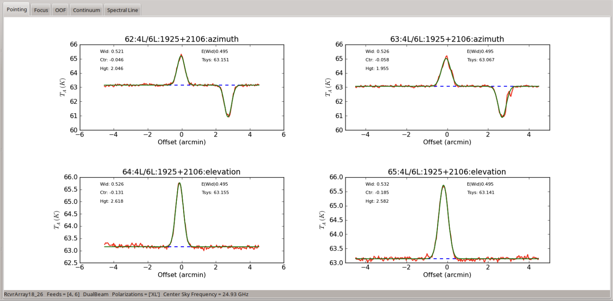
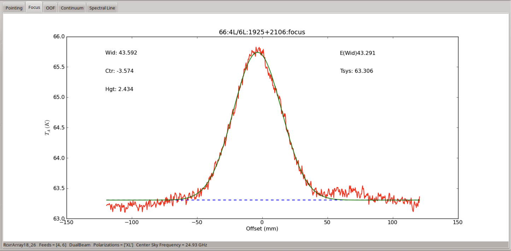
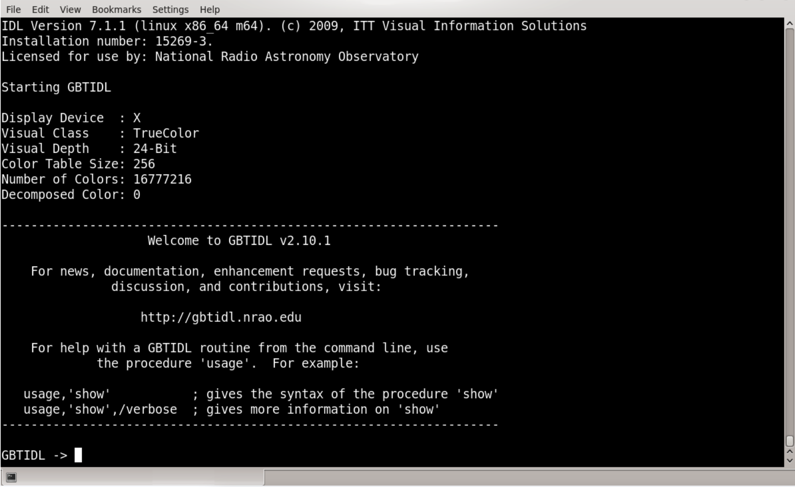
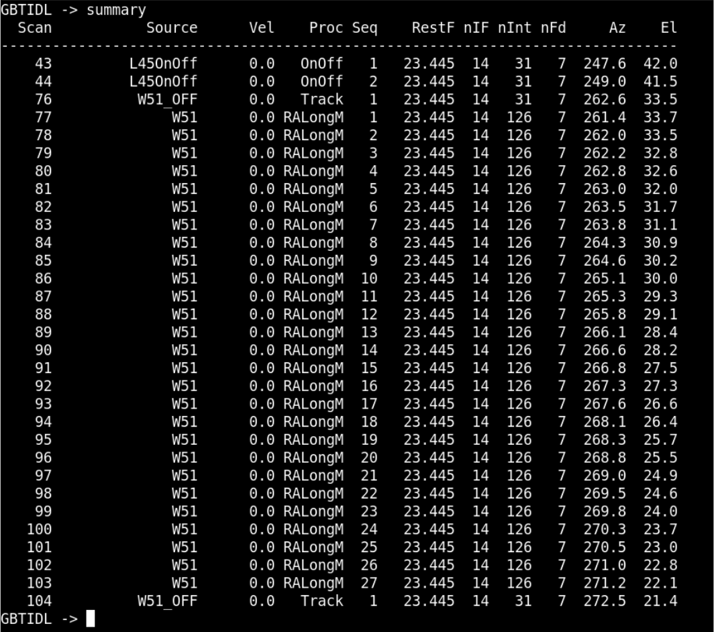
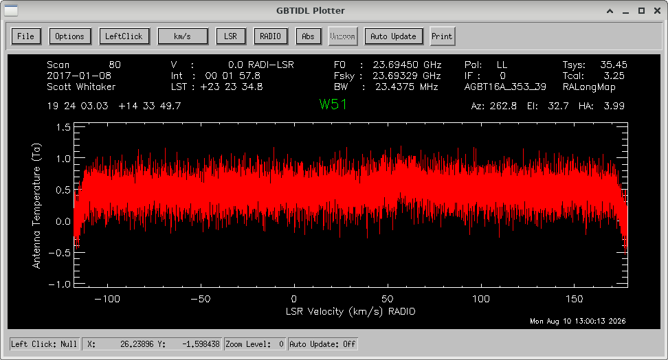
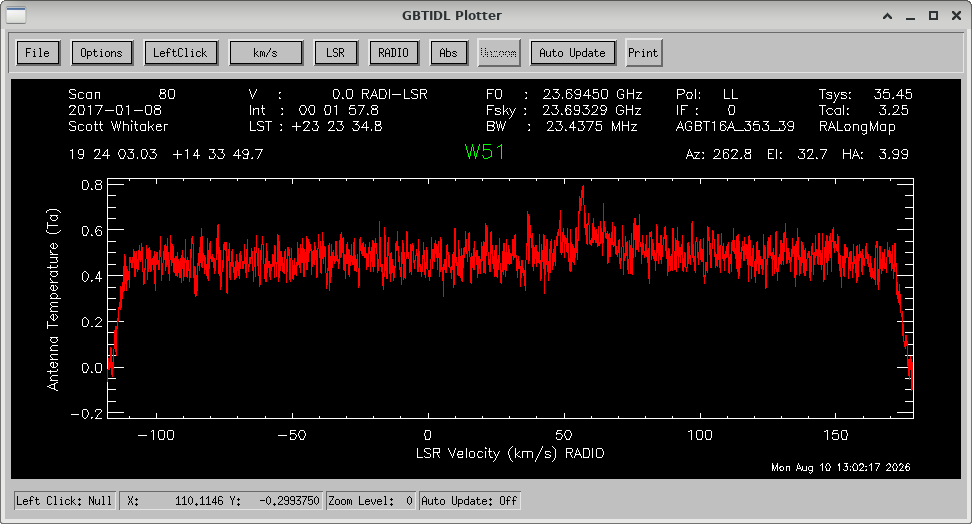
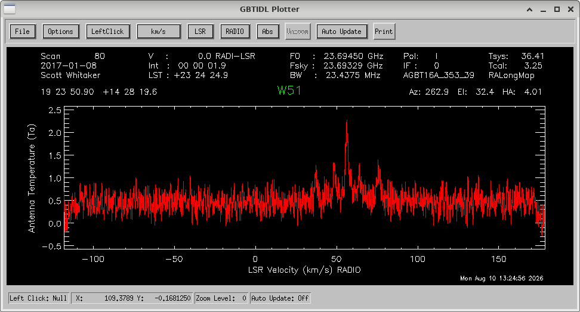
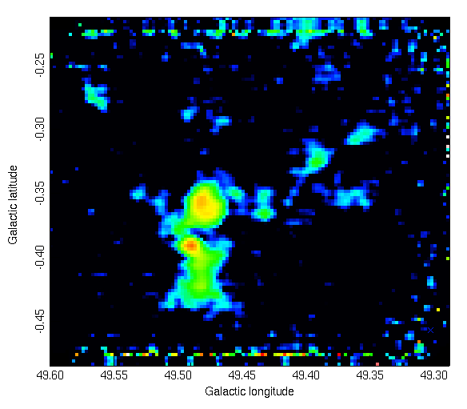

.. _kfpa_nh3_mapping_tutorial:

###############################################
NH\ :sub:`3` Mapping Observations with the KFPA
###############################################

This tutorial walks you through the process of conducting a set of observations using the KFPA on the GBT. We will observe the first two inversion transitions of ammonia (J,K = 1, 1 and 2,2) towards the active star-forming region W51.

This tutorial assumes your scientific proposal has been accepted. It will then walk you through observational setup, observing, and data reduction providing a dataset ready for use in scientific analysis.

.. admonition:: What you should already know
    :class: note

    You need a GBO computing account. You should be relatively familiar with using a
    Linux command line, and starting AstrID. 

    You can find general instructions for using AstrID, as well as starting CLEO, contacting
    the operator, etc. :ref:`here <how-tos/general_guides/gbt_observing:GBT observations 101>`.

.. admonition:: Data

   The data we will be working with in this tutorial is taken from a set of observations of the RAMPS project. RAMPS observed a section of the Galactic Plane (40°>l>10°; b<\|0.4°\|) at frequencies including the ammonia (J,K = 1,1 and 2,2) inversion transition lines. These data are accessible at ``/home/scratch/lmorgan/Observer_Training/QuickGuides/KFPA/Data/RAMPS/RAMPS_W51.raw.vegas``.

1 Starting Out
==============

Congratulations! Your scientific proposal to use the GBT has been accepted. You want to map the ammonia (J,K = 1,1 and 2,2) emission coming from the W51 active star-forming region. Now, your assigned project friend should reach out to you in plenty of time before the next observing semester starts to introduce themselves and offer any assistance that you may need in order to prepare for your observations. If you have not heard from your project friend yet and would like to take the initiative, you can find out who the project friend is either from your disposition notice (emailed out when your project is accepted) or by logging into the Dynamic Scheduling System (DSS) at  dss.gb.nrao.edu. You will first need your NRAO proposal submission tool credentials to login.

2 Scripts and Configuration
===========================

In order to perform observations with the GBT, you will write scripts using Python (currently v2.7). Normally, these scripts are written, saved and executed using the AstrID GUI. The full use and functionality of AstrID is covered elsewhere and will only be addressed here where it is specifically applicable to this particular project.

The first step we will follow in this guide is to establish general observing procedures. Scripts can then be constructed to carry out those procedures.

2.0 Calibration
---------------

Good observing procedure in general is to first perform the necessary calibration scans for whatever set of observations is being undertaken, followed by the scientific observations themselves. When using the KFPA, what constitutes "necessary calibration" is not always straightforward. For calibration with the KFPA, at minimum the observer should point and focus the telescope (multiple times if necessary) and (usually) take a reference spectrum that is known to have emission at the frequency of interest. In this case, W51 is both the source we wish to map, as well as a known source of molecular ammonia emission so that it can be used for calibration purposes. It may be that your main science objective is to search for spectral lines that are not already well established, or that the source you are planning to map is not already known to be a source of emission in any of the lines you plan to observe. In these cases, creating a separate configuration which will tune for a spectral line that has been previously observed and/or choosing a separate source known to be a source of a line that you are able to observe would be a reasonable choice.

2.0.1 Point and Focus Script
____________________________

First we write a script that will point and focus the telescope using the KFPA receiver 
with the command :func:`AutoPeakFocus() <astrid_commands.AutoPeakFocus>`.

.. literalinclude:: material/KFPA_tutorial/kfpa_pointFocus.py
    :language: python
    :linenos:

The individual components of this script are
    * :func:`ResetConfig() <astrid_commands.ResetConfig>`
        This command resets the configuration tool values to their defaults and helps to avoid
        carrying over any settings that the previous GBT observer may have made.

    * ``config = ""``
        This configuration string, labelled ``config`` is a set of parameters with their desired
        values that tell the system how you want to set up your observations. This will be covered
        in more detail shortly. 

    * :func:`Configure(config) <astrid_commands.Configure` 
        This command passes the parameter settings in the configuration string to the system itself
        and sets them. Strictly speaking, it is not necessary to configure the telescope before
        performing an :func:`AutoPeakFocus() <astrid_commands.AutoPeakFocus>`, as this command 
        performs its own configuration. However, it can be useful to do so, to pre-empt potential
        issues, such as the wrong receiver (i.e. the receiver that was being used by the previous
        observer) being selected for observations by mistake.

    * ``W51Source = Location('Galactic', 49.445, -0.35)``
        This defines the string "W51" as a :func:`Location object <astrid_commands.Location>`, 
        which contains the sky coordinates of the source to be observed. This could alternatively 
        be read via a :func:`Catalog() <astrid_commands.Catalog` function, or input in a different 
        coordinate system.

    * :func:`AutoPeakFocus() <astrid_commands.AutoPeakFocus>`
        For this example, note that the first argument passed to 
        :func:`AutoPeakFocus() <astrid_commands.AutoPeakFocus>` would be the actual source you want
        to perform the pointing/focus scans on. If you have a particular known source that you would
        like to use for this purpose, it can be supplied to the command using a catalog source or 
        :func:`Location object <astrid_commands.Location>`, similarly to the ``W51Source`` object.
        For most observers, the actual source used for this purpose is unimportant, so long as the 
        pointing/focus scans are successful and sensible. In this case, we supply ``None`` as the 
        first argument so that :func:`AutoPeakFocus() <astrid_commands.AutoPeakFocus>` will search
        for a source automatically. The second argument passed to :func:`AutoPeakFocus() <astrid_commands.autoPeakFocus>`
        is the location of the center point of the circle that it will use to search for a valid 
        nearby pointing source. The defaults are that AutoPeakFocus will search for a source of
        at least 1.0 Jy within a radius of 10 degrees. If it is unable to find one, it will query
        the user on what they would like to do.

2.0.2 Spectral Line Calibration Observation Script
__________________________________________________

Now that we have a pointing/focus script that will place the GBT itself in a good state for science observations, we similarly want to ensure that the backend system is also operating correctly.

.. literalinclude:: material/KFPA_tutorial/kfpa_lineObs.py
    :language: python
    :linenos:

.. note::

    There is no ResetConfig() command in this script - the only system settings that may have changed since running this for our Peak and focus script were made within that script and so are known to us. 
    
    
The following commands in the script are

* ``config=""``
    As we are now planning to use the configuration as defined by this string, it is worthwhile 
    to step through the relevant settings. The parameters particularly relevant to the observations
    in this guide are described.
           
    * ``receiver = 'RcvrArray18_26'`` 
        Defines the receiver to be used. ``'RcvrArray18_26'`` is the string used to identify
        the KFPA in the GBT system.
    * ``beam = 'All'`` 
        The KFPA comprises seven usable beams, this parameter tells the system which of these
        seven beams we wish to collect data from.
    * ``restfreq = 23694.0, 23722.63``
        The rest frequency or frequencies to be observed. This may be a list or defined as a 
        dictionary. The potential range of inputs for this parameter is very large (and especially
        so for the KFPA) and can be complicated. Please seek assistance from GBT staff for spectral
        setups using the KFPA.

* :func:`Configure(config) <astrid_commands.Configure>`
    Passes the configuration settings to the system. 

* ``W51Peak = Location('Galactic', 49.483, -0.358)``
    This is a slightly different sky position to the one defined as ``W51Source`` in the peak and focus
    script. This ``W51Peak`` position is the brightest point of the source in ammonia emission we will 
    be mapping.

* ``W51Off = Location('Galactic, 49.483, 0.642)``
    This is the position to be used as the reference point for our position-switched observations. For
    spectral line observations where emission is not expected to be particularly widespread, it is 
    common to simply use an offset of 1 degree, though care should be taken to ensure that this is 
    emission-free.

* :func:`Slew() <AstrID_commands.Slew>`
    This command moves the telescope to the commanded position.

* :func:`Balance() <AstrID_commands.Balance>` 
    This command adjusts power settings along the signal pathway to ensure that the system is operating
    within its optimal response regime for the given inputs. Note that we are balancing here while the
    telescope is pointed at our reference position. This is to ensure that most contributions to the 
    system temperature (e.g. the atmospheric contribution, a function of elevation) will be similar to
    our actual observations while, when actually observing our source, we are adding power to the balanced 
    level. Alternatively, we might balance while pointed at the source itself. However, in this case, we
    expect the source to be quite bright and so contribute significantly to the overall system temperature.
    By balancing "on-source", we run the risk of underpowering the system when moving to our reference 
    position. Severe differences in these levels will have impacts on data quality and should be avoided.
 
* :func:`OnOff() <AstrID_commands.OnOff>`
    This command performs the position-switched observation itself on the provided sky position, using the
    defined offset as the reference position. Note that we are explicitly using parameter names in this 
    command (e.g. ``location=W51Peak``) while this is not strictly required. Users familiar with writing
    AstrID scripts may prefer to omit these labels. However, we are including them in this guide for clarity.

2.1 Mapping
-----------

Assuming that the pointing/focus and spectral line reference observations proceed without issue, we will then want to proceed to our actual mapping observation. There are many different possible approaches to mapping with the GBT, each with different benefits and drawbacks. The approach followed here is to perform a long scan on a reference position, followed by the map itself, followed by another long scan on the same reference position. When deciding what procedure you should follow for your own projects, you should determine whether this would be a good scheme for your scientific goals. In this case, each integration of the map is essentially treated as a single position-switched observation. The benefit of this is that each integration has a large factor of "off" time compared to the "on" time and so signal-to-noise ratios will be improved. A drawback here is that, if the map takes too long to observe, then atmospheric conditions (which are often particularly significant in K-Band observations) may change significantly over the time it takes to complete the map and the "on" and "off" phases of parts of the map may not be well-matched in terms of their non-source system temperature contributions. If superior flux-calibration accuracy is important for your experiment, then it may be better for you to perform a :func:`RALongMapWithReference() <astrid_commands.RALongMapWithReference>`, which performs an "off" observation every N rows or for you to use frequency-switching when mapping. GBO staff will be happy to advise you on these issues.

The following script shows the procedure to perform the actual science observations of this project. 

.. literalinclude:: material/KFPA_tutorial/kfpa_mapping.py
    :language: python
    :linenos:

Most of the features here have already been described, with the following exceptions and additions:

* ``config=""``
    A small change has been made to the ``swper`` and ``tint`` parameters in the configuration string.
    Previously, these were both set to 1.0 s. For mapping, these need to be set so that they are 
    consistent with the scanning speed, such that the map will be fully sampled. The full determination
    of these parameters is something that would be done at the time of proposal writing but, by using 
    the `GBT Mapping Calculator <https://www.gb.nrao.edu/~rmaddale/GBT/GBTMappingCalculator.html>`__, 
    a basic mapping command is easily constructed. By supplying the desired map sizes, along with the
    integration time (per beam), the mapping calculator will provide an example AstrID command which 
    will produce a map with those parameters. In this case, an integration time of 0.834 s is needed 
    in order to prevent "beam-smearing" as the telescope moves across the sky. In this example, we are
    using a ``swper`` which is a factor of two smaller than the integration time, effectively allowing 
    us redundancy in the collection of our data - collecting two samples of data per integration.

* ``W51Source = Location('Galactic', 49.445, -0.35)``
    Note that we have returned to our original source coodinates from the pointing/focus script, this 
    location is the center position of our map, rather than the brightest point as we used in the 
    spectral line reference script. 

* :func:`Track <AstrID_commands.Track>` 
    A :func:`Track <AstrID_commands.Track>` command follows the commanded position for the defined
    length of time, using the defined beam as the pointing center. This serves as our reference "off" 
    position, taken before the map, with an identical :func:`Track <AstrID_commands.Track>` scan 
    performed following the map. Care should be taken to **NOT** balance between the reference and 
    source scans.

* :func:`RALongMap <AstrID_commands.RALongMap>` -- The map we are taking has 59 rows which each take
  120 s, totalling nearly two hours. This is at the upper end of how long one should observe at K-Band
  using the GBT without performing a pointing/focus observation. During stable conditions at night, 
  this length of time may be acceptable. For daytime observations, observations which span dawn or 
  dusk or less than ideal weather conditions, the map should be divided into blocks of no more than 
  one hour, with pointing/focus scans performed in between. This is accomplished by, for example,
  taking the ``start=1, stop=59`` inputs to our single mapping command and creating two new maps, 
  the first having ``start=1, stop=29`` and the second having ``start=30, stop=59``.

3 Observing
===========

To learn how to execute your observing scripts, please follow the :ref:`how-tos/general_guides/gbt_observing:GBT observations 101`
guide. Here we show what would be expected to happen when carrying out the scripts described above.

3.0 Point and Focus
-------------------

Once this script is submitted, AstrID will reset all configuration parameters to their default values,
configure for the provided configuration string and then search for an appropriate source near the target
position. Once this is found, AstrID will perform four pointing scans, followed by a focus scan (assuming
that there are no errors during this process). In the AstrID GUI the peak scans should resemble this

.. note::

    The KFPA is a multi-beam receiver and, by default, uses data from two beams simultaneously to perform
    pointing scans. The two beams used for this are mounted on the telescope in a cross-elevation orientation,
    meaning that when azimuthal pointing scans are performed and the "reference" scan is removed from the 
    "source" scan, a negative "dip" will be seen in the power output. This leads to the distinctive appearance
    of azimuth pointing scans when using multi-beam receivers on the GBT.

The focus scan should look like this

Assuming that the pointing and focus observations complete satisfactorily, the derived corrections will be 
applied to the telescope and you may proceed. If there is a failure along the way, often the best course of
action is to resubmit the script and try again. If there is a reason not to do this (e.g. there has been a
more significant software or hardware failure) then the operator will advise you. If you are unable to 
complete the pointing/focus scans after two or three attempts then it is likely that there is a problem with
your script, the GBT itself or another system. 

Some issues which have been encountered in the past include   

* **Pointing source too weak** 
    AstrID will try to find a pointing source which is bright enough to provide a good pointing solution.
    However, in some cases, the source AstrID finds is simply not bright enough. If you suspect that this
    is the case, you can provide ``flux = 2.0`` as an argument to the AutoPeakFocus() command to force 
    AstrID to find a pointing source that is at least 2 Jy in flux. At K-Band, this should be more than
    adequate to complete a good set of pointing/focus scans.
* **Trying to observe a source below the horizon** 
    While it should not be possible to be scheduled at a time when your source is not visible in the sky,
    it has occasionally happened and can produce warnings/errors that are not completely obvious that this
    is what has happened. Please check the LST you are observing at against your source coordinates and make
    sure that you expect to be able to see your source.

If you do not see a reason for the failure of your pointing/focus observations, check with the operator and 
ask if they can see any obvious failures. While the operators are not responsible for guidance on your 
observations, they are familiar with the various telescope systems and will be able to identify any serious
problems with the hardware. In the case that the operator can also not identify an obvious problem, it is
time to call the on-call support scientist. The operator will know who this is at any given time and will be 
able to reach them. The on-call scientist will be able to advise you on how to proceed.

3.1 Spectral Line Calibration Observation
-----------------------------------------

After submitting this script, AstrID will set the commanded configuration parameters, slew to the commanded 
off position and balance the system there. Observers should watch the AstrID output carefully here. The power
levels of VEGAS are considered to be in range if they are within 2 dB of -20 dB (see :ref:`references/backends/vegas:Monitoring VEGAS observations`
is covered under "VEGAS Monitoring Tools" in the Observers Guide). 
Outside of these values, the :func:`Balance() <AstrID_commands.Balance>` command may fail. There are also 
other balancing failures that AstrID will report. However, AstrID will not necessarily stop a scan because 
balancing has failed. This is by design as there are instruments which need to operate outside of the 
standard balanced power ranges. It is worth a reminder here that data quality is primarily the 
responsibility of the observer and you should be careful to monitor any and all error messages that are
passed through the AstrID window in the "Log" window. In the case that balancing errors are seen, the
:func:`Balance() <AstrID_commands.Balance>` command should be re-issued. It is rare that a 
:func:`Balance() <AstrID_commands.Balance>` command fails multiple times in a row unless there is an issue
with the configuration. If you fail to achieve reasonable balanced power levels after two or three attempts,
you should contact the operator and ask for advice.

Assuming that the :func:`Balance() <AstrID_commands.Balance>` command has proceeded without issue, the
spectral line script will continue to perform an :func:`OnOff() <astrid_commands.OnOff>` scan pair on the 
commanded position. This scan can be checked for data quality through the `online` capability of GBTIDL.

To start the GBTIDL software, go to a terminal window on a Green Bank Linux Machine (``titania`` or ``ariel``
**ONLY** if you are currently observing, `another machine <http://greenbankobservatory.org/portal/gbt/processing>`__,
if you are not observing), and type

.. code-block:: bash

    gbtidl

How you can access your data depends on if you are currently observing or not.

.. tab-set:: 

    .. tab-item:: Currently observing (online)

        .. code-block:: idl

            online

    .. tab-item:: Not currently observing (offline)

        .. code-block:: idl

            offline, 'AGBT24A_000_01'

Once you have successfully connected to your dataset, you can look at some basic metadata via

.. code-block:: idl

    summary

This will show you a collection of basic information about the scans you have taken.

.. note:: 

   There are several things to note about this summary of information. 
   
   1. This summary does not contain peak and focus scans. This is because the data taken by each 
      backend are written to a different file and here GBTIDL is reading only the VEGAS file. 
   2. You may notice that the source scan numbers do not match what might be expected. If our 
      observations had been run as described, the peak and focus scans would account for scan 
      numbers 1-5, with the OnOff spectral line calibration scans beginning with scan number 6. 
      In fact, the example dataset being used here was originally part of a large survey strategy
      and so there are differences in this aspect of the observations. This also accounts for the
      fact that our OnOff spectral line calibration scans have actually been performed on the 
      source ‘L45OnOff’.

We can now examine the data taken in our spectral line reference scan using GBTIDL commands.

.. code-block:: idl

    getps, 43

This will return the reduced spectrum for the position-switched scan pair of scans 43 and 44. 

.. note:: 

    By default, :code:`getps` will show you the data for :code:`fdnum=0` (i.e. beam 1), :code:`ifnum=0` (i.e. the first input rest frequency) and :code:`plnum=0` (i.e. the left-hand circularly polarized channel). 
    
    
.. todo:: Show the resulting spectrum. 
    
.. note:: 

    In order to achieve a high signal-to-noise ratio for these data both polarizations have been averaged and the spectrum has been smoothed by 12 channels).

.. todo:: Add all commands required to achieve this.

The ammonia spectrum is clearly visible, which gives us confidence that our configuration, telescope pointing and power levels are all within reasonable limits. A final further assurance of the data quality of our observations can be found by noting the system temperature, given in the top right corner of the GBTIDL data plotter window. A good range for the system temperature of the KFPA is ~30 - 45 K. Here we see that we have a system temperature of 35.0 K. This implies that everything is running smoothly and we have good observing conditions.

3.2 Mapping
-----------

After submitting the mapping script, AstrID will set the commanded configuration, slew to the commanded ‘off’ position and balance the system. Following a successful balance, the off position will be observed via the :func:`Track <AstrID_commands.Track>` command for 30 s. Then the :func:`RALongMap <AstrID_commands.RALongMap>` procedure will be followed until completion, at which point another 30 s track scan on the off position will be observed.
It is not always obvious how best to monitor data quality while mapping. Assuming that the ‘online’ mode of GBTIDL is being used, mapping scans will become accessible shortly after each scan row is completed, throughout the observing session. There is no standard capability provided for users to produce ‘quick look’ maps during the observing process. In order to determine the health of ongoing observations, users should continue to monitor the VEGAS power levels, as well as the system temperatures reported in CLEO and GBTIDL.

It is, of course, possible to examine the spectral data in near ‘real-time’ as data are collected. Running the command

.. code-block:: idl

    getsigref, 78, 77

This will return a spectrum which has been processed with the first row of our map taken as the ‘on’ portion of a position-switched observation, using our actual ‘off’ for the reference portion. This will allow us to maintain a general overview of the data being collected (monitoring system temperature, etc). However, we are unlikely to see spectral line emission in most circumstances using this command. This is because the entire row of our map is being averaged for the ‘on’ position, which will result in low signal-to-noise, even if significant spectral line emission is present at some positions within that row. It is also possible to reduce spectra for individual integrations within a scan row. However, it is not necessarily straightforward to determine which integrations are likely to contain emission, even if the relevant sky coordinates are known.

4 Data Reduction (Basic)
========================

**The following section is currently under construction. Users are welcome to read, but please keep in mind that formatting and/or information will be changed imminently. Thank you!**

This section is intended to outline the process of reducing a set of observations with the GBT, focusing on using the K-Band Focal Plane Array (KFPA) to observe transitions of the ammonia molecule in an active star-forming region designated as W51. The relevant dataset has been taken from the RAMPS survey (Hogge, et al. 2018). This section will mainly be concerned with a straightforward reduction of the data in a standard manner. Where it is possible to improve data quality by utilizing special techniques, these will be covered in supplementary material. Aspect of the observations which are more general, such as performing pointing and focus scans, will only be addressed insofar as the relate directly to the receiver and observing constraints in question.

It is expected that the user is familiar with the previous content of the KFPA Observing Guide. This sets out the process of preparing and conducting a single session of mapping observations. Specifically, the dataset used in that example is the same as the one used here.

4.0 Data Setup
--------------

The data used for example purposes comes from the RAMPS survey. Specifically, a map which covers the region 49.29° -- 49.59°, -0.23° -- -0.47° in Galactic longitude and latitude. The strategy of the RAMPS survey was the produce tiles of many small regions, which were later stiched together.

In the case presented here, we are interested in a region centered at coordinates of 49.445, -0.35. This was observed as part of RAMPS with the project ID of AGBT16A_353, in session 39. Retrieving the data would normally involve the process of using the GBT Help Desk; however, for the purpose of following this guide, an sdfits file has been created for this exercise.

This example assumes the user will be using GBTIDL for data reduction which can only be used on the GBO network. Thus you will need to have a GBO computing account and connect remotely.

4.0.1 Setting the Work Directory
________________________________

Once connected to the GBO network, navigate to the directory that will house all related files to this example.

Use ``cd`` to navigate to your working directory:

.. code-block:: bash

   cd /path/to/your/working_directory

All commands in this example assumes that you are operating out of your designated working directory. If you must revisit this example, ensure that you return to the same working directory before resuming work.

4.0.2 Accessing the Data
________________________

The next step is to copy the target data and place it in your working directory. There are multiple methods to complete this task. For the purposes of this example, the intended target file can be found at.

.. code-block:: bash

   cd /home/dataproducts/training_data/<project_file>

.. note::

   'RAMPS_W51' is a select data set of 'AGBT16A_353_39'. 

.. todo::

   Insert data copy/transfer methods.

Additionally, the Astrid log of the observations can be retrieved, if desired, via:

.. code-block:: bash
   
   getastridlog AGBT16A_353_39

From this log and the information given in the KFPA Observing Guide, we find the configuration statements used for these observations, as well as the relevant scan numbers. As in the KFPA Observing Guide, we can view the summary of the dataset by reading in the data with GBTIDL.

Start up GBTIDL at the command line, read in the data, and check the file contents via:

.. code-block:: idl

   gbtidl                       # starts up gbtidl
   filein, 'AGBT16A_353_39'     # loads in the dataset
   summary                      # lists the basic metadata

The summary output should look like:

.. todo::
   
   Insert summary output image.

We can see that scans 43 and 44 are a position-switched scan pair of a calibration source. Scans 76 and 104 are reference scans of the off position. Scans 77 -- 103 are a sequence of mapping scans.

A straightforward reduction of a single map 'stripe' can be achieved via:

.. code-block:: idl

   getsigref, 80, 76

Note that this defaults to the first 'ifnum' of the scan, the first beam, and the first polarization. The first rest frequency, in our case, is the rest frequency of the ammonia (1, 1) transition at 23.6945 GHz. Furthermore, it is using the entire scan as the 'On' in a position-switched reduction. This means that a whole strip of the map is contributing to the resulting spectrum.

This will result in a scan that looks like:

4.1 Polarizations and Smoothing
-----------------------------------------

4.1.1 Smoothing a Single Polarization
_____________________________________

Note that the goal for the velocity resolution of the RAMPS survey is 0.2 km/s per channel. Having loaded out spectrum via the 'getsigref' command, we can now access the data structure !g, which contains information we might normally expect to find in a FITS file header. The !g idl structure itself is a general container and the !g.s[0] structure relateds directly to the spectral data.

Printing the native resolution of the observed data can be done via:

.. code-block:: idl

   print, !g.s[0].frequency_resolution

This shows that the native resolution of the observed data us 1430.5115 Hz. At 23.694 GHz, this is the equivalent to a velocity difference of 0.0181 km/s and we must smooth to the requisite resolution of 0.2 km/s.

We can apply a smoothing kernel over 11 channels via:

.. code-block:: idl

   gsmooth, 11

This results in a spectrum that looks like:

An indication of some emission may be seen at around velocity of 58 km/s. Remember that this spectrum represents a whole 0.26° stripe ans so any localized areas of emission will be 'washed out' by the rest of the stripe.

4.2.1 Smoothing the Averaged Polarizations
__________________________________________

In order to find the spectrum of a single position in our map, we want to reduce the data for a single integration via the use of the parameter 'intnum'. In order to retrieve all of the information for that position, we would want to average the two observed polarizations, as well as the data from each beam.

Averging the polarizations can be achieved via:

.. code-block:: idl

   sclear                                               # ensures that the memory buffer is cleared
   getsigref, 80, 76, intnum=50, plnum=0, fdnum=0       # reduces the first polarization
   accum                                                # loads the spectrum into the memory buffer
   getsigref, 80, 76, intnum=5-, plnum=1, fdnum=0       # reduces the second polarization
   accum                                                # loads the spectrum into the memory buffer
   ave                                                  # averages the two spectra together
   gsmooth, 11                                          # applies smoothing kernel over 11 channels

This results in a spectrum that looks like:

Emission can clearly be seen centered at ~57 km/s.

It should be noted that averaging data from multiple beams at this point is not beneficial. For a given scan/integration, the beams are at different positions on the sky; therefor, averaging their data together would not be representative of a single sky position. Because of this, it is sensible to reduce the data for each beam individually and then combine them via an overall gridding procedure.

With this in mind, it should also be noted that the approach here is to reduce the map integration-by-integration, producing files which can then be fed into the gbtgridder routine, which will produce the final cube. As such, some decisions need to be made at this point, such as whether the individual polarizations should be averaged at the beginning, or output separately so that they can be averaged by the gridder. For the purposes of illustration, we keep the polarizations separate here. This is generally good practice as issues which may affect data quality (e.g. RFI or instrumentation failure) are often associated with a single polarization. If any such issues arise, having the data separated into different polarizations can facilitate more granular inspection and allow for flagging of poor data.

4.2 Temperature Scaling
-----------------------

A remaining factor to account for is the temperature scale we wish our spectra to be calibrated on. By default, GTBIDL present spectra on the antenna temperature (Ta) scale. In order to convert this scaling to flux density (Jy) or corrected antenna temperature (Ta*), it is necessary to account for the sky opacity. The approach to determining this is outlined in the Sky Opacity Guide. For the example presented here, we find a sky opacity tau value of 0.03.

.. todo::

   Insert Sky Opacity Guide link.

We can now scale to the corrected antenna temperature (Ta*) scale via:

.. code-block:: idl

   getsigref, 80, 76, units='Ta*', tau=0.03

.. note::

   Care must be taken here to include a tau value. If the following command:

   .. code-block:: idl

      getsigref, 29, 8, units='Ta*'

   is run without specifying tau, a default 'representative' value is used (0.032 in this case). This could potentially result in poorly calibrated data.

Note the scaling to a main beam temperature scale from the corrected antenna temperature requires only a simple scalar division by the beam efficiency factor. For KFPA observations at 23.7 GHz, this is eta_mb ~0.89 and can be measured from calibration observations or estimated from information given in the GBT Proposers Guide.

.. note::

   Insert GBT Proposers Guide link

4.3 Baseline Removal
--------------------

One thing yet to be done is removing the baseline level. As we do not (necessarily) know in advance what the expected velocity range of any emission in the map might be, it makes sense to initially remove a low factor polynomial over the entire spectral range. By using a low factor polynomial (e.g. 2), we avoid fitting to any potential emission. Although, we should avoid including the band edges where it can be seen that power tapers off. This might have unwanted effects on the baseline fitting.

An initial estimate of the region can be fitted can be obtained via:

.. code-block:: idl

   setregion

The user can interactively click on the spectrum edges and set the region to be fitted.

Once this is done, the relevant channel numbers can be retrieved via:

.. code-block:: idl

   print, !g.regions[0:1]       # this assumes that only a single region is set

The channel numbers needed for this example are 589 and 15854.

Now the region is defined, the polynomial factor can be applied, and the fitted baseline inspected via:

.. code-block:: idl

   nregion, [589, 15854]        # procedurally applies the baseline fitting
   nfit, 2                      # sets the baseline polynomial factor of 2
   bshape                       # allows user to inspect fitted baseline shape before removal

This results in plotted features like:

The actual removal of the baseline is achieved via:

.. code-block:: idl

   baseline

.. todo::

   Insert baseline-removed spectrum image.

Note again that we are not attempting to remove any 'wiggly' baseline shape at this step, merely calibrating the spectra to the same overall level by removing any broad excess/deficit power level. For most projects which do not require particularly high calibration precision, this will likely be adequate for a final science product. If more precision is necessary, this should be an iterative step in which emission is identified and velocity ranges set more carefully so that higher-order polynomial baseline shapes can be fitted and removed. This should be done individually for each beam and polarization. A total of 14 individual instances in the case of KFPA, when using all beams and dual polarizations (as in this example).

4.4 Preparing Files for GBTGridder
----------------------------------

At this point, we have applied scaling to the Ta* scale and found acceptable ranges and polynomial order for the baseline fit. Now we are ready to reduce out data integration-by-integration and output them into files which can then be fed into gbtgridder.

Outputting the files is achieved by:

.. code-block:: idl

   fileout, 'W51_Map_Beam00_plnum0_infum0.fits',/new    # opens new file for writing; '/new' is a flag to overwrite existing files of the same name
   keep                                                 # writes spectral data container contents to the file

A complete initial data reduction of an individual feed/polarization/frequency, with the production of a file containing the reduced data can be done in a single script.

That can be achieved by a script like:

.. code-block:: idl

   first_scan=77
   last_scan=103
   off_scan=76
   n_ints=126         # as seen in the summary info prior
   fileout, 'W51_Map_Beam00_plnum0_ifnum).fits',/new
   for scan = first_scan, last_scan, do begin
      for int = 0, n_ints-1 do begin
         getsigref, scan, off_scan, intnum=int, plnum=0, ifnum=0, fdnum=0, units='Ta*', tau=0.03
         nregion, [589, 15854]
         nfit, 2
         baseline
         gsmooth, 11
         keep
      endfor
   endfor

This simple procedure may then be run for each required feed, polarization, and rest frequency. It is important that intended input files contain only the desired parameters, as gbtgridder does not have the capability to distinguish frequency or polarization in its input files. If scans of multiple frequencies were included, for example, gbtgridder would blindly grid all values, blending together emission from those frequencies. By outputting individual files for each feed/polarization/frequency, inputs to gbtgridder can be more carefully controlled.

4.5 GBTGridder
--------------

A basic description of the gbtgridder usage syntax, with input arguments, can be found on any GBO computer via:

.. code-block:: idl

   gbtgridder -h

For our case here, we are going to run gbtdridder with the following:

.. code-block:: idl

   gbtgridder -k gaussbessel --clobber --mapcenter 49.445 -0.35 --size 125 109 -c 1577:9866 --pixelwidth 9 --p TAN -o W51_IFNUM0 W51_Map_Beam0?_plnum?_ifnum0.fits --noweight --autoConfirm

Now let's break down what this does:

* **gbtgridder**
    Starts up gbtgridder.

* **-k gausebessel**
    Specifies the gridding kernel used. A Gauss/Bessel function most accurately represents the GBT beam and is likely the most appropriate choice for fully-sampled data.

* **--clobber**
    Tells gbtgridder to overwrite any output files which may already exist.

* **--mapcenter 49.445 -0.35**
    Defines the central coordinates of the map. In most cases, gbtgridder will find and set these by default. However, in some cases (e.g. if a map covers a Galactic longitude of 180°), gbtgridder may struggle to recover reasonable values. It can be slightly less computationally intensive to define the coordinates, especially if gbtgridder is going to be run multiple times.

* **--size 125 109**
    Defines the x/y sizes of the output cube. Again, gbtgridder will usually process and set these values by default, but explicitly setting them can save calculation time and safegaurd against unconstrained parameters.

* **-c 1577:9866**
    Sets the channel range that will be gridded into the output cube. Note that this range will be relevant to the data being input in gbtgridder. It is important here to note if the '/decimate' flag was passed to the 'gsmooth' command when the data was smoothed. If so, these channel numbers will be different by an equivalent factor from the raw data.

* **--pixelwidth 9**
    Defines the width of a pizel on the sky in arcseconds. A value roughly equivalent to 1/3 of the observed beamwidth is typical.

* **-p TAN**
    The sky projection used for the output files.

* **-o W51_IFNUM0**
    The prefix used for output files.

* **W51_Map_Beam0?_plnum?_ifnum0.fits**
    The input files to gbtgridder, given without a parameter flag. The '?' serves as a wildcard (similar to '*' but for a single character). GBTGridder will attempt to grid all data put into it; therefor, it is very important only intended data is covered by the file string.

* **--noweight**
    Prevents gbtgridder from creating a file containing the weights used when gridding.

* **--autoConfirm**
    Allows gbtgridder to proceed with the actual gridding without waiting for the user to confirm the input parameters once the input files are read.

Having run this command... congratulations! You now have a fully reduced data cube.

An integrated (moment 0) map of this cube is shown below:

This concludes a basic data reduction procedure for the KFPA receiver. A more complex guide will follow for advanced users.
