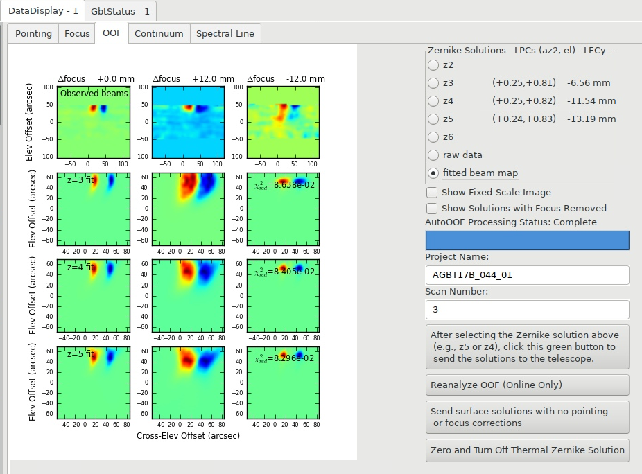

.. _OOF_tutorial:

############
OOF Examples
############

.. admonition:: Goal

    This tutorial will run you through many different OOF results so that you can get a feel for when an OOF solution is (a) good and you can apply it and (b) bad and should not be applied. 

General conditions that produce bad OOFs
========================================

Keyhole
-------
OOF done with Argus in the keyhole at >85° which resulted in an OOF "RMS"=438 :math:`\mu\mathrm{m}` with a large implied focus and elevation (el) pointing offset. 

.. tab-set:: 

    .. tab-item:: z5

        .. image:: material/OOF_tutorial/general_bad/AGBT17B_044_01_s3_bad_keyhole_z5_fixedScale.png

    .. tab-item:: z4

        .. image:: material/OOF_tutorial/general_bad/AGBT17B_044_01_s3_bad_keyhole_z4_fixedScale.png

    .. tab-item:: z3

        .. image:: material/OOF_tutorial/general_bad/AGBT17B_044_01_s3_bad_keyhole_z3_fixedScale.png

Notice that they all have sharp features and the higher orders have RMS :math:`\gtrsim` 400 :math:`\mu\mathrm{m}` and large implied focus and elevation pointing offsets. 

Fitted beam map:

Notice that observed beams are not circular; this is likely due to the beam jittering around due to movement of telescope. Notice that the beam is elongated but this is not necessarily due to being in the keyhole.

.. note::

    Note that the source is at the very top of the fitted beam map and a bit is cut off. This indicates that the pointing was off. This often happens when you observe at high elevations so being in the keyhole is likely the cause in this case.

High Winds
----------
OOF done with Argus in windy conditions.

.. tab-set:: 

    .. tab-item:: z5

        .. image:: material/OOF_tutorial/general_bad/AGBT19A_326_07_s20_z5_fixedScale.png

    .. tab-item:: z4

        .. image:: material/OOF_tutorial/general_bad/AGBT19A_326_07_s20_z4_fixedScale.png

    .. tab-item:: z3

        .. image:: material/OOF_tutorial/general_bad/AGBT19A_326_07_s20_z3_fixedScale.png

    .. tab-item:: Raw data

        .. image:: material/OOF_tutorial/general_bad/AGBT19A_326_07_s20_raw_data.png

    .. tab-item:: Fitted beam map

        .. image:: material/OOF_tutorial/general_bad/AGBT19A_326_07_s20_fitted_beam_map.png

        Notice that none of the beams are circular. Notice that the Zernike fits to the beam are streaky; this is due to the telescope moving in the wind.

.. _bad-low-snr:

Low SNR
-------
You should always check the SNR of your OOF sources. To do this go to the *DataDisplay* tab and then click **raw data**. See :numref:`fig-good-oof-raw-data` (look particularly at the row that is marked "After baseline removal") for an example of what good raw data SNR plots look like and see :numref:`fig-bad-oof-raw-data` for an example of what bad raw data SNR plots look like (as in you do not see the source at all).

Below is an example of an OOF done with Argus that is categorized as a "marginal OOF" with borderline SNR.

.. tab-set:: 

    .. tab-item:: z5 Surface Delta Map

        .. image:: material/OOF_tutorial/general_bad/AGBT17B_151_68_s3_z5_fixedScale.png

    .. tab-item:: Raw data

        .. image:: material/OOF_tutorial/general_bad/AGBT17B_151_68_s3_raw_data.png

    .. tab-item:: Fitted beam map

        .. image:: material/OOF_tutorial/general_bad/AGBT17B_151_68_s3_fitted_beam_map.png

        Notice that the beams plus and minus focus positions are not circular. This is not due to low SNR but due to the telescope being out of focus at those focus positions.

Notice that though the RMS of the surface delta map is 244 :math:`\mu\mathrm{m}` (which is reasonable and categorized as good), the SNR of the data is overall low (especially the +12mm focus *After baseline removal*). If you have low RMS from an OOF with Argus, you might not be detecting the source. And if you aren't detecting a source, your "signal" is just noise and RMS of noise is likely low so you would expect a low surface RMS. So for all receivers that you can OOF with besides MUSTANG-2, you need to make sure you have a high SNR source for OOFing. 

**Advice for this situation:** Find a different source to OOF on with higher SNR.

.. note::
    
    You need two out of the three scans to have good SNR to get a good surface solution.

Comparing Ka and Argus OOF on Same Source
=========================================
Here is a comparison of the raw data from an OOF taken on the same source (3C84, also known as 0319+4130) with Ka+CCB and Argus. 

.. tab-set:: 

    .. tab-item:: Ka+CCB

        .. image:: material/OOF_tutorial/Argus/TGBT19B_506_01_s3_Ka_raw_data.png

    .. tab-item:: Argus

        .. image:: material/OOF_tutorial/Argus/Argus_3C84_resized.png

The takeaway here is that if you can do your OOF with Ka (unless you are a MUSTANG-2 observer) do it with Ka as the larger beam size allows for better SNR of a source and thus a better OOF solution.

Q-band
======
Both of the following OOFs were taken during a VLBI run where the observer used Q-band to OOF and then observed with W-band.

.. _qband_bad:

Bad
---
Right at the start of the observing session, the observer started with an OOF with Q-band.

.. tab-set:: 

    .. tab-item:: z5

        .. image:: material/OOF_tutorial/Q-band/AGMV24B_376_01_OOF1_bad_z5_fixedScale.png

    .. tab-item:: z4

        .. image:: material/OOF_tutorial/Q-band/AGMV24B_376_01_OOF1_bad_z4_fixedScale.png

    .. tab-item:: z3

        .. image:: material/OOF_tutorial/Q-band/AGMV24B_376_01_OOF1_bad_z3_fixedScale.png

    .. tab-item:: Raw data

        .. image:: material/OOF_tutorial/Q-band/AGMV24B_376_01_OOF1_bad_raw_data.png

    .. tab-item:: Fitted beam map

        .. image:: material/OOF_tutorial/Q-band/AGMV24B_376_01_OOF1_bad_fitted_beam_map.png

        Notice that the +- focus positions do not look good.

All of the above surface delta maps have a) sharp features, b) a high surface RMS, and c) high focus corrections. You can view the scaled surface delta maps in :ref:`Scaling for a Bad OOF Example 1 <scaling_bad_oof_ex1>`. 

Let's take a look at the solutions with the focus removed. 

.. tab-set:: 

    .. tab-item:: z5

        .. image:: material/OOF_tutorial/Q-band/AGMV24B_376_01_OOF1_bad_z5_focus_removed.png

        Though some of the spherical shape has been removed from the focus dependency, notice that the sharp features are still there and there is still a very high surface RMS.

    .. tab-item:: z4

        .. image:: material/OOF_tutorial/Q-band/AGMV24B_376_01_OOF1_bad_z4_focus_removed.png

        Again, though some of the spherical shape has been removed from the focus dependency, notice that the sharp features are still there and there is still a high surface RMS. 

    .. tab-item:: z3

        .. image:: material/OOF_tutorial/Q-band/AGMV24B_376_01_OOF1_bad_z3_focus_removed.png

        Removing the focus corrections didn't change the features in the surface delta map much because there wasn't a large focus correction for this Zernike order. Some somewhat sharp features still exist and there is still a high RMS.

Since we didn't see improvement from the focus removed solutions, this would point to some other issue going on. For example, the surface may have been bad at the start.

**Advice for this situation:** This situation is a gray area. Generally in this situation, given high RMS the observer may opt to repeat OOF. In this case given the VLBI time constraints, the observer opted to not apply and move on.

.. _qband_uncertain:

Uncertain
---------
Then later in the same VLBI observing session, the observer had to OOF again.

.. tab-set:: 

    .. tab-item:: z5

        .. image:: material/OOF_tutorial/Q-band/AGMV24B_376_01_OOF2_iffy_z5_fixedScale.png

        Notice the sharp features, very high surface RMS, and large focus correction. 

    .. tab-item:: z4

        .. image:: material/OOF_tutorial/Q-band/AGMV24B_376_01_OOF2_iffy_z4_fixedScale.png

        Notice the sharp features, high surface RMS, and large focus correction. 

    .. tab-item:: z3

        .. image:: material/OOF_tutorial/Q-band/AGMV24B_376_01_OOF2_iffy_z3_fixedScale.png

        Notice the sharp features have been minimized, the surface RMS is still high but not as high as before, and the focus correction is much smaller. 

    .. tab-item:: Raw data

        .. image:: material/OOF_tutorial/Q-band/AGMV24B_376_01_OOF2_iffy_raw_data.png

    .. tab-item:: Fitted beam map

        .. image:: material/OOF_tutorial/Q-band/AGMV24B_376_01_OOF2_iffy_fitted_beam_map.png

You can look at the scaled surface delta maps in :ref:`how-tos/general_guides/autooof:Scaling for an Uncertain OOF`.

This is a good example in which to see if the surface corrections look ok with the focus removed.

.. tab-set:: 

    .. tab-item:: z5

        .. image:: material/OOF_tutorial/Q-band/AGMV24B_376_01_OOF2_iffy_z5_focus_removed.png

        Notice the sharp features are still there and there is still a very high surface RMS.

    .. tab-item:: z4

        .. image:: material/OOF_tutorial/Q-band/AGMV24B_376_01_OOF2_iffy_z4_focus_removed.png

        Notice the sharp features are still there (though more muted) but now the surface RMS has dropped to a reasonable regime. 

    .. tab-item:: z3

        .. image:: material/OOF_tutorial/Q-band/AGMV24B_376_01_OOF2_iffy_z3_focus_removed.png

        Notice that there are no longer sharp features (though those had resolved in the initial surface delta map) and that the spherical feature that is indicative of being out of focus has disappeared. But the main thing to note is that the surface RMS has dropped to a good regime.

**Advice for this situation:** Based on all of this data, the advice in this case is to apply the z3 solutions. This is a good example that sometimes the z5 solutions aren't a great fit and going to a lower order gets you better solutions.

Argus
=====
.. note:: 

    When the weather is good, OOFing with Argus is ok (in that you can get the SNR needed to fit the surface), but when the weather is marginal getting a usable Argus OOF is challenging. Thus, the general guidance is to OOF with Ka if its available.

.. _argus_good:

Good
----
.. tab-set:: 

    .. tab-item:: z5

        .. image:: material/OOF_tutorial/Argus/AGBT21B_024_40_s3_z5_fixedScale.png

    .. tab-item:: z4

        .. image:: material/OOF_tutorial/Argus/AGBT21B_024_40_s3_z4_fixedScale.png

    .. tab-item:: z3

        .. image:: material/OOF_tutorial/Argus/AGBT21B_024_40_s3_z3_fixedScale.png

    .. tab-item:: Raw data

        .. image:: material/OOF_tutorial/Argus/AGBT21B_024_40_s3_raw_data.png

    .. tab-item:: Fitted beam map

        .. image:: material/OOF_tutorial/Argus/AGBT21B_024_40_s3_fitted_beam_map.png

.. _argus_bad:

Bad
---
See the many examples above (see the first three bad examples of :ref:`how-tos/general_guides/autooof:Examples` section).

MUSTANG-2
=========

MUSTANG-2 observers use OOF not only for correcting the surface but also for their pointing and focus corrections (as opposed to using an AutoPeakFocus as other receivers do). Below are examples of good, bad, and uncertain OOFs. Additionally, MUSTANG-2 observers use an IDL GUI to check the beam and keep an eye on the data (see :ref:`this guide <mustang2_gui>`). Thus the *raw data* view in the *DataDisplay* -> *OOF* tab are not of particular use to MUSTANG-2 observers. 

.. note::

    The order of the focus values for a MUSTANG-2 OOF is typically -10mm, 0 mm, then 10 mm. However, when you look at the "fitted beam map" in AstrID, the order will be +10mm, 0, -10mm (so inverted from the order of the scans).

.. _mustang2_good:

Good
----

.. _mustang2_good_ex1:

Example 1
^^^^^^^^^

.. tab-set:: 

    .. tab-item:: z5

        .. image:: material/OOF_tutorial/M2/good/AGBT21A_376_01_s5_z5_fixedScale.png

        Notice the relatively smooth features, good surface RMS, and small focus correction. 

    .. tab-item:: z4

        .. image:: material/OOF_tutorial/M2/good/AGBT21A_376_01_s5_z4_fixedScale.png

    .. tab-item:: z3

        .. image:: material/OOF_tutorial/M2/good/AGBT21A_376_01_s5_z3_fixedScale.png
    
    .. tab-item:: Raw data

        .. image:: material/OOF_tutorial/M2/good/AGBT21A_376_01_s5_raw_data.png

    .. tab-item:: Fitted beam map

        .. image:: material/OOF_tutorial/M2/good/AGBT21A_376_01_s5_fitted_beam_map.png

    .. tab-item:: Beam maps from M2 GUI

        .. image:: material/OOF_tutorial/M2/good/AGBT21A_376_01_s5_m2_gui_beam_maps.png

        Lower left hand corner has the scan number (s#) then the focus value.

You can look at the scaled surface delta maps in :ref:`how-tos/general_guides/autooof:Scaling for a Good OOF`.

Solutions with Focus Removed: 

.. tab-set:: 

    .. tab-item:: z5

        .. image:: material/OOF_tutorial/M2/good/AGBT21A_376_01_s5_z5_focus_removed.png
 

    .. tab-item:: z4

        .. image:: material/OOF_tutorial/M2/good/AGBT21A_376_01_s5_z4_focus_removed.png

    .. tab-item:: z3

        .. image:: material/OOF_tutorial/M2/good/AGBT21A_376_01_s5_z3_focus_removed.png

Notice for all of the solutions with the focus removed have relatively smooth features, good surface RMS, and small focus correction. Remember that if the focus corrections are small, you wont see much of a difference in the focus removed solutions. 

.. _mustang2_good_ex2:

Example 2
^^^^^^^^^

.. tab-set:: 

    .. tab-item:: z5

        .. image:: material/OOF_tutorial/M2/good/AGBT21B_206_06_s8_z5_fixedScale.png

        Notice the relatively smooth features, good surface RMS, and small focus correction. 

    .. tab-item:: z4

        .. image:: material/OOF_tutorial/M2/good/AGBT21B_206_06_s8_z4_fixedScale.png

    .. tab-item:: z3

        .. image:: material/OOF_tutorial/M2/good/AGBT21B_206_06_s8_z3_fixedScale.png

    .. tab-item:: Raw data

        .. image:: material/OOF_tutorial/M2/good/AGBT21B_206_06_s8_raw_data2.png

    .. tab-item:: Fitted beam map

        .. image:: material/OOF_tutorial/M2/good/AGBT21B_206_06_s8_fitted_beam_map.png

    .. tab-item:: Beam maps from M2 GUI

        .. image:: material/OOF_tutorial/M2/good/AGBT21B_206_06_s8_m2_gui_beam_maps.png

        Lower left hand corner has the scan number (s#) then the focus value.

.. _mustang2_good_ex3:

Example 3
^^^^^^^^^

.. tab-set:: 

    .. tab-item:: z5

        .. image:: material/OOF_tutorial/M2/good/AGBT21B_298_08_s42_z5_fixedScale.png

        Notice the relatively smooth features, good surface RMS, and small focus correction. 

    .. tab-item:: z4

        .. image:: material/OOF_tutorial/M2/good/AGBT21B_298_08_s42_z4_fixedScale.png

    .. tab-item:: z3

        .. image:: material/OOF_tutorial/M2/good/AGBT21B_298_08_s42_z3_fixedScale.png

    .. tab-item:: Raw data

        .. image:: material/OOF_tutorial/M2/good/AGBT21B_298_08_s42_raw_data.png

    .. tab-item:: Fitted beam map

        .. image:: material/OOF_tutorial/M2/good/AGBT21B_298_08_s42_fitted_beam_map.png

    .. tab-item:: Beam maps from M2 GUI

        .. image:: material/OOF_tutorial/M2/good/AGBT21B_298_08_s42_m2_gui_beam_maps.png

        Lower left hand corner has the scan number (s#) then the focus value.

.. _mustang2_bad:

Bad
---

.. _mustang2_bad_ex1:

Example 1
^^^^^^^^^

.. tab-set:: 

    .. tab-item:: z5

        .. image:: material/OOF_tutorial/M2/bad/AGBT21B_206_06_s41_z5_fixedScale.png

        Notice the sharp features, very high surface RMS, and very large focus correction.  

    .. tab-item:: z4

        .. image:: material/OOF_tutorial/M2/bad/AGBT21B_206_06_s41_z4_fixedScale.png

        Notice the sharp features, very high surface RMS, and very large focus correction.

    .. tab-item:: z3

        .. image:: material/OOF_tutorial/M2/bad/AGBT21B_206_06_s41_z3_fixedScale.png

        Notice the sharp features, very high surface RMS, and very large focus correction.

    .. tab-item:: Raw data

        .. image:: material/OOF_tutorial/M2/bad/AGBT21B_206_06_s41_raw_data.png

    .. tab-item:: Fitted beam map

        .. image:: material/OOF_tutorial/M2/bad/AGBT21B_206_06_s41_fitted_beam_map.png

        Notice how non-circular the source is. This indicates something is quite wrong.

    .. tab-item:: Beam maps from M2 GUI

        .. image:: material/OOF_tutorial/M2/bad/AGBT21B_206_06_s41_m2_gui_beam_maps.png

        Lower left hand corner has the scan number (s#) then the focus value. Again, notice how non-circular the source is. This indicates something is quite wrong.

Notice that *all* of the focus corrections are ~30mm and the circular shape of the solutions in the surface delta map. These two things together indicate that at the time of the observations the telescope was quite out of focus and the solutions are dominated by the focus. This is confirmed you can see this in the beam maps (fitted beam maps in AstrID and in M2 GUI). Thus, this is a good situation in which to view the solutions with the focus removed.

.. tab-set::

    .. tab-item:: z5

        .. image:: material/OOF_tutorial/M2/bad/AGBT21B_206_06_s41_z5_focus_removed.png

        Notice that even though the spherical shape indicative of a large focus correction is gone, the features are still a bit sharp. There is a more reasonable but still high surface RMS.

    .. tab-item:: z4

        .. image:: material/OOF_tutorial/M2/bad/AGBT21B_206_06_s41_z4_focus_removed.png

        Notice that even though the spherical shape indicative of a large focus correction is gone, the features are still a bit sharp. There is a more reasonable but still high surface RMS.

    .. tab-item:: z3

        .. image:: material/OOF_tutorial/M2/bad/AGBT21B_206_06_s41_z3_focus_removed.png

        Notice that even though the spherical shape indicative of a large focus correction is gone, the features are still a bit sharp though more muted now than the z4 and z5. There is a more reasonable surface RMS.

**Advice for this situation:** though the observer could maybe apply z3 and that might work, the advice for this situation is to manually put in a focus of +30 mm (either by hand in AstrID or ask the operator to do it) then redo the OOF. 

.. _mustang2_bad_ex2:

Example 2
^^^^^^^^^

.. tab-set:: 

    .. tab-item:: z5

        .. image:: material/OOF_tutorial/M2/bad/AGBT21B_206_06_s46_z5_fixedScale.png

        Notice the sharp features, very high surface RMS, but small focus correction.  

    .. tab-item:: z4

        .. image:: material/OOF_tutorial/M2/bad/AGBT21B_206_06_s46_z4_fixedScale.png

        Notice the sharp features, high surface RMS, and large focus correction.

    .. tab-item:: z3

        .. image:: material/OOF_tutorial/M2/bad/AGBT21B_206_06_s46_z3_fixedScale.png

        Notice that the sharp features have gotten better and reasonable surface RMS, but there is a very large focus correction.

    .. tab-item:: Raw data

        .. image:: material/OOF_tutorial/M2/bad/AGBT21B_206_06_s46_raw_data.png

    .. tab-item:: Fitted beam map

        .. image:: material/OOF_tutorial/M2/bad/AGBT21B_206_06_s46_fitted_beam_map.png

    .. tab-item:: Beam maps from M2 GUI

        .. image:: material/OOF_tutorial/M2/bad/AGBT21B_206_06_s46_m2_gui_beam_maps.png

        Lower left hand corner has the scan number (s#) then the focus value.

You can look at the scaled surface delta maps in :ref:`Scaling for a Bad OOF Example 2 <scaling_bad_oof_ex2>`. The context of this OOF is that it is after another bad OOF (see :ref:`previous bad M2 OOF <mustang2_bad_ex1>`). Notice that there are some solutions that have large focus corrections so another good time to look at the solutions with focus removed:

.. tab-set:: 

    .. tab-item:: z5

        .. image:: material/OOF_tutorial/M2/bad/AGBT21B_206_06_s46_z5_focus_removed.png

        Notice that the sharp features are still there, very high surface RMS, and large focus correction.

    .. tab-item:: z4

        .. image:: material/OOF_tutorial/M2/bad/AGBT21B_206_06_s46_z4_focus_removed.png

        Notice that the sharp features are still there, very high surface RMS, and large focus correction.

    .. tab-item:: z3

        .. image:: material/OOF_tutorial/M2/bad/AGBT21B_206_06_s46_z3_focus_removed.png

        Notice that removing the focus correction has not changed the shape of the surface delta map.

In this example, the beams look a lot better than in the  but still none are in focus. Thus, the **advice for this situation** is to manually apply a focus offset of +15mm (either by hand in AstrID or ask the operator to do it) and OOF again.

It is unclear what the best thing to do in this situation. This OOF was done right after :ref:`previous bad M2 OOF example<mustang2_bad_ex1>`. You can see in the z5 focus offset that the focus is better (-0.08 mm), but looking at the focus removed solutions we see really large deltas. But this makes sense in that now the focus is better but the previous OOF was "bad" and so the surface is probably bad. Consequently you would expect large corrections to a bad surface, so maybe z5 might be ok to apply. In the actual observing session this was the end of the observing session, so the observer didn't actually have to make a choice. 

.. _mustang2_bad_ex3:

Example 3
^^^^^^^^^

.. tab-set:: 

    .. tab-item:: z5

        .. image:: material/OOF_tutorial/M2/bad/AGBT25B_185_04_s2_z5.png

        Notice the horrible shape, the **extremely** high surface RMS, pointing offsets, and LFCy!!

    .. tab-item:: z4

        .. image:: material/OOF_tutorial/M2/bad/AGBT25B_185_04_s2_z4.png

    .. tab-item:: z3

        .. image:: material/OOF_tutorial/M2/bad/AGBT25B_185_04_s2_z3.png

    .. tab-item:: Raw data

        .. image:: material/OOF_tutorial/M2/bad/AGBT25B_185_04_s2_raw_data.png

    .. tab-item:: Fitted beam map

        .. image:: material/OOF_tutorial/M2/bad/AGBT25B_185_04_s2_fitted_beam_map.png

        Notice that the object is in the upper portion of the map not in the center as it usually is/ should be.

    .. tab-item:: Beam maps from M2 GUI

        .. image:: material/OOF_tutorial/M2/bad/AGBT25B_185_04_s2_m2_gui_beam_maps.png

        Lower left hand corner has the scan number (s#) then the focus value. Notice that the object is in the upper portion of the map.

Notice that in the fitted beam map the source is at the very top of the maps (barely visible) and in beam maps from the M2 GUI it is in the upper portion of the maps. This is not normal as the source is typically near the center of the maps. This indicates that the pointing of the telescope is off (in elevation in particular). The observer looked at the pointing offsets and saw that the El offset from the last project was 1.1'. They then set the El offset to 0 and did another OOF. That fixed the problem. 

**Advice for this situation:** remove elevation pointing offset and re-OOF. 

.. _mustang2_uncertain:

Uncertain
---------

.. _mustang2_uncertain_ex1:

Example 1
^^^^^^^^^

.. tab-set:: 

    .. tab-item:: z5

        .. image:: material/OOF_tutorial/M2/uncertain/AGBT21B_298_08_s3_z5_fixedScale.png

        Notice the sharp features, high surface RMS, and very large focus correction.  

    .. tab-item:: z4

        .. image:: material/OOF_tutorial/M2/uncertain/AGBT21B_298_08_s3_z4_fixedScale.png

        Notice that the sharp features have become more muted (though still a bit there on the right of the surface delta map), high surface RMS, and large focus correction.

    .. tab-item:: z3

        .. image:: material/OOF_tutorial/M2/uncertain/AGBT21B_298_08_s3_z3_fixedScale.png

        Notice that the sharp features have disappeared and there is now a reasonable surface RMS, but still a relatively large focus correction.

    .. tab-item:: Raw data

        .. image:: material/OOF_tutorial/M2/uncertain/AGBT21B_298_08_s3_raw_data.png

    .. tab-item:: Fitted beam map

        .. image:: material/OOF_tutorial/M2/uncertain/AGBT21B_298_08_s3_fitted_beam_map.png

        Look good/typical. 

    .. tab-item:: Beam maps from M2 GUI

        .. image:: material/OOF_tutorial/M2/uncertain/AGBT21B_298_08_s3_m2_gui_beam_maps.png

        Lower left hand corner has the scan number (s#) then the focus value.

Due to high focus corrections, look at the solutions with the focus removed:

.. tab-set:: 

    .. tab-item:: z5

        .. image:: material/OOF_tutorial/M2/uncertain/AGBT21B_298_08_s3_z5_focus_removed.png

        Notice that the sharp features are still there and a high surface RMS.

    .. tab-item:: z4

        .. image:: material/OOF_tutorial/M2/uncertain/AGBT21B_298_08_s3_z4_focus_removed.png

        Notice that removing the focus correction has created some more features in the surface delta map but that the surface RMS is in the reasonable regime. 

    .. tab-item:: z3

        .. image:: material/OOF_tutorial/M2/uncertain/AGBT21B_298_08_s3_z3_focus_removed.png

        Notice that removing the focus correction has created some sharper features in the lower portion of the surface delta map but there is a reasonable surface RMS.

**Advice for this situation:** Apply the z4 or z3 to introduce smoother, less aggressive corrections to the surface.

.. _mustang2_uncertain_ex2:

Example 2
^^^^^^^^^

.. tab-set:: 

    .. tab-item:: z5

        .. image:: material/OOF_tutorial/M2/uncertain/AGBT21B_298_08_s20_z5_fixedScale.png

        Notice the sharp feature in the upper portion of the surface delta map and high surface RMS, but a relatively reasonable focus correction.  

    .. tab-item:: z4

        .. image:: material/OOF_tutorial/M2/uncertain/AGBT21B_298_08_s20_z4_fixedScale.png

        Notice that the sharp feature has become more muted though still exists but now there is a reasonable surface RMS. However the focus correction has doubled.

    .. tab-item:: z3

        .. image:: material/OOF_tutorial/M2/uncertain/AGBT21B_298_08_s20_z3_fixedScale.png

        Notice that the sharp feature has mostly disappeared and there is now a low surface RMS, but now there is a large focus correction.

    .. tab-item:: Raw data

        .. image:: material/OOF_tutorial/M2/uncertain/AGBT21B_298_08_s20_raw_data.png

    .. tab-item:: Fitted beam map

        .. image:: material/OOF_tutorial/M2/uncertain/AGBT21B_298_08_s20_fitted_beam_map.png

    .. tab-item:: Beam maps from M2 GUI

        .. image:: material/OOF_tutorial/M2/uncertain/AGBT21B_298_08_s20_m2_gui_beam_maps.png

        Lower left hand corner has the scan number (s#) then the focus value.

Solutions with Focus Removed:

.. tab-set:: 

    .. tab-item:: z5

        .. image:: material/OOF_tutorial/M2/uncertain/AGBT21B_298_08_s20_z5_focus_removed.png

        Notice that removing the focus correction has muted the sharp features and there is now a reasonable surface RMS.

    .. tab-item:: z4

        .. image:: material/OOF_tutorial/M2/uncertain/AGBT21B_298_08_s20_z4_focus_removed.png

        Notice that removing the focus correction has created sharper features in the surface delta map and now there is a higher surface RMS.

    .. tab-item:: z3

        .. image:: material/OOF_tutorial/M2/uncertain/AGBT21B_298_08_s20_z3_focus_removed.png

        Notice that removing the focus correction has created sharper features in the surface delta map and now there is a higher surface RMS.

It is unclear what the best thing to do in this situation. One thing the observer could try would to apply z5 and see how that affects the data.

.. _mustang2_uncertain_ex3:

Example 3
^^^^^^^^^

.. tab-set:: 

    .. tab-item:: z5

        .. image:: material/OOF_tutorial/M2/uncertain/AGBT22A_459_04_s3_z5_fixedScale.png

        Notice the sharp features on the outskirts of the surface delta map. It generally looks a little wonky. Notice that though the RMS is in the reasonable range it is on this high end. The focus correction is reasonable.   

    .. tab-item:: z4

        .. image:: material/OOF_tutorial/M2/uncertain/AGBT22A_459_04_s3_z4_fixedScale.png

        Notice that previously sharp features have disappeared and the typical structure of a MUSTANG-2 OOF is now seen. Surface RMS and focus corrections are in the reasonable range. 

    .. tab-item:: z3

        .. image:: material/OOF_tutorial/M2/uncertain/AGBT22A_459_04_s3_z3_fixedScale.png

        Not much different from z4 - a little less sharp features. 

    .. tab-item:: Raw data

        .. image:: material/OOF_tutorial/M2/uncertain/AGBT22A_459_04_s3_raw_data.png

    .. tab-item:: Fitted beam map

        .. image:: material/OOF_tutorial/M2/uncertain/AGBT22A_459_04_s3_fitted_beam_map.png

    .. tab-item:: Beam maps from M2 GUI

        .. image:: material/OOF_tutorial/M2/uncertain/AGBT22A_459_04_s3_m2_gui_beam_maps.png

        Lower left hand corner has the scan number (s#) then the focus value.

Notice that all the focus offsets are relatively small and within ~1mm of one another. Solutions with Focus Removed:

.. tab-set:: 

    .. tab-item:: z5

        .. image:: material/OOF_tutorial/M2/uncertain/AGBT22A_459_04_s3_z5_focus_removed.png

    .. tab-item:: z4

        .. image:: material/OOF_tutorial/M2/uncertain/AGBT22A_459_04_s3_z4_focus_removed.png

    .. tab-item:: z3

        .. image:: material/OOF_tutorial/M2/uncertain/AGBT22A_459_04_s3_z3_focus_removed.png

Notice that removing the focus correction did changed the surface delta map nor the surface RMS - that is because the focus corrections were small. 

**Advice for this situation:** apply z3, because z5 is a bit wonky looking and between z4 and z3 the features in the surface delta map are the least sharp in z3. We pick a lower order to get closer RMS/solutions to previous surface. Additionally, the +3mm focus offset for z3 is in the middle of the z4 and z5 focus corrections. You could likely apply z4 or z3 and be ok.

